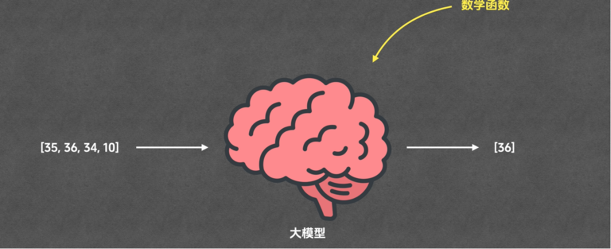
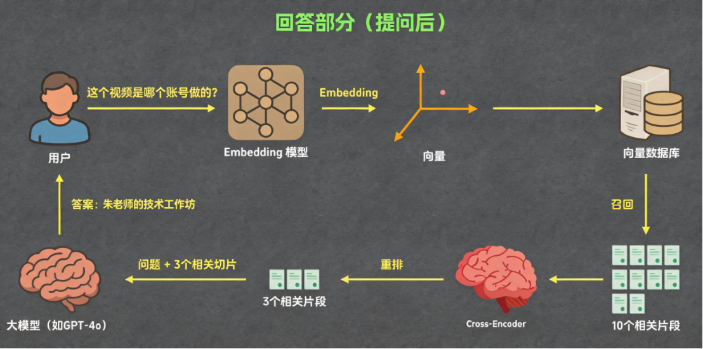
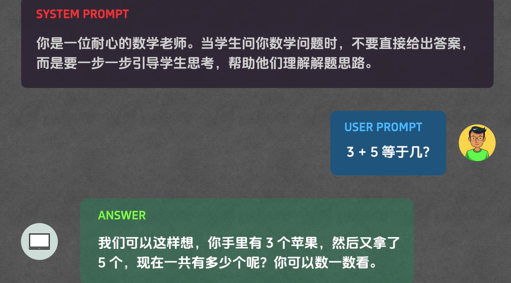
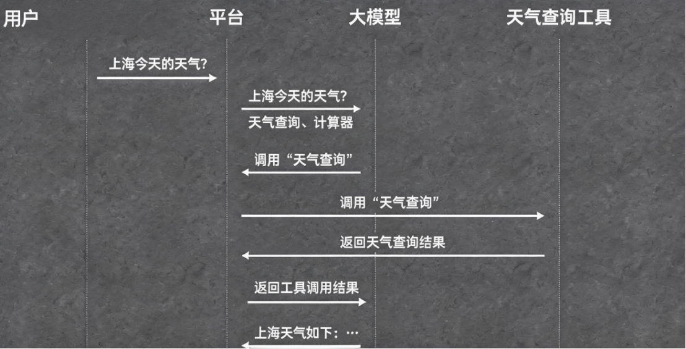
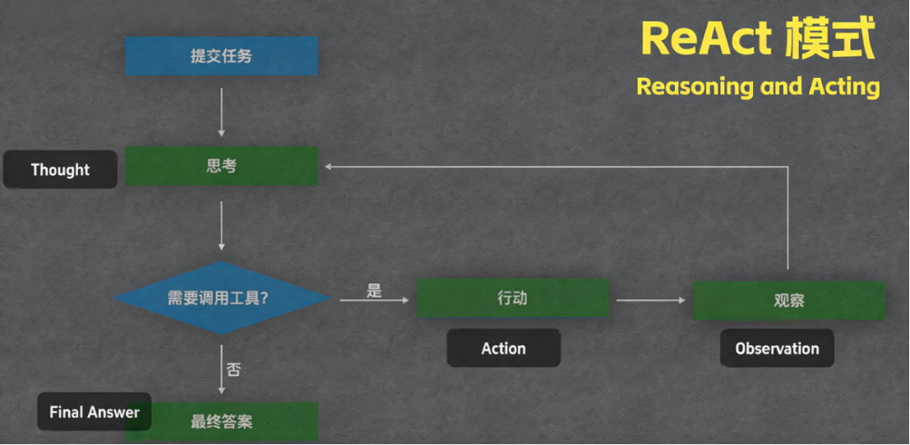

## 1. AI 核心概念底层〔篇一 · 转型与操作模型〕


> 做数字化产品，绕不开 AI。可 LLM、Token、Context、Agent 这些词，很多人只知其名、不知其义。这一章我们从底层往上，一个一个拆开——不背定义，只讲清楚它到底是怎么回事。本章工具无关，只讲原理。

>  **本章学习目标**（读完你能——）
> - 用大白话说清：大模型为什么是「逐词接龙」、Token 为什么是 AI 世界的计量单位；
> - 讲明白 Context、RAG、Prompt、Tool/MCP、Agent/Skill 各自解决什么问题、彼此怎么衔接；
> - 在配套「概念实验室」里亲手分词、看上下文窗口、跑通一次 RAG 检索与 ReAct 智能体。
>
>  **难度** 入门 ｜ **前置** 无 ｜ **预计** 20 分钟 ｜ 阅读标记： 必读 ·  动手/选读（详见下方「两种读法」）。
>
> **两种读法**：新手请逐节读「备注」并动手做实验室（每节末的  动手）；有基础的读者可只扫每节开头的  关键词，直接跳到案例 04（RAG）看落地。

### 1.1 大语言模型
>  **必读** ｜ 入门 ｜ 关键词：**自回归** · **概率预测** · **结束标识**（三者都在下方备注里讲透）

```备注
2017 年，Google 的八个人发了一篇叫《Attention Is All You Need》的论文，提出了一个叫 Transformer 的架构。当时没几个人意识到，这篇论文会把整个世界推进 AI 时代——今天你听说的几乎所有大模型，底子都是它。

那这个「大模型」到底在干嘛？说穿了，它做的事朴素得让人意外：文字接龙。你问它「朱老师的讲座怎么样？」，它不会一次想好整句答案，而是先算出「下一个最该出现的词」概率最高的是哪个——比如「特别」；然后把「特别」接到你的问题后面，当成新的输入，再算下一个词——「棒」；如此一个词一个词地往下接，直到它算出「该结束了」这个特殊信号，才收笔。

这就是为什么大模型永远是一个字一个字往外蹦，而不是唰地一下把整段甩给你——这套「逐词生成」的机制，是它后面所有行为的根。
```

### 1.2 Token 与分词
>  **必读** ｜ 入门 ｜ 关键词：**编码切分** · **映射编号** · **量化换算**

```备注
2026 年 3 月的英伟达 GTC 大会上，黄仁勋讲了两个小时。清华的杨斌教授数了一下：整场演讲里出现频次最高的词，不是「AI」，也不是「GPU」，而是——Token，超过 70 次。就在同一天，阿里巴巴宣布成立「Token 事业部」，和淘天电商、阿里云平级。黄仁勋甚至造了个词叫「Token 经济学」。一个技术名词，怎么就成了产业的中心？

先说它是什么。大模型内部其实读不懂文字，它只认数字。所以人和模型之间，得有个翻译——Tokenizer（分词器）。它干两件事：把你输入的话切成一个个最小片段（这片段就叫 Token），再给每个 Token 绑一个数字编号（Token ID）。你问「今天天气怎么样？」，可能被切成「今天 / 天气 / 怎么样 / ？」这么几个 Token，再变成一串数字喂进模型。

这里有个最常见的误会：Token 不等于「字」。字符是固定的，1 个汉字就是 1 个字符；可 Token 不一样——有的模型把「今天」当 1 个 Token，有的拆成「今」「天」两个。所以同一句话，在不同模型里 Token 数可能不同。行业里有个粗略换算：1 个 Token≈0.75 个英文单词≈1.5~2 个汉字，40 万 Token 大约 60~80 万汉字。

那 Token 为什么这么重要？因为它是 AI 世界的「计量单位」——你花多少钱、模型能记多长、算力烧多少，全部按 Token 算。你后面会反复见到它。
```



>  **动手试试**：起服务后打开「概念实验室」→ `#/lab/tokenizer`，把「今天天气怎么样？」亲手分词，看它被切成几个 Token、每个 Token 的编号（Token ID）是多少；再换一句英文对比，直观感受「1 Token≈1.5~2 汉字」。

### 1.3 上下文与窗口
>  **必读** ｜ 进阶 ｜ 关键词：**上下文（Context）** · **上下文窗口** · **检索增强（RAG）**

```备注
你有没有想过：大模型明明只是个「输入什么、输出什么」的函数，它凭什么能「记住」你上一句说了啥？

答案有点反直觉：它其实没有记忆。每次你发消息，前端程序都会悄悄把「之前的完整对话」和你这次的新问题拼在一起，一整包重新发给模型。模型每次收到的，都是完整的前情提要，所以看起来像「记得」。这一整包信息，就叫 Context（上下文）——它是模型这一次运算能看到的全部输入，是临时的记忆载体，装着历史对话、系统规则、工具数据等等。

那这个「临时记忆」能装多大？这就是 Context Window（上下文窗口）——单次能容纳的最大 Token 数。它直接决定了模型能记多长。如今主流模型的窗口已经到百万级：GPT-5.4 约 105 万 Token，Gemini 3.1 Pro、Opus 4.6 都是 100 万——按 1 Token≈1.5 汉字算，100 万 Token 差不多能装下整套《哈利·波特》。

但「窗口大」不等于「越塞越好」。实测中有个现象叫 context rot（上下文腐烂）：上下文一长，模型对埋在中间的信息就读不准、性能随长度衰减——关键内容放开头或结尾都比淹在中段强。所以塞满窗口不是本事，挑对喂什么才是。

可就算窗口再大、你也会挑着放，还有个致命问题：假如你有一份上千页的产品手册，想让 AI 依托它答用户问题，是不是每次都把整本书塞进去？答案是否定的——太贵、太吵，无关内容会干扰判断。行业的最优解叫 RAG（检索增强生成）：先用检索算法从手册里挑出和问题最相关的那几段，只把这几段 + 问题喂给模型。省钱、聚焦、还更准。这正是本教程「向量库检索」案例干的事。
```



>  **动手试试**：打开 `#/lab/context` 看「上下文窗口」怎么随对话增长、塞满会发生什么；再打开 `#/lab/rag`（RAG Playground）输入一个产品问题，观察它从真实语料里召回了哪几段、相似度多少——这正是案例 04 的底层。

### 1.4 提示词
>  **必读** ｜ 入门 ｜ 关键词：**用户提示（User）** · **系统提示（System）** · **提示词工程**

```备注
同样一句「帮我写一首诗」，为什么有人得到惊艳的作品，有人只得到一堆打油诗？差别不在模型，在提示词（Prompt）。

Prompt 就是你给模型下的具体指令，它的精准度直接决定输出质量。你说「帮我写首诗」，模型只能瞎猜——五言、七言、古体、现代，全凭运气；可你说「帮我写一首五言绝句，主题是秋天的落叶，风格悲凉萧瑟」，它立刻就能从体裁、主题、风格三个维度精准命中。这门「把话说清楚」的功夫，就是提示词工程。

再往深一层，Prompt 其实分两种，各司其职。System Prompt（系统提示词）是开发者在后台预设的、用户看不见也改不了，负责定人设、定规则、定边界，全程生效。比如做一个数学辅导机器人，后台先固定一句：「你是耐心的小学数学老师，学生提问时禁止直接给答案，要用生活化例子一步步引导。」User Prompt（用户提示词）才是学生每轮输入的具体问题，比如「3+5 等于几？」。没有系统提示词，模型会直接甩出「8」；有了它，模型会引导：「你手里有 3 个苹果，妈妈又给你 5 个，现在一共几个？自己数数看。」——System 定规矩，User 定任务，两者配合，才有既守规则又解决问题的 AI。
```



### 1.5 工具与协议
>  **必读** ｜ 进阶 ｜ 关键词：**工具（Tool）** · **四方协作** · **统一接入（MCP）**

```备注
你问 AI：「今天上海天气怎么样？」它多半会说「抱歉，我无法获取实时数据」。为什么这么强的模型，连查个天气都不会？

因为大模型的能力全来自训练数据，本质是「文字概率预测」，它天生无法联网、无法触达真实世界。要补上这块短板，就得引入 Tool（工具）——一个可以被调用的函数：给它固定入参（比如「城市、日期」），它去调真实接口，返回结构化结果。有了工具，模型才从「纯文本脑补」变成「能对接真实世界」。

但工具不是模型自己调的，中间涉及四方：用户提问 → 平台把问题转给模型 → 模型判断「需要查天气」，生成一条标准的「工具调用指令」回传平台 → 平台真正执行工具、拿到数据、再交回模型整理成人话。模型负责思考决策，平台负责穿针引线。

问题又来了：每个 AI 平台的工具接入标准都不一样，同一个工具适配 GPT、Gemini、Claude 得写三遍代码，太浪费。于是有了 MCP（模型上下文协议）——一套通用的工具接入标准。它像手机的 Type-C 接口：统一之前各家充电口互不通用，统一之后一个充电器走天下。工具按 MCP 开发一次，就能接入所有支持它的平台。
```



### 1.6 智能体与技能
>  **必读** ｜ 进阶 ｜ 关键词：**智能体（Agent）** · **循环推理（ReAct）** · **智能体技能（Skill）**

```备注
有了工具，AI 能查天气了。但真实需求往往更复杂：「帮我看看我当前位置的天气，如果下雨，就再帮我找附近的雨伞店。」这一句话，要连用定位、天气、店铺三个工具，还要根据「是否下雨」分情况——单次工具调用根本搞不定。

这就引出了 Agent（智能体）。它的本事是自主规划、分步推理、循环执行：第一步想「得先知道我在哪」，调定位工具；拿到经纬度，第二步调天气工具；判断「下雨了」，第三步才去调店铺工具找雨伞店；最后把所有结果拼成答案。这套「思考→调用工具→拿到结果→再思考」的循环，就是业内说的 ReAct 架构——它让 AI 从「被动应答」升级为「主动把复杂任务干完」。（这条循环，正是第 2 章「三层 Loop」的种子。）

可 Agent 再聪明，面对你的个性化习惯还是会抓瞎——你希望出门前它按「先看天气、再列清单、格式固定」来办，可它不知道。于是有了 Agent Skill（智能体技能）：一份固化的专属说明书，把触发条件、执行步骤、判断规则、输出格式一次写清楚，AI 一加载就照办，既复用又省 Token。本教程的 Skill 库，就是这类结构化技能。
```



>  **动手试试**：打开 `#/lab/agent` 玩一局「ReAct 智能体」小游戏，看 AI 如何一步步「思考→调用工具→观察→再思考」把一个多步任务做完——你会对第 2 章的「三层 Loop」有直觉。

---

### 1.7 [深度] 休谟：为什么 AI 必须「验证」而不能「证明」
>  **深度** ｜ 高阶 ｜ 面向专业读者：给前面所有概念一个哲学地基（新手可跳过）

<details>
<summary> 展开：三百年前的休谟，说透了今天 AI 的三件事</summary>

**① 归纳问题 → 所以必须验证，不能证明。** 一切机器学习都是「从见过的样本，推没见过的情况」——这正是苏格兰哲学家大卫·休谟 1748 年点破的**归纳问题**：从过去推未来，逻辑上无法保证。他的例子很利落：「太阳明天不升起，并不比它升起更自相矛盾。」1997 年 Wolpert 与 Macready 的**「没有免费午餐」定理**把这句话数学化了（Schurz《Hume's Problem Solved》，MIT 2019 进一步论证）：在所有可能问题上平均，没有哪个学习算法能一直更优——模型在训练分布外「自信地错」，不是 bug，是归纳的本性。**结论直通 §2**：既然正确性无法被证明，就只能被**验证**（evals / 传感器）。这正是本书反复强调「先建 Inspector 再建 Loop」的哲学根。

**② is-ought 鸿沟 → 所以价值要人来供给。** 休谟还指出（《人性论》3.1.1）：从一堆「是什么」（事实）推不出「该怎样」（价值），中间必须补一条价值前提——史称**休谟的断头台**。AI 学到的是数据里「是什么」的模式，学不到「该怎样」；所以**目标与价值必须由人供给**，高影响领域（金融/医疗/政务）保留人工复核，正是这条鸿沟的工程落地。（注：这和摩尔的「自然主义谬误」是两回事，别混。）

**③ 因果 ≠ 相关。** 休谟说我们从没观察到「必然的因果」，只观察到「恒常联结」——A 之后总跟着 B。现代说法（Judea Pearl《为什么》的「因果之梯」）：机器学习学的是**相关**，不是因果，站在阶梯最低一层。这正是本书反复警惕的「把噪声/相关当信号」（案例 02 的真实/合成双散点对照就是给这句话准备的活教材）。把休谟推到技术哲学的高度再看一层：**归纳问题说「过去如此不保证将来如此」——这正是所有机器学习泛化风险的哲学原型**（训练分布≠部署分布），也是评测必须**持续跑而非跑一次**的根本理由（案例 07 的回归门就是给归纳问题装的工程护栏）。顺带一个 2026 年的呼应：**哈萨比斯**（DeepMind，2024 诺贝尔化学奖）主张先「解决智能，再用智能解决其他一切」，而他点名的拦路石恰是**验证速度**（Axios，2025-12）——18 世纪的怀疑论者和 21 世纪的 AGI 推进者，指向同一件事：**结论不会自己为真，验证才让它可用**。（以上为两位的公开主张；接到本书传感器/回归门上的推论是我们的引申。）

一句话：**AI 是一台归纳机器**——它强大也脆弱的根源都在这里。（附注：「白板说」是洛克的；休谟的独特主张是「观念是印象的摹本」。而且现代 ML 也不是白板——网络结构与归纳偏置就是它的先验，「没有免费午餐」定理说你还非得有先验不可。「用 evals 代替证明」是本书据此做的引申，不是休谟原话。）

</details>

### 1.8 这些概念，后文在哪儿落地（前后联系）
>  **必读** ｜ 入门 ｜ 关键词：**概念 ↔ 章节 ↔ 案例**（本章不是孤岛，每个概念后面都会用到）

本章的概念不是背完就完——它们贯穿全书。遇到时用这张表随时往后跳，也能理解「为什么要先学这个」：

| §1 概念 | 后文在哪儿落地（章节 / 案例） |
|---|---|
| Token / 上下文窗口 | §2 Loop 的成本-延迟权衡；案例 04 RAG「只喂高相关片段」正是为省 Token |
| RAG / Embedding / 向量 | 案例 04 语义检索、案例 05 关系库底座、案例 07 RAG 评测台 |
| Agent / ReAct（§1.6） | §2 三层 Loop 的「执行器」；`#/lab/agent` ReAct 小游戏、案例 08 逐任务 maker/checker Loop |
| eval / 评测 | §2「传感器就是设计本身」、§5 门禁三绿；案例 07 评测台、案例 08 门禁走查 |
| 幻觉 / hallucination | 案例 04 用检索压幻觉；§5 高影响域保留人工复核 |
| 归纳问题 / 没有免费午餐（§1.7） | §2 所以「必须验证而非证明」；§3.0 规格驱动开发（SDD）的哲学根 |

一句话：**§1 是地基，后面每一章、每个案例都踩在它上面**——这就是「各部分既独立又交叉」的意思。

### 本章小结

- **一条链看懂 AI**：LLM 逐词接龙 → Token 计量 → Context 装记忆 → Prompt 下指令 → Tool/MCP 触达真实世界 → Agent/Skill 自主把复杂任务干完。上一个概念的局限，正是下一个概念要解决的问题。
- **对产品经理的意义**：这些不是技术细节，而是你做 AI 产品时的「成本表、能力边界、体验杠杆」——Token 决定成本，Context 决定能记多长，RAG 决定要不要建知识库，Agent/Skill 决定能不能自动化。
- **动手闭环**：本章每个核心概念都能在「概念实验室」亲手验证（`#/lab/tokenizer`、`#/lab/context`、`#/lab/rag`、`#/lab/agent`），读完务必去跑一遍。

### 练习（做完再往下读）

1. **巩固**：把「帮我把这份 20 页的产品周报总结成 3 条要点」拆一拆——它大概消耗多少 Token？为什么不建议把公司全部历史周报都塞进上下文？（提示：成本 + 窗口 + 噪声）
2. **巩固**：同一个「查订单状态」的工具，要接入三个不同大模型平台。有了 MCP 和没有 MCP，工作量差别在哪？
3. **挑战**：你要做一个「电商客服 AI」，它得能查订单、查物流、按公司话术回复。请用本章概念画出它需要哪些 System Prompt、哪些 Tool、是否需要 Agent 循环与 Skill——写成一段 100 字的方案。

<details>
<summary>参考思路（先自己想，再展开）</summary>

1. 20 页周报约 1~2 万字，按「1 Token≈1.5~2 汉字」（§1.2）折算 ≈ 0.5~1.3 万 Token 输入；全部历史周报会撑爆窗口、单次调用变贵，且大量无关内容会稀释模型注意力、降低总结质量——这正是该用 RAG 只召回相关段落的场景。
2. 没有 MCP：为 GPT/Gemini/Claude 各写一套工具适配，三份代码三处维护；有 MCP：按协议实现一次，所有支持 MCP 的平台即插即用（类比 Type-C）。
3. System Prompt 固定客服人设与话术边界（禁止承诺赔付等）；Tool 至少要「查订单」「查物流」两个真实接口；因为要「先查订单再决定查不查物流、最后按话术回复」，需要 Agent 的 ReAct 循环；把「标准应答格式 + 话术规则」固化成 Skill 便于复用省 Token。
</details>

> **寓教于乐**：概念记混了？打开小游戏 `#/game`（AI 概念配对），把 LLM/Token/Context/RAG/Agent/Skill 和它们的定义连连看，30 秒巩固本章。
