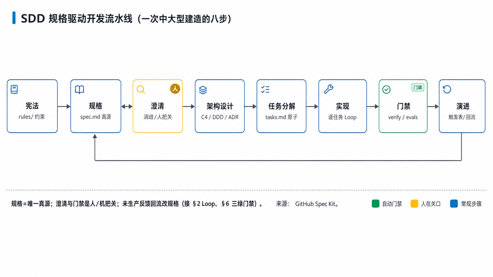
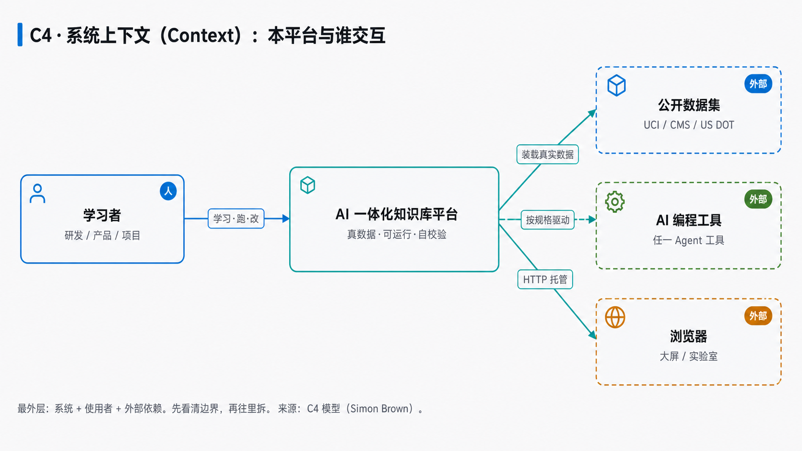
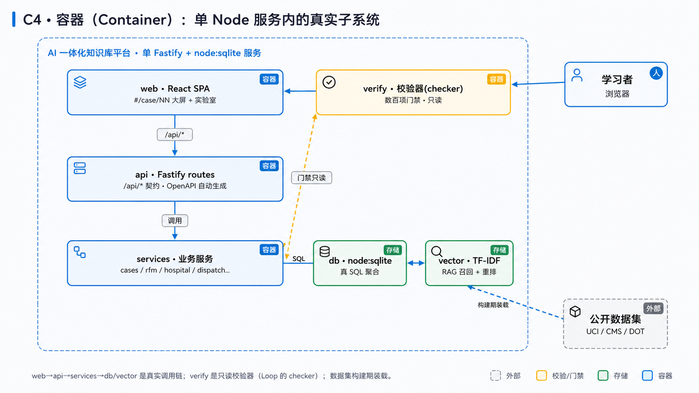
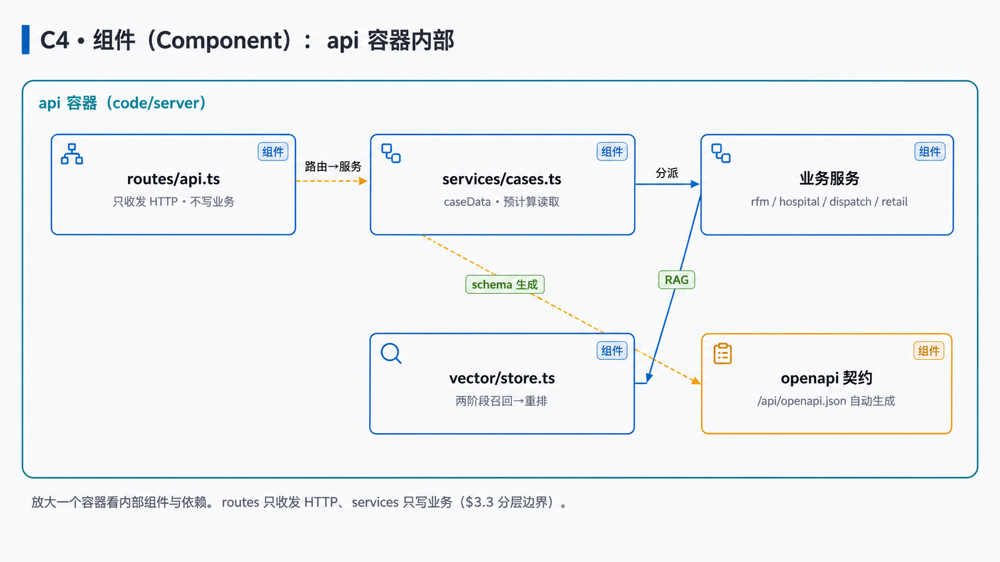
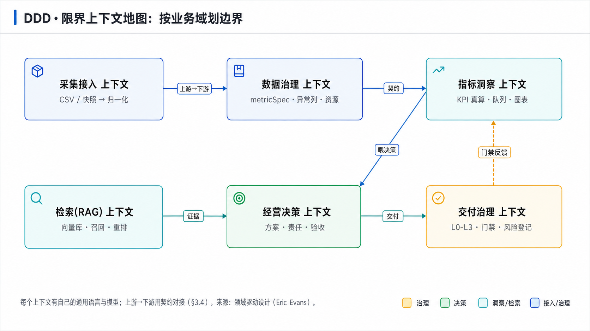
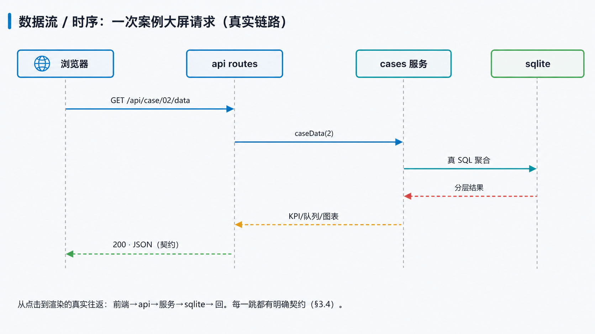
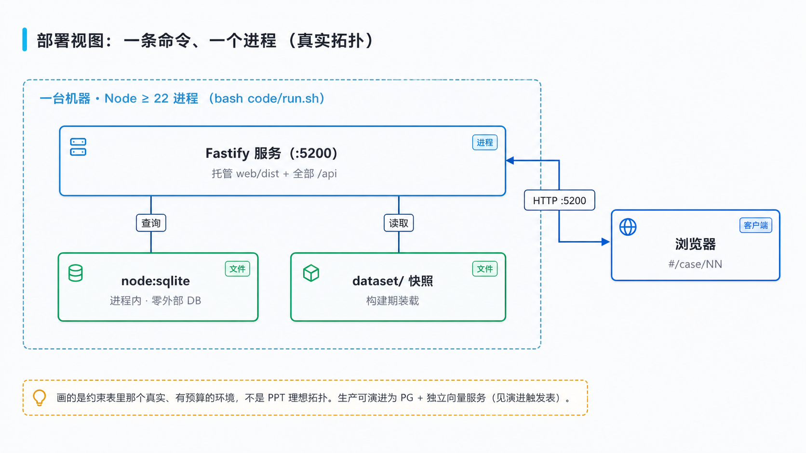
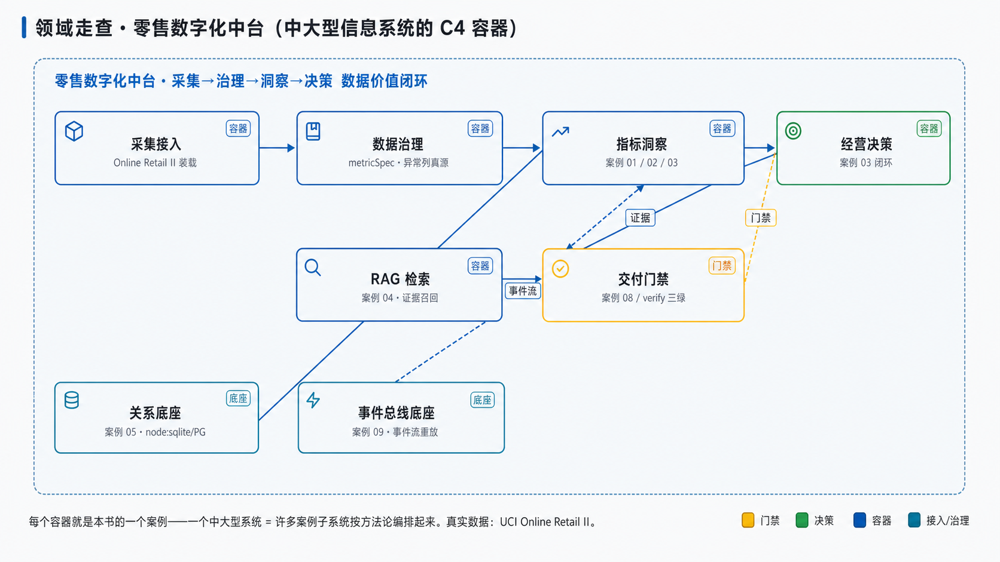

## 3. 系统架构设计（SDD 方法论）〔篇二 · 架构设计知识体系〕

> 这一章回答一个扎心的问题：**为什么几个 prompt 喂给 AI，做得出一个案例小页面，却做不出一个中大型信息系统？** 因为大系统不是「灵感式地多聊几句」堆出来的，而是靠一套**规格驱动 + 可追溯 + 分而治之**的方法论，把一次大建造拆成许多有纪律、可验收的小步——每一步一个 Loop（§2）、每一关一道门禁（§5）。



>  **本章学习目标**（读完你能——）
> - 说清「几个 prompt 建不成系统」的根因，并用 **SDD 规格驱动开发** 的八步把一次中大型建造走完；
> - 用 **C4 四层图 + DDD 限界上下文** 把一个系统从上下文拆到组件；
> - 把约束表 / 质量属性场景 / ADR / 演进触发表这些「架构工件」**真填出来**，而不只是知道名字。
>
>  **难度** 高阶（新手可先读每节  主线 + 图 + 备注，跳过  深水区）｜ **前置** 第 2 章 ｜ **预计** 25 分钟。

### 3.0 规格驱动开发（SDD）：让 AI 从「创意写手」变成「有纪律的规格工程师」
>  **必读** ｜ 高阶 ｜ 关键词：**规格即真源** · **宪法/澄清/门禁** · **分而治之**（一次大建造的八步）

```备注
2025 年，业界给「几个 prompt 建不成大系统」找到了一个响亮的答案，叫**规格驱动开发（Spec-Driven Development，SDD）**——GitHub 开源了 spec-kit，微软、AWS（Kiro）、各家很快跟进。它的核心一句话：**「代码服务于规格，而不是规格服务于代码。」** 规格（spec）才是唯一真源（Spec Kit 的立场），代码只是规格在某种语言里的表达。

为什么这招管用？因为直接 vibe coding 的失败模式很固定：每轮丢掉上一轮的上下文、AI 自信地替你猜错、产出的代码能跑但和既有架构对不上、越滚越漂。SDD 用一串**强制的阶段 + 模板**把这些堵住。落到步骤上就是这条八步流水线（见上图）：

**① 宪法** 立不可谈判的原则（本书的 `rules/` 就是宪法：DRY、单文件<800、类型安全、安全红线）。**② 规格** 把「要什么、为什么」写成结构化文档，含输入输出、边界、前后置条件。**③ 澄清**：把模糊处强制标出来问清楚——**这一步必须人在关口**（防「意图债务」，§2.9）。**④ 架构设计**：C4 画图、DDD 划域、写 ADR（本章下面几节）。**⑤ 任务分解**：拆成原子、可并行的小任务（tasks）。**⑥ 实现**：每个任务跑一个 maker/checker Loop（§2）。**⑦ 门禁**：一致性检查 + evals + `verify` 三绿（§5），**这一步机器自动把关**。**⑧ 演进**：上线后用生产反馈回流去改规格，而不是改完代码就完事。

要诚实的是：SDD 不是银弹。代码生成本身**非确定**，规格也可能漂移、也可能滑向「重型瀑布」。所以它必须配一套**高确定性的 CI 门禁**兜底——这正好是本书 §5 的三绿门禁存在的理由。**方法论（分步）+ 门禁（把关）** 两条腿，才走得动一个中大型系统。（来源：GitHub Spec Kit；Thoughtworks 2025 定名。另一路 **OpenSpec（Fission-AI）** 走 **delta spec**——只记「这次变更了什么」、不重写整篇，对老项目更友好，是 Spec Kit 严格阶段门禁之外的轻量选择；组合拳里它就是「规格」那一环，见 §2.6。旗舰**案例 08「SDD 系统建造走查」**正是照这条流水线把本平台自己建出来的。）
```

### 3.1 从约束到规格：架构的第一张证据表
>  **必读** ｜ 进阶 ｜ 关键词：**业务/合规/规模/成本约束** · **约束表**（规格里最硬的一页）

```备注
新手做架构，第一反应往往是「用什么技术栈、上不上微服务、要不要上 Kafka」。但脱离场景聊技术选型，永远吵不出结果——因为**架构的起点根本不是技术，是约束**。所以 SDD 的「规格」里，最硬的一页就是**约束表**：把业务、合规、规模、成本的硬边界一条条列清，它是你后面每个架构决策的**证据**。

一句话点破：**没有约束支撑的复杂度，就是没有证据的复杂度**——你上了一套微服务，若说不出是哪条约束逼你上的，那它多半是负债，不是架构。下面是**本平台自己**填出来的约束表（dogfood，真对得上仓库）：
```

| 约束类别 | 本平台的真实约束 | 导出的架构后果 |
|---|---|---|
| 业务 | 教学：**真数据 · 可运行 · 可自校验** | 建真·全栈服务，而非「读静态 JSON」的假原型 |
| 合规/安全 | 高影响域（金融/医疗）**不得自动决策** | 人工复核横幅 + 风险边界守卫（§5 门禁） |
| 规模 | 单机教学、离线可跑、**零外部依赖** | 单 Node 服务 + `node:sqlite`，**不上分布式** |
| 成本 | 一条命令起、零云账单 | 进程内 SQLite/向量库，不接云 DB（奥卡姆） |

### 3.2 质量属性：把「非功能需求」写成可量化场景
>  **必读** ｜ 进阶 ｜ 关键词：**刺激→环境→响应→度量** · **质量属性场景**（选型的证据来源）

```备注
两个系统功能清单一模一样——都是「下单、查订单、退款」，架构会一样吗？不一定，甚至天差地别。为什么？因为**质量属性**不同：一个要扛「峰值 400 单/秒、P95<200ms」，另一个要「7×24 可用、故障 5 分钟可回滚」。功能相同，质量属性优先级不同，导出的架构就完全不同。

架构师的功夫，是把模糊的「非功能需求」写成**可量化的质量属性场景**（SEI 风格：刺激→环境→响应→度量）——它就是你后面做拆分和选型的证据。下面是**本平台**填好的两条（正是本书「可复现 + 可校验」两大招牌的架构表达）：
```

| 质量属性 | 刺激 | 环境 | 响应 | 度量 |
|---|---|---|---|---|
| **可复现性** | 在任意机器重跑构建链 | 构建期、无网络 | 产物逐字节一致 | 截图/JSON diff = 0，案例数动态一致 |
| **可校验性** | 改坏一处（种错） | 发布前门禁 | `verify` 报红并定位根因 | 拦截率 100%、定位到 `file:line` |

### 3.3 架构设计：用 C4 拆层、用 DDD 划域
>  **必读** ｜ 高阶 ｜ 关键词：**C4 四层** · **限界上下文** · **模块化单体优先**（拆分要有证据）

```备注
规格写好了，怎么把一个系统「画」出来、拆下去？两把公认的好工具：**C4 模型**（Simon Brown）负责画图，**DDD 领域驱动设计**（Eric Evans）负责划域。

**C4 是四层缩放**：**Context（上下文）**——系统跟谁交互，先看清边界；**Container（容器）**——系统内部有哪些可独立部署/运行的东西（web、api、数据库…）；**Component（组件）**——放大一个容器看内部组件；**Code**——再放大到类/函数（通常不用画）。像地图从省到市到街道，一层看一层的粒度，不会一上来就淹死在细节里。下面三张是**本平台自己**的 C4（真对得上 `code/`）：
```







```备注
**DDD 则负责「边界画在哪」**：把系统按**业务域**切成一个个**限界上下文（Bounded Context）**，每个上下文有自己的「通用语言」和模型，上游→下游之间用契约对接。这跟「按技术分层」是两个维度——DDD 问的是「这块业务归谁管、说的是不是同一套语言」。下图是本平台按业务域画的限界上下文地图：
```



```备注
最后一句务实的拆分原则：**模块化单体优先**。先在一个进程里把上面这些边界划清楚，「预留而不预付」——边界就是将来真要拆微服务时的进程切口，但现在不急着付分布式的代价。1967 年 Melvin Conway 早提醒过：**系统结构会长得和组织沟通结构一样**（康威定律）——所以怎么拆，从来不只是技术问题。怎么保证边界不被人偷偷破坏？用**架构守护测试（适应度函数）**把「A 模块不许直接调 B 的内部」写成能自动跑的断言。案例 06 就是拿本平台后端自己做的分层拆解 + 依赖检查示范。
```

### 3.4 接口契约：子系统之间的合同
>  **必读** ｜ 高阶 ｜ 关键词：**错误信封** · **幂等** · **契约即代码**（拆开的子系统靠它对接）

```备注
2002 年前后，亚马逊内部流传贝索斯的死命令「Bezos API Mandate」：所有团队只能通过**服务接口**暴露数据和功能，不许走后门读别人的库；接口要按「将来能开放给外部」来设计；**不照做的人会被开除。** 正是这条近乎不近人情的规定逼出了后来的 AWS。它说明：**接口契约不是文档礼仪，是系统能不能长大的生死线。**

一份好契约至少约定四条：**统一错误信封**（都回 `{code, message, details}`，调用方不用猜）；**写操作幂等**（同一「创建订单」重发一次不该变两笔）；**404 不泄露资源是否存在**；**分页/可用动作由服务端驱动**。最关键一招叫**契约即代码**：别让文档和实现两张皮——本平台的 OpenAPI 由路由 schema **自动生成**（`/api/openapi.json`），改实现文档自动跟着变，永不漂移。下面这张时序图，就是一次真实请求怎么在这些契约上一跳跳走完的：
```



### 3.5 ADR：把「为什么这样选」留下来
>  **必读** ｜ 进阶 ｜ 关键词：**背景 → 决策 → 后果** · **可追溯**（架构最该沉淀的产物）

```备注
你有没有经历过：三个月前团队吵一下午定下「用 A 不用 B」，三个月后新同事又原封不动问一遍，因为**没人记得当时为什么这么选**。软件工程师 Michael Nygard（2011）给的解药很简单，叫 **ADR（架构决策记录）**：每个关键决策写一篇短记录，三段——**背景**（当时的约束和证据）、**决策**（选了什么）、**后果**（好处、代价、以及「出现什么信号就该重估」）。重点永远是那个**「为什么」**，因为方案会过时，但「当时基于什么判断」才是后人接得住的关键。下面是本平台一份**真填出来**的 ADR：
```

> **ADR-001 · 本地用 node:sqlite，生产标注为 PostgreSQL**
> - **背景**：约束表要求「一条命令起、零外部依赖、离线可跑」（§3.1）；同时教学要讲 PG/pgvector 架构。两个约束都得满足。
> - **决策**：本地用 `node:sqlite` 跑**真 SQL**（真实 CREATE TABLE + 索引 + 参数化聚合），页面与正文**显式标注「生产为 PG」**，用文字补讲连接池 / B-tree vs GIN / pgvector HNSW / EXPLAIN 等 PG 特性。
> - **后果**：➕ 零运维、可复现、截图稳定；➖ 不覆盖真并发与 pgvector 实测 → 用文字补。**重估信号**：若要演示真并发或 pgvector 召回，则切 PG（见下方演进触发表）。

### 3.6 部署演进：画真实机房，写演进触发
>  **必读** ｜ 进阶 ｜ 关键词：**部署视图** · **演进触发表** · **奥卡姆**（能简单就别复杂）

```备注
2004 年 Martin Fowler 写下「绞杀榕（Strangler Fig）」的比喻：绞杀榕顺着老树慢慢长、最后取代它，全程不用把老树一次砍倒。系统演进就该这样——不是推倒重来，而是让新架构沿旧系统逐步长上去。前提是你得先想清楚「什么时候该长下一步」。

所以部署这一步两个务实动作：一是**部署视图画真实机房**——画约束表里那个真实、有预算的环境，不是 PPT 理想拓扑（本平台就是「一台机器、一个 Node 进程」，见下图）；二是列一张**演进触发表**，把「何时该改造」写成可观察的提前量，而不是凭感觉「我觉得该上微服务了」。贯穿始终的是一把剃刀——**奥卡姆**：能一张聚合表解决就别上专用集群，每个引入的组件都得能指着约束表说出「是它逼我上的」。
```



| 现状（本平台） | 演进触发信号 | 演进动作 | 回滚办法 |
|---|---|---|---|
| 单 `node:sqlite` 进程内库 | 需真并发 / 数据量涨到现在 100× | 切 PostgreSQL + 连接池 | 保留 sqlite 适配层，切回一版 |
| 进程内 TF-IDF 向量 | 语料 > 10 万篇 / 需真语义向量 | 上 pgvector 或专用向量服务 | 关开关回退 TF-IDF |
| 单进程托管前后端 | 前端团队要独立发布节奏 | 拆 `web` 为独立部署 | 合回单服务托管 |

### 3.7 一次完整走查：零售数字化中台（把方法论用在一个中大型系统上）
>  **选读·进阶** ｜ 高阶 ｜ 关键词：**领域走查** · **容器=案例** · **分而治之**（看方法论怎么落到一个大系统）

```备注
把前面六节串起来用一次——设计一个真正的中大型信息系统：**零售数字化中台**。它不是一个页面，而是一整套「采集→治理→洞察→决策」的数据价值闭环。走一遍 SDD：

**规格**：中台要让运营「看得清（指标）、查得准（检索）、定得下（决策）」，约束=复用真实零售数据、高影响动作留人工。**架构（C4 容器）**：把中台拆成 采集接入 / 数据治理 / 指标洞察 / RAG 检索 / 经营决策 五个容器 + 关系库/事件总线两个底座 + 交付门禁——其中的核心容器都对得上本书的案例（见下图：指标洞察=案例 01/02/03、经营决策=案例 03、RAG 检索=案例 04、关系库=案例 05、事件总线=案例 09、交付门禁=案例 08 与 verify 三绿；采集与治理两环由数据构建链 fetch-datasets/metricSpec 承担）。**DDD**：五个容器就是五个限界上下文，上游→下游用契约对接。**ADR**：如「指标洞察用预计算还是实时算」写一份决策留痕。**任务分解**：每个容器再拆成若干可验收小任务，逐一用 Loop 建。

这就把「几个 prompt 建不成系统」讲透了：一个中大型系统 = **许多子系统（案例）按方法论编排起来**；你在本书跑过的每个案例，都是这张大图里的一块。
```



### 3.8 走查：把 ADR 与适应度函数落成真工件
>  **选读·进阶** ｜ 高阶 ｜ 关键词：**ADR 是交付物** · **适应度函数能跑** · **卡即方法**

```备注
3.5 写了一份 ADR-001、3.3 提了「架构守护测试（适应度函数）」——但概念读一百遍，不如指着两份真交付物看它们长什么样。本书旗舰架构案例的验收交付物就摆在 `outputs/product_case_library/` 里，走查一遍：

**案例 06「子系统分解图与接口契约」的验收单**（`case_06_system_arch_flow_方案验收.md`）里，「必含 Skill」明写着 `c4-modeling、interface-contract、adr-authoring`——ADR 不是可选的文档礼仪，是这份架构交付物的**验收硬条件**之一；它的「不合格标准」直接写死「越过『架构决策须可追溯（ADR），不得口头拍板』即不合格」。而 3.3 那句「用适应度函数把边界写成能自动跑的断言」，在这个案例里就是真代码 `archModel()`：它扫 `code/server` 各子系统的 import、检循环依赖，现在的真实读数是 5 个子系统、5 条依赖边、0 条循环——§7.5 会让你亲手把它跑一遍。这份验收单还把这条适应度函数要拦的三种坏味道明写了出来——职责越界、契约缺失、循环依赖——每一种都是它扫 import 时能报出来的，不靠人眼盯。**案例 08「SDD 系统建造走查」的验收单**再加一味 `arch-review`：把规格↔架构↔任务↔ADR 四类工件逐项核一致性，这就是架构评审门禁的样子。

怎么自己写这两样？方法被沉淀成了两张卡，都在 `skills/pm_skills.md`：**`adr-authoring`** 教你三段式（背景→决策→后果，重点写「为什么」和「出现什么信号该重估」）、**`fitness-function`** 教你把「哪些边界最容易被偷偷破坏、循环依赖怎么检」写成纳入门禁的自动断言。卡不是摆设——你照案例做方案时，把整卡粘给 Agent，它就按卡上的六槽逼你把 ADR 和守护断言补全。顺带把 3.2 的质量属性场景也接上：它的方法卡 `quality-attribute-scenario`（SEI 刺激→环境→响应→度量）同在 `skills/pm_skills.md`，和上面两张一起，构成架构章的三张「可验收工件」卡——一张管「为什么这么选」（ADR）、一张管「非功能需求怎么量」（质量属性场景）、一张管「边界怎么守」（适应度函数）。三张卡都不是让你背概念，是让 Agent 陪你把这三件最容易含糊过去的事逐条填实。一句话收口：**架构真正的产物不是图，是「为什么这么选」（ADR）+「不许被谁破坏」（适应度函数）这两样能被后人追溯、被机器复核的东西。**
```

---

### 本章小结

- **几个 prompt 建不成中大型系统**——要用 **SDD 八步**（宪法→规格→澄清→架构设计→任务分解→实现→门禁→演进）把大建造拆成许多有纪律、可验收的小步；方法论（分步）+ 门禁（三绿）两条腿才走得动。
- **架构 = 特定约束下对质量属性做出的一组可追溯决策**：约束表→质量属性场景→C4/DDD 拆解→接口契约→ADR→部署/演进，每一步都有一份**真填出来**的工件（本章全是本平台自己的 dogfood 实例）。
- **两条红线**：① 每个复杂度都要有约束当证据（奥卡姆）；② 每个关键决策都要可追溯（ADR）。工具署名：SDD=GitHub Spec Kit，C4=Simon Brown，DDD=Eric Evans，ADR=Michael Nygard。

### 练习

1. **巩固**：为什么说「几个 prompt 做得出一个案例小页面，却做不出中大型系统」？用 SDD 八步里的**任意三步**解释缺了它们会怎样翻车。
2. **巩固**：给「一个日均几百单、要求 7×24 可用、故障 5 分钟可回滚的企业内部系统」写两条质量属性场景（SEI：刺激→环境→响应→度量）。
3. **挑战**：给你负责的一个真实系统画一张 **C4 容器图**（3-6 个容器 + 依赖箭头），并为其中一个关键技术选型写一份**三段式 ADR**（背景→决策→后果，含重估信号）。

<details>
<summary>参考思路</summary>

1. 缺**规格**→每轮丢上下文、AI 猜错、越滚越漂；缺**架构设计**→子系统边界糊在一起、改一处塌一片；缺**门禁**→能跑但对不上既有架构、上线才炸。三者任缺其一，系统都长不大。
2. 例：①「运维在工作时间重启任一节点（刺激），系统在生产环境（环境）应在 5 分钟内自动切流并可回滚到上一版本（响应），期间订单接口可用率 ≥99.9%（度量）」；②「凌晨批处理失败（刺激）时，系统（环境）应告警并保留可重跑的幂等入口（响应），重跑后数据一致（度量）」。
3. 开放题。C4 容器图关键：只画「可独立运行/部署」的东西（前端、API、DB、缓存…）+ 依赖箭头，别混进类和函数。ADR 关键：重点写「为什么」和「出现什么信号就重估」，而不是罗列选了什么。
</details>
