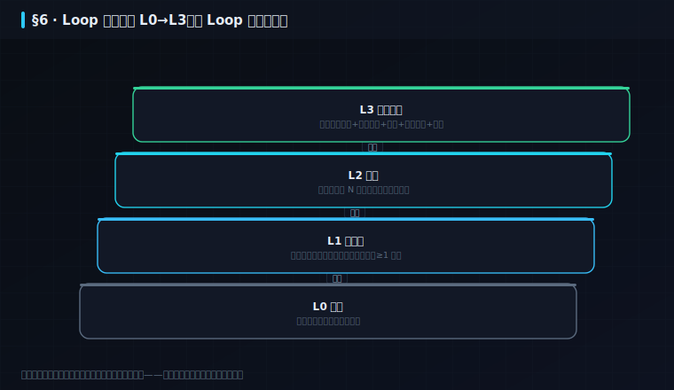
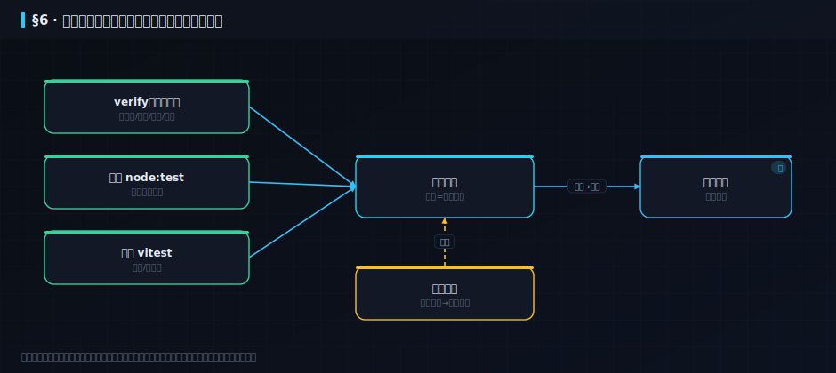

## 5. 交付治理（项目镜头）〔篇三 · 工程与交付〕

>  **本章学习目标**（读完你能——）
> - 用 L0→L3 分级，把一个 AI Loop 从「只报告」安全地推到「无人值守」；
> - 用「门禁 + 停止条件 + 责任分派 + 风险登记」四件套把交付管住；
> - 把 §2 讲的 Loop 治理，从「工程原语」翻译成项目/交付的日常动作——这就是**项目镜头**。
>
>  **难度** 进阶 ｜ **前置** §2（尤其 §2.5 何时建 Loop、§2.9 上线分级）｜ **预计** 14 分钟。

在研发镜头里，Loop 的护栏叫 stop-rules、maker/checker、cost cap；换到**项目镜头**，同样这几样东西有另一套名字：门禁、升级协议、RACI、风险登记。同一副骨架，换个角色看，就是交付治理。本章把 `skills/loop_engineering/` 里那些「工程原语」翻译成项目经理每天要拍的板。

### 5.1 上线分级：把 Loop 当交付分四级推
>  **必读** ｜ 进阶 ｜ 关键词：**报告 → 辅助 → 无人值守** · **每级有退出条件**

```备注
你不会让一个刚培训完的新人第一天就独自签合同。AI Loop 上线也一样——它要像自动驾驶那样分级放权，每一级有明确的「毕业考」才能升级（§2.9 给过这张阶梯，这里从交付角度落地）。

**L0 草稿**：先人工把这个 Loop 跑通一遍，退出条件=「我确认它到底该干什么、边界在哪」。**L1 只报告**：只观察、只出报告、绝不动手，至少跑一周，退出条件=「误报率降到可接受、它的判断和我一致」。**L2 辅助**：它可以提议改动，但每一步人工点头，退出条件=「连续 N 次提议都对、我敢闭眼点同意了」。**L3 无人值守**：才允许自动处理低风险操作，且必须配齐白名单、成本上限、急停、独立验收、可检索日志。

项目经理的活，就是给每个 Loop 定这四级的「毕业考」，并且**拒绝跳级**——跳级上线是本书反复警告的事故温床。
```



### 5.2 停止条件与升级协议：让它知道什么时候该叫人
>  **必读** ｜ 进阶 ｜ 关键词：**停止规则** · **成本上限** · **升级到人**

```备注
自动化最怕的不是「干得慢」，而是「错着错着还不停」。所以每个 Loop 上线前，先写死它的**停止条件**——本仓库 `skills/loop_engineering/stop-rules` 就是现成模板：**同一个失败连续两轮必须停下、叫人**（防止对着一个修不动的错误无限烧 Token）；**Token / 时间 / 次数封顶**；**碰到红线路径立即急停并上报**。

再配一份**升级协议**：什么情况 Loop 自己处理、什么情况必须升级给人（金额超阈值、命中高影响域、连续失败、置信度低）。这正是 §2.4「六件套」里的 sub-agents 与其配套 stop-rules 的项目化表达——只不过项目经理关心的不是代码，而是「谁在什么条件下被叫醒」。
```

### 5.3 责任分派与可追溯：谁做、谁验、谁担
>  **选读·进阶** ｜ 进阶 ｜ 关键词：**写的人 ≠ 验的人** · **决策留痕（ADR）** · **审计日志**

```备注
§2.3 说「写代码的和验代码的必须分开」，在项目镜头里这就是最朴素的 RACI：**Maker 负责做、Checker 负责验、且两者不能是同一个（人或 Agent）**——让做的人给自己打分，总是太宽容。

可追溯靠两样东西留痕：**决策用 ADR**（背景→决策→后果，见 §3.5），让「为什么这么定」半年后还查得到；**过程用日志**（`skills/loop_engineering/memory-template` 的记忆区、git 提交历史、本书的 `verify` 逐项输出）——出了事，能一路倒查到是哪一步、哪次改动引入的。没有留痕的交付，等于没有交付。
```

### 5.4 风险登记与门禁看板：本书自己就是样例
>  **必读** ｜ 进阶 ｜ 关键词：**风险登记** · **发布门禁** · **dogfood**

```备注
项目治理的收口，是一块**门禁看板**：把「能不能发布」变成一组可自动核对的关卡，而不是靠拍脑袋说「差不多了」。

本书自己就是活样例——它的发布门禁就是那句反复出现的**三绿**：`verify_course_package.mjs` 数百项逐项核验（真数据、单文件<800 行、诚信标注、角色镜头齐全……）+ 后端 `node:test` + 前端 `vitest`，任一不过就发布不了。这块门禁配一份**风险登记**：把已知风险（高影响域未留人工复核、合成数据未标注、跨行业词泄漏）写成可自动检测的守卫，风险不再靠记忆、靠口头约定。这正是**项目镜头的终点，也是研发镜头的 `verify`、产品镜头的 evals——同一块门禁，三种角色各看到自己关心的那一面。**
```



```备注
**走查一遍**：给「自动更新依赖」这个 Loop 定门禁。L0 手动更一次；L1 只报告「有哪些可更新、有无破坏性变更」跑一周；L2 提 PR 但人工合并；L3 才自动合并 patch 级、且过全部测试 + 锁 major。发布门禁 = 依赖更新 PR 必须三绿 + 无 major 跳变 + 安全扫描通过；风险登记里写一条「自动合并误伤」→ 检测 = CI 回归 → 触发 = 值班人回滚。这就是把「能不能发」变成一张可核对关卡的一次真实走查（对照案例 08「SDD 系统建造走查」第⑦步的活体门禁）。
```

### 5.5 动手：种错见红 + 截图边车传感器
>  **必读·动手** ｜ 进阶 ｜ 关键词：**门禁活展品** · **图与数对不上即红** ｜ 动手约 10 分钟

5.4 说本书自己就是门禁的活样例。活样例的意思是：它经得起你亲手去戳。这一节戳两下——一下戳「诚信标注」，一下戳一个 5.4 还没讲过的新传感器。

**实验一：把数据性质标错，看门禁替你拦下。** 5.4 列的发布门禁里有一项叫「诚信标注」——每条案例都要如实声明数据是 `real` / `hybrid` / `synthetic`，绝不许把合成说成真实。这条不是口号，是守卫。把案例 01 的 `dataKind` 从 `hybrid`（真实基座 + 已标注的合成叠加）偷偷改成一个不存在的 `fake`，跑门禁：

```bash
node code/tools/verify_course_package.mjs
```
```
  ✗ [01 morning_ops_grid] 缺 dataKind(real|hybrid|synthetic)
检查 855 项，失败 1 项
✗ NOT GREEN
```

门禁当场红。换句话说，「数据性质标注错误」在这本书里根本发不出去——诚信不靠作者的自觉，靠一条会 `exit 1` 的守卫兜底。改回 `hybrid` 还原，`855 项、失败 0、ALL GREEN`。这就是 5.4 那句「风险不再靠记忆、靠口头约定」的样子：你把「不许把合成当真实」写成守卫，它就 24 小时替你值班。

**实验二：截图边车传感器——让「图」和「数」对不上就报红。** 这是 5.4 之后新长出来的一个传感器，书里还没讲过，正好补上。老问题是这样：verify 一直会检查「每个案例的截图文件在不在」，但「在」不等于「对」——截图可能是三个月前的旧图，页面写着 41.7%、数据链早改成别的了，文件却好端端躺着，传感器全程失明。这是典型的「验证剧场」：看着在验，其实啥也没验住。

v20 的补法是给截图加一条**边车（sidecar）**：`screenshot_cases.mjs` 抓 png 的同一时刻，从活页面的 DOM 里把品牌、侧栏案例数、页头 H1、以及该案 KPI 的名值对导出成一个同名 `.json`。然后 verify 逐案把这份边车和数据链 `case_NN.json` 对一遍——**图里显示的数，必须和数据链里的数一个不差（容差 0）。** 拿案例 07 的边车试一下：它的 KPI「命中率」边车值是 `41.7`。把边车里这个数偷偷改成 `88.8`（模拟「截图吹了个牛、数据链没跟上」），跑 verify：

```bash
node code/tools/verify_course_package.mjs
```
```
  ✗ 案例7 截图 KPI 命中率=「88.8」≠ 数据链 41.7（容差 0）
检查 855 项，失败 1 项
✗ NOT GREEN
```

图和数一对不上，立刻红；改回 `41.7` 就复绿。这条守卫的意义，是把「截图」从一张随时可能过期的装饰画，变成一个必须和真实数据同步的传感器——它正好是 5.3「过程留痕」和 5.4「门禁看板」最新鲜的一个实例：连一张图都要能倒查到数据源，才算真的可追溯。到这里你该看出门禁的套路了：**凡是「存在 ≠ 正确」的地方，就补一条核对内容的守卫，把验证剧场一处处拆掉。**

把两个实验连起来看，你就摸到了 5.4 那句「同一块门禁，三种角色各看到自己关心的那一面」的实感：研发看到的是 `verify` 逐项红绿，产品看到的是 evals 的命中率有没有跌，项目看到的是这块看板能不能放行——三者查的是同一个 `/api/gates`，只是各取所需。而截图边车这个新传感器提醒我们：门禁不是建好就一劳永逸的，它会随着系统长出新盲区（截图静默过期就是一个），每发现一处「存在但可能不对」，就得再补一条核对内容的守卫。这也是为什么本书的检查项会从几十项一路涨到 855 项——不是为了数字好看，而是每一条都对应着一次「我们曾经在这里被静默地骗过」。门禁看板的成熟度，不看它有多少条，而看它有没有把你踩过的坑一个个都变成了守卫。你给自己项目建门禁时也一样：第一版只需三五条硬指标，但每复盘一次事故，就往里加一条「这次要是有它就能提前拦住」的守卫，日积月累，看板才真的替你扛事。

---

### 5.X 这套护栏，业界刚给了名字：Harness Engineering
>  **选读** ｜ 关键词：**Harness Engineering**（=§2.2 的脚手架工程，2026-03/04 命名）

```备注
本书做的事——给 AI 工作流装传感器、门禁、停机规则、回归基线——2026 年被命名为 **Harness Engineering**，与 Spec Engineering 并列 AI 原生开发两大支柱（源：awesome-harness-engineering；Mahajan，2026-03；核实 2026-07）。它就是 §2.2 说的**脚手架工程（Harness）**长成体系后的样子（直译「挽具」，本书统一叫脚手架）。名字是新的，内容你已会：§2 传感器 + 本章三绿 + 案例 07 回归门 + 案例 08 活体门禁 = 一套完整 harness。
```

### 本章小结

- **交付治理 = 上线分级 + 停止/升级 + 责任分派 + 门禁风险登记**：四件套把一个会自转的 Loop 管成能安全交付的东西。
- **同一副骨架，换角色换名字**：研发的 stop-rules / maker-checker / cost cap，就是项目的 升级协议 / RACI / 门禁——§2 的 Loop 治理与本章是一体两面。
- **本书 dogfood 自己**：三绿（verify + node:test + vitest）就是它自己的发布门禁；门禁即 evals 即验收，三镜头共享同一块。

### 练习

1. **巩固**：给「自动更新依赖」这个 Loop 设计 L0→L3 的四级毕业考，每级写一条明确的退出条件。
2. **巩固**：`skills/loop_engineering/stop-rules` 里「同一失败连续两轮必须停」防的是哪种事故？换成项目语言怎么说？
3. **挑战**：给你负责的一个真实交付，列一张最小「风险登记」（3 条），每条写清：风险是什么、怎么自动检测、触发后谁被叫醒。

<details>
<summary>参考思路</summary>

1. L0 手动更一次确认流程；L1 只报告「有哪些可更新、有无破坏性变更」跑一周；L2 提 PR 但人工合并；L3 仅自动合并 patch 级、且过全部测试+锁定 major。每级退出条件=上一级稳定运行且无误伤。
2. 防「无限修复循环」（Infinite Fix Loop）——对着一个修不动的错误反复烧 Token/改坏别处。项目语言：一个任务卡在同一阻塞项两个迭代，必须升级，不许再自己硬刚。
3. 开放题。示例：风险=高影响域自动决策 → 检测=扫代码/配置有无「自动授信/拒付」路径 → 触发=风控负责人；风险=合成数据当真 → 检测=MANIFEST 标注缺失 → 触发=数据负责人。
</details>
