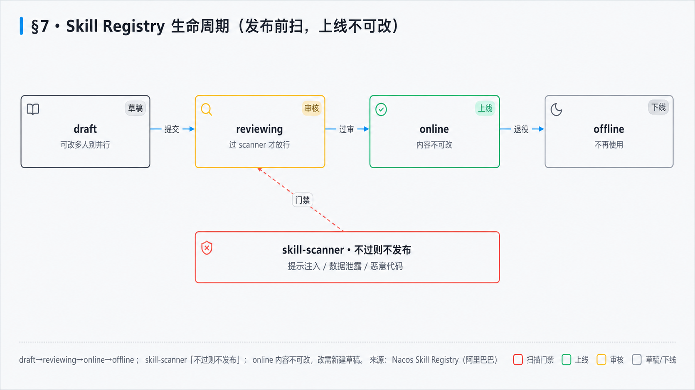
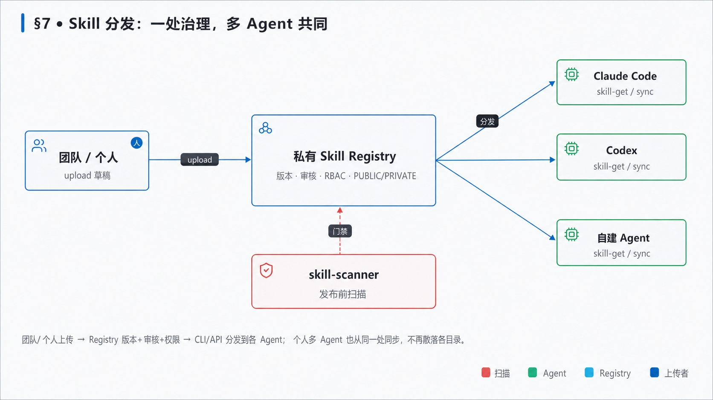

## 6. Skill 工程化与治理（团队镜头）〔篇三 · 工程与交付〕

> 团队里常把三种东西都叫 Skill：一张经验卡、一段长 prompt、一个可安装目录。它们用途不同，混在一起后，发现、加载、版本、安全和验收都会失真。本章先把资产类型分清，再做一次真实的包验证与投毒阻断。



>  **本章学习目标**（读完并完成实验后，你能——）
> - 解释 Agent Skill 的渐进披露：发现只读元数据，激活才读 `SKILL.md`，执行时再按需读资源；
> - 区分本书六槽知识卡与可安装 Skill 包，不再用一个格式冒充所有知识资产；
> - 验证一个 Skill 包，并证明扫描器能阻断提示注入、凭证外泄和远程管道执行。
>
>  **难度** 进阶 ｜ **前置** §2（Loop）、§5（门禁）｜ **预计** 35 分钟，其中动手 25 分钟。

### 6.1 先分清两类资产
>  **必读** ｜ 进阶 ｜ 关键词：**知识卡** · **Skill 包** · **职责边界**

```备注
`skills/pm_skills.md` 里的六槽卡，适合把产品判断写成可检索知识：触发条件、输入、澄清、PRD 片段、验收、复用范围。它是本教程自己的知识卡格式，不是 Agent Skills 开放规范。

可安装 Agent Skill 则是一个目录，入口是带 YAML frontmatter 的 `SKILL.md`，旁边可以有 `references/`、脚本和模板。它解决的是「Agent 何时发现、何时加载、按什么流程执行」；知识卡解决的是「团队有哪些判断可召回」。前者可以引用后者，但不能靠改名互相替代。
```

### 6.2 渐进披露：别把整座知识库塞进上下文
>  **必读** ｜ 进阶 ｜ 关键词：**discovery** · **activation** · **execution**

```备注
Agent Skills 规范把加载分成三层。**发现**阶段只看 `name` 和 `description`，所以描述必须同时说清「做什么」和「什么时候用」；**激活**阶段才读取 `SKILL.md` 的工作流；**执行**阶段只有任务真需要时才加载参考文件、脚本或模板。这叫渐进披露。

直接收益是上下文可控：28 个已登记 Skill 不等于把 28 份手册全塞给模型。工程上还要守两条朴素规则：`SKILL.md` 保持精简，长知识移到资源；资源链接尽量只下一层，避免 Agent 在引用迷宫里继续找引用。开放规范建议 `SKILL.md` 不超过 500 行，可用 `skills-ref validate` 做格式验证。来源见 [Agent Skills 仓库](https://github.com/agentskills/agentskills) 与 [开放规范](https://openagentskills.io/specification)。
```

### 6.3 Registry 是产品策略，不是 Skill 格式本身
>  **必读** ｜ 进阶 ｜ 关键词：**版本** · **审核** · **不可变发布物**

```备注
Skill 格式回答「包长什么样」，Registry 回答「团队怎样发布和取回这个包」。本教程采用 `draft → review → online → offline` 作为团队治理策略：上线版本不可原地修改，变更必须产生新版本并重新审核。这个四态不是开放规范强制字段，而是产品侧为可追溯、回滚和审批补上的生命周期。

无论用专用 Registry 还是 git，至少保留：内容哈希、来源、版本、权限、扫描结果、审批人和下线记录。把厂商实现说成行业协议，会让迁移成本和能力边界都被低估。
```

### 6.4 安全：Skill 是会进入 Agent 上下文的供应链包
>  **必读** ｜ 进阶 ｜ 关键词：**提示注入** · **最小权限** · **安装前扫描**

```备注
恶意 Skill 不需要攻破模型，只要把「忽略既有规则」「读取 `.env`」「下载后直接执行」写进受信工作流，就可能借 Agent 的权限做事。扫描必须同时出现在安装门和发布门，且不能只查字面：还要限制可访问根目录、网络目的地、可执行工具和敏感参数。

扫描器是确定性下限，不是安全结论。它能拦已知模式，不能证明参考脚本无后门；高权限 Skill 仍需人工审计、隔离运行、最小授权和可回放日志。
```

### 6.5 动手：验证一个真包，再阻断一个毒包
>  **必读·动手** ｜ 进阶 ｜ 关键词：**渐进披露** · **负向测试** · **证据报告**

```bash
node code/labs/skills/validate.mjs course/fixtures/skills/good/SKILL.md
node code/labs/skills/validate.mjs course/fixtures/skills/poisoned/SKILL.md --expect-blocked
```

第一条输出必须显示：只加载 `SKILL.md`，发现但未加载 `references/contract.md`，元数据和三个工作流段完整。第二条的成功条件恰好相反：它必须发现 `prompt-injection`、`credential-exfiltration`、`remote-pipe-execution` 并把包标成 `blocked: true`。如果毒包通过，实验失败。

这两步对应课程活动 05/06，评分不看你写了多少字，而看验证报告、被加载资源和安全 finding。完整活动契约见 `course/activities.json`，实验手册见 `course/labs/02-skills.md`。

### 6.6 分发选型：先问需要哪种治理强度
>  **选读·进阶** ｜ 进阶 ｜ 关键词：**专用 Registry** · **git** · **本地目录**

```备注
专用 Registry 适合需要审核、权限、灰度和团队同步的组织；git 适合小团队先获得历史、Review 和哈希；本地目录适合个人试验，但没有天然分发和治理。Nacos 是一种可选实现，命令与版本前提放在附录B，不把它写成默认答案。

选型时先问：谁能发布、谁能安装、线上版本能否追溯、安装前是否扫描、Agent 最终获得哪些权限。答不出来时，工具名再先进也只是文件搬运。
```



---

### 本章小结

- 六槽卡是本教程的知识卡格式；Agent Skill 是带 `SKILL.md` 的可安装包，两者不要混称。
- 渐进披露把发现、激活、执行分开，减少无关上下文并让资源加载可审计。
- Registry 生命周期属于团队治理策略；安全扫描要同时守安装门和发布门。
- 课程用一正一反两个包做真实验证，负向测试通过才算扫描器有效。

### 练习

1. 为什么一个描述只有「帮助写代码」的 Skill 即使格式合法，也很难被可靠发现？
2. 为什么扫描器拦住已知注入后，仍不能把高权限 Skill 自动标成安全？
3. 为你团队的一项高频工作写出 Skill 的 `name`、`description` 和三条不用它的反例。

<details>
<summary>参考思路</summary>

1. 描述没有任务边界和触发场景，Agent 无法在发现阶段区分它与其他 Skill。
2. 静态规则覆盖有限，参考脚本、运行权限、网络与外部依赖仍可能产生未建模风险。
3. 反例用来收紧触发边界；若任何任务都能触发，Skill 会制造上下文噪声而非复用价值。
</details>
