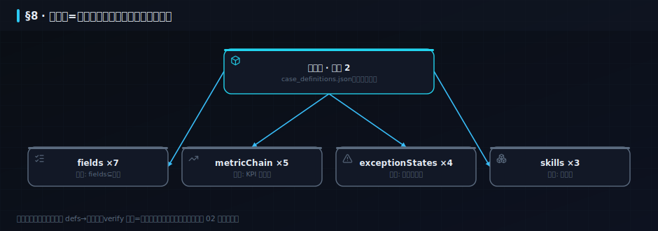

## 8. DDD 深化：把领域驱动落到真代码〔篇二 · 架构设计知识体系〕

> §3.3 用 C4+限界上下文画过「边界在哪」。这一章往下钻一层：边界**里面**怎么建模——实体、值对象、聚合、领域事件、资源库这些 DDD 战术件，每个都用**本仓库的真实代码**当标本解剖。传统书用一个虚构电商案例讲 DDD；本书的案例就是你正在读的这个系统本身。

>  **本章学习目标**（读完你能——）
> - 分清实体/值对象/聚合，并说出为什么「聚合根是一致性的边界」；
> - 用通用语言审视一份真实代码：名字与业务说的是不是同一套话；
> - 在本仓库指认每个 DDD 战术件的真实标本，并识别一处**故意暴露的建模瑕疵**。
>
>  **难度** 高阶 ｜ **前置** §3 ｜ **预计** 18 分钟。

### 8.1 通用语言：名字就是架构
>  **必读** ｜ 进阶 ｜ 关键词：**Ubiquitous Language** · **代码=业务词典**

```备注
DDD 第一原则不是画图，是**说同一种话**：业务叫「案例」，代码就叫 `case`，文档就叫案例——不许出现「代码里叫 record、页面上叫实操、需求里叫场景」的三张皮。检验通用语言最快的办法是 grep：在本仓库搜 `case`，从 `case_definitions.json`（定义）到 `caseData()`（服务）到 `#/case/NN`（路由）到「案例/NN-*.md」（书页），一条词链贯穿四层——这不是巧合，是纪律。AI 时代这条纪律更值钱：**Agent 靠名字理解你的系统**，词链断裂处就是它猜错的地方（§2.9 意图债务的一大来源）。
```

### 8.2 实体、值对象、聚合：一致性的三层线
>  **必读** ｜ 高阶 ｜ 关键词：**身份 vs 值** · **聚合根=一致性边界**

```备注
三个词一句话分清：**实体**有身份（案例 02 改了标题还是案例 02——身份是 `num`）；**值对象**只有值（KPI `{name:'命中率',value:25,unit:'%'}` 换个值就是另一个对象，没人在乎「它是哪一个」）；**聚合**是一组必须一起保持一致的对象，**聚合根**是唯一入口。本仓库的标本：`case_definitions.json` 里的一条案例定义就是聚合根——fields/metricChain/exceptionStates/skills 都挂在它下面，verify 的「fields⊆表头」「KPI 数=metricSpec 数」守卫就是**聚合不变量**（invariant）的机器化。改任何子对象必须经过根（改 defs 再重建），绕过根直接改产物 md，下一次 build 就会把你冲掉——这就是「聚合根是唯一入口」的物理执行。
```



### 8.3 领域服务与领域事件
>  **必读** ｜ 进阶 ｜ 关键词：**无状态动词** · **事件=过去时事实**

```备注
不属于任何单个实体的业务动词，放**领域服务**：`rfm()` 算的是全体会员的分层，不属于哪个会员——所以它是 `services/cases.ts` 里的一个无状态函数，而不是某实体的方法。**领域事件**则是「已发生的事实」的名词化：本仓库最真实的事件流是 git 提交（「v18-P1 已合并」）与门禁结果（「verify 全绿@某时刻」）——§9 的事件案例会把这条流真正接上屏。命名铁律：事件用过去时（OrderPlaced / 门禁已通过），命令用祈使（PlaceOrder / 运行门禁）——AI 读你的事件名时，时态就是语义。
```

### 8.4 资源库与防腐层：边界上的两扇门
>  **必读** ｜ 进阶 ｜ 关键词：**Repository=集合假象** · **ACL=翻译官**

```备注
**资源库（Repository）**给领域一个假象：「所有订单就像一个内存集合」，背后是 CSV 还是 PG 领域不关心——`data/csv.ts` 与 `db/relational.ts` 就是两个资源库实现，换存储不动业务（§3.5 ADR-001 的底气正来自这里）。**防腐层（ACL）**是上下文边界上的翻译官：外部模型再乱，翻译成我的通用语言再进门。本仓库标本：`fetch-datasets.mjs` 把 UCI 原始英文表头（Invoice/Quantity/Price…）翻译成中文业务语言（订单号/数量/单价）——上游 schema 变了只改翻译层，全书不动。
```

### 8.5 一处故意暴露的瑕疵：找出它
>  **选读·挑战** ｜ 高阶 ｜ 关键词：**建模味道**

```备注
诚实说，本仓库不是完美 DDD 标本。`services/cases.ts` 里业务函数逐渐堆积（rfm/retail/caseData/archModel…），正在滑向 DDD 反模式「**贫血服务大杂烩**」——按聚合拆成 rfm.service / retail.service 才是教科书答案，但拆分要有触发信号（文件逼近 800 行红线，critic big-file 探针盯着）。留着这处瑕疵是刻意的：**架构债在「看得见+有守卫盯着」时可以是理性选择**（§3.6 演进触发表同理）。练习 3 会让你论证何时该拆。
```

---

### 本章小结

- **通用语言是可以 grep 的**：词链贯穿定义→服务→路由→文档，断裂处=Agent 猜错处。
- **聚合根=一致性边界的唯一入口**：verify 的不变量守卫 + 「产物必经 build 重建」= 聚合纪律的机器化。
- 资源库隔离存储、防腐层隔离外部模型；**债可以留，但必须看得见且有守卫**。

### 练习

1. **巩固**：KPI 对象为什么是值对象而不是实体？如果给每条 KPI 发一个 id 会发生什么坏事？
2. **巩固**：指出「fields⊆表头」守卫守护的是哪个聚合的哪条不变量。
3. **挑战**：给 8.5 的瑕疵写一条演进触发行（现状/触发信号/动作/回滚），格式照 §3.6。

<details>
<summary>参考思路</summary>

1. 它的相等性由值决定，替换即变更；发 id 会诱使系统「更新 KPI」而不是「重算 KPI」，与「指标必须从数据重算」的不变量冲突。
2. 案例聚合（根=defs 里的一条案例）的不变量「声明字段必须真实存在于数据表头」。
3. 例：现状 cases.ts 单文件多服务｜触发 >700 行或新增第 3 个领域函数簇｜动作 按聚合拆 service 文件｜回滚 保留统一导出入口，合并回单文件。
</details>
