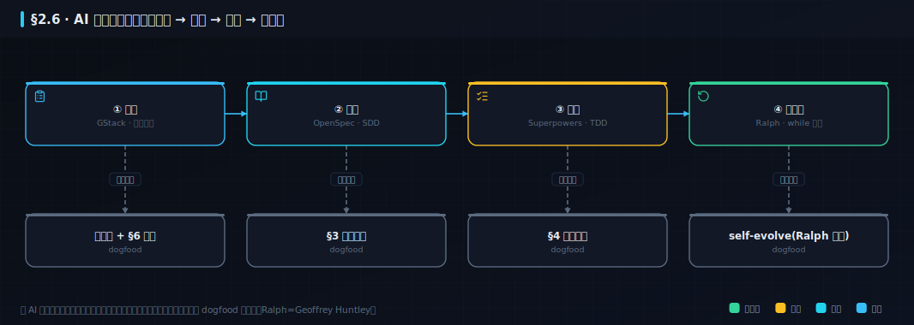
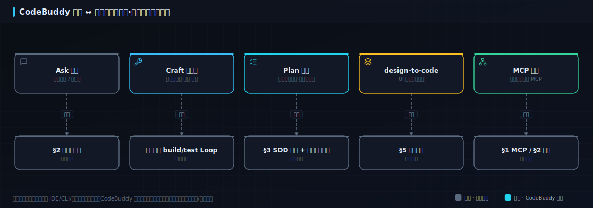

## 附录B · 工具生态速查（带日期，过时即换）

> 本附录集中收纳全书点名的真实工具：命令、目录、对照。**模式是脊柱（正文讲），工具是实例（本页查）**——星数、命令、归属都会随时间变，本页整体**最后核实：2026-07**，落地前以各项目官方仓库为准。

### B.1 AI 驱动开发组合拳 · 上手实操

```bash
# ① 治理：召唤虚拟团队验证需求、拆任务（gstack）
/office-hours     # 暴力追问需求合理性
/plan             # 工程经理视角拆任务

# ② 规格：把约定锁进文件，成为唯一真源（OpenSpec）
/opsx-propose  →  /opsx-apply  →  /opsx-archive   # 提案→实施→归档(delta spec)

# ③ 纪律：装上强制 TDD（Superpowers）——先写失败测试，再写实现
git clone https://github.com/obra/superpowers ~/.superpowers

# ④ 自动化：无人值守跑任务清单，每步过 verify 才提交（Ralph）
ralph run --tasks tasks.md --spec specs/x.md --verify "npm test" \
  --on-success "git add -A && git commit -m '[ralph] {task}'"
```



> **工具信息最后核实：2026-07。** 上面的具体工具名、命令、星数都会变（AI 工具生态迭代极快）——但那条**流水线（治理→规格→纪律→自动化）是模式，不随工具过时**。记模式，工具随时可换；详见 §7.7 的工具生态速查与「过时即风险」。

#### 2.6.1 国产落地：一个当下就能装、能跑的组合拳实例——CodeBuddy
>  **选读·进阶** ｜ 进阶 ｜ 关键词：**CodeBuddy** · **三形态** · **Plan / Craft / Ask**（模式是脊柱，工具是实例）

```备注
诚实说一句：上面那条组合拳的命令，很多都跑在 Claude Code 上——而 **Claude / Claude Code 目前不支持中国大陆**（见 [Anthropic 支持地区](https://www.anthropic.com/supported-countries)，2025-09 起进一步限制中国控股实体）。本书讲「真可运行」，就不能让中文读者对着一套装不上的工具干瞪眼。

对中文读者，当下能装、能跑的一个落点是 **CodeBuddy（腾讯云代码助手）**：国内首家支持**三形态**（IDE / CLI / 插件），三个模式恰好对上本书的三件事——**Ask**（对话问答）＝提示词工程；**Craft**（智能体：多文件生成 / 重构 / 测试）＝研发镜头的 build/test 内层 Loop；**Plan**（规划：先列任务清单、再自主执行读改查）＝ §3 的 SDD 任务分解 + 组合拳里「自动化」那一环。它还是**国内首个支持 MCP** 的助手（对上 §1 的 MCP、§2 的连接），并能 **design-to-code**（把 UI 设计一键转成前端代码，对上 §5）。据腾讯与媒体口径，其内部使用率与编码提效数字都不低——但那是厂商/媒体说法、非本书实测，别当权威。

要强调的是：**模式才是脊柱，CodeBuddy 只是一个「你现在就能上手」的实例**——海外读者用 Claude Code / Cursor / gstack / Ralph 同样成立。下图把 CodeBuddy 的模式对到本书概念。
```



### B.2 Skill Registry（Nacos）CLI

**方案 A · Nacos Skill Registry（团队级）**：Nacos 是阿里巴巴 2018 年开源的服务发现与配置中心，3.2.0 起扩展出 AI 注册中心，能管 Skill / Agent / MCP。控制台在「AI 注册中心 > Skill 管理」，也提供 CLI：

```bash
nacos-cli skill-upload  /path/to/my-skill          # 上传草稿(draft)
nacos-cli skill-review  my-skill                   # 提交审核(过 skill-scanner)
nacos-cli skill-release my-skill --version 0.0.2   # 审核通过后发布 online
nacos-cli skill-get     my-skill                   # 团队成员下载
nacos-cli skill-sync    --all                      # 本地跟随 Registry 版本自动同步
```

一个典型 Skill 目录：`my-skill/{SKILL.md, scripts/, references/, assets/}`，`SKILL.md` 是核心（元数据 + 指令）。

### B.3 开源资源索引
>  **选读** ｜ 入门 ｜ 关键词：**索引**（要落地时按表找工具；星数是弱信号，用前先核实来源/许可/安全）

| 类别 | 工具 / 资源 | 一句话 |
|---|---|---|
| 组合拳·治理 | gstack（garrytan/gstack） | 23 角色虚拟工程团队（Garry Tan/YC） |
| 组合拳·规格 | OpenSpec（Fission-AI/OpenSpec） | SDD / delta spec（增量规格） |
| 组合拳·纪律 | Superpowers（obra/superpowers） | 强制 TDD + 方法论（Jesse Vincent） |
| 组合拳·自动化 | Ralph（Geoffrey Huntley；实现 snarktank/ralph） | Agent 包进 while 循环 |
| Skill 治理 | Nacos Skill Registry（alibaba/nacos） | 私有 Skill 仓库·版本/审核/扫描（阿里） |
| 国产 AI 编程 | CodeBuddy（腾讯 copilot.tencent.com） | 三形态 IDE/CLI/插件·Plan/Craft/Ask·国内首家 MCP·中文读者当下可跑（见 B.1） |
| 去 AI 味 | humanizer / stop-slop / taste-skill / ai-flavor-remover / shuorenhua / nuwa-skill / writing-agent 等 | 去 AI 写作痕迹的 skill 榜 |
| 技能/资源索引 | awesome-claude-code / claude-skills（alirezarezvani/claude-skills） | Skill 与资源索引 |
| 文件化计划 | planning-with-files（OthmanAdi/planning-with-files） | 文件化 AI 任务计划（印证本书做法） |
| 学习延伸 | cs249r_book（harvard-edge/cs249r_book） | 哈佛《机器学习系统》开源教材 |
| 领域/多 Agent | marketing-skills · gastown · herdr（终端多 Agent）· page-agent（网页 GUI） | 领域技能 / 多 Agent 工作台 |

> 这些工具星数动辄十几万，但**星数是带日期的弱人气信号，不等于质量或权威**——挑工具先核实来源、许可与安全（尤其对照 §6.3 的 skill-scanner，公开 Skill 有毒的比例并不低）。
>
> **最后核实：2026-07。** 工具的版本、命令、星数、归属都会随时间变——本表是某一时刻的快照，落地前请以各项目官方仓库为准。这本身就是「过时即风险」的一个实例：**模式（治理→规格→纪律→自动化、Registry 生命周期）不随工具过时，但具体工具名与命令会**——所以本书把工具内容集中在带日期、可替换的小节里，别把它们当永恒真理。
