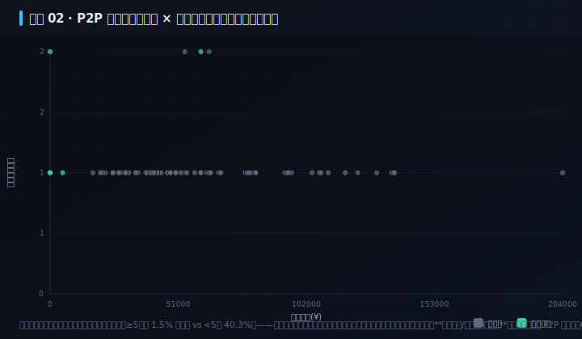
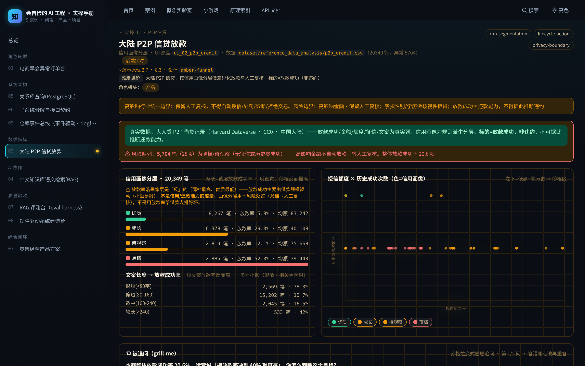

# 实操 02：信用画像分层｜大陆 P2P 信贷放款

### 项目场景故事

P2P 信贷风控 PM 天天面对同一道题：两万笔借款申请里，哪些该放款、哪些要收紧、哪些必须人工复核。凭「额度高就靠谱」拍脑袋会翻车。真正的抓手是把借款人按「有无征信 × 历史成功次数 × 授信额度」做信用画像分层，把「薄档 / 待观察」拎出来走人工复核。但这份真实数据藏着一个反直觉真相：薄档、无征信、小额的借款反而更容易融到款（放款率薄档 52% > 优质 6%）——因为放款成功主要由借款规模驱动（小额易融、大额难融），与信用强弱负相关。这恰恰是本案最锋利的一课：放款成功率不是信用/还款能力的度量。

> **本案例演示/验证**：原理 2.7、8.3｜**采用设计** `amber-funnel`（见 [design/amber-funnel.md](../../design/amber-funnel.md)）

> **在数字化系统中的位置**：能力智能层 · 洞察环节｜**理论→实操**：把 §2.7 的产品判断力与 §8.3 的领域服务（`creditSegment()` 无状态分层真算），落成「信用画像真算 → 分层 → 薄档/待观察转人工复核 → 差异化放款」的可运行风控动作。

> **角色镜头**： 产品（本案更偏这些角色；主脊 §1-§2 三镜头共读）

>  **难度** 进阶｜**一句话** 大陆 P2P 信贷：按信用画像分层做差异化放款与人工复核，标的=放款成功（非违约）｜**前置** 建议先读完第一部分
>
>  **洞见**：信用分层的价值不在算出一个分数，而在把「征信空白、历史零成功」的薄档拎出来做风险处置。本案真算 20349 笔人人贷，整体放款率 20.6%——但反直觉：薄档放款率 52% 远高于优质 6%，无征信(32%) 高于有征信(16%)，授信额度≥5万的仅 1.5% 融到款、<5万 的 40.3%。因为放款成功主要由借款规模驱动（小额易融、大额难融），与信用强弱负相关。放款成功 ≠ 信用好 ≠ 还得起，它是被规模混淆的信号，绝不能当信用度量——这正是本案最该记住的一条。
>
>  **常见坑**：① 把「放款成功」当信用/还款能力——本案放款率与信用强弱负相关（薄档反而最高），拿它给借款人排好坏会得出「给无征信小额薄档放款」的荒谬结论；② 相关当因果——短文案放款率更高，其实是短文案≈小额、小额易融的混淆，不是文案好；③ 用性别/学历做拒贷规则——高影响金融必须可解释、判定权留人工复核。

**现状问题**

- 决策依赖的关键指标：借款数、放款成功率、征信完整率、优质画像占比、借款金额均值。
- 现场常见异常：高风险薄档、需人工复核、无征信、文案偏短。
- 只做通用页面无法支撑「按信用画像分层给差异化放款/额度策略；薄档与待观察走人工复核，不自动放款。」。

**本次任务**

- 明确岗位、指标链、异常状态与决策动作。
- 使用 `rfm-segmentation` 与 `lifecycle-action` 完成分析，产出 `信用画像分层放款策略`，用 `privacy-boundary` 验收。

### 任务目标与数据

- 行业：P2P信贷
- 真实业务场景：大陆 P2P 信贷放款与信用画像运营
- 岗位：信贷风控产品经理
- 数据或资料：`dataset/reference_data_analysis/p2p_credit.csv`（20349 行，异常 5704）
- 公开参考：人人贷 P2P 借贷公开数据（Harvard Dataverse doi:10.7910/DVN/C4RUDY，CC0，中国大陆）；信用分层方法论参考信用评分卡/RFM
- 行业字段：借款号、放款成功、借款金额、授信额度、有征信报告、信用画像、风险信号
- 指标链（真实基座 + 已标注教学合成叠加列）：借款数 20349，放款成功率 20.6%，征信完整率 71.3%，优质画像占比 40.6%，借款金额均值 62463.61
- 决策动作：按信用画像分层给差异化放款/额度策略；薄档与待观察走人工复核，不自动放款。
- 风险边界：高影响金融·保留人工复核；禁按性别/学历做歧视性拒贷；放款成功≠还款能力，不得据此推断违约（高影响行业·人工复核）
- UI 原型：`ui_02_p2p_credit`（credit_seg_screen）
- 采用设计：amber-funnel
- SaaS 组件：信用分层、放款转化、征信完整度、文案质量、风险队列、人工复核

### Prompt 实操

> **怎么用**：推荐用 **CodeBuddy 的 Plan 模式**（腾讯，国产·当下可跑）——把下面灰底代码框**整段原样粘进去，它会先列出任务清单、再自主执行**，你不需要看懂里面的技术细节；没装过就先装一个。海外读者用 Claude Code / Cursor / Trae 等任一 Agent 工具同理（见附录B）。

**Prompt 1：大陆 P2P 信贷放款与信用画像运营 - 问题定义**

```text
请以产品经理身份，用 AI 编程工具（如 Trae、CodeBuddy 等任一 Agent 工具）完成「大陆 P2P 信贷放款与信用画像运营」的**产品问题定义**（这一步先把问题想清楚，不写代码）：
- 岗位与场景：信贷风控产品经理 面向「大陆 P2P 信贷放款与信用画像运营」，把业务判断转成一份可验证的产品问题定义。
- 数据：读取 `dataset/reference_data_analysis/p2p_credit.csv`，只使用其中实际存在的字段（借款号、放款成功、借款金额、授信额度、有征信报告、信用画像、风险信号）。
- 指标链：借款数、放款成功率、征信完整率、优质画像占比、借款金额均值（当前真实值：借款数=20349，放款成功率=20.6%，征信完整率=71.3%，优质画像占比=40.6%，借款金额均值=62463.61）。
- 现场异常：要盯的是 高风险薄档、需人工复核、无征信、文案偏短——说清每类异常谁负责、如何被发现。
- 决策动作：这份定义最终要支撑的关键决策是——按信用画像分层给差异化放款/额度策略；薄档与待观察走人工复核，不自动放款。
- 使用 Skill：用 rfm-segmentation、lifecycle-action 完成分析（结构化 Skill 见 skills/pm_skills.md）。
- 输出：信用画像分层放款策略，保存为 `outputs/product_case_library/case_02_p2p_credit_问题定义.md`。
- 边界：结论必须回到数据或公开参考（人人贷 P2P 借贷公开数据（Harvard Dataverse doi:10.7910/DVN/C4RUDY，CC0，中国大陆）；信用分层方法论参考信用评分卡/RFM）；不得越过「高影响金融·保留人工复核；禁按性别/学历做歧视性拒贷；放款成功≠还款能力，不得据此推断违约」；高影响行业保留人工复核。
```

**Prompt 2：大陆 P2P 信贷放款与信用画像运营 - 方案验收**（注意：outputs/ 交付物由 build_docs 重建覆盖，建议在新分支/对照目录运行）

```text
请以产品经理身份，用 AI 编程工具（如 Trae、CodeBuddy 等任一 Agent 工具）完成「大陆 P2P 信贷放款与信用画像运营」的**方案验收**（把上一步的问题定义做成可运行原型，并逐项验收）：
- 目标：基于问题定义，产出一个可运行的深色大屏原型，让指标链、异常队列、责任、行动都能在页面上看到、点得动。
- 数据：读取 `dataset/reference_data_analysis/p2p_credit.csv`，只使用其中实际存在的字段（借款号、放款成功、借款金额、授信额度、有征信报告、信用画像、风险信号）。
- 指标链：借款数、放款成功率、征信完整率、优质画像占比、借款金额均值（当前真实值：借款数=20349，放款成功率=20.6%，征信完整率=71.3%，优质画像占比=40.6%，借款金额均值=62463.61）。
- 原型（技术契约，遵 rules/ 约束：DRY、单文件<800行、TS 类型、中文注释）：在 `code/web`（Vite+React+TS）路由 `#/case/02`，按 `ui_02_p2p_credit`（credit_seg_screen）与设计 `amber-funnel` 渲染；数据经 `build_case_data.mjs` 预计算，不得复用通用表格占位。
- 使用 Skill：用 privacy-boundary 做验收（结构化 Skill 见 skills/pm_skills.md）。
- 输出：信用画像分层放款策略，保存为 `outputs/product_case_library/case_02_p2p_credit_方案验收.md`。
- 验收条件：指标链回到真实数据、异常可追踪、行动入口明确；不得越过「高影响金融·保留人工复核；禁按性别/学历做歧视性拒贷；放款成功≠还款能力，不得据此推断违约」；高影响行业保留人工复核；`node code/tools/verify_course_package.mjs` 必须 ALL GREEN。
```

### 图形/原型/表单







- 图形类型：p2p_credit（设计 amber-funnel）
- 看图顺序：先看放款成功率与信用画像分层，再看「薄档/待观察」风险队列，最后想这两层该放款、收紧还是转人工复核。
- UI 差异：本案例采用 `ui_02_p2p_credit` + 设计 `amber-funnel`，不得复用通用表格占位；可运行原型见 `#/case/02`。

### 交付物与验收

交付物：**信用画像分层放款策略**。必含要素（字段/指标链/异常状态/Skill/决策动作/高影响复核）与合格线由自测器六项核对：`node code/tools/check_my_work.mjs 2 你的方案.md`；红线：不越过「高影响金融·保留人工复核；禁按性别/学历做歧视性拒贷；放款成功≠还款能力，不得据此推断违约」。

**指定实操融合**

- RP11：AI-Excel 数据分析转产品判断
  - 产出：指标分析表, 产品改进建议
  - 验收：RFM、趋势或异常检测结果必须转化为明确产品判断，不能停留在图表描述。

### 跟着做（动手复现）

1. 起服务：`bash code/run.sh`，浏览器打开 `#/case/02`（本案专属大屏）。
2. **你应看到**：真实数据横幅、信用画像分层、授信×历史成功散点与薄档风险队列，数据来自后端实时接口（性质见章首标注）。
3. **动手改一改**：改 `code/tools/fetch-datasets.mjs` 里 p2p_credit 生成块的信用画像切点（`score>=4?'优质'` 那行），把阈值改成 `score>=5`，依次跑 `node code/tools/fetch-datasets.mjs && node code/tools/build_case_data.mjs`，刷新 `#/case/02` 看优质占比与风险队列怎么变——体会「分层切点是产品决策、不是天经地义」。
4. **自测产出**：`node code/tools/check_my_work.mjs 2 你的方案.md`——红项指明缺什么、回哪章补。

<details>
<summary> 深度（专业读者）：权衡 · 失效模式 · 何时别用</summary>

本案标的是「放款成功」而非「违约」——干净可 vendored 的大陆公开集里没有违约标的（魔镜杯/拍拍贷/天池违约集均需账号且禁再分发，见 MANIFEST）。它能教「分层做风险处置」与「别把混淆信号当度量」，但**教不了违约预测**。最锋利的一课是混淆(confounding)：放款成功率沿信用画像层是反的（薄档 52% vs 优质 6%），因为背后真正驱动放款的是借款规模（额度≥5万仅 1.5% 融到款），信用信号被规模压过。文案长度→放款率同理（短文案≈小额）。所以信用画像分层只用于「谁走人工复核」，绝不用放款率给借款人排好坏。
</details>

### 练习（做完再进下一个案例）

1. **巩固**：打开 `#/case/02`，找出「薄档」群——无征信、历史零成功的申请，你会给他们放款、收紧、还是转人工复核？为什么？
2. **挑战**：高额度申请里也有征信空白的人。用「有无征信 × 历史成功次数 × 授信额度」设计一套信用画像分层规则，说明为什么不能只按额度一刀切放款。

<details>
<summary>参考思路（先自己想，再展开）</summary>

- 这两题没有唯一标准答案，检验的是你能否把本案方法用自己的话讲出来：先按「跟着做」第 3 步真改一次、看指标怎么动，再对照上方「深度」折叠块的权衡与失效模式自评你的答案有没有踩坑。
- 答不顺就回读本案演示的原理小节 §2.7、§8.3；写成方案后跑 `node code/tools/check_my_work.mjs 2 你的方案.md`，红项会指明缺什么、回哪章补。
</details>

### 被追问（grill-me · 先自己答，再展开）

> 教员式追问：不给你标准答案，先逼你选、再点破误区。页内 `#/case/02` 有可交互版（答错即追问）。

**追问 1**：本案整体放款成功率 20.6%。运营说「把放款率冲到 40% 就算赢」，你怎么判断这个目标？

- A. 对，放款越多营收越高
- B. 不能只冲放款率——放款成功≠还得起，冲高可能是给薄档乱放款埋坏账
- C. 无所谓，KPI 达标就行

<details>
<summary>点破（先选再展开）</summary>

- 若答错：这份数据的标的是「放款成功（是否融到款）」，不是「是否违约」。放款率冲高、如果冲的是薄档/无征信人群，你根本不知道他们还不还得起——你在用一个测不到风险的指标当成功标准。再选一次？
- 答对后再想一层：再追一层：其实本案数据里薄档放款率(52%)远高于优质(6%)、额度≥5万的仅 1.5% 融到款——放款率越高越可能只是「小额薄档」。那你会用什么指标给放款率把关，避免把混淆信号当成功标准？
</details>

**追问 2**：「薄档」群（无征信、历史零成功）你打算怎么处置？

- A. 直接拒贷，省事
- B. 一律自动放款，反正额度不高
- C. 转人工复核、不自动放款——高影响金融判定权留人工

<details>
<summary>点破（先选再展开）</summary>

- 若答错：直接拒贷会误伤真实新客（薄档≠坏人，只是信息少）；一律自动放款则把风险敞口交给算法。高影响金融的铁律是「可解释 + 人在环」，边界样本交人工复核。再选？
- 答对后再想一层：最后一问：如果模型给某个薄档打了高分，你会因为分数高就自动放款吗？
</details>

> **小结**：本案用「大陆 P2P 信贷放款与信用画像运营」演示原理 2.7、8.3，落成可运行、可验收的产品判断。运行 `bash code/run.sh` 后访问 `#/case/02`（真后端实时数据）。

[← 返回案例总览](README.md) · [返回目录](../../AI时代研发产品项目一体化知识库/README.md)
