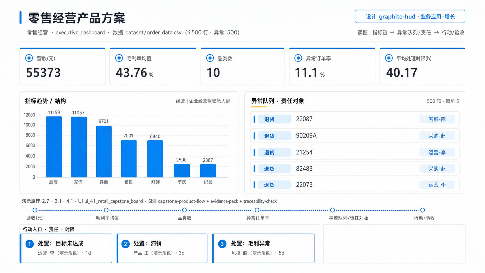
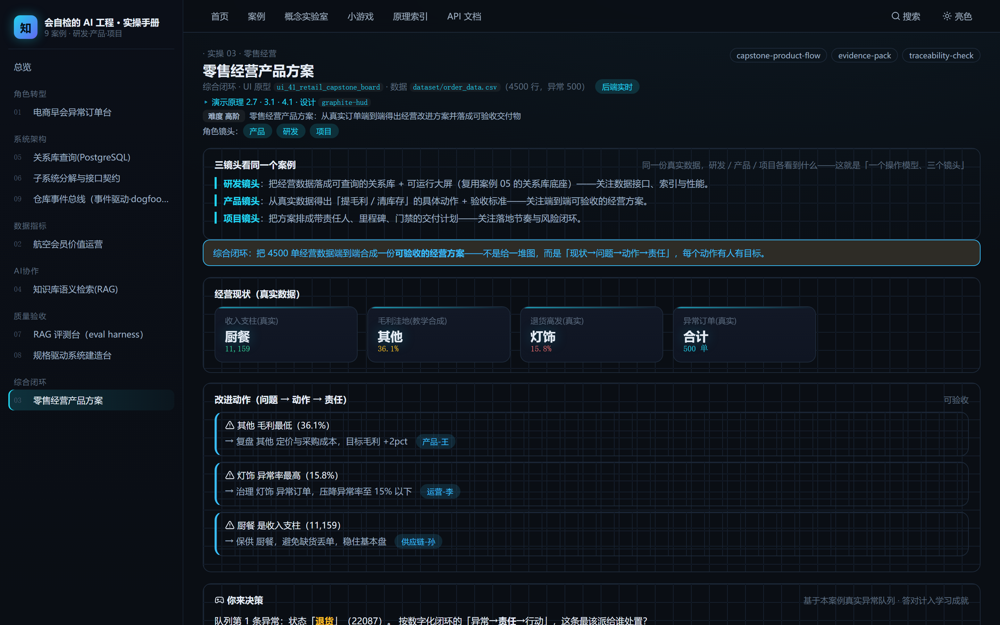

# 实操 03：综合闭环｜零售经营产品方案

### 项目场景故事

作为综合闭环案例，零售经营负责人要把「早会异常→驾驶舱洞察→改进动作→责任闭环」串成一份可验收的经营方案。本案基于真实 UCI Online Retail II（4500 单真实英国电商订单），把销售额、退货、区域结构端到端形成从数据到方案的完整链路。毛利率为教学合成叠加、已标注。

> **本案例演示/验证**：原理 2.7、3.1、4.1｜**采用设计** `graphite-hud`（见 [design/graphite-hud.md](../../design/graphite-hud.md)）

> **在数字化系统中的位置**：业务应用层 · 增长环节｜**理论→实操**：把原理 2.7、3.1、4.1 落成可运行操作：从数据端到端得出零售经营改进方案并落成可验收交付物（依赖案例 04–06 的数据底座，本案可先不管）

> **角色镜头**： 产品 ·  研发 ·  项目（本案更偏这些角色；主脊 §1-§2 三镜头共读）

>  **难度** 高阶｜**一句话** 零售经营产品方案：从真实订单端到端得出经营改进方案并落成可验收交付物｜**前置** 建议先读完第一部分
>
>  **洞见**：综合案例的价值在「端到端可验收」：不是给一堆图，而是从真实数据得出「哪个区域是收入支柱、哪个品类退货高发要治理」的具体动作，且每个动作有责任人和验收标准。 「毛利洼地」基于教学合成的毛利率，页面已标注，实操中应换成真实成本数据。
>
>  **常见坑**：① 方案停在「分析」不落到「动作+责任+验收」；② 脱离数据编经营结论——本案收入/区域/退货结论都回到 order_data 真实聚合；③ 把教学合成的毛利当真实成本决策依据。

### 三镜头看同一个案例

> 同一份真实数据、同一个案例，研发/产品/项目三种角色各看到什么——这就是「一个操作模型、三个镜头」。

-  **研发镜头**：把经营数据落成可查询的关系库 + 可运行大屏（复用案例 05 的关系库底座）——关注数据接口、索引与性能。
-  **产品镜头**：从真实数据得出「提毛利 / 清库存」的具体动作 + 验收标准——关注端到端可验收的经营方案。
-  **项目镜头**：把方案排成带责任人、里程碑、门禁的交付计划——关注落地节奏与风险闭环。

**现状问题**

- 决策依赖的关键指标：营收(元)、毛利率均值、品类数、异常订单率、平均处理时限(h)。
- 现场常见异常：目标未达成、滞销、毛利异常、责任未闭环。
- 只做通用页面无法支撑「从数据端到端得出零售经营改进方案并落成可验收交付物」。

**本次任务**

- 明确岗位、指标链、异常状态与决策动作。
- 使用 `capstone-product-flow` 与 `evidence-pack` 完成分析，产出 `零售经营产品方案`，用 `traceability-check` 验收。

### 任务目标与数据

- 行业：零售经营
- 真实业务场景：零售经营产品方案
- 岗位：经营负责人
- 数据或资料：`dataset/order_data.csv`（4500 行，异常 500）
- 公开参考：https://archive.ics.uci.edu/dataset/502/online+retail+ii（真实英国电商订单，CC BY 4.0）
- 行业字段：SKU、品类、区域、金额、毛利率、库存天数、责任人
- 指标链（真实基座 + 已标注教学合成叠加列）：营收(元) 55373，毛利率均值 43.76%，品类数 10，异常订单率 11.1%，平均处理时限(h) 40.17
- 决策动作：从数据端到端得出零售经营改进方案并落成可验收交付物
- 风险边界：不得脱离数据编造结论
- UI 原型：`ui_41_retail_capstone_board`（executive_dashboard）
- 采用设计：graphite-hud
- SaaS 组件：目标达成、收入趋势、业务结构、区域排行、异常告警、行动队列

### Prompt 实操

> **怎么用**：推荐用 **CodeBuddy 的 Plan 模式**（腾讯，国产·当下可跑）——把下面灰底代码框**整段原样粘进去，它会先列出任务清单、再自主执行**，你不需要看懂里面的技术细节；没装过就先装一个。海外读者用 Claude Code / Cursor / Trae 等任一 Agent 工具同理（见附录B）。

**Prompt 1：零售经营产品方案 - 问题定义**

```text
请以产品经理身份，用 AI 编程工具（如 Trae、CodeBuddy 等任一 Agent 工具）完成「零售经营产品方案」的**产品问题定义**（这一步先把问题想清楚，不写代码）：
- 岗位与场景：经营负责人 面向「零售经营产品方案」，把业务判断转成一份可验证的产品问题定义。
- 数据：读取 `dataset/order_data.csv`，只使用其中实际存在的字段（SKU、品类、区域、金额、毛利率、库存天数、责任人）。
- 指标链：营收(元)、毛利率均值、品类数、异常订单率、平均处理时限(h)（当前真实值：营收(元)=55373，毛利率均值=43.76%，品类数=10，异常订单率=11.1%，平均处理时限(h)=40.17）。
- 现场异常：要盯的是 目标未达成、滞销、毛利异常、责任未闭环——说清每类异常谁负责、如何被发现。
- 决策动作：这份定义最终要支撑的关键决策是——从数据端到端得出零售经营改进方案并落成可验收交付物
- 使用 Skill：用 capstone-product-flow、evidence-pack 完成分析（结构化 Skill 见 skills/pm_skills.md）。
- 输出：零售经营产品方案，保存为 `outputs/product_case_library/case_03_retail_capstone_board_问题定义.md`。
- 边界：结论必须回到数据或公开参考（https://archive.ics.uci.edu/dataset/502/online+retail+ii（真实英国电商订单，CC BY 4.0））；不得越过「不得脱离数据编造结论」。
```

**Prompt 2：零售经营产品方案 - 方案验收**（注意：outputs/ 交付物由 build_docs 重建覆盖，建议在新分支/对照目录运行）

```text
请以产品经理身份，用 AI 编程工具（如 Trae、CodeBuddy 等任一 Agent 工具）完成「零售经营产品方案」的**方案验收**（把上一步的问题定义做成可运行原型，并逐项验收）：
- 目标：基于问题定义，产出一个可运行的深色大屏原型，让指标链、异常队列、责任、行动都能在页面上看到、点得动。
- 数据：读取 `dataset/order_data.csv`，只使用其中实际存在的字段（SKU、品类、区域、金额、毛利率、库存天数、责任人）。
- 指标链：营收(元)、毛利率均值、品类数、异常订单率、平均处理时限(h)（当前真实值：营收(元)=55373，毛利率均值=43.76%，品类数=10，异常订单率=11.1%，平均处理时限(h)=40.17）。
- 原型（技术契约，遵 rules/ 约束：DRY、单文件<800行、TS 类型、中文注释）：在 `code/web`（Vite+React+TS）路由 `#/case/03`，按 `ui_41_retail_capstone_board`（executive_dashboard）与设计 `graphite-hud` 渲染；数据经 `build_case_data.mjs` 预计算，不得复用通用表格占位。
- 使用 Skill：用 traceability-check 做验收（结构化 Skill 见 skills/pm_skills.md）。
- 输出：零售经营产品方案，保存为 `outputs/product_case_library/case_03_retail_capstone_board_方案验收.md`。
- 验收条件：指标链回到真实数据、异常可追踪、行动入口明确；不得越过「不得脱离数据编造结论」；`node code/tools/verify_course_package.mjs` 必须 ALL GREEN。
```

### 图形/原型/表单





- 图形类型：retail_capstone_board（设计 graphite-hud）
- 看图顺序：先看经营现状(真实收入支柱/退货高发)，再看「现状→问题→动作→责任」方案，最后检查每条动作是否可验收。
- UI 差异：本案例采用 `ui_41_retail_capstone_board` + 设计 `graphite-hud`，不得复用通用表格占位；可运行原型见 `#/case/03`。

### 交付物与验收

交付物：**零售经营产品方案**。必含要素（字段/指标链/异常状态/Skill/决策动作/高影响复核）与合格线由自测器六项核对：`node code/tools/check_my_work.mjs 3 你的方案.md`；红线：不越过「不得脱离数据编造结论」。

### 参考验证

本案属于「从真实字段和查询证据走到一个可追责决策」链的支持素材。打开 `#/case/03` 核对专属页面与真实接口；核心动手、评分和完成证据集中在该链的主实验，避免重复做同一套运行/观察/改动/自测。

<details>
<summary> 深度（专业读者）：权衡 · 失效模式 · 何时别用</summary>

为什么把指标→检索→决策串成闭环，而非孤立看指标？孤立指标不产生行动。失效模式：闭环里任一环用了合成数据却当真。何时别用：业务尚未定型时，先手工跑几轮再自动化（§2「先建传感器再谈自动化」）。
</details>

### 练习（做完再进下一个案例）

1. **巩固**：打开 `#/case/03`，从真实的「区域收入」和「品类退货率」各挑一个「要保供」和「要治理退货」的对象。
2. **挑战**：把本案分析写成一份「动作 + 责任人 + 验收标准」的经营方案（3 条即可），确保每一条都能被真实数据验证；指出哪一条依赖了教学合成的毛利、应如何补真实成本。

<details>
<summary>参考思路（先自己想，再展开）</summary>

- 这两题没有唯一标准答案，检验的是你能否把本案方法用自己的话讲出来：先按「跟着做」第 3 步真改一次、看指标怎么动，再对照上方「深度」折叠块的权衡与失效模式自评你的答案有没有踩坑。
- 答不顺就回读本案演示的原理小节 §2.7、§3.1、§4.1；写成方案后跑 `node code/tools/check_my_work.mjs 3 你的方案.md`，红项会指明缺什么、回哪章补。
</details>

> **小结**：本案用「零售经营产品方案」演示原理 2.7、3.1、4.1，落成可运行、可验收的产品判断。运行 `bash code/run.sh` 后访问 `#/case/03`（真后端实时数据）。

[← 返回案例总览](README.md) · [返回目录](../../AI时代研发产品项目一体化知识库/README.md)
