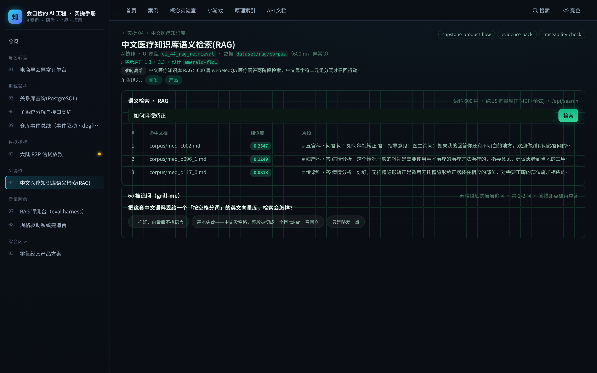

# 实操 04：AI协作｜中文医疗知识库语义检索(RAG)

### 项目场景故事

AI 产品经理要把上千页产品知识做成语义检索：不是全量塞入大模型，而是用向量库只召回与问题高相关的片段（对应 §1.3 上下文/RAG）。前端调 /api/search 实时展示命中与相似度。

> **本案例演示/验证**：原理 1.3、3.3｜**采用设计** `emerald-flow`（见 [design/emerald-flow.md](../../design/emerald-flow.md)）

> **在数字化系统中的位置**：底座平台层 · 治理环节｜**理论→实操**：把原理 1.3、3.3 落成可运行操作：用真实向量检索为问答/推荐提供高相关片段，替代全量塞入（数字化底座本身）

> **角色镜头**： 研发 ·  产品（本案更偏这些角色；主脊 §1-§2 三镜头共读）

>  **难度** 高阶｜**一句话** 中文医疗知识库 RAG：600 篇 webMedQA 医疗问答两阶段检索，中文靠字符二元组分词才召回得动｜**前置** 建议先读完第一部分
>
>  **洞见**：RAG 的价值不在「能检索」，而在「只召回最相关的几段」——本案换成 600 篇中文医疗问答语料（webMedQA·Apache-2.0，一个具体垂直企业 KB），真做两阶段：cosine 粗召回 top-10 → 词项覆盖重排 top-3。关键坑：中文检索必须中文分词，store.ts 用字符二元组（相邻两字）才在无空格的中文上召回得动——直接套英文按空格分词，整段变一个 token、召回全废。这是中文 RAG 的第一个坎。
>
>  **常见坑**：① 拿英文分词器处理中文（按空格切→整段一个 token，召回率崩）；② 只做粗召回不重排（相关段淹没在长尾）；③ 语料装载截断却不自知（默认只装一部分却宣称全量——见案例07 第三幕）。

**现状问题**

- 决策依赖的关键指标：语料篇数、语料总字(万)、平均篇幅(字)、金标问答数。
- 现场常见异常：低相似、无命中、越权语料。
- 只做通用页面无法支撑「用真实向量检索为问答/推荐提供高相关片段，替代全量塞入」。

**本次任务**

- 明确岗位、指标链、异常状态与决策动作。
- 使用 `capstone-product-flow` 与 `evidence-pack` 完成分析，产出 `RAG 检索方案与验收`，用 `traceability-check` 验收。

### 任务目标与数据

- 行业：中文医疗知识库
- 真实业务场景：医疗健康知识库语义检索
- 岗位：AI 产品经理
- 数据或资料：`dataset/rag/corpus`（600 行，异常 0）
- 公开参考：本地：skills/external/pm-skills-deanpeters（RAG 语料）｜pgvector github.com/pgvector/pgvector
- 行业字段：查询、命中文档、相似度、片段
- 指标链（真实数据）：语料篇数 600，语料总字(万) 10，平均篇幅(字) 171，金标问答数 60
- 决策动作：用真实向量检索为问答/推荐提供高相关片段，替代全量塞入
- 风险边界：不得把低相似片段当作事实回答
- UI 原型：`ui_44_rag_retrieval`（rag_search）
- 采用设计：emerald-flow
- SaaS 组件：查询框、命中列表、相似度条、片段预览、语料统计

### Prompt 实操

> **怎么用**：推荐用 **CodeBuddy 的 Plan 模式**（腾讯，国产·当下可跑）——把下面灰底代码框**整段原样粘进去，它会先列出任务清单、再自主执行**，你不需要看懂里面的技术细节；没装过就先装一个。海外读者用 Claude Code / Cursor / Trae 等任一 Agent 工具同理（见附录B）。

**Prompt 1：医疗健康知识库语义检索 - 问题定义**

```text
请以产品经理身份，用 AI 编程工具（如 Trae、CodeBuddy 等任一 Agent 工具）完成「医疗健康知识库语义检索」的**产品问题定义**（这一步先把问题想清楚，不写代码）：
- 岗位与场景：AI 产品经理 面向「医疗健康知识库语义检索」，把业务判断转成一份可验证的产品问题定义。
- 数据：读取 `dataset/rag/corpus`，只使用其中实际存在的字段（查询、命中文档、相似度、片段）。
- 指标链：语料篇数、语料总字(万)、平均篇幅(字)、金标问答数（当前真实值：语料篇数=600，语料总字(万)=10，平均篇幅(字)=171，金标问答数=60）。
- 现场异常：要盯的是 低相似、无命中、越权语料——说清每类异常谁负责、如何被发现。
- 决策动作：这份定义最终要支撑的关键决策是——用真实向量检索为问答/推荐提供高相关片段，替代全量塞入
- 使用 Skill：用 capstone-product-flow、evidence-pack 完成分析（结构化 Skill 见 skills/pm_skills.md）。
- 输出：RAG 检索方案与验收，保存为 `outputs/product_case_library/case_04_rag_knowledge_retrieval_问题定义.md`。
- 边界：结论必须回到数据或公开参考（本地：skills/external/pm-skills-deanpeters（RAG 语料）｜pgvector github.com/pgvector/pgvector）；不得越过「不得把低相似片段当作事实回答」。
```

**Prompt 2：医疗健康知识库语义检索 - 方案验收**（注意：outputs/ 交付物由 build_docs 重建覆盖，建议在新分支/对照目录运行）

```text
请以产品经理身份，用 AI 编程工具（如 Trae、CodeBuddy 等任一 Agent 工具）完成「医疗健康知识库语义检索」的**方案验收**（把上一步的问题定义做成可运行原型，并逐项验收）：
- 目标：基于问题定义，产出一个可运行的深色大屏原型，让指标链、异常队列、责任、行动都能在页面上看到、点得动。
- 数据：读取 `dataset/rag/corpus`，只使用其中实际存在的字段（查询、命中文档、相似度、片段）。
- 指标链：语料篇数、语料总字(万)、平均篇幅(字)、金标问答数（当前真实值：语料篇数=600，语料总字(万)=10，平均篇幅(字)=171，金标问答数=60）。
- 原型（技术契约，遵 rules/ 约束：DRY、单文件<800行、TS 类型、中文注释）：在 `code/web`（Vite+React+TS）路由 `#/case/04`，按 `ui_44_rag_retrieval`（rag_search）与设计 `emerald-flow` 渲染；数据经 `build_case_data.mjs` 预计算，不得复用通用表格占位。
- 使用 Skill：用 traceability-check 做验收（结构化 Skill 见 skills/pm_skills.md）。
- 输出：RAG 检索方案与验收，保存为 `outputs/product_case_library/case_04_rag_knowledge_retrieval_方案验收.md`。
- 验收条件：指标链回到真实数据、异常可追踪、行动入口明确；不得越过「不得把低相似片段当作事实回答」；`node code/tools/verify_course_package.mjs` 必须 ALL GREEN。
```

### 图形/原型/表单





- 图形类型：rag_knowledge_retrieval（设计 emerald-flow）
- 看图顺序：先看召回列表与相似度，再对比重排前后 top-3 的变化，最后想「中文为什么必须换分词」。
- UI 差异：本案例采用 `ui_44_rag_retrieval` + 设计 `emerald-flow`，不得复用通用表格占位；可运行原型见 `#/case/04`。

### 交付物与验收

交付物：**RAG 检索方案与验收**。必含要素（字段/指标链/异常状态/Skill/决策动作/高影响复核）与合格线由自测器六项核对：`node code/tools/check_my_work.mjs 4 你的方案.md`；红线：不越过「不得把低相似片段当作事实回答」。

### 跟着做（动手复现）

1. 起服务：`bash code/run.sh`，浏览器打开 `#/case/04`（本案专属大屏）。
2. **你应看到**：检索框+召回/重排两列结果与相似度，数据来自后端实时接口（性质见章首标注）。
3. **动手改一改**：在 `#/case/04` 检索框输入一个中文问题（如「铁路全长多少公里」），看召回 top-10 → 重排 top-3；再去 `code/server/vector/store.ts` 的 `tokenize()` 把中文二元组那行注释掉，重启 `bash code/run.sh` 观察中文召回怎么崩——体会「中文 RAG 第一坎是分词」。
4. **自测产出**：`node code/tools/check_my_work.mjs 4 你的方案.md`——红项指明缺什么、回哪章补。

<details>
<summary> 深度（专业读者）：权衡 · 失效模式 · 何时别用</summary>

RAG 质量几乎由「切分 + 召回 + 重排」三步决定：切太碎丢上下文、切太大稀释相关度；向量召回 recall 高但 precision 低，所以两阶段——粗召回(cosine top-k)保 recall、精排(Cross-Encoder)提 precision。评估要同时看 recall@k 与 answer faithfulness：检索到了却仍幻觉，说明生成端没约束住。
</details>

### 练习（做完再进下一个案例）

1. **巩固**：打开 `#/case/04`，输入一个中文问题，说清「粗召回 top-10」和「重排 top-3」各解决什么问题。
2. **挑战**：为什么中文检索用「字符二元组」比「单字」好？举一个二元组能区分、单字会混淆的例子。

<details>
<summary>参考思路（先自己想，再展开）</summary>

- 这两题没有唯一标准答案，检验的是你能否把本案方法用自己的话讲出来：先按「跟着做」第 3 步真改一次、看指标怎么动，再对照上方「深度」折叠块的权衡与失效模式自评你的答案有没有踩坑。
- 答不顺就回读本案演示的原理小节 §1.3、§3.3；写成方案后跑 `node code/tools/check_my_work.mjs 4 你的方案.md`，红项会指明缺什么、回哪章补。
</details>

### 被追问（grill-me · 先自己答，再展开）

> 教员式追问：不给你标准答案，先逼你选、再点破误区。页内 `#/case/04` 有可交互版（答错即追问）。

**追问 1**：把这套中文语料丢给一个「按空格分词」的英文向量库，检索会怎样？

- A. 一样好，向量库不挑语言
- B. 基本失效——中文没空格，整段被切成一个巨 token，召回崩
- C. 只是略差一点

<details>
<summary>点破（先选再展开）</summary>

- 若答错：中文「德龙烟铁路全长多少公里」没有空格，英文分词器 `/[a-z0-9]+/` 一个词都切不出来，整段变成一个 token，TF-IDF 全塌。本案 store.ts 专门加了字符二元组（`[一-龥]` 相邻两字）才召回得动。再选？
- 答对后再想一层：再追：那为什么二元组（bigram）比单字（unigram）更适合中文检索？
</details>

**追问 2**：某查询 cosine 粗召回 top-10 里有正确段落，但重排后掉出 top-3。问题最可能在哪？

- A. 语料太少
- B. 重排信号（词项覆盖）与该问法不匹配——需要更好的重排特征
- C. 向量库坏了

<details>
<summary>点破（先选再展开）</summary>

- 若答错：粗召回已把正确段捞进 top-10，说明召回没问题；掉出 top-3 是「重排」没把它顶上去。RAG 的精度瓶颈常在重排、不在召回。再选？
- 答对后再想一层：最后：换成真实企业知识库（一个问题答案散在多篇），hit@3 还会像 CMRC 这样高吗？
</details>

> **所以真正的一课**：中文没有空格，用英文分词器会把整句切成一个巨型 token、召回崩塌——中文 RAG 要靠字符二元组等分词；检索强不强，先看分词对不对。

> **小结**：本案用「医疗健康知识库语义检索」演示原理 1.3、3.3，落成可运行、可验收的产品判断。运行 `bash code/run.sh` 后访问 `#/case/04`（真后端实时数据）。

[← 返回案例总览](README.md) · [返回目录](../../AI时代研发产品项目一体化知识库/README.md)
