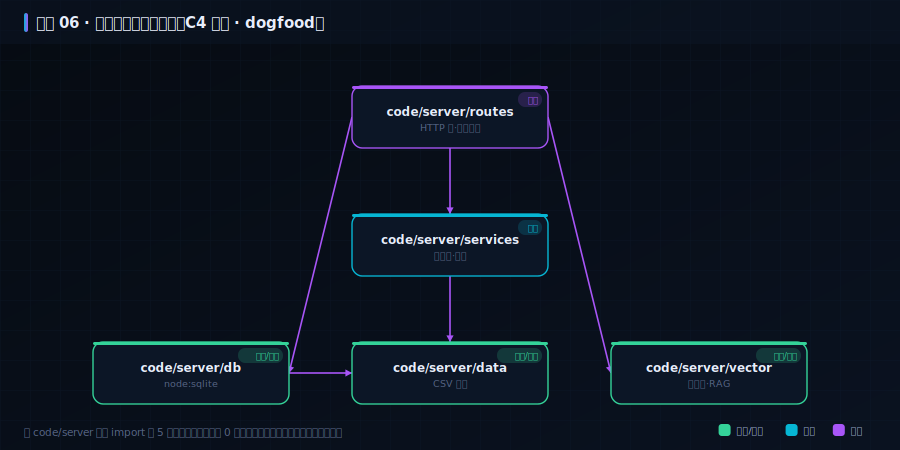
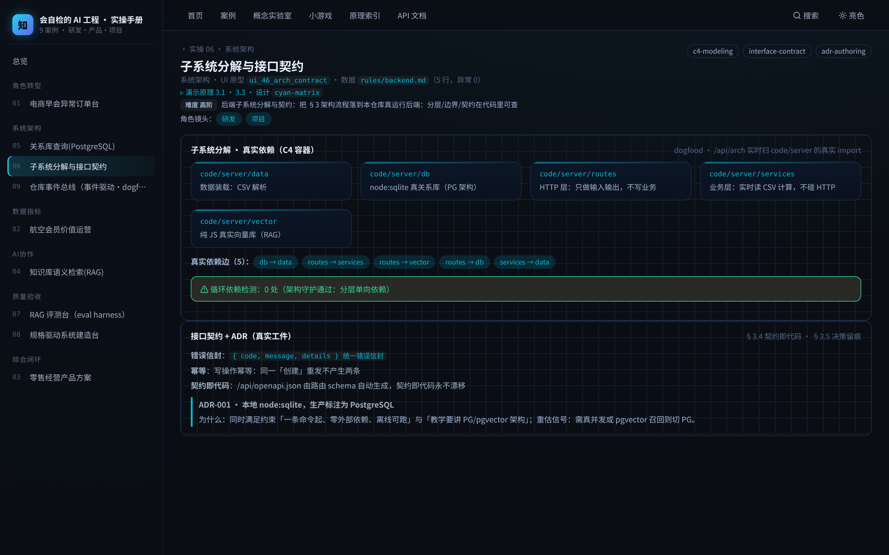

# 实操 06：系统架构｜子系统分解与接口契约

### 项目场景故事

架构型产品经理以本教程后端自身为例演示系统架构设计：routes/services/data/db/vector 分层与模块边界、一次真实接口契约调用（/api/health、错误信封），把 §3 方法论落到可运行代码（dogfood）。

> **本案例演示/验证**：原理 3.1、3.3｜**采用设计** `cyan-matrix`（见 [design/cyan-matrix.md](../../design/cyan-matrix.md)）

> **在数字化系统中的位置**：底座平台层 · 治理环节｜**理论→实操**：把原理 3.1、3.3 落成可运行操作：把 §3 架构流程落到本仓库真运行后端：分层/边界/契约在代码里可查（数字化底座本身）

> **角色镜头**： 研发 ·  项目（本案更偏这些角色；主脊 §1-§2 三镜头共读）

>  **难度** 高阶｜**一句话** 后端子系统分解与契约：把 §3 架构流程落到本仓库真运行后端：分层/边界/契约在代码里可查｜**前置** 建议先读完第一部分
>
>  **洞见**：系统架构的落点是「分层边界 + 接口契约」：本案以后端自身为例——routes 不写业务、services 不碰 HTTP，一次真实 /api/health 契约调用可查。架构决策要留 ADR，可追溯。
>
>  **常见坑**：① 分层名义存在、实则 controller 里塞业务；② 接口无契约（错误信封/幂等）各调各的；③ 架构口头拍板不留 ADR，后人无从追溯。

**现状问题**

- 决策依赖的关键指标：子系统数、接口契约数、依赖边数、循环依赖。
- 现场常见异常：职责越界、契约缺失、循环依赖。
- 只做通用页面无法支撑「把 §3 架构流程落到本仓库真运行后端：分层/边界/契约在代码里可查」。

**本次任务**

- 明确岗位、指标链、异常状态与决策动作。
- 使用 `c4-modeling` 与 `interface-contract` 完成分析，产出 `子系统分解图与接口契约`，用 `adr-authoring` 验收。

### 任务目标与数据

- 行业：系统架构
- 真实业务场景：后端子系统分解与契约
- 岗位：架构型产品经理
- 数据或资料：`rules/backend.md`（5 行，异常 0）
- 公开参考：Software Engineering at Google https://abseil.io/resources/swe-book/ ｜ 12factor.net
- 行业字段：子系统、职责、接口、契约
- 指标链（真实数据）：子系统数 5，接口契约数 11，依赖边数 5，循环依赖 0
- 决策动作：把 §3 架构流程落到本仓库真运行后端：分层/边界/契约在代码里可查
- 风险边界：架构决策须可追溯（ADR），不得口头拍板
- UI 原型：`ui_46_arch_contract`（arch_board）
- 采用设计：cyan-matrix
- SaaS 组件：子系统图、分层边界、接口契约、健康检查、ADR 记录

### Prompt 实操

> **怎么用**：推荐用 **CodeBuddy 的 Plan 模式**（腾讯，国产·当下可跑）——把下面灰底代码框**整段原样粘进去，它会先列出任务清单、再自主执行**，你不需要看懂里面的技术细节；没装过就先装一个。海外读者用 Claude Code / Cursor / Trae 等任一 Agent 工具同理（见附录B）。

**Prompt 1：后端子系统分解与契约 - 问题定义**

```text
请以产品经理身份，用 AI 编程工具（如 Trae、CodeBuddy 等任一 Agent 工具）完成「后端子系统分解与契约」的**产品问题定义**（这一步先把问题想清楚，不写代码）：
- 岗位与场景：架构型产品经理 面向「后端子系统分解与契约」，把业务判断转成一份可验证的产品问题定义。
- 数据：读取 `rules/backend.md`，只使用其中实际存在的字段（子系统、职责、接口、契约）。
- 指标链：子系统数、接口契约数、依赖边数、循环依赖（当前真实值：子系统数=5，接口契约数=11，依赖边数=5，循环依赖=0）。
- 现场异常：要盯的是 职责越界、契约缺失、循环依赖——说清每类异常谁负责、如何被发现。
- 决策动作：这份定义最终要支撑的关键决策是——把 §3 架构流程落到本仓库真运行后端：分层/边界/契约在代码里可查
- 使用 Skill：用 c4-modeling、interface-contract 完成分析（结构化 Skill 见 skills/pm_skills.md）。
- 输出：子系统分解图与接口契约，保存为 `outputs/product_case_library/case_06_system_arch_flow_问题定义.md`。
- 边界：结论必须回到数据或公开参考（Software Engineering at Google https://abseil.io/resources/swe-book/ ｜ 12factor.net）；不得越过「架构决策须可追溯（ADR），不得口头拍板」。
```

**Prompt 2：后端子系统分解与契约 - 方案验收**（注意：outputs/ 交付物由 build_docs 重建覆盖，建议在新分支/对照目录运行）

```text
请以产品经理身份，用 AI 编程工具（如 Trae、CodeBuddy 等任一 Agent 工具）完成「后端子系统分解与契约」的**方案验收**（把上一步的问题定义做成可运行原型，并逐项验收）：
- 目标：基于问题定义，产出一个可运行的深色大屏原型，让指标链、异常队列、责任、行动都能在页面上看到、点得动。
- 数据：读取 `rules/backend.md`，只使用其中实际存在的字段（子系统、职责、接口、契约）。
- 指标链：子系统数、接口契约数、依赖边数、循环依赖（当前真实值：子系统数=5，接口契约数=11，依赖边数=5，循环依赖=0）。
- 原型（技术契约，遵 rules/ 约束：DRY、单文件<800行、TS 类型、中文注释）：在 `code/web`（Vite+React+TS）路由 `#/case/06`，按 `ui_46_arch_contract`（arch_board）与设计 `cyan-matrix` 渲染；数据经 `build_case_data.mjs` 预计算，不得复用通用表格占位。
- 使用 Skill：用 adr-authoring 做验收（结构化 Skill 见 skills/pm_skills.md）。
- 输出：子系统分解图与接口契约，保存为 `outputs/product_case_library/case_06_system_arch_flow_方案验收.md`。
- 验收条件：指标链回到真实数据、异常可追踪、行动入口明确；不得越过「架构决策须可追溯（ADR），不得口头拍板」；`node code/tools/verify_course_package.mjs` 必须 ALL GREEN。
```

### 图形/原型/表单







- 图形类型：system_arch_flow（设计 cyan-matrix）
- 看图顺序：先看 5 个真实子系统的分层边界，再看一次真实 /api/health 契约调用，最后想 routes 为何不该写业务。
- UI 差异：本案例采用 `ui_46_arch_contract` + 设计 `cyan-matrix`，不得复用通用表格占位；可运行原型见 `#/case/06`。

### 交付物与验收

交付物：**子系统分解图与接口契约**。必含要素（字段/指标链/异常状态/Skill/决策动作/高影响复核）与合格线由自测器六项核对：`node code/tools/check_my_work.mjs 6 你的方案.md`；红线：不越过「架构决策须可追溯（ADR），不得口头拍板」。

### 跟着做（动手复现）

1. 起服务：`bash code/run.sh`，浏览器打开 `#/case/06`（本案专属大屏）。
2. **你应看到**：后端子系统依赖图（真扫 import）与 ADR/契约卡，数据来自后端实时接口（性质见章首标注）。
3. **动手改一改**：给「新增一个导出报表接口」写一份最小契约(错误信封 + 幂等 + 分页)，说明它该放哪一层。
4. **自测产出**：`node code/tools/check_my_work.mjs 6 你的方案.md`——红项指明缺什么、回哪章补。

<details>
<summary> 深度（专业读者）：权衡 · 失效模式 · 何时别用</summary>

分层不是名义上的目录，而是靠「适应度函数」强制的边界：本教程用 verify 断言 routes 不出现业务关键字、services 不 import HTTP 上下文。契约层还要统一错误信封 `{code,message,data}`、幂等键（防重复提交）、分页规范——各调各的会让联调成本指数级上升。
</details>

### 练习（做完再进下一个案例）

1. **巩固**：打开 `#/case/06` 看后端分层，说出为什么 routes 层不该写业务逻辑。
2. **挑战**：给「新增一个导出报表接口」写一份最小接口契约（统一错误信封 + 幂等 + 分页），并说明它该放在哪一层。

<details>
<summary>参考思路（先自己想，再展开）</summary>

- 这两题没有唯一标准答案，检验的是你能否把本案方法用自己的话讲出来：先按「跟着做」第 3 步真改一次、看指标怎么动，再对照上方「深度」折叠块的权衡与失效模式自评你的答案有没有踩坑。
- 答不顺就回读本案演示的原理小节 §3.1、§3.3；写成方案后跑 `node code/tools/check_my_work.mjs 6 你的方案.md`，红项会指明缺什么、回哪章补。
</details>

### 被追问（grill-me · 先自己答，再展开）

> 教员式追问：不给你标准答案，先逼你选、再点破误区。页内 `#/case/06` 有可交互版（答错即追问）。

**追问 1**：后端已按 routes/ services/ data/ 三个目录分好，架构分层是不是就到位了？

- A. 是，目录分了就到位
- B. 不是，边界要靠适应度函数强制
- C. 是，只要不循环依赖

<details>
<summary>点破（先选再展开）</summary>

- 若选「是，目录分了就到位」：目录名骗不了门禁——routes 里塞业务、service import HTTP 上下文，目录再整齐也是烂边界。本案用 /api/arch 实时扫真实 import + 断言循环依赖=0 强制。
- 若选「是，只要不循环依赖」：无循环依赖是必要不充分——还要 routes 不出现业务关键字、service 不依赖 HTTP。适应度函数管「谁能依赖谁」，不只是「有没有环」。
- 答对后再想一层：对。那第二问，新增导出报表接口时——
</details>

**追问 2**：要新增「导出报表」接口，图省事把聚合 SQL 直接写在 routes 里，可以吗？

- A. 可以，能跑就行
- B. 不行，业务/数据逻辑不该在 routes 层

<details>
<summary>点破（先选再展开）</summary>

- 若答错：routes 只做 HTTP 边界；聚合 SQL 是 service/data 的职责——写进 routes 就破坏本案适应度函数强制的分层，verify 会红。
- 答对后再想一层：对。分层不是目录名，是门禁替你守住的依赖方向。
</details>

> **所以真正的一课**：名义目录≠真边界；架构分层靠适应度函数（扫 import、禁业务关键字入 routes、循环依赖=0）强制——目录名骗不了门禁。

> **小结**：本案用「后端子系统分解与契约」演示原理 3.1、3.3，落成可运行、可验收的产品判断。运行 `bash code/run.sh` 后访问 `#/case/06`（真后端实时数据）。

[← 返回案例总览](README.md) · [返回目录](../../AI时代研发产品项目一体化知识库/README.md)
