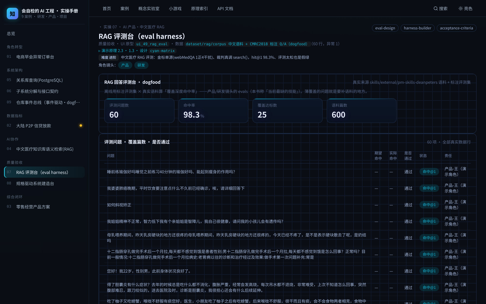

# 实操 07：质量验收｜RAG 评测台（eval harness）

### 项目场景故事

你给产品接了个 RAG 问答，老板问「它到底答得准不准」，你只能说「我试了几个感觉还行」。把「感觉」变成「评测台」：定一组标注好的问题与期望命中，让系统离线跑一遍，算出命中率、列出没答对的，再决定上不上线。本案的语料就是本书已本地化的 deanpeters PM 语料（dogfood）。

> **本案例演示/验证**：原理 2.3、1.3｜**采用设计** `cyan-matrix`（见 [design/cyan-matrix.md](../../design/cyan-matrix.md)）

> **在数字化系统中的位置**：能力智能层 · 验收环节｜**理论→实操**：把「evals 是当前最缺的技能」落成一个可跑的评测台：离线用标注集量化 RAG 回答好不好

> **角色镜头**： 产品 ·  研发（本案更偏这些角色；主脊 §1-§2 三镜头共读）

>  **难度** 进阶｜**一句话** 中文医疗 RAG 评测：金标单源(webMedQA 1正4干扰)、裁判真调 search()，hit@1 98.3%、评测太松也是假绿｜**前置** 建议先读完第一部分
>
>  **洞见**：评测门连演四幕：v1 裁判只量语料静态覆盖（假绿——search() 改坏照样绿）；v2 真调被测系统数命中才现形（分数大跌）；v3 追查抓出装载截断（默认只装一部分却宣称全量）；v24 换 60 题中文医疗 webMedQA 金标后 hit@1 高达 98.3%——这引出第四幕：**评测太松也是假绿**。webMedQA 是 answer-selection（每题 1 正 4 干扰），正确答案就是问题的直接回答、与问题强相关，检索一抓一个准，分数高不代表检索难；判据虽收紧到 hit@1（必须重排第 1），仍要标定难度、把未命中队列拿出来看。
>
>  **常见坑**：① 裁判只量静态覆盖不调被测系统（改坏门照样绿）；② 语料装载截断不自知；③ 只看命中率不看未命中队列（没有错误分析＝没有改进方向）；④ gold 与语料同源导致命中虚高，误以为检索很强——评测难度没标定。

**现状问题**

- 决策依赖的关键指标：评测问题数、命中率、语料篇数、语料覆盖(万字)。
- 现场常见异常：未命中、低相关、待标注。
- 只做通用页面无法支撑「用离线评测集量化「RAG 回答好不好」，据此决定能不能上线、还差哪些语料」。

**本次任务**

- 明确岗位、指标链、异常状态与决策动作。
- 使用 `eval-design` 与 `harness-builder` 完成分析，产出 `RAG 评测报告（命中率/错误分析）`，用 `acceptance-criteria` 验收。

### 任务目标与数据

- 行业：AI 产品·中文医疗 RAG
- 真实业务场景：RAG 回答评测台
- 岗位：AI 产品经理 / 应用研发
- 数据或资料：`dataset/rag/corpus 中文语料 + CMRC2018 标注 Q/A（dogfood）`（60 行，异常 1）
- 公开参考：deanpeters PM-Skills 语料 + 本书标注评测集
- 行业字段：问题、期望命中、实际命中、是否通过
- 指标链（真实数据）：评测问题数 60，命中率 98.3%，覆盖达标数 25，语料篇数 600
- 决策动作：用离线评测集量化「RAG 回答好不好」，据此决定能不能上线、还差哪些语料
- 风险边界：评测分数是发布参考，不替代人工抽检；分数高不等于零幻觉
- UI 原型：`ui_49_rag_eval`（rag_eval）
- 采用设计：cyan-matrix
- SaaS 组件：评测集、命中矩阵、分数卡、错误分析

### Prompt 实操

> **怎么用**：推荐用 **CodeBuddy 的 Plan 模式**（腾讯，国产·当下可跑）——把下面灰底代码框**整段原样粘进去，它会先列出任务清单、再自主执行**，你不需要看懂里面的技术细节；没装过就先装一个。海外读者用 Claude Code / Cursor / Trae 等任一 Agent 工具同理（见附录B）。

**Prompt 1：RAG 回答评测台 - 问题定义**

```text
请以产品经理身份，用 AI 编程工具（如 Trae、CodeBuddy 等任一 Agent 工具）完成「RAG 回答评测台」的**产品问题定义**（这一步先把问题想清楚，不写代码）：
- 岗位与场景：AI 产品经理 / 应用研发 面向「RAG 回答评测台」，把业务判断转成一份可验证的产品问题定义。
- 数据：读取 `dataset/rag/corpus 中文语料 + CMRC2018 标注 Q/A（dogfood）`，只使用其中实际存在的字段（问题、期望命中、实际命中、是否通过）。
- 指标链：评测问题数、命中率、语料篇数、语料覆盖(万字)（当前真实值：评测问题数=60，命中率=98.3%，覆盖达标数=25，语料篇数=600）。
- 现场异常：要盯的是 未命中、低相关、待标注——说清每类异常谁负责、如何被发现。
- 决策动作：这份定义最终要支撑的关键决策是——用离线评测集量化「RAG 回答好不好」，据此决定能不能上线、还差哪些语料
- 使用 Skill：用 eval-design、harness-builder 完成分析（结构化 Skill 见 skills/pm_skills.md）。
- 输出：RAG 评测报告（命中率/错误分析），保存为 `outputs/product_case_library/case_07_rag_eval_harness_问题定义.md`。
- 边界：结论必须回到数据或公开参考（deanpeters PM-Skills 语料 + 本书标注评测集）；不得越过「评测分数是发布参考，不替代人工抽检；分数高不等于零幻觉」。
```

**Prompt 2：RAG 回答评测台 - 方案验收**（注意：outputs/ 交付物由 build_docs 重建覆盖，建议在新分支/对照目录运行）

```text
请以产品经理身份，用 AI 编程工具（如 Trae、CodeBuddy 等任一 Agent 工具）完成「RAG 回答评测台」的**方案验收**（把上一步的问题定义做成可运行原型，并逐项验收）：
- 目标：基于问题定义，产出一个可运行的深色大屏原型，让指标链、异常队列、责任、行动都能在页面上看到、点得动。
- 数据：读取 `dataset/rag/corpus 中文语料 + CMRC2018 标注 Q/A（dogfood）`，只使用其中实际存在的字段（问题、期望命中、实际命中、是否通过）。
- 指标链：评测问题数、命中率、语料篇数、语料覆盖(万字)（当前真实值：评测问题数=60，命中率=98.3%，覆盖达标数=25，语料篇数=600）。
- 原型（技术契约，遵 rules/ 约束：DRY、单文件<800行、TS 类型、中文注释）：在 `code/web`（Vite+React+TS）路由 `#/case/07`，按 `ui_49_rag_eval`（rag_eval）与设计 `cyan-matrix` 渲染；数据经 `build_case_data.mjs` 预计算，不得复用通用表格占位。
- 使用 Skill：用 acceptance-criteria 做验收（结构化 Skill 见 skills/pm_skills.md）。
- 输出：RAG 评测报告（命中率/错误分析），保存为 `outputs/product_case_library/case_07_rag_eval_harness_方案验收.md`。
- 验收条件：指标链回到真实数据、异常可追踪、行动入口明确；不得越过「评测分数是发布参考，不替代人工抽检；分数高不等于零幻觉」；`node code/tools/verify_course_package.mjs` 必须 ALL GREEN。
```

### 图形/原型/表单





- 图形类型：rag_eval_harness（设计 cyan-matrix）
- 看图顺序：先看评测集规模与命中率，再看命中矩阵里哪些问题没答对，最后看「分数是参考、不替代抽检」的边界。
- UI 差异：本案例采用 `ui_49_rag_eval` + 设计 `cyan-matrix`，不得复用通用表格占位；可运行原型见 `#/case/07`。

### 交付物与验收

交付物：**RAG 评测报告（命中率/错误分析）**。必含要素（字段/指标链/异常状态/Skill/决策动作/高影响复核）与合格线由自测器六项核对：`node code/tools/check_my_work.mjs 7 你的方案.md`；红线：不越过「评测分数是发布参考，不替代人工抽检；分数高不等于零幻觉」。

### 跟着做（动手复现）

1. 起服务：`bash code/run.sh`，浏览器打开 `#/case/07`（本案专属大屏）。
2. **你应看到**：金标题目命中/未命中队列与覆盖图，数据来自后端实时接口（性质见章首标注）。
3. **动手改一改**：往评测集 `code/data/eval_gold.json` 里加两道你关心的问题、指定期望命中关键词，跑 `node code/tools/eval_harness.mjs`——注意改了金标必须加 `--update` 立新基线（否则回归门按旧基线报红），再跑 `node code/tools/build_case_data.mjs` 重建页面数据，看命中率怎么变。
4. **自测产出**：`node code/tools/check_my_work.mjs 7 你的方案.md`——红项指明缺什么、回哪章补。

<details>
<summary> 深度（专业读者）：权衡 · 失效模式 · 何时别用</summary>

为什么离线评测集比线上 A/B 先行？因为归纳问题（§1.7）——模型在没见过的问法上会自信地错；一组固定、可复现的评测集，是你在上线前唯一能反复量化的「验证」，正是「没有免费午餐」下只能验证不能证明的日常版。 本案配有**双指标回归门**：`node code/tools/eval_harness.mjs`——主指标 hit@3（裁判真调 store.ts 的 search()，期望文档须进重排前 3），次指标语料覆盖；低于 eval_baseline.json 基线即 exit 1。金标单一真源 code/data/eval_gold.json，改题须 --update 立新基线。
</details>

### 练习（做完再进下一个案例）

1. **巩固**：本案的评测集与语料分别来自哪里？命中率是怎么算出来的（真实计算，不是编的）？
2. **挑战**：设计一个「错误分析」流程：命中率从 60% 提到 80%，你会先看哪些没命中的问题、怎么补语料？

<details>
<summary>参考思路（先自己想，再展开）</summary>

- 这两题没有唯一标准答案，检验的是你能否把本案方法用自己的话讲出来：先按「跟着做」第 3 步真改一次、看指标怎么动，再对照上方「深度」折叠块的权衡与失效模式自评你的答案有没有踩坑。
- 答不顺就回读本案演示的原理小节 §2.3、§1.3；写成方案后跑 `node code/tools/check_my_work.mjs 7 你的方案.md`，红项会指明缺什么、回哪章补。
</details>

### 被追问（grill-me · 先自己答，再展开）

> 教员式追问：不给你标准答案，先逼你选、再点破误区。页内 `#/case/07` 有可交互版（答错即追问）。

**追问 1**：换中文 CMRC 金标后 hit@3 几乎 100%。团队说「检索无敌了，可以上线」。你信吗？

- A. 信，100% 就是强
- B. 不信——CMRC 问题就是从对应段抽取的，gold 与语料同源、评测太容易，测不出真实区分度
- C. 再补点语料就行

<details>
<summary>点破（先选再展开）</summary>

- 若答错：CMRC 是单段抽取式问答，问题几乎逐字引用它的来源段落，检索当然一抓一个准。gold 和语料同源，hit@3 虚高——这不是检索强，是评测太松。本案因此收紧到 hit@1。再选？
- 答对后再想一层：再追：那真实企业知识库该怎么设计评测集，才不至于「评测太容易」？
</details>

**追问 2**：hit@1 下有 2 题未命中（如「谁设计了该教堂」）。你先做什么？

- A. 把这 2 题从金标删掉，命中率就 100% 了
- B. 看它们重排第 1 召回了哪篇、为什么错，再决定调分词/重排还是补语料
- C. 不管，96.7% 够高了

<details>
<summary>点破（先选再展开）</summary>

- 若答错：删题让分数好看，是最典型的评测造假——你把「测不过的题」藏起来，等于自欺。正确动作是做错误分析：看未命中题重排第 1 是什么、错在召回还是重排。再选？
- 答对后再想一层：最后：如果为了让 hit@1 好看去改金标 docPattern（放宽匹配），这算优化还是作弊？
</details>

> **所以真正的一课**：评测太松和假绿一样骗人——gold 与语料同源时 hit@3 虚高，必须靠收紧判据（hit@1）标定难度；裁判要真调被测系统，题目还要难到测得出区分度。

> **小结**：本案用「RAG 回答评测台」演示原理 2.3、1.3，落成可运行、可验收的产品判断。运行 `bash code/run.sh` 后访问 `#/case/07`（真后端实时数据）。

[← 返回案例总览](README.md) · [返回目录](../../AI时代研发产品项目一体化知识库/README.md)
