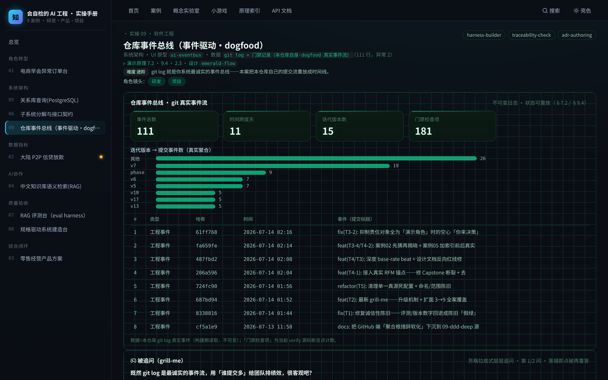

# 实操 09：系统架构｜仓库事件总线（事件驱动·dogfood）

### 项目场景故事

新同事问：这仓库怎么长成这样的？没人说得全。平台工程师打开 git log：从最初版一路到当前版，每次迭代、每次收敛、每次回退都在——事件流比任何人的记忆都诚实。本案把这条流变成一屏时间线。

> **本案例演示/验证**：原理 7.2、9.4、2.3｜**采用设计** `emerald-flow`（见 [design/emerald-flow.md](../../design/emerald-flow.md)）

> **在数字化系统中的位置**：底座平台层 · 采集环节｜**理论→实操**：把 §7.2 事件驱动与 §9.4 事件溯源落成可运行操作：git 提交=不可变事件，按版本聚合重放迭代史，门禁红绿挂在时间线上。

> **角色镜头**： 研发 ·  项目（本案更偏这些角色；主脊 §1-§2 三镜头共读）

>  **难度** 进阶｜**一句话** git log 就是你系统最诚实的事件总线——本案把本仓库自己的提交流重放成时间线。｜**前置** 建议先读完第一部分
>
>  **洞见**：事件溯源的最小教学标本不需要 Kafka：任何 git 仓库都自带一条不可变事件日志，状态（如「现在门禁有多少检查项」）可以从事件流重放推导。
>
>  **常见坑**：把事件流当考核器——按提交数评价人会立刻教会所有人刷提交；事件流用于重放与复盘，不用于绩效。

**现状问题**

- 决策依赖的关键指标：事件总数、时间跨度天、迭代版本数、门禁检查项。
- 现场常见异常：回退提交、门禁未过版本。
- 只做通用页面无法支撑「从事件流重放系统状态：任一时刻的门禁规模与迭代节奏一目了然，回退/异常提交进入复盘队列」。

**本次任务**

- 明确岗位、指标链、异常状态与决策动作。
- 使用 `harness-builder` 与 `traceability-check` 完成分析，产出 `仓库事件流重放报告（版本聚合时间线 + 门禁红绿标注 + 回退复盘清单）`，用 `adr-authoring` 验收。

### 任务目标与数据

- 行业：软件工程
- 真实业务场景：仓库事件总线
- 岗位：平台工程师
- 数据或资料：`git log + 门禁记录（本仓库自身·dogfood 真实事件流）`（111 行，异常 2）
- 公开参考：本仓库 git 历史（真实、不可变、可复算）
- 行业字段：提交哈希、提交时间、提交标题、迭代版本、门禁检查项
- 指标链（真实数据）：事件总数 111，时间跨度天 11，迭代版本数 15，门禁检查项 181
- 决策动作：从事件流重放系统状态：任一时刻的门禁规模与迭代节奏一目了然，回退/异常提交进入复盘队列
- 风险边界：事件流只读；不得据单条提交评价个人绩效
- UI 原型：`ui-eventbus`（workflow_pipeline）
- 采用设计：emerald-flow
- SaaS 组件：事件时间线、版本聚合柱、事件明细队列

### Prompt 实操

> **怎么用**：推荐用 **CodeBuddy 的 Plan 模式**（腾讯，国产·当下可跑）——把下面灰底代码框**整段原样粘进去，它会先列出任务清单、再自主执行**，你不需要看懂里面的技术细节；没装过就先装一个。海外读者用 Claude Code / Cursor / Trae 等任一 Agent 工具同理（见附录B）。

**Prompt 1：仓库事件总线 - 问题定义**

```text
请以产品经理身份，用 AI 编程工具（如 Trae、CodeBuddy 等任一 Agent 工具）完成「仓库事件总线」的**产品问题定义**（这一步先把问题想清楚，不写代码）：
- 岗位与场景：平台工程师 面向「仓库事件总线」，把业务判断转成一份可验证的产品问题定义。
- 数据：读取 `git log + 门禁记录（本仓库自身·dogfood 真实事件流）`，只使用其中实际存在的字段（提交哈希、提交时间、提交标题、迭代版本、门禁检查项）。
- 指标链：事件总数、时间跨度天、迭代版本数、门禁检查项（当前真实值：事件总数=111，时间跨度天=11，迭代版本数=15，门禁检查项=181）。
- 现场异常：要盯的是 回退提交、门禁未过版本——说清每类异常谁负责、如何被发现。
- 决策动作：这份定义最终要支撑的关键决策是——从事件流重放系统状态：任一时刻的门禁规模与迭代节奏一目了然，回退/异常提交进入复盘队列
- 使用 Skill：用 harness-builder、traceability-check 完成分析（结构化 Skill 见 skills/pm_skills.md）。
- 输出：仓库事件流重放报告（版本聚合时间线 + 门禁红绿标注 + 回退复盘清单），保存为 `outputs/product_case_library/case_09_repo_event_bus_问题定义.md`。
- 边界：结论必须回到数据或公开参考（本仓库 git 历史（真实、不可变、可复算））；不得越过「事件流只读；不得据单条提交评价个人绩效」。
```

**Prompt 2：仓库事件总线 - 方案验收**（注意：outputs/ 交付物由 build_docs 重建覆盖，建议在新分支/对照目录运行）

```text
请以产品经理身份，用 AI 编程工具（如 Trae、CodeBuddy 等任一 Agent 工具）完成「仓库事件总线」的**方案验收**（把上一步的问题定义做成可运行原型，并逐项验收）：
- 目标：基于问题定义，产出一个可运行的深色大屏原型，让指标链、异常队列、责任、行动都能在页面上看到、点得动。
- 数据：读取 `git log + 门禁记录（本仓库自身·dogfood 真实事件流）`，只使用其中实际存在的字段（提交哈希、提交时间、提交标题、迭代版本、门禁检查项）。
- 指标链：事件总数、时间跨度天、迭代版本数、门禁检查项（当前真实值：事件总数=111，时间跨度天=11，迭代版本数=15，门禁检查项=181）。
- 原型（技术契约，遵 rules/ 约束：DRY、单文件<800行、TS 类型、中文注释）：在 `code/web`（Vite+React+TS）路由 `#/case/09`，按 `ui-eventbus`（workflow_pipeline）与设计 `emerald-flow` 渲染；数据经 `build_case_data.mjs` 预计算，不得复用通用表格占位。
- 使用 Skill：用 adr-authoring 做验收（结构化 Skill 见 skills/pm_skills.md）。
- 输出：仓库事件流重放报告（版本聚合时间线 + 门禁红绿标注 + 回退复盘清单），保存为 `outputs/product_case_library/case_09_repo_event_bus_方案验收.md`。
- 验收条件：指标链回到真实数据、异常可追踪、行动入口明确；不得越过「事件流只读；不得据单条提交评价个人绩效」；`node code/tools/verify_course_package.mjs` 必须 ALL GREEN。
```

### 图形/原型/表单





- 图形类型：repo_event_bus（设计 emerald-flow）
- 看图顺序：先看版本聚合柱（迭代节奏）→ 再看时间线明细 → 最后想：你的系统哪条日志能这样重放？
- UI 差异：本案例采用 `ui-eventbus` + 设计 `emerald-flow`，不得复用通用表格占位；可运行原型见 `#/case/09`。

### 交付物与验收

交付物：**仓库事件流重放报告（版本聚合时间线 + 门禁红绿标注 + 回退复盘清单）**。必含要素（字段/指标链/异常状态/Skill/决策动作/高影响复核）与合格线由自测器六项核对：`node code/tools/check_my_work.mjs 9 你的方案.md`；红线：不越过「事件流只读；不得据单条提交评价个人绩效」。

### 跟着做（动手复现）

1. 起服务：`bash code/run.sh`，浏览器打开 `#/case/09`（本案专属大屏）。
2. **你应看到**：指标链（事件总数 / 时间跨度天 …）、异常队列与行动入口，数据来自后端实时接口（性质见章首标注）。
3. **动手改一改**：本地跑 git log --oneline | head -20 对照页面时间线；再想想 §9.4：如果要把「门禁红绿」也持久化为事件，该记哪几个字段？
4. **自测产出**：`node code/tools/check_my_work.mjs 9 你的方案.md`——红项指明缺什么、回哪章补。

<details>
<summary> 深度（专业读者）：权衡 · 失效模式 · 何时别用</summary>

权衡：事件流重放（本案）vs 快照读取（其余案例直读当前态）——重放可审计但贵，快照快但丢历史；生产系统常「快照+增量事件」混合。失效模式：事件被改写（git rebase 公共分支）即总线失信——不可变性是事件总线的命根。何时别用：低频小系统直接读状态更省。
</details>

### 练习（做完再进下一个案例）

1. **巩固**：用事件溯源术语说明：为什么「当前案例数」能从这条事件流重放出来？
2. **挑战**：给「门禁通过」设计一条事件记录（字段+时态命名，参照 §8.3）。

<details>
<summary>参考思路（先自己想，再展开）</summary>

- 这两题没有唯一标准答案，检验的是你能否把本案方法用自己的话讲出来：先按「跟着做」第 3 步真改一次、看指标怎么动，再对照上方「深度」折叠块的权衡与失效模式自评你的答案有没有踩坑。
- 答不顺就回读本案演示的原理小节 §7.2、§9.4、§2.3；写成方案后跑 `node code/tools/check_my_work.mjs 9 你的方案.md`，红项会指明缺什么、回哪章补。
</details>

### 被追问（grill-me · 先自己答，再展开）

> 教员式追问：不给你标准答案，先逼你选、再点破误区。页内 `#/case/09` 有可交互版（答错即追问）。

**追问 1**：既然 git log 是最诚实的事件流，用「谁提交多」给团队排绩效，很客观吧？

- A. 客观，数据不撒谎
- B. 不客观，会诱发刷提交（古德哈特）
- C. 客观，但要加权

<details>
<summary>点破（先选再展开）</summary>

- 若选「客观，数据不撒谎」：按提交数考核会立刻教会所有人拆碎提交、刷数量（古德哈特定律）。事件流用于重放/复盘，不用于绩效。
- 若选「客观，但要加权」：加权也救不了——只要「提交数」进了考核，行为就朝刷数量变形。问题不在权重，在拿只读事件流当 KPI。
- 答对后再想一层：对。第二问，关于「不可变」——
</details>

**追问 2**：上线后发现一条历史事件记错了，直接 git rebase 把公共分支改对，可以吗？

- A. 可以，改对就行
- B. 不行，追加补偿事件，绝不改历史

<details>
<summary>点破（先选再展开）</summary>

- 若答错：改写公共历史=事件总线失信，不可变性是它的命根；纠错要追加一条补偿事件（如 Reverted/Corrected），让错和改都留在流里。
- 答对后再想一层：对。只读 + 不可变，才有「账实永远对得上」。
</details>

> **所以真正的一课**：事件流的价值在只读与不可变——拿它当绩效 KPI 会被古德哈特扭曲，改写公共历史会让总线失信；纠错靠追加补偿事件，不靠改历史。

> **小结**：本案用「仓库事件总线」演示原理 7.2、9.4、2.3，落成可运行、可验收的产品判断。运行 `bash code/run.sh` 后访问 `#/case/09`（真后端实时数据）。

[← 返回案例总览](README.md) · [返回目录](../../AI时代研发产品项目一体化知识库/README.md)
