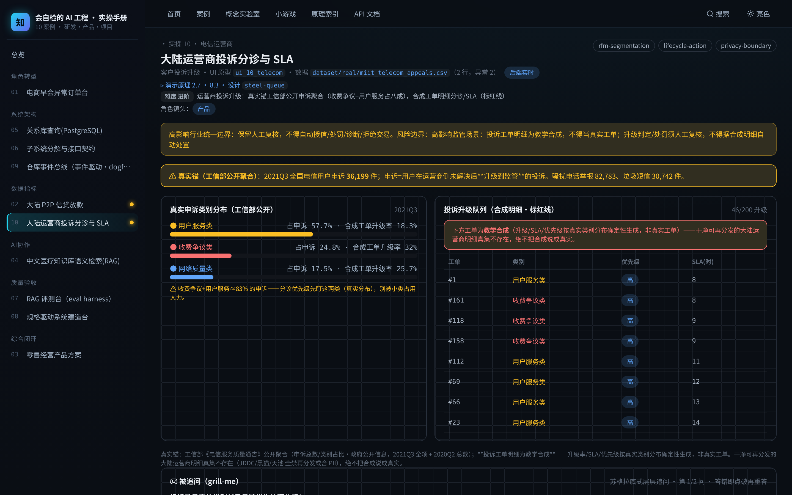

# 实操 10：客户投诉升级｜大陆运营商投诉分诊与 SLA

### 项目场景故事

运营商体验 PM 要把客户投诉分诊、预测哪些会升级为监管申诉。真实锚是工信部公开申诉聚合（收费争议+用户服务占约八成）；投诉工单明细为教学合成、页面已显式标注红线。

> **本案例演示/验证**：原理 2.7、8.3｜**采用设计** `steel-queue`（见 [design/steel-queue.md](../../design/steel-queue.md)）

> **在数字化系统中的位置**：能力智能层 · 洞察环节｜**理论→实操**：把投诉分诊/升级预警落成可运行操作：按工信部真实类别分布排分诊优先级，对高升级类别预警，SLA 违约兜底。

> **角色镜头**： 产品（本案更偏这些角色；主脊 §1-§2 三镜头共读）

>  **难度** 进阶｜**一句话** 运营商投诉升级：真实锚工信部公开申诉聚合（收费争议+用户服务占八成），合成工单明细分诊/SLA（标红线）｜**前置** 建议先读完第一部分
>
>  **洞见**：客户投诉升级的抓手是「按真实分布分诊」：工信部公开数据显示收费争议+用户服务类占申诉约八成——分诊优先级先盯这两类，别被网络质量类等小类占用人力。申诉=用户在运营商侧未解决后升级到监管的投诉。 投诉工单明细为教学合成（升级/SLA 按真实类别分布确定性生成），绝不当真实工单。
>
>  **常见坑**：① 按投诉「量」而非「升级风险」排优先级；② 把合成工单明细当真实工单做处罚决策；③ 忽视「申诉=升级层」的语义。

**现状问题**

- 决策依赖的关键指标：申诉总件数、用户服务类占比、收费争议类占比、网络质量类占比。
- 现场常见异常：。
- 只做通用页面无法支撑「按真实申诉类别分布分诊投诉、对高升级风险类别优先处置、SLA 违约预警」。

**本次任务**

- 明确岗位、指标链、异常状态与决策动作。
- 使用 `rfm-segmentation` 与 `lifecycle-action` 完成分析，产出 `投诉升级分诊方案与 SLA 治理`，用 `privacy-boundary` 验收。

### 任务目标与数据

- 行业：电信运营商
- 真实业务场景：运营商·客户投诉升级分诊与 SLA 违约预警
- 岗位：运营商体验/风控 PM
- 数据或资料：`dataset/real/miit_telecom_appeals.csv`（2 行，异常 2）
- 公开参考：工信部《电信服务质量通告》季度公开数据（政府公开信息，2021Q3 全项 + 2020Q2 总数）
- 行业字段：季度、申诉总件数、用户服务类占比、收费争议类占比、网络质量类占比
- 指标链（真实基座 + 已标注教学合成叠加列）：申诉总件数 37543，用户服务类占比 58%，收费争议类占比 25%，网络质量类占比 18%
- 决策动作：按真实申诉类别分布分诊投诉、对高升级风险类别优先处置、SLA 违约预警
- 风险边界：高影响监管场景：投诉工单明细为教学合成，不得当真实工单；升级判定/处罚须人工复核，不得据合成明细自动处置（高影响行业·人工复核）
- UI 原型：`ui_10_telecom`（telecom_escalation_screen）
- 采用设计：steel-queue
- SaaS 组件：信用分层、放款转化、征信完整度、文案质量、风险队列、人工复核

### Prompt 实操

> **怎么用**：推荐用 **CodeBuddy 的 Plan 模式**（腾讯，国产·当下可跑）——把下面灰底代码框**整段原样粘进去，它会先列出任务清单、再自主执行**，你不需要看懂里面的技术细节；没装过就先装一个。海外读者用 Claude Code / Cursor / Trae 等任一 Agent 工具同理（见附录B）。

**Prompt 1：运营商·客户投诉升级分诊与 SLA 违约预警 - 问题定义**

```text
请以产品经理身份，用 AI 编程工具（如 Trae、CodeBuddy 等任一 Agent 工具）完成「运营商·客户投诉升级分诊与 SLA 违约预警」的**产品问题定义**（这一步先把问题想清楚，不写代码）：
- 岗位与场景：运营商体验/风控 PM 面向「运营商·客户投诉升级分诊与 SLA 违约预警」，把业务判断转成一份可验证的产品问题定义。
- 数据：读取 `dataset/real/miit_telecom_appeals.csv`，只使用其中实际存在的字段（季度、申诉总件数、用户服务类占比、收费争议类占比、网络质量类占比）。
- 指标链：申诉总件数、用户服务类占比、收费争议类占比、网络质量类占比（当前真实值：申诉总件数=37543，用户服务类占比=58%，收费争议类占比=25%，网络质量类占比=18%）。
- 现场异常：要盯的是 ——说清每类异常谁负责、如何被发现。
- 决策动作：这份定义最终要支撑的关键决策是——按真实申诉类别分布分诊投诉、对高升级风险类别优先处置、SLA 违约预警
- 使用 Skill：用 rfm-segmentation、lifecycle-action 完成分析（结构化 Skill 见 skills/pm_skills.md）。
- 输出：投诉升级分诊方案与 SLA 治理，保存为 `outputs/product_case_library/case_10_telecom_complaint_escalation_问题定义.md`。
- 边界：结论必须回到数据或公开参考（工信部《电信服务质量通告》季度公开数据（政府公开信息，2021Q3 全项 + 2020Q2 总数））；不得越过「高影响监管场景：投诉工单明细为教学合成，不得当真实工单；升级判定/处罚须人工复核，不得据合成明细自动处置」；高影响行业保留人工复核。
```

**Prompt 2：运营商·客户投诉升级分诊与 SLA 违约预警 - 方案验收**（注意：outputs/ 交付物由 build_docs 重建覆盖，建议在新分支/对照目录运行）

```text
请以产品经理身份，用 AI 编程工具（如 Trae、CodeBuddy 等任一 Agent 工具）完成「运营商·客户投诉升级分诊与 SLA 违约预警」的**方案验收**（把上一步的问题定义做成可运行原型，并逐项验收）：
- 目标：基于问题定义，产出一个可运行的深色大屏原型，让指标链、异常队列、责任、行动都能在页面上看到、点得动。
- 数据：读取 `dataset/real/miit_telecom_appeals.csv`，只使用其中实际存在的字段（季度、申诉总件数、用户服务类占比、收费争议类占比、网络质量类占比）。
- 指标链：申诉总件数、用户服务类占比、收费争议类占比、网络质量类占比（当前真实值：申诉总件数=37543，用户服务类占比=58%，收费争议类占比=25%，网络质量类占比=18%）。
- 原型（技术契约，遵 rules/ 约束：DRY、单文件<800行、TS 类型、中文注释）：在 `code/web`（Vite+React+TS）路由 `#/case/10`，按 `ui_10_telecom`（telecom_escalation_screen）与设计 `steel-queue` 渲染；数据经 `build_case_data.mjs` 预计算，不得复用通用表格占位。
- 使用 Skill：用 privacy-boundary 做验收（结构化 Skill 见 skills/pm_skills.md）。
- 输出：投诉升级分诊方案与 SLA 治理，保存为 `outputs/product_case_library/case_10_telecom_complaint_escalation_方案验收.md`。
- 验收条件：指标链回到真实数据、异常可追踪、行动入口明确；不得越过「高影响监管场景：投诉工单明细为教学合成，不得当真实工单；升级判定/处罚须人工复核，不得据合成明细自动处置」；高影响行业保留人工复核；`node code/tools/verify_course_package.mjs` 必须 ALL GREEN。
```

### 图形/原型/表单





- 图形类型：telecom_complaint_escalation（设计 steel-queue）
- 看图顺序：先看放款成功率与信用画像分层，再看「薄档/待观察」风险队列，最后想这两层该放款、收紧还是转人工复核。
- UI 差异：本案例采用 `ui_10_telecom` + 设计 `steel-queue`，不得复用通用表格占位；可运行原型见 `#/case/10`。

### 交付物与验收

交付物：**投诉升级分诊方案与 SLA 治理**。必含要素（字段/指标链/异常状态/Skill/决策动作/高影响复核）与合格线由自测器六项核对：`node code/tools/check_my_work.mjs 10 你的方案.md`；红线：不越过「高影响监管场景：投诉工单明细为教学合成，不得当真实工单；升级判定/处罚须人工复核，不得据合成明细自动处置」。

**指定实操融合**

- RP11：AI-Excel 数据分析转产品判断
  - 产出：指标分析表, 产品改进建议
  - 验收：RFM、趋势或异常检测结果必须转化为明确产品判断，不能停留在图表描述。

### 跟着做（动手复现）

1. 起服务：`bash code/run.sh`，浏览器打开 `#/case/10`（本案专属大屏）。
2. **你应看到**：指标链（申诉总件数 / 用户服务类占比 …）、异常队列与行动入口，数据来自后端实时接口（性质见章首标注）。
3. **动手改一改**：打开页面看真实类别分布：算「收费争议+用户服务」占申诉的比例定分诊优先级；再分清哪些是真锚（工信部类别分布）、哪些是合成（工单升级/SLA），别混淆。
4. **自测产出**：`node code/tools/check_my_work.mjs 10 你的方案.md`——红项指明缺什么、回哪章补。

<details>
<summary> 深度（专业读者）：权衡 · 失效模式 · 何时别用</summary>

为什么申诉是「升级」的真实信号？申诉=用户在运营商侧未解决后主动升级到监管机构——天然筛出运营商没接住的投诉。真实类别分布（收费争议+用户服务≈八成）是分诊优先级的真锚。失效模式：拿合成工单明细的升级率当真实业务水平——明细是合成，只有工信部聚合分布是真实。数据现实：干净可再分发的大陆运营商明细真集不存在（JDDC/黑猫/天池 全禁再分发或含 PII），故真值锚用工信部公开聚合 + 合成明细并标红线。
</details>

### 练习（做完再进下一个案例）

1. **巩固**：打开 `#/case/02`，找出「薄档」群——无征信、历史零成功的申请，你会给他们放款、收紧、还是转人工复核？为什么？
2. **挑战**：高额度申请里也有征信空白的人。用「有无征信 × 历史成功次数 × 授信额度」设计一套信用画像分层规则，说明为什么不能只按额度一刀切放款。

<details>
<summary>参考思路（先自己想，再展开）</summary>

- 这两题没有唯一标准答案，检验的是你能否把本案方法用自己的话讲出来：先按「跟着做」第 3 步真改一次、看指标怎么动，再对照上方「深度」折叠块的权衡与失效模式自评你的答案有没有踩坑。
- 答不顺就回读本案演示的原理小节 §2.7、§8.3；写成方案后跑 `node code/tools/check_my_work.mjs 10 你的方案.md`，红项会指明缺什么、回哪章补。
</details>

### 被追问（grill-me · 先自己答，再展开）

> 教员式追问：不给你标准答案，先逼你选、再点破误区。页内 `#/case/10` 有可交互版（答错即追问）。

**追问 1**：投诉量最高的类别就是最该优先处理的吗？

- A. 是，量大就先处理
- B. 不一定，要看升级风险/真实分布
- C. 按投诉时间先来后到

<details>
<summary>点破（先选再展开）</summary>

- 若选「是，量大就先处理」：量大不代表最该先处理——要看哪类最易升级为监管申诉（风险），且工信部真实分布显示收费争议+用户服务占八成才是重点。
- 若选「按投诉时间先来后到」：先来后到会让高升级风险的收费争议投诉超时爆雷；按升级风险+真实分布分诊。
- 答对后再想一层：对。工信部真实数据：收费争议+用户服务类占申诉约八成——分诊先盯真实高占比+高升级类别。那第二问：
</details>

**追问 2**：页面「投诉升级队列」的工单是真实运营商工单吗？可以据此对客服处罚吗？

- A. 是真实工单，可处罚
- B. 不是，明细是合成、只有聚合分布是真实
- C. 是真实但不能处罚

<details>
<summary>点破（先选再展开）</summary>

- 若答错：看清红线：工单明细是教学合成（升级/SLA 按真实类别分布确定性生成），不是真实工单；干净可再分发的大陆运营商明细真集不存在。真实的只有工信部公开聚合分布。绝不拿合成明细做处罚。
- 答对后再想一层：对。真值锚=工信部公开聚合；明细合成、标红线，不得据此处罚。
</details>

> **所以真正的一课**：运营商投诉升级：真实的是工信部公开申诉聚合（收费争议+用户服务占约八成，是分诊真锚），工单明细是教学合成——按升级风险+真实分布分诊，绝不把合成明细当真实工单做处罚；高影响监管场景须人工复核。

> **小结**：本案用「运营商·客户投诉升级分诊与 SLA 违约预警」演示原理 2.7、8.3，落成可运行、可验收的产品判断。运行 `bash code/run.sh` 后访问 `#/case/10`（真后端实时数据）。

[← 返回案例总览](README.md) · [返回目录](../../AI时代研发产品项目一体化知识库/README.md)
