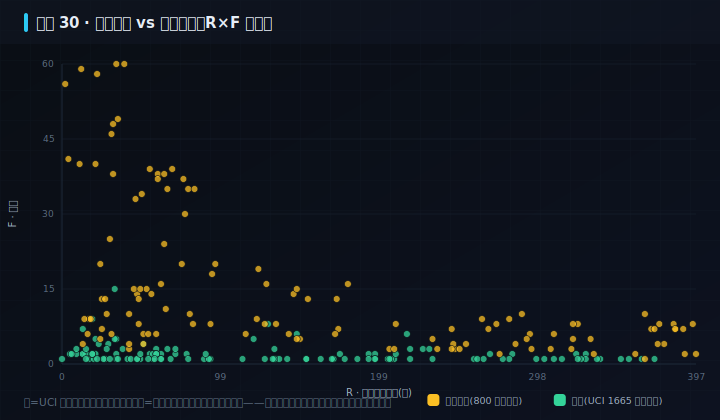

# 实操 30：RFM 客户分层｜航空会员价值运营

### 项目场景故事

> **数据性质：教学合成**（固定种子生成，设计说明见 dataset/design/case_30.md）——分层与效应为教学而设，不代表真实业务分布。

航空会员运营 PM 每季度都要回答同一个问题：800 名会员里，谁是真正的高价值、谁在悄悄流失、有限的运营预算该砸给谁。凭卡等级拍脑袋不行——白金卡里也有一年没飞的。真正的抓手是 RFM：用「最近乘机天数 R、年飞行次数 F、年消费 M」把会员真分层，再把「过去高消费、近期却久未乘机」的高价值流失群单独拎出来，优先做定向挽回。

> **本案例演示/验证**：原理 1.3、3.0｜**采用设计** `amber-funnel`（见 [design/amber-funnel.md](../../design/amber-funnel.md)）

> **在数字化系统中的位置**：能力智能层 · 洞察环节｜**理论→实操**：把 §1.3 的数据检索/分层与 §3 的指标闭环，落成「R/F/M 真算 → 分层 → 识别高价值流失 → 定向挽回」的可运行会员运营动作（数据故事见 dataset/design/case_30.md）。

> **角色镜头**： 产品（本案更偏这些角色；主脊 §1-§2 三镜头共读）

>  **难度** 进阶｜**一句话** 航空会员价值运营：按 R/F/M 分层识别高价值流失群，做定向挽回与权益运营｜**前置** 建议先读完第一部分
>
>  **洞见**：RFM 的价值不在算出分数，而在于把一群「看起来还行、其实正在流失」的高价值会员从平均数里揪出来——本案 RFM demo（/api/rfm）真算出「年消费前列、却久未乘机」的高价值流失群，这才是运营该抢救的人，而不是给所有人发一样的券。
>
>  **常见坑**：① 只看卡等级不看 RFM（白金也会流失）；② 把「分层」当标签发一遍券了事，不针对高价值流失群做定向干预；③ 用平均消费掩盖分层差异——本案分层均消费从 11 万到 1.8 万，一刀切必然错配。

**现状问题**

- 决策依赖的关键指标：会员数、年飞行次数均值、年消费总额(元)、高价值分层占比、里程余额均值。
- 现场常见异常：高价值流失、里程临期、久未乘机、权益未用。
- 只做通用页面无法支撑「按 R/F/M 分层识别高价值流失群，对不同层给定向挽回/升舱/权益动作。」。

**本次任务**

- 明确岗位、指标链、异常状态与决策动作。
- 使用 `rfm-segmentation` 与 `lifecycle-action` 完成分析，产出 `RFM 分层运营策略`，用 `privacy-boundary` 验收。

### 任务目标与数据

- 行业：航空会员
- 真实业务场景：航空会员价值运营
- 岗位：会员产品经理
- 数据或资料：`dataset/reference_data_analysis/2-air_data.csv`（800 行，异常 800）
- 公开参考：RFM 会员价值方法论（Arthur Hughes《Strategic Database Marketing》）；本案数据设计见 dataset/design/case_30.md
- 行业字段：会员号、卡等级、最近乘机天数、年飞行次数、年消费、分层、里程余额
- 指标链（教学合成数据（固定种子，非真实业务））：会员数 800，年飞行次数均值 14.46，年消费总额(元) 43732680，高价值分层占比 55.1%，里程余额均值 46686.77
- 决策动作：按 R/F/M 分层识别高价值流失群，对不同层给定向挽回/升舱/权益动作。
- 风险边界：不得输出歧视性或不可解释规则
- UI 原型：`ui_30_airline_member_rfm`（sales_funnel_screen）
- 采用设计：amber-funnel
- SaaS 组件：RFM分层、会员价值、流失预警、里程余额、定向权益、挽回动作

### Prompt 实操

> **怎么用**：推荐用 **CodeBuddy 的 Plan 模式**（腾讯，国产·当下可跑）——把下面灰底代码框**整段原样粘进去，它会先列出任务清单、再自主执行**，你不需要看懂里面的技术细节；没装过就先装一个。海外读者用 Claude Code / Cursor / Trae 等任一 Agent 工具同理（见附录B）。

**Prompt 1：航空会员价值运营 - 问题定义**

```text
请以产品经理身份，用 AI 编程工具（如 Trae、CodeBuddy 等任一 Agent 工具）完成「航空会员价值运营」的**产品问题定义**（这一步先把问题想清楚，不写代码）：
- 岗位与场景：会员产品经理 面向「航空会员价值运营」，把业务判断转成一份可验证的产品问题定义。
- 数据：读取 `dataset/reference_data_analysis/2-air_data.csv`，只使用其中实际存在的字段（会员号、卡等级、最近乘机天数、年飞行次数、年消费、分层、里程余额）。
- 指标链：会员数、年飞行次数均值、年消费总额(元)、高价值分层占比、里程余额均值（当前真实值：会员数=800，年飞行次数均值=14.46，年消费总额(元)=43732680，高价值分层占比=55.1%，里程余额均值=46686.77）。
- 现场异常：要盯的是 高价值流失、里程临期、久未乘机、权益未用——说清每类异常谁负责、如何被发现。
- 决策动作：这份定义最终要支撑的关键决策是——按 R/F/M 分层识别高价值流失群，对不同层给定向挽回/升舱/权益动作。
- 使用 Skill：用 rfm-segmentation、lifecycle-action 完成分析（结构化 Skill 见 skills/pm_skills.md）。
- 输出：RFM 分层运营策略，保存为 `outputs/product_case_library/case_30_airline_member_rfm_问题定义.md`。
- 边界：结论必须回到数据或公开参考（RFM 会员价值方法论（Arthur Hughes《Strategic Database Marketing》）；本案数据设计见 dataset/design/case_30.md）；不得越过「不得输出歧视性或不可解释规则」。
```

**Prompt 2：航空会员价值运营 - 方案验收**（注意：outputs/ 交付物由 build_docs 重建覆盖，建议在新分支/对照目录运行）

```text
请以产品经理身份，用 AI 编程工具（如 Trae、CodeBuddy 等任一 Agent 工具）完成「航空会员价值运营」的**方案验收**（把上一步的问题定义做成可运行原型，并逐项验收）：
- 目标：基于问题定义，产出一个可运行的深色大屏原型，让指标链、异常队列、责任、行动都能在页面上看到、点得动。
- 数据：读取 `dataset/reference_data_analysis/2-air_data.csv`，只使用其中实际存在的字段（会员号、卡等级、最近乘机天数、年飞行次数、年消费、分层、里程余额）。
- 指标链：会员数、年飞行次数均值、年消费总额(元)、高价值分层占比、里程余额均值（当前真实值：会员数=800，年飞行次数均值=14.46，年消费总额(元)=43732680，高价值分层占比=55.1%，里程余额均值=46686.77）。
- 原型（技术契约，遵 rules/ 约束：DRY、单文件<800行、TS 类型、中文注释）：在 `code/web`（Vite+React+TS）路由 `#/case/30`，按 `ui_30_airline_member_rfm`（sales_funnel_screen）与设计 `amber-funnel` 渲染；数据经 `build_case_data.mjs` 预计算，不得复用通用表格占位。
- 使用 Skill：用 privacy-boundary 做验收（结构化 Skill 见 skills/pm_skills.md）。
- 输出：RFM 分层运营策略，保存为 `outputs/product_case_library/case_30_airline_member_rfm_方案验收.md`。
- 验收条件：指标链回到真实数据、异常可追踪、行动入口明确；不得越过「不得输出歧视性或不可解释规则」；`node code/tools/verify_course_package.mjs` 必须 ALL GREEN。
```

### 图形/原型/表单





- 图形类型：airline_member_rfm（设计 amber-funnel）
- 看图顺序：先看 RFM 分层与均消费，再看「高价值流失」预警群，最后想给这群人发什么定向权益。
- UI 差异：本案例采用 `ui_30_airline_member_rfm` + 设计 `amber-funnel`，不得复用通用表格占位；可运行原型见 `#/case/30`。

### 交付物与验收

交付物：**RFM 分层运营策略**。必含要素（字段/指标链/异常状态/Skill）与合格线由自测器逐项核对：`node code/tools/check_my_work.mjs 30 你的方案.md`；红线：不越过「不得输出歧视性或不可解释规则」。

**指定实操融合**

- RP11：AI-Excel 数据分析转产品判断
  - 产出：指标分析表, 产品改进建议
  - 验收：RFM、趋势或异常检测结果必须转化为明确产品判断，不能停留在图表描述。

### 跟着做（动手复现）

1. 起服务：`bash code/run.sh`，浏览器打开 `#/case/30`（本案专属大屏）。
2. **你应看到**：教学合成横幅、分层散点与分层队列，数据来自后端实时接口（性质见章首标注）。
3. **动手改一改**：对照页内「真实对照」：真实 1665 客户的 R×F 与合成 800 会员的埋点差在哪？把合成「高价值流失」阈值改 10%（dataset/design/case_30.md），看分层怎么变。
4. **自测产出**：`node code/tools/check_my_work.mjs 30 你的方案.md`——红项指明缺什么、回哪章补。

<details>
<summary> 深度（专业读者）：权衡 · 失效模式 · 何时别用</summary>

RFM 的分位切点（如 R<30 天=5 分）不是天经地义，要按业务周期定：航空看「年」、快消看「周」。它只看历史交易、看不到未来价值，进阶用 CLV（客户生命周期价值）或 cohort 留存补足。最大的坑是把「分层」当标签发一遍券——真正的动作是对「高价值流失群」做可归因的定向干预。 v18 起本案双轨：主视图=教学合成（可控埋点利于教学），对照=UCI 快照 CustomerID 级真算 RFM（R/F/M 全真实、分层为分位规则派生）——真实分布长尾且噪，正好演示「教学合成为什么存在、又为什么必须显式标注」。
</details>

### 练习（做完再进下一个案例）

1. **巩固**：打开 `#/case/30`，找出「高价值流失群」——年消费前列、却最近久未乘机的会员，你会给他们发什么权益？
2. **挑战**：白金卡里也有一年没飞的人。用 R/F/M 三个维度设计一套分层规则，说明为什么不能只按卡等级一刀切发券。

> **小结**：本案用「航空会员价值运营」演示原理 1.3、3.0，落成可运行、可验收的产品判断。运行 `bash code/run.sh` 后访问 `#/case/30`（真后端实时数据）。

[← 返回案例总览](README.md) · [返回目录](../../AI时代研发产品项目一体化知识库/README.md)
