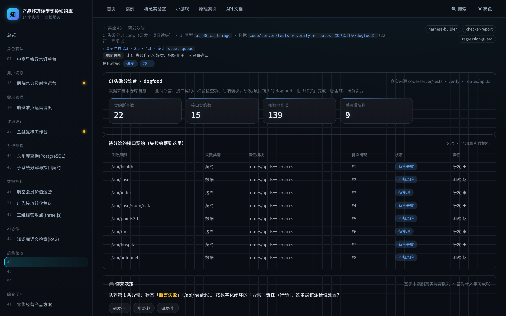

# 实操 48：CI 失败分诊 Loop（研发·项目镜头）

> **本案例演示/验证**：原理 2.3、2.5、4.3｜**采用设计** `steel-queue`（见 [design/steel-queue.md](../../design/steel-queue.md)）

> **在数字化系统中的位置**：能力智能层 · 验收环节｜**理论→实操**：把 §2 的 checker/inspector 落成一个真实的 CI 失败分诊 Loop：失败自动归类、指责任、给建议

> **角色镜头**： 研发 ·  项目（本案更偏这些角色；主脊 §1-§2 三镜头共读）

> **方法论落点**：单个案例 = SDD 流水线（§3.0）上一个可验收的小任务；一个中大型系统 = 许多这样的任务按方法论编排起来（完整走查见旗舰案例 51）。

>  **难度** 进阶｜**一句话** 让 CI 失败自己分好类、指好责任，人只做确认｜**前置** 建议先读完第一部分
>
>  **洞见**：「先建 Inspector 再建 Loop」在研发镜头的落地：分诊台就是那个 Inspector，它把「红了」变成「哪里红、谁负责、怎么修」。数据全来自本仓库自身的测试与校验，不是编的。
>
>  **常见坑**：最危险的不是分错类，而是让分诊台直接自动合并/发布——那是跳过 L2 直上 L3。分诊只出建议，人来拍板。

### 项目场景故事

你们的 CI 一红，群里就开始「是不是我这块」的猜谜，半小时过去还没定位。把这件事做成一个分诊 Loop：每次失败自动按「哪个测试、哪类断言、哪个模块」归类，给出责任建议与重试入口——人只需确认，不再猜谜。本案的数据就是本仓库自己的测试套件、校验器与接口契约（dogfood）。

**现状问题**

- 决策依赖的关键指标：测试用例数、契约断言数、校验检查项、接口数。
- 现场常见异常：断言失败、回归风险、待复现。
- 只做通用页面无法支撑「把一次 CI 失败自动分诊到「哪个模块、哪类问题、谁来修」，人只做确认」。

**本次任务**

- 明确岗位、指标链、异常状态与决策动作。
- 使用 `harness-builder` 与 `checker-report` 完成分析，产出 `CI 失败分诊报告`，用 `regression-guard` 验收。

### 任务目标与数据

- 行业：研发效能
- 真实业务场景：CI 失败分诊台
- 岗位：研发 Tech Lead / 交付负责人
- 数据或资料：`code/server/tests + verify + routes（本仓库自身·dogfood）`（22 行，异常 8）
- 公开参考：本仓库 code/server/tests、verify_course_package.mjs、routes/api.ts
- 行业字段：失败用例、失败类别、责任模块、首次出现
- 指标链（真实值）：契约断言数 22，接口契约数 16，校验检查项 184，后端模块数 9
- 决策动作：把一次 CI 失败自动分诊到「哪个模块、哪类问题、谁来修」，人只做确认
- 风险边界：分诊只做建议，合并/发布仍需人工确认，不自动 force-merge
- UI 原型：`ui_48_ci_triage`（ci_triage）
- 采用设计：steel-queue
- SaaS 组件：失败列表、分类标签、责任映射、重试面板

### Prompt 实操

**Prompt 1：CI 失败分诊台 - 问题定义**

```text
请以产品经理身份，用 AI 编程工具（如 Trae、CodeBuddy 等任一 Agent 工具）完成「CI 失败分诊台」的**产品问题定义**（这一步先把问题想清楚，不写代码）：
- 岗位与场景：研发 Tech Lead / 交付负责人 面向「CI 失败分诊台」，把业务判断转成一份可验证的产品问题定义。
- 数据：读取 `code/server/tests + verify + routes（本仓库自身·dogfood）`，只使用其中真实存在的字段（失败用例、失败类别、责任模块、首次出现）。
- 指标链：测试用例数、契约断言数、校验检查项、接口数（当前真实值：契约断言数=22，接口契约数=16，校验检查项=184，后端模块数=9）。
- 现场异常：要盯的是 断言失败、回归风险、待复现——说清每类异常谁负责、如何被发现。
- 决策动作：这份定义最终要支撑的关键决策是——把一次 CI 失败自动分诊到「哪个模块、哪类问题、谁来修」，人只做确认
- 使用 Skill：用 harness-builder、checker-report 完成分析（结构化 Skill 见 skills/pm_skills.md）。
- 输出：CI 失败分诊报告，保存为 `outputs/product_case_library/case_48_ci_triage_loop_问题定义.md`。
- 边界：结论必须回到数据或公开参考（本仓库 code/server/tests、verify_course_package.mjs、routes/api.ts）；不得越过「分诊只做建议，合并/发布仍需人工确认，不自动 force-merge」。
```

**Prompt 2：CI 失败分诊台 - 方案验收**

```text
请以产品经理身份，用 AI 编程工具（如 Trae、CodeBuddy 等任一 Agent 工具）完成「CI 失败分诊台」的**方案验收**（把上一步的问题定义做成可运行原型，并逐项验收）：
- 目标：基于问题定义，产出一个可运行的深色大屏原型，让指标链、异常队列、责任、行动都能在页面上看到、点得动。
- 数据：读取 `code/server/tests + verify + routes（本仓库自身·dogfood）`，只使用其中真实存在的字段（失败用例、失败类别、责任模块、首次出现）。
- 指标链：测试用例数、契约断言数、校验检查项、接口数（当前真实值：契约断言数=22，接口契约数=16，校验检查项=184，后端模块数=9）。
- 原型（技术契约，遵 rules/ 约束：DRY、单文件<800行、TS 类型、中文注释）：在 `code/web`（Vite+React+TS）路由 `#/case/48`，按 `ui_48_ci_triage`（ci_triage）与设计 `steel-queue` 渲染；数据经 `build_case_data.mjs` 预计算，不得复用通用表格占位。
- 使用 Skill：用 regression-guard 做验收（结构化 Skill 见 skills/pm_skills.md）。
- 输出：CI 失败分诊报告，保存为 `outputs/product_case_library/case_48_ci_triage_loop_方案验收.md`。
- 验收条件：指标链回到真实数据、异常可追踪、行动入口明确；不得越过「分诊只做建议，合并/发布仍需人工确认，不自动 force-merge」；`node code/tools/verify_course_package.mjs` 必须 ALL GREEN。
```

### 图形/原型/表单





- 图形类型：ci_triage_loop（设计 steel-queue）
- 看图顺序：先看四个真实计量（测试/断言/校验项/接口），再看分诊队列怎么把失败指到模块与责任，最后看「只建议不自动合并」的边界。
- UI 差异：本案例采用 `ui_48_ci_triage` + 设计 `steel-queue`，不得复用通用表格占位；可运行原型见 `#/case/48`。

### 交付物与验收

- 交付物：CI 失败分诊报告
- 必含字段：失败用例、失败类别、责任模块、首次出现
- 必含指标链：测试用例数、契约断言数、校验检查项、接口数
- 必含异常状态：断言失败、回归风险、待复现
- 必含 Skill：harness-builder、checker-report、regression-guard

- 合格标准：业务场景具体、指标链完整、异常状态可追踪、行动入口明确、验收条件可执行。
- 不合格标准：使用泛化产品名称、缺少行业指标、只描述页面不说明业务取舍、越过「分诊只做建议，合并/发布仍需人工确认，不自动 force-merge」。

### 跟着做（动手复现）

1. 起服务：`bash code/run.sh`，浏览器打开 `#/case/48`（本案专属大屏）。
2. **你应看到**：指标链（测试用例数 / 契约断言数 / 校验检查项 …）、异常队列与责任对象、行动入口，数据全部来自真实后端实时计算。
3. **动手改一改**：给 code/server 新增一个会失败的断言，重跑 node --test，观察分诊台把它归到哪个类别、指给哪个模块。

<details>
<summary> 深度（专业读者）：权衡 · 失效模式 · 何时别用</summary>

为什么分诊只到「建议」就停？因为「同一失败连续两轮必须停、叫人」（stop-rules）——自动重试修不动的错误只会烧钱烧时间。分诊台是 L1→L2，force-merge 是 L3，跨级就是事故。
</details>

### 练习（做完再进下一个案例）

1. **巩固**：本案的「真实数据」具体来自本仓库哪三处？为什么说它是 dogfood？
2. **挑战**：给这个分诊 Loop 设计 L0→L3 的四级毕业考，写清每级的退出条件与护栏。

> **小结**：本案用「CI 失败分诊台」演示原理 2.3、2.5、4.3，落成可运行、可验收的产品判断。运行 `bash code/run.sh` 后访问 `#/case/48`（真后端实时数据）。

[← 返回案例总览](README.md) · [返回目录](../../AI时代研发产品项目一体化知识库/README.md)
