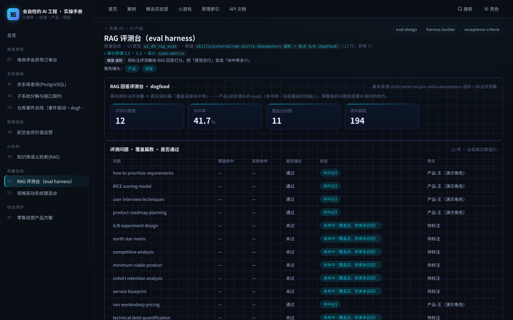

# 实操 49：RAG 评测台 / eval harness（产品·研发镜头）

### 项目场景故事

你给产品接了个 RAG 问答，老板问「它到底答得准不准」，你只能说「我试了几个感觉还行」。把「感觉」变成「评测台」：定一组标注好的问题与期望命中，让系统离线跑一遍，算出命中率、列出没答对的，再决定上不上线。本案的语料就是本书已本地化的 deanpeters PM 语料（dogfood）。

> **本案例演示/验证**：原理 2.6、1.3｜**采用设计** `cyan-matrix`（见 [design/cyan-matrix.md](../../design/cyan-matrix.md)）

> **在数字化系统中的位置**：能力智能层 · 验收环节｜**理论→实操**：把「evals 是当前最缺的技能」落成一个可跑的评测台：离线用标注集量化 RAG 回答好不好

> **角色镜头**： 产品 ·  研发（本案更偏这些角色；主脊 §1-§2 三镜头共读）

> **方法论落点**：单个案例 = SDD 流水线（§3.0）上一个可验收的小任务；一个中大型系统 = 许多这样的任务按方法论编排起来（完整走查见旗舰案例 51）。

>  **难度** 进阶｜**一句话** 用标注评测集给 RAG 回答打分，把「感觉还行」变成「命中率多少」｜**前置** 建议先读完第一部分
>
>  **洞见**：OpenAI/吴恩达都说 evals 是 AI 产品的头号新技能，本书前面反复讲、却一直没有一个能跑的评测案例——这一案就是补上它。评测集 × 真实语料，离线算命中，把 vibe 变成数字。
>
>  **常见坑**：把命中率当成唯一真理。评测集覆盖不全时，高分可能只是「考了会的」；所以要配错误分析 + 人工抽检，别让分数剧场化（§2 的「验证剧场」）。

**现状问题**

- 决策依赖的关键指标：评测问题数、命中率、语料篇数、语料覆盖(万字)。
- 现场常见异常：未命中、低相关、待标注。
- 只做通用页面无法支撑「用离线评测集量化「RAG 回答好不好」，据此决定能不能上线、还差哪些语料」。

**本次任务**

- 明确岗位、指标链、异常状态与决策动作。
- 使用 `eval-design` 与 `harness-builder` 完成分析，产出 `RAG 评测报告（命中率/错误分析）`，用 `acceptance-criteria` 验收。

### 任务目标与数据

- 行业：AI 产品
- 真实业务场景：RAG 回答评测台
- 岗位：AI 产品经理 / 应用研发
- 数据或资料：`skills/external/pm-skills-deanpeters 语料 + 标注 Q/A（dogfood）`（12 行，异常 1）
- 公开参考：deanpeters PM-Skills 语料 + 本书标注评测集
- 行业字段：问题、期望命中、实际命中、是否通过
- 指标链（真实数据）：评测问题数 12，命中率 91.7%，语料篇数 194，语料覆盖(万字) 191
- 决策动作：用离线评测集量化「RAG 回答好不好」，据此决定能不能上线、还差哪些语料
- 风险边界：评测分数是发布参考，不替代人工抽检；分数高不等于零幻觉
- UI 原型：`ui_49_rag_eval`（rag_eval）
- 采用设计：cyan-matrix
- SaaS 组件：评测集、命中矩阵、分数卡、错误分析

### Prompt 实操

> **怎么用**：推荐用 **CodeBuddy 的 Plan 模式**（腾讯，国产·当下可跑）——把下面灰底代码框**整段原样粘进去，它会先列出任务清单、再自主执行**，你不需要看懂里面的技术细节；没装过就先装一个。海外读者用 Claude Code / Cursor / Trae 等任一 Agent 工具同理（见附录B）。

**Prompt 1：RAG 回答评测台 - 问题定义**

```text
请以产品经理身份，用 AI 编程工具（如 Trae、CodeBuddy 等任一 Agent 工具）完成「RAG 回答评测台」的**产品问题定义**（这一步先把问题想清楚，不写代码）：
- 岗位与场景：AI 产品经理 / 应用研发 面向「RAG 回答评测台」，把业务判断转成一份可验证的产品问题定义。
- 数据：读取 `skills/external/pm-skills-deanpeters 语料 + 标注 Q/A（dogfood）`，只使用其中实际存在的字段（问题、期望命中、实际命中、是否通过）。
- 指标链：评测问题数、命中率、语料篇数、语料覆盖(万字)（当前真实值：评测问题数=12，命中率=91.7%，语料篇数=194，语料覆盖(万字)=191）。
- 现场异常：要盯的是 未命中、低相关、待标注——说清每类异常谁负责、如何被发现。
- 决策动作：这份定义最终要支撑的关键决策是——用离线评测集量化「RAG 回答好不好」，据此决定能不能上线、还差哪些语料
- 使用 Skill：用 eval-design、harness-builder 完成分析（结构化 Skill 见 skills/pm_skills.md）。
- 输出：RAG 评测报告（命中率/错误分析），保存为 `outputs/product_case_library/case_49_rag_eval_harness_问题定义.md`。
- 边界：结论必须回到数据或公开参考（deanpeters PM-Skills 语料 + 本书标注评测集）；不得越过「评测分数是发布参考，不替代人工抽检；分数高不等于零幻觉」。
```

**Prompt 2：RAG 回答评测台 - 方案验收**

```text
请以产品经理身份，用 AI 编程工具（如 Trae、CodeBuddy 等任一 Agent 工具）完成「RAG 回答评测台」的**方案验收**（把上一步的问题定义做成可运行原型，并逐项验收）：
- 目标：基于问题定义，产出一个可运行的深色大屏原型，让指标链、异常队列、责任、行动都能在页面上看到、点得动。
- 数据：读取 `skills/external/pm-skills-deanpeters 语料 + 标注 Q/A（dogfood）`，只使用其中实际存在的字段（问题、期望命中、实际命中、是否通过）。
- 指标链：评测问题数、命中率、语料篇数、语料覆盖(万字)（当前真实值：评测问题数=12，命中率=91.7%，语料篇数=194，语料覆盖(万字)=191）。
- 原型（技术契约，遵 rules/ 约束：DRY、单文件<800行、TS 类型、中文注释）：在 `code/web`（Vite+React+TS）路由 `#/case/49`，按 `ui_49_rag_eval`（rag_eval）与设计 `cyan-matrix` 渲染；数据经 `build_case_data.mjs` 预计算，不得复用通用表格占位。
- 使用 Skill：用 acceptance-criteria 做验收（结构化 Skill 见 skills/pm_skills.md）。
- 输出：RAG 评测报告（命中率/错误分析），保存为 `outputs/product_case_library/case_49_rag_eval_harness_方案验收.md`。
- 验收条件：指标链回到真实数据、异常可追踪、行动入口明确；不得越过「评测分数是发布参考，不替代人工抽检；分数高不等于零幻觉」；`node code/tools/verify_course_package.mjs` 必须 ALL GREEN。
```

### 图形/原型/表单





- 图形类型：rag_eval_harness（设计 cyan-matrix）
- 看图顺序：先看评测集规模与命中率，再看命中矩阵里哪些问题没答对，最后看「分数是参考、不替代抽检」的边界。
- UI 差异：本案例采用 `ui_49_rag_eval` + 设计 `cyan-matrix`，不得复用通用表格占位；可运行原型见 `#/case/49`。

### 交付物与验收

- 交付物：RAG 评测报告（命中率/错误分析）
- 必含字段：问题、期望命中、实际命中、是否通过
- 必含指标链：评测问题数、命中率、语料篇数、语料覆盖(万字)
- 必含异常状态：未命中、低相关、待标注
- 必含 Skill：eval-design、harness-builder、acceptance-criteria

- 合格标准：业务场景具体、指标链完整、异常状态可追踪、行动入口明确、验收条件可执行。
- 不合格标准：使用泛化产品名称、缺少行业指标、只描述页面不说明业务取舍、越过「评测分数是发布参考，不替代人工抽检；分数高不等于零幻觉」。

### 跟着做（动手复现）

1. 起服务：`bash code/run.sh`，浏览器打开 `#/case/49`（本案专属大屏）。
2. **你应看到**：指标链（评测问题数 / 命中率 / 语料篇数 …）、异常队列与责任对象、行动入口，数据全部来自真实后端实时计算。
3. **动手改一改**：往评测集里加两道你关心的问题、指定期望命中关键词，重跑 build_case_data，看命中率怎么变。

<details>
<summary> 深度（专业读者）：权衡 · 失效模式 · 何时别用</summary>

为什么离线评测集比线上 A/B 先行？因为归纳问题（§1.7）——模型在没见过的问法上会自信地错；一组固定、可复现的评测集，是你在上线前唯一能反复量化的「验证」，正是「没有免费午餐」下只能验证不能证明的日常版。 本案配有**回归门**：`node code/tools/eval_harness.mjs` 用同一金标集+裁判规则复算得分，低于 `eval_baseline.json` 基线即失败——评测从「算一次给你看」升级为「守住不许变差」。
</details>

### 练习（做完再进下一个案例）

1. **巩固**：本案的评测集与语料分别来自哪里？命中率是怎么算出来的（真实计算，不是编的）？
2. **挑战**：设计一个「错误分析」流程：命中率从 60% 提到 80%，你会先看哪些没命中的问题、怎么补语料？

> **小结**：本案用「RAG 回答评测台」演示原理 2.6、1.3，落成可运行、可验收的产品判断。运行 `bash code/run.sh` 后访问 `#/case/49`（真后端实时数据）。

[← 返回案例总览](README.md) · [返回目录](../../AI时代研发产品项目一体化知识库/README.md)
