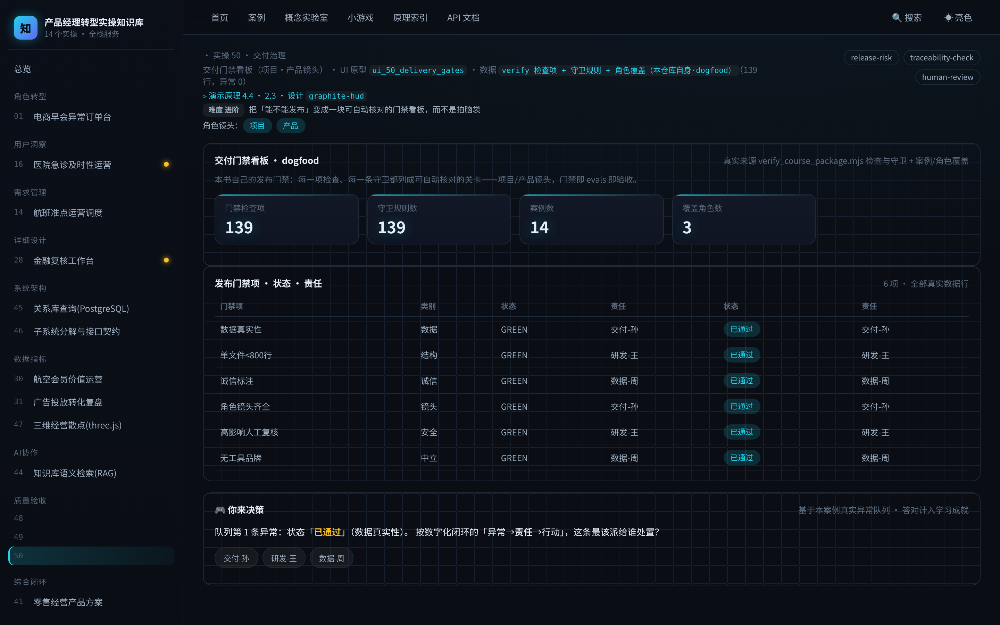

# 实操 50：交付门禁看板（项目·产品镜头）

### 项目场景故事

发布前的老问题：到底「好了没有」？靠谁拍胸脯，还是靠一块看板？本案把本书自己的发布门禁做成看板——verify 的每一项检查、每一条守卫规则、案例与角色覆盖，全列成可自动核对的关卡，红一项就发不了。这就是项目镜头的收口，也是研发的 verify、产品的 evals 的同一块门禁（dogfood）。

> **本案例演示/验证**：原理 4.4、2.3｜**采用设计** `graphite-hud`（见 [design/graphite-hud.md](../../design/graphite-hud.md)）

> **在数字化系统中的位置**：底座平台层 · 验收环节｜**理论→实操**：把 §6 的「门禁 + 风险登记」落成本书自己的发布门禁看板：能不能发布靠一组可自动核对的关卡

> **角色镜头**： 项目 ·  产品（本案更偏这些角色；主脊 §1-§2 三镜头共读）

> **方法论落点**：单个案例 = SDD 流水线（§3.0）上一个可验收的小任务；一个中大型系统 = 许多这样的任务按方法论编排起来（完整走查见旗舰案例 51）。

>  **难度** 进阶｜**一句话** 把「能不能发布」变成一块可自动核对的门禁看板，而不是拍脑袋｜**前置** 建议先读完第一部分
>
>  **洞见**：这一案最「元」：它把本书自己的发布门禁（verify 的数百项检查 + 三绿）做成一个案例——门禁即 evals 即验收，研发的 verify、产品的 evals、项目的门禁，是同一块看板的三张脸。
>
>  **常见坑**：把「门禁全绿」当成「一定没问题」。门禁是必要条件不是充分条件——它只拦住你写进去的风险；没写成守卫的风险，绿灯照样放行。所以要持续把新风险补进风险登记。

**现状问题**

- 决策依赖的关键指标：门禁检查项、守卫规则数、案例数、覆盖角色数。
- 现场常见异常：未过、待补、需人工确认。
- 只做通用页面无法支撑「用一块门禁看板决定「能不能发布」，把「差不多了」变成一组可自动核对的关卡」。

**本次任务**

- 明确岗位、指标链、异常状态与决策动作。
- 使用 `release-risk` 与 `traceability-check` 完成分析，产出 `交付门禁与风险登记`，用 `human-review` 验收。

### 任务目标与数据

- 行业：交付治理
- 真实业务场景：交付门禁看板
- 岗位：项目/交付负责人
- 数据或资料：`verify 检查项 + 守卫规则 + 角色覆盖（本仓库自身·dogfood）`（193 行，异常 0）
- 公开参考：本仓库 verify_course_package.mjs 检查与守卫、案例与角色覆盖
- 行业字段：门禁项、类别、状态、责任
- 指标链（真实值）：门禁检查项 193，门禁类别 6，案例数 17，覆盖角色数 3
- 决策动作：用一块门禁看板决定「能不能发布」，把「差不多了」变成一组可自动核对的关卡
- 风险边界：门禁绿灯是发布的必要条件而非充分条件；高影响项仍需人工签署
- UI 原型：`ui_50_delivery_gates`（delivery_gates）
- 采用设计：graphite-hud
- SaaS 组件：门禁清单、通过率、风险登记、签署

### Prompt 实操

> **怎么用**：推荐用 **CodeBuddy 的 Plan 模式**（腾讯，国产·当下可跑）——把下面灰底代码框**整段原样粘进去，它会先列出任务清单、再自主执行**，你不需要看懂里面的技术细节；没装过就先装一个。海外读者用 Claude Code / Cursor / Trae 等任一 Agent 工具同理（见 §2.6.1）。

**Prompt 1：交付门禁看板 - 问题定义**

```text
请以产品经理身份，用 AI 编程工具（如 Trae、CodeBuddy 等任一 Agent 工具）完成「交付门禁看板」的**产品问题定义**（这一步先把问题想清楚，不写代码）：
- 岗位与场景：项目/交付负责人 面向「交付门禁看板」，把业务判断转成一份可验证的产品问题定义。
- 数据：读取 `verify 检查项 + 守卫规则 + 角色覆盖（本仓库自身·dogfood）`，只使用其中真实存在的字段（门禁项、类别、状态、责任）。
- 指标链：门禁检查项、守卫规则数、案例数、覆盖角色数（当前真实值：门禁检查项=193，门禁类别=6，案例数=17，覆盖角色数=3）。
- 现场异常：要盯的是 未过、待补、需人工确认——说清每类异常谁负责、如何被发现。
- 决策动作：这份定义最终要支撑的关键决策是——用一块门禁看板决定「能不能发布」，把「差不多了」变成一组可自动核对的关卡
- 使用 Skill：用 release-risk、traceability-check 完成分析（结构化 Skill 见 skills/pm_skills.md）。
- 输出：交付门禁与风险登记，保存为 `outputs/product_case_library/case_50_delivery_gates_board_问题定义.md`。
- 边界：结论必须回到数据或公开参考（本仓库 verify_course_package.mjs 检查与守卫、案例与角色覆盖）；不得越过「门禁绿灯是发布的必要条件而非充分条件；高影响项仍需人工签署」。
```

**Prompt 2：交付门禁看板 - 方案验收**

```text
请以产品经理身份，用 AI 编程工具（如 Trae、CodeBuddy 等任一 Agent 工具）完成「交付门禁看板」的**方案验收**（把上一步的问题定义做成可运行原型，并逐项验收）：
- 目标：基于问题定义，产出一个可运行的深色大屏原型，让指标链、异常队列、责任、行动都能在页面上看到、点得动。
- 数据：读取 `verify 检查项 + 守卫规则 + 角色覆盖（本仓库自身·dogfood）`，只使用其中真实存在的字段（门禁项、类别、状态、责任）。
- 指标链：门禁检查项、守卫规则数、案例数、覆盖角色数（当前真实值：门禁检查项=193，门禁类别=6，案例数=17，覆盖角色数=3）。
- 原型（技术契约，遵 rules/ 约束：DRY、单文件<800行、TS 类型、中文注释）：在 `code/web`（Vite+React+TS）路由 `#/case/50`，按 `ui_50_delivery_gates`（delivery_gates）与设计 `graphite-hud` 渲染；数据经 `build_case_data.mjs` 预计算，不得复用通用表格占位。
- 使用 Skill：用 human-review 做验收（结构化 Skill 见 skills/pm_skills.md）。
- 输出：交付门禁与风险登记，保存为 `outputs/product_case_library/case_50_delivery_gates_board_方案验收.md`。
- 验收条件：指标链回到真实数据、异常可追踪、行动入口明确；不得越过「门禁绿灯是发布的必要条件而非充分条件；高影响项仍需人工签署」；`node code/tools/verify_course_package.mjs` 必须 ALL GREEN。
```

### 图形/原型/表单





- 图形类型：delivery_gates_board（设计 graphite-hud）
- 看图顺序：先看门禁检查项与守卫规则的真实数量，再看门禁清单逐项状态与责任，最后看「绿灯是必要非充分、高影响需人工签署」的边界。
- UI 差异：本案例采用 `ui_50_delivery_gates` + 设计 `graphite-hud`，不得复用通用表格占位；可运行原型见 `#/case/50`。

### 交付物与验收

- 交付物：交付门禁与风险登记
- 必含字段：门禁项、类别、状态、责任
- 必含指标链：门禁检查项、守卫规则数、案例数、覆盖角色数
- 必含异常状态：未过、待补、需人工确认
- 必含 Skill：release-risk、traceability-check、human-review

- 合格标准：业务场景具体、指标链完整、异常状态可追踪、行动入口明确、验收条件可执行。
- 不合格标准：使用泛化产品名称、缺少行业指标、只描述页面不说明业务取舍、越过「门禁绿灯是发布的必要条件而非充分条件；高影响项仍需人工签署」。

### 跟着做（动手复现）

1. 起服务：`bash code/run.sh`，浏览器打开 `#/case/50`（本案专属大屏）。
2. **你应看到**：指标链（门禁检查项 / 守卫规则数 / 案例数 …）、异常队列与责任对象、行动入口，数据全部来自真实后端实时计算。
3. **动手改一改**：在 verify 里故意让一条守卫失败，重跑，观察门禁看板的通过状态与「发不了」的结论。

<details>
<summary> 深度（专业读者）：权衡 · 失效模式 · 何时别用</summary>

为什么说「门禁即 evals 即验收」？因为三者本质同构：都是把「对不对/好不好/能不能发」变成一组可自动、可复现的断言。区别只在角色关心的那一面——研发看代码断言、产品看回答质量、项目看发布关卡，共享同一块门禁。
</details>

### 练习（做完再进下一个案例）

1. **巩固**：本案门禁看板的检查项数量从哪来（真实计算）？为什么说「门禁是必要非充分条件」？
2. **挑战**：给你负责的一个真实交付列一张最小风险登记（3 条），每条写：风险、怎么自动检测成门禁、触发后谁签署。

> **小结**：本案用「交付门禁看板」演示原理 4.4、2.3，落成可运行、可验收的产品判断。运行 `bash code/run.sh` 后访问 `#/case/50`（真后端实时数据）。

[← 返回案例总览](README.md) · [返回目录](../../AI时代研发产品项目一体化知识库/README.md)
