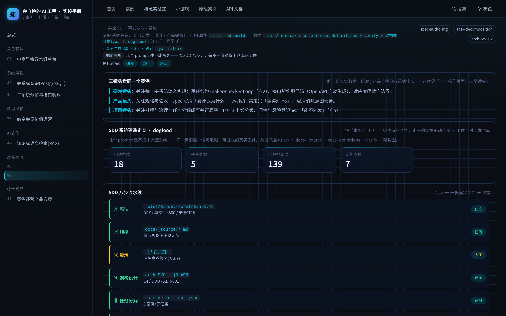

# 实操 51：SDD 系统建造走查（研发·项目·产品镜头）

> **本案例演示/验证**：原理 3.0、2.3、6.4｜**采用设计** `cyan-matrix`（见 [design/cyan-matrix.md](../../design/cyan-matrix.md)）

> **在数字化系统中的位置**：底座平台层 · 验收环节｜**理论→实操**：把 §3.0 的 SDD 八步落成一次可查的系统建造走查——每一步都对到仓库里一份真实工件

> **角色镜头**： 研发 ·  项目 ·  产品（本案更偏这些角色；主脊 §1-§2 三镜头共读）

> **方法论落点**：单个案例 = SDD 流水线（§3.0）上一个可验收的小任务；一个中大型系统 = 许多这样的任务按方法论编排起来（完整走查见旗舰案例 51）。

>  **难度** 高阶｜**一句话** 几个 prompt 建不成系统——照 SDD 八步走，每步一份对得上仓库的工件｜**前置** 建议先读完第一部分
>
>  **洞见**：本案把「本平台自己」当作被建造的系统，走一遍 SDD 八步：每步都对到仓库里一份真实工件——rules/=宪法、docs/_source=规格、case_definitions=任务、arch SVG=C4 架构、verify=门禁。这就是「几个 prompt 不够、必须要方法论」最实的证据。
>
>  **常见坑**：最容易被跳过的是「澄清」和「门禁」两步：跳澄清=把没说清的意图留给 AI 猜（意图债务，§2.9）；跳门禁=对不上既有架构、上线才炸。

### 项目场景故事

有人问：AI 这么强，几个 prompt 不就把系统写出来了？本案给一个诚实的反例——把「本教程平台自己」当作要建造的中大型系统，照 SDD 八步走一遍，你会看到：光是把它建成、还能自校验，就需要宪法(rules)、规格(docs)、澄清、架构(C4/ADR)、任务分解、逐任务实现、门禁(verify 三绿)、演进这一整套，每步一份真实工件。数据全部来自本仓库自身（dogfood）。

### 三镜头看同一个案例

> 同一份真实数据、同一个案例，研发/产品/项目三种角色各看到什么——这就是「一个操作模型、三个镜头」。

-  **研发镜头**：关注每个子系统怎么实现：逐任务跑 maker/checker Loop（§2）、接口契约即代码（OpenAPI 自动生成）、适应度函数守边界。
-  **产品镜头**：关注规格与验收：spec 写清「要什么为什么」、evals/门禁定义「做得好不好」、澄清消除意图债务。
-  **项目镜头**：关注排程与治理：任务分解成可并行原子、L0-L3 上线分级、门禁与风险登记决定「能不能发」（§6）。

**现状问题**

- 决策依赖的关键指标：宪法条款、子系统数、门禁检查项、架构图数。
- 现场常见异常：规格缺失、契约缺失、门禁未过。
- 只做通用页面无法支撑「用规格驱动八步把一次中大型建造拆成可追溯、可验收的小步（而非几个 prompt 一把梭）」。

**本次任务**

- 明确岗位、指标链、异常状态与决策动作。
- 使用 `spec-authoring` 与 `task-decomposition` 完成分析，产出 `SDD 系统建造走查报告`，用 `arch-review` 验收。

### 任务目标与数据

- 行业：研发效能 / 架构
- 真实业务场景：规格驱动系统建造台
- 岗位：架构师 / 研发负责人
- 数据或资料：`rules/ + docs/_source + case_definitions + verify + 架构图（本仓库自身·dogfood）`（18 行，异常 0）
- 公开参考：本仓库 rules/、docs/_source、code/tools、arch SVG、verify_course_package.mjs
- 行业字段：步骤、工件、状态、产出
- 指标链（真实值）：宪法条款 18，子系统数 5，门禁检查项 193，架构图数 7
- 决策动作：用规格驱动八步把一次中大型建造拆成可追溯、可验收的小步（而非几个 prompt 一把梭）
- 风险边界：每步产出须可追溯（规格/ADR/门禁），不得跳过澄清与门禁两步
- UI 原型：`ui_51_sdd_build`（sdd_buildwalk）
- 采用设计：cyan-matrix
- SaaS 组件：SDD 流水线、工件清单、门禁状态、C4 图

### Prompt 实操 · SDD 系统建造八步（多 prompt 编排）

> 正面回答「几个 prompt 建不成系统」：下面是一条**流水线**——每步一个 prompt、产一份工件、喂给下一步；澄清与门禁是人/机把关。照着走，才建得动一个中大型系统。

> **怎么用**：把每一步的代码框整段复制进你的 AI 编程工具，拿到工件后再喂给下一步；不必看懂每行技术细节。

**① 宪法（constitution）**

```text
请先读 `rules/`（DRY、单文件<800 行、类型安全、安全红线等不可谈判的约束），并声明：本次建造全程不得违反这些原则。它们是本系统的宪法。
```

**② 规格（spec）**

```text
把「要建什么、为什么」写成 `spec.md`：目标、用户与场景、输入输出与数据、边界、前后置条件，以及一张约束表（业务/合规/规模/成本）。只写 what/why，不写实现。
```

**③ 澄清（clarify）**

```text
把 `spec.md` 里所有模糊处标成 `[需澄清]`，逐条列出来问我确认——这一步我（人）必须在场逐条拍板，消除「意图债务」（§2.9），不许你替我猜。
```

**④ 架构设计（plan）**

```text
基于确认后的规格产出 `plan.md`：C4 上下文/容器/组件图、DDD 限界上下文划分、以及关键技术选型的 ADR（背景→决策→后果，含重估信号）。
```

**⑤ 任务分解（tasks）**

```text
把 `plan.md` 拆成 `tasks.md`：原子、可并行、可独立验收的小任务，每个标注依赖、验收条件与所属子系统。
```

**⑥ 实现（implement）**

```text
逐个 task 跑一个 maker/checker Loop（§2）：builder 实现 → checker 跑全部检查 → 全绿才进下一个任务；接口契约即代码（OpenAPI 由 schema 自动生成，§3.4）。
```

**⑦ 门禁（analyze/gate）**

```text
整体门禁：跨工件一致性检查 + evals + `verify` 三绿（§6）。任一红灯，回到对应步骤修复，不放行。这一步机器自动把关。
```

**⑧ 演进（evolve）**

```text
上线后按「演进触发表」（§3.6）观察信号；一旦触发，回去改 `spec.md`（而非直接改代码），让规格始终是唯一真源。
```

### 图形/原型/表单





- 图形类型：sdd_system_build（设计 cyan-matrix）
- 看图顺序：先看四个真实计量（宪法条款/子系统/门禁项/架构图），再顺着 SDD 八步看每步对应的真实工件与状态，最后体会「跳澄清/跳门禁」的风险边界。
- UI 差异：本案例采用 `ui_51_sdd_build` + 设计 `cyan-matrix`，不得复用通用表格占位；可运行原型见 `#/case/51`。

### 交付物与验收

- 交付物：SDD 系统建造走查报告
- 必含字段：步骤、工件、状态、产出
- 必含指标链：宪法条款、子系统数、门禁检查项、架构图数
- 必含异常状态：规格缺失、契约缺失、门禁未过
- 必含 Skill：spec-authoring、task-decomposition、arch-review

- 合格标准：业务场景具体、指标链完整、异常状态可追踪、行动入口明确、验收条件可执行。
- 不合格标准：使用泛化产品名称、缺少行业指标、只描述页面不说明业务取舍、越过「每步产出须可追溯（规格/ADR/门禁），不得跳过澄清与门禁两步」。

### 跟着做（动手复现）

1. 起服务：`bash code/run.sh`，浏览器打开 `#/case/51`（本案专属大屏）。
2. **你应看到**：指标链（宪法条款 / 子系统数 / 门禁检查项 …）、异常队列与责任对象、行动入口，数据全部来自真实后端实时计算。
3. **动手改一改**：打开 rules/ 与 docs/_source，找出本案「宪法」与「规格」两步各对应哪些真实文件；再在 verify 里种一个错，看「门禁」步会不会红。

<details>
<summary> 深度（专业读者）：权衡 · 失效模式 · 何时别用</summary>

为什么 SDD 能建大系统而「几个 prompt」不能？因为 SDD 用规格+阶段门禁把 LLM「从创意写手变成有纪律的规格工程师」，维持了跨子系统的一致性、堵住了规格漂移。但它非银弹（非确定、可能瀑布化），必须配高确定性门禁（本平台的三绿）兜底——方法论 + 门禁两条腿。
</details>

### 练习（做完再进下一个案例）

1. **巩固**：本案 SDD 八步里，「宪法」「规格」「架构」「门禁」各对应本仓库哪个真实文件/产物？
2. **挑战**：挑一个你要做的中大型系统，把它套进 SDD 八步，写出每步你会产出的一份工件（哪怕一句话）。

> **小结**：本案用「规格驱动系统建造台」演示原理 3.0、2.3、6.4，落成可运行、可验收的产品判断。运行 `bash code/run.sh` 后访问 `#/case/51`（真后端实时数据）。

[← 返回案例总览](README.md) · [返回目录](../../AI时代研发产品项目一体化知识库/README.md)
