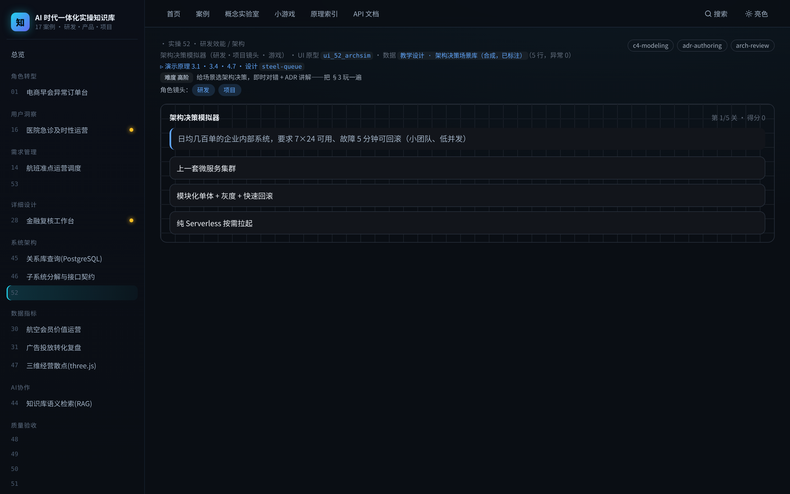

# 实操 52：架构决策模拟器（研发·项目镜头 · 游戏）

> **本案例演示/验证**：原理 3.1、3.4、4.7｜**采用设计** `steel-queue`（见 [design/steel-queue.md](../../design/steel-queue.md)）

> **在数字化系统中的位置**：底座平台层 · 决策环节｜**理论→实操**：把 §3 架构方法论做成闯关：给场景 + 约束选架构决策，即时对错 + ADR 讲解

> **角色镜头**： 研发 ·  项目（本案更偏这些角色；主脊 §1-§2 三镜头共读）

> **方法论落点**：单个案例 = SDD 流水线（§3.0）上一个可验收的小任务；一个中大型系统 = 许多这样的任务按方法论编排起来（完整走查见旗舰案例 51）。

>  **难度** 高阶｜**一句话** 给场景选架构决策，即时对错 + ADR 讲解——把 §3 玩一遍｜**前置** 建议先读完第一部分
>
>  **洞见**：架构不是背知识点，是在**约束**下做判断。本关每道题都藏着 §3 的一条红线（奥卡姆/契约/YAGNI），选错了当场告诉你踩了哪条——比读十遍散文都记得牢。
>
>  **常见坑**：最常见的错是「为复杂而复杂」：没有约束逼你，却上了微服务/新库/分布式。记住：没有约束支撑的复杂度就是负债。

### 项目场景故事

与其让你背「架构六步」，不如给你几个真实两难场景，你来拍板：日均几百单要不要上微服务？教学平台用 sqlite 还是 PG？选个日期要不要装库？每选一次，系统当场用 ADR 的口吻告诉你对不对、为什么——玩着玩着 §3 就长进脑子里了。

**现状问题**

- 决策依赖的关键指标：关卡数、决策点、涉及原理数、通关满分。
- 现场常见异常：过度工程、无证据复杂度、越界耦合。
- 只做通用页面无法支撑「在约束下选出「有证据的」架构决策，而非拍脑袋上复杂度」。

**本次任务**

- 明确岗位、指标链、异常状态与决策动作。
- 使用 `c4-modeling` 与 `adr-authoring` 完成分析，产出 `架构决策复盘`，用 `arch-review` 验收。

### 任务目标与数据

- 行业：研发效能 / 架构
- 真实业务场景：架构决策模拟器
- 岗位：架构师 / 技术负责人
- 数据或资料：`教学设计 · 架构决策场景库（合成，已标注）`（5 行，异常 0）
- 公开参考：本书 §3 信息化架构方法论
- 行业字段：场景、你的选择、是否最优、为什么
- 指标链（真实值）：关卡数 5，决策点 15，涉及原理数 5，通关满分 100
- 决策动作：在约束下选出「有证据的」架构决策，而非拍脑袋上复杂度
- 风险边界：决策须可追溯到约束 / ADR，不得无证据上复杂度
- UI 原型：`ui_52_archsim`（arch_sim_game）
- 采用设计：steel-queue
- SaaS 组件：场景卡、选项、即时判定、ADR 讲解

### Prompt 实操

> **怎么用**：打开你的 AI 编程工具（没有就先装一个，如 Trae、CodeBuddy 等任一 Agent 工具），把下面灰底代码框**整段原样复制、粘贴进对话框发送**——你不需要看懂里面的技术细节，AI 会照着做。

**Prompt 1：架构决策模拟器 - 问题定义**

```text
请以产品经理身份，用 AI 编程工具（如 Trae、CodeBuddy 等任一 Agent 工具）完成「架构决策模拟器」的**产品问题定义**（这一步先把问题想清楚，不写代码）：
- 岗位与场景：架构师 / 技术负责人 面向「架构决策模拟器」，把业务判断转成一份可验证的产品问题定义。
- 数据：读取 `教学设计 · 架构决策场景库（合成，已标注）`，只使用其中真实存在的字段（场景、你的选择、是否最优、为什么）。
- 指标链：关卡数、决策点、涉及原理数、通关满分（当前真实值：关卡数=5，决策点=15，涉及原理数=5，通关满分=100）。
- 现场异常：要盯的是 过度工程、无证据复杂度、越界耦合——说清每类异常谁负责、如何被发现。
- 决策动作：这份定义最终要支撑的关键决策是——在约束下选出「有证据的」架构决策，而非拍脑袋上复杂度
- 使用 Skill：用 c4-modeling、adr-authoring 完成分析（结构化 Skill 见 skills/pm_skills.md）。
- 输出：架构决策复盘，保存为 `outputs/product_case_library/case_52_arch_decision_sim_问题定义.md`。
- 边界：结论必须回到数据或公开参考（本书 §3 信息化架构方法论）；不得越过「决策须可追溯到约束 / ADR，不得无证据上复杂度」。
```

**Prompt 2：架构决策模拟器 - 方案验收**

```text
请以产品经理身份，用 AI 编程工具（如 Trae、CodeBuddy 等任一 Agent 工具）完成「架构决策模拟器」的**方案验收**（把上一步的问题定义做成可运行原型，并逐项验收）：
- 目标：基于问题定义，产出一个可运行的深色大屏原型，让指标链、异常队列、责任、行动都能在页面上看到、点得动。
- 数据：读取 `教学设计 · 架构决策场景库（合成，已标注）`，只使用其中真实存在的字段（场景、你的选择、是否最优、为什么）。
- 指标链：关卡数、决策点、涉及原理数、通关满分（当前真实值：关卡数=5，决策点=15，涉及原理数=5，通关满分=100）。
- 原型（技术契约，遵 rules/ 约束：DRY、单文件<800行、TS 类型、中文注释）：在 `code/web`（Vite+React+TS）路由 `#/case/52`，按 `ui_52_archsim`（arch_sim_game）与设计 `steel-queue` 渲染；数据经 `build_case_data.mjs` 预计算，不得复用通用表格占位。
- 使用 Skill：用 arch-review 做验收（结构化 Skill 见 skills/pm_skills.md）。
- 输出：架构决策复盘，保存为 `outputs/product_case_library/case_52_arch_decision_sim_方案验收.md`。
- 验收条件：指标链回到真实数据、异常可追踪、行动入口明确；不得越过「决策须可追溯到约束 / ADR，不得无证据上复杂度」；`node code/tools/verify_course_package.mjs` 必须 ALL GREEN。
```

### 图形/原型/表单





- 图形类型：arch_decision_sim（设计 steel-queue）
- 看图顺序：先看场景与约束，再选，再看即时判定与「为什么」（ADR 口吻）；通关看总分与踩坑复盘。
- UI 差异：本案例采用 `ui_52_archsim` + 设计 `steel-queue`，不得复用通用表格占位；可运行原型见 `#/case/52`。

### 交付物与验收

- 交付物：架构决策复盘
- 必含字段：场景、你的选择、是否最优、为什么
- 必含指标链：关卡数、决策点、涉及原理数、通关满分
- 必含异常状态：过度工程、无证据复杂度、越界耦合
- 必含 Skill：c4-modeling、adr-authoring、arch-review

- 合格标准：业务场景具体、指标链完整、异常状态可追踪、行动入口明确、验收条件可执行。
- 不合格标准：使用泛化产品名称、缺少行业指标、只描述页面不说明业务取舍、越过「决策须可追溯到约束 / ADR，不得无证据上复杂度」。

### 跟着做（动手复现）

1. 起服务：`bash code/run.sh`，浏览器打开 `#/case/52`（本案专属大屏）。
2. **你应看到**：指标链（关卡数 / 决策点 / 涉及原理数 …）、异常队列与责任对象、行动入口，数据全部来自真实后端实时计算。
3. **动手改一改**：故意每题都选「最复杂的选项」，看系统怎么一条条告诉你「无证据的复杂度」；再对照 §3.1 奥卡姆。

<details>
<summary> 深度（专业读者）：权衡 · 失效模式 · 何时别用</summary>

为什么架构题要考「约束」而不是「最佳实践」？因为脱离约束没有最佳架构——同一个「要不要上微服务」，高并发大团队选是、小团队内部系统选否。本关每道题的正解都绑在场景约束上；把约束抽掉，答案就翻转。这正是 §3.1「没有约束支撑的复杂度就是负债」的可玩版。
</details>

### 练习（做完再进下一个案例）

1. **巩固**：本关里「日均几百单要不要上微服务」的正解是什么？它对应 §3 的哪条红线？
2. **挑战**：给你自己项目的一个真实架构两难，仿本关写一道题：场景 + 约束 + 3 选项 + 正解 + ADR 式「为什么」。

> **小结**：本案用「架构决策模拟器」演示原理 3.1、3.4、4.7，落成可运行、可验收的产品判断。运行 `bash code/run.sh` 后访问 `#/case/52`（真后端实时数据）。

[← 返回案例总览](README.md) · [返回目录](../../AI时代研发产品项目一体化知识库/README.md)
