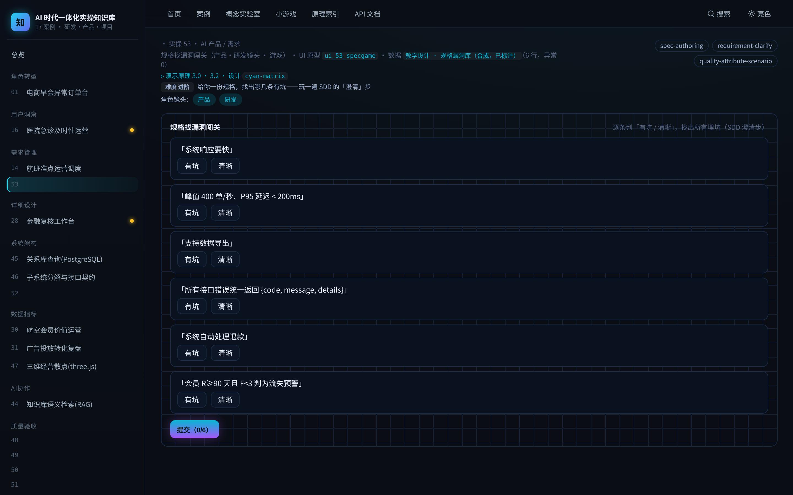

# 实操 53：规格找漏洞闯关（产品·研发镜头 · 游戏）

> **本案例演示/验证**：原理 3.0、3.2｜**采用设计** `cyan-matrix`（见 [design/cyan-matrix.md](../../design/cyan-matrix.md)）

> **在数字化系统中的位置**：业务应用层 · 决策环节｜**理论→实操**：把 SDD「澄清」步做成闯关：找出规格里的模糊 / 漏洞，即时对错 + 为什么

> **角色镜头**： 产品 ·  研发（本案更偏这些角色；主脊 §1-§2 三镜头共读）

> **方法论落点**：单个案例 = SDD 流水线（§3.0）上一个可验收的小任务；一个中大型系统 = 许多这样的任务按方法论编排起来（完整走查见旗舰案例 51）。

>  **难度** 进阶｜**一句话** 给你一份规格，找出哪几条有坑——玩一遍 SDD 的「澄清」步｜**前置** 建议先读完第一部分
>
>  **洞见**：SDD 说「澄清」是人必须在场的一步（§3.0）。为什么？因为一句「系统要快」看着没问题，AI 拿去就自信地替你猜——这就是意图债务。本关训练你一眼看出「哪句话没说清」。
>
>  **常见坑**：最容易漏的坑是「看着具体、其实没边界」：如「支持导出」——什么格式？多大量？谁能导？不问清，做出来准返工。

### 项目场景故事

产品经理最值钱的一手，是在几百行需求里一眼揪出那句「没说清、会出事」的话。本关给你一份混着清晰条目与埋了坑的规格，你逐条判「有坑 / 清晰」，系统当场告诉你漏洞在哪、为什么——把 SDD 的「澄清」步玩成打地鼠。

**现状问题**

- 决策依赖的关键指标：规格条目数、埋坑数、涉及原理数、满分。
- 现场常见异常：需求模糊、边界缺失、意图债务。
- 只做通用页面无法支撑「在动手前找出规格里没说清的地方，逐条澄清，消除意图债务」。

**本次任务**

- 明确岗位、指标链、异常状态与决策动作。
- 使用 `spec-authoring` 与 `requirement-clarify` 完成分析，产出 `规格澄清清单`，用 `quality-attribute-scenario` 验收。

### 任务目标与数据

- 行业：AI 产品 / 需求
- 真实业务场景：规格找漏洞闯关
- 岗位：产品经理 / 需求分析
- 数据或资料：`教学设计 · 规格漏洞库（合成，已标注）`（6 行，异常 0）
- 公开参考：本书 §3.0 SDD 澄清步、§3.2 质量属性场景
- 行业字段：规格条目、你的判断、是否有坑、漏洞在哪
- 指标链（真实值）：规格条目数 6，埋坑数 3，涉及原理数 2，满分 60
- 决策动作：在动手前找出规格里没说清的地方，逐条澄清，消除意图债务
- 风险边界：模糊处必须标 [需澄清] 由人确认，不得让 AI 替你猜
- UI 原型：`ui_53_specgame`（spec_hunt_game）
- 采用设计：cyan-matrix
- SaaS 组件：规格条目、有坑/清晰、即时判定、漏洞讲解

### Prompt 实操

**Prompt 1：规格找漏洞闯关 - 问题定义**

```text
请以产品经理身份，用 AI 编程工具（如 Trae、CodeBuddy 等任一 Agent 工具）完成「规格找漏洞闯关」的**产品问题定义**（这一步先把问题想清楚，不写代码）：
- 岗位与场景：产品经理 / 需求分析 面向「规格找漏洞闯关」，把业务判断转成一份可验证的产品问题定义。
- 数据：读取 `教学设计 · 规格漏洞库（合成，已标注）`，只使用其中真实存在的字段（规格条目、你的判断、是否有坑、漏洞在哪）。
- 指标链：规格条目数、埋坑数、涉及原理数、满分（当前真实值：规格条目数=6，埋坑数=3，涉及原理数=2，满分=60）。
- 现场异常：要盯的是 需求模糊、边界缺失、意图债务——说清每类异常谁负责、如何被发现。
- 决策动作：这份定义最终要支撑的关键决策是——在动手前找出规格里没说清的地方，逐条澄清，消除意图债务
- 使用 Skill：用 spec-authoring、requirement-clarify 完成分析（结构化 Skill 见 skills/pm_skills.md）。
- 输出：规格澄清清单，保存为 `outputs/product_case_library/case_53_spec_flaw_hunt_问题定义.md`。
- 边界：结论必须回到数据或公开参考（本书 §3.0 SDD 澄清步、§3.2 质量属性场景）；不得越过「模糊处必须标 [需澄清] 由人确认，不得让 AI 替你猜」。
```

**Prompt 2：规格找漏洞闯关 - 方案验收**

```text
请以产品经理身份，用 AI 编程工具（如 Trae、CodeBuddy 等任一 Agent 工具）完成「规格找漏洞闯关」的**方案验收**（把上一步的问题定义做成可运行原型，并逐项验收）：
- 目标：基于问题定义，产出一个可运行的深色大屏原型，让指标链、异常队列、责任、行动都能在页面上看到、点得动。
- 数据：读取 `教学设计 · 规格漏洞库（合成，已标注）`，只使用其中真实存在的字段（规格条目、你的判断、是否有坑、漏洞在哪）。
- 指标链：规格条目数、埋坑数、涉及原理数、满分（当前真实值：规格条目数=6，埋坑数=3，涉及原理数=2，满分=60）。
- 原型（技术契约，遵 rules/ 约束：DRY、单文件<800行、TS 类型、中文注释）：在 `code/web`（Vite+React+TS）路由 `#/case/53`，按 `ui_53_specgame`（spec_hunt_game）与设计 `cyan-matrix` 渲染；数据经 `build_case_data.mjs` 预计算，不得复用通用表格占位。
- 使用 Skill：用 quality-attribute-scenario 做验收（结构化 Skill 见 skills/pm_skills.md）。
- 输出：规格澄清清单，保存为 `outputs/product_case_library/case_53_spec_flaw_hunt_方案验收.md`。
- 验收条件：指标链回到真实数据、异常可追踪、行动入口明确；不得越过「模糊处必须标 [需澄清] 由人确认，不得让 AI 替你猜」；`node code/tools/verify_course_package.mjs` 必须 ALL GREEN。
```

### 图形/原型/表单





- 图形类型：spec_flaw_hunt（设计 cyan-matrix）
- 看图顺序：逐条读规格，判「有坑/清晰」，看即时判定与「漏洞在哪」；通关看找出率与遗漏项。
- UI 差异：本案例采用 `ui_53_specgame` + 设计 `cyan-matrix`，不得复用通用表格占位；可运行原型见 `#/case/53`。

### 交付物与验收

- 交付物：规格澄清清单
- 必含字段：规格条目、你的判断、是否有坑、漏洞在哪
- 必含指标链：规格条目数、埋坑数、涉及原理数、满分
- 必含异常状态：需求模糊、边界缺失、意图债务
- 必含 Skill：spec-authoring、requirement-clarify、quality-attribute-scenario

- 合格标准：业务场景具体、指标链完整、异常状态可追踪、行动入口明确、验收条件可执行。
- 不合格标准：使用泛化产品名称、缺少行业指标、只描述页面不说明业务取舍、越过「模糊处必须标 [需澄清] 由人确认，不得让 AI 替你猜」。

### 跟着做（动手复现）

1. 起服务：`bash code/run.sh`，浏览器打开 `#/case/53`（本案专属大屏）。
2. **你应看到**：指标链（规格条目数 / 埋坑数 / 涉及原理数 …）、异常队列与责任对象、行动入口，数据全部来自真实后端实时计算。
3. **动手改一改**：把你手头一份真实需求拿来，仿本关逐条问「这句可量化吗？有没有边界？高影响吗？」——你会发现坑比想象多。

<details>
<summary> 深度（专业读者）：权衡 · 失效模式 · 何时别用</summary>

为什么「找漏洞」比「写规格」更该先练？因为 AI 时代的失败多发生在澄清缺位——你没说清的，Agent 自信地替你猜（意图债务）。训练「一眼看出哪句没说清」，比堆更长的 prompt 有用得多。三类高频坑：无量化（要快）、无边界（支持导出）、高影响无复核（自动退款）——记住这三类，规格评审能挡住大半返工。
</details>

### 练习（做完再进下一个案例）

1. **巩固**：「系统要快」为什么是坑？该怎么改成不含糊的质量属性场景（§3.2）？
2. **挑战**：写 3 条规格：1 条清晰、2 条埋坑（一条缺量化、一条缺边界），并给出各自的澄清问题。

> **小结**：本案用「规格找漏洞闯关」演示原理 3.0、3.2，落成可运行、可验收的产品判断。运行 `bash code/run.sh` 后访问 `#/case/53`（真后端实时数据）。

[← 返回案例总览](README.md) · [返回目录](../../AI时代研发产品项目一体化知识库/README.md)
