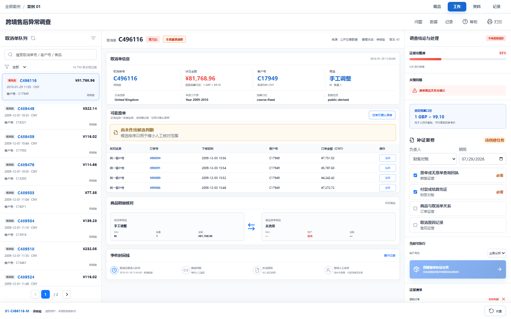

# 综合案例 B01　一张 8.17 万元取消单，缺的是哪张原单？

## 需求

售后人员必须在退款前找到可核对的原单；如果金额、时间或商品关系不足，就留下补证任务，不能靠相似金额猜测。

## 问题

售后队列里出现了一张很扎眼的取消记录：发票 `C496116`、商品代码 `M`、数量 `-1`，按课程固定汇率换算为人民币 81,768.96 元。金额很大，但这条记录没有自动告诉我们三件最重要的事：原订单是哪一张、货是否退回、退款是否已经发生。

本案例要解决的是：材料不全时，怎样让售后继续工作，又不让系统误退款？

退款核验专员先回答三个问题：

1. 这条取消记录能否与某张原订单可靠关联？
2. 当前还缺原单查询回执、付款凭证、商品关系还是取消原因？
3. 缺口没有补齐之前，应该创建补证任务，还是由主管暂缓退款？

## 逻辑思维方法论：从取消信号到原单核验的命题化

本案例的方法论链条如下：

1. **命题清晰化**：售后队列里出现"一张 81,768.96 元的取消记录"——但"取消记录"只是现象，不是可验证的命题。要判断原单是否存在，必须把它变成具体字段：发票 `C496116`、商品代码 `M`、数量 `-1`、`is_cancellation_proxy=true`。`is_cancellation_proxy` 只表示发票号具有取消记录的形式特征，不是退款回执，也不是退货签收。

2. **量词严谨性**：14,794 条课程样本记录中，只有部分取消记录能直接确认原单——"部分有原单"只在已核验的范围内成立，不能推广到全部 14,794 条。代表队列里的大额记录没有找到可确认原单，页面因此把其他记录标为"待逐笔排除"，而不是给出一个看似精确的关联分数；没有原单的记录不能因为"金额相似"就关联。

3. **逻辑边界守护**："暂缓退款"不是判定用户有问题，只是在材料不完整时停止不可逆动作。退款是不可逆的，材料不全时只能创建补证任务、提交人工复核或由主管暂缓——系统不自动退款，也不靠相似金额猜测原单。

## 数据

本地数据来自 UCI Online Retail II，共 14,794 条课程样本记录。页面使用的主要字段是 `invoice_id`、`stock_code`、`quantity`、`invoice_at`、`unit_price_gbp`、`customer_id`、`country` 和 `is_cancellation_proxy`。

`is_cancellation_proxy=true` 只表示发票号具有取消记录的形式特征。它不是退款回执，也不是退货签收。人民币金额使用课程内固定汇率，只用于统一案例口径，不代表实时汇率。

选中的大额记录并没有在代表队列中找到可以直接确认的原单。页面因此把其他记录标为"待逐笔排除"，而不是给出一个看似精确的关联分数。

## 解决方案



<video src="../../assets/case-diagrams/B01-requirement.webm" controls muted loop></video>

<video src="../../assets/case-diagrams/B01-architecture.webm" controls muted loop></video>

页面分成四块：

- 顶部先给出退款金额、数量、关系核对队列和案卷状态。
- 中间把取消记录与候选记录画成订单关系，虚线明确表示"待核对"。
- 右侧案卷保留发票、商品、客户、国家和原始单价，方便回到原始记录。
- 底部固定展示当前对象、操作角色和当前状态允许执行的动作。

正常处理顺序是：

```text
待核验
  ├─ 业务分析：创建原单补证任务 → 待补证
  │    └─ 业务分析：提交独立人工复核 → 人工复核待处理
  └─ 业务主管：暂缓退款 → 退款已暂缓
```

"暂缓退款"不是判定用户有问题，只是在材料不完整时停止不可逆动作。

## CodeBuddy Prompt

把下面的 Prompt 交给 CodeBuddy。先让它读取已有数据字段、业务规则和状态流程，不要先重写工作流：

```text
请实现案例 B01 的退货证据核验台。

业务目标：售后人员需要核对取消发票、原订单和退款材料；材料不足时只能补证、提交人工复核或由主管暂缓退款。

数据：只使用 dataset/01-retail-return-evidence/case.csv 中的真实字段。金额用 line_amount_cny；is_cancellation_proxy 只能显示为取消信号，不能解释为已经退款。

页面：左侧显示取消记录与候选订单关系，右侧显示案卷摘要，底部显示交易记录、取消信号和人工动作。候选关系必须标明待核对，不能生成虚构置信度。

交互：售后专员创建补证任务，材料回传后由另一名复核人确认；主管可以写明理由后暂缓。刷新页面后仍能看到案卷状态和操作记录。

完成后运行类型检查、聚焦测试和生产构建。
```

## 演示

**操作**：

1. 打开案例 B01，顶部进度条第一步"1 找原单"变蓝高亮。在页面中部候选列表里点击 `C496116` 这一条（该条变蓝表示选中），再在取消单卡片底部点击"没有可确认原单"按钮（该按钮变红表示已确认无原单）。
2. 顶部进度条第二步"2 发起补证"变蓝高亮。在页面右侧材料清单中，保留已勾选的"原单或无原单查询回执"和"付款或结算凭证"两项必需材料，再勾选"商品与取消单关系"复选框，在下方"负责人"和"期限"输入框填写后，点击底部"创建补证任务"按钮。
3. 顶部进度条高亮"3 等待材料"。在右侧材料列表逐项点击"标记回传"（含"商品与取消单关系"，标记后材料项变绿，"商品明细关系"显示"关系材料已回传"）。
4. 顶部进度条高亮"4 人工复核"。在"复核说明"框填写至少 6 个字符的说明（框下显示字符计数），全部材料回传且说明满 6 字符后"提交独立人工复核"按钮变蓝可点击。
5. 也可以恢复案例后切换业务主管，在"暂缓理由"框填写理由再点"暂缓退款"。

**结果**：创建任务后状态从"待核验 · v0"变为"待补证 · v1"。材料未齐时复核按钮不可用；全部回传后才能进入人工复核。取消形式标记不能替代原单回执、付款凭证和商品关系材料；点了"没有可确认原单"时，"商品明细关系"只能靠"商品与取消单关系"材料回传来确认，不能靠候选编码相同。


## 实现与排错

- 实现：[`code/cases/01-retail-return-evidence`](../../code/cases/01-retail-return-evidence/)。
- 聚焦测试：[`case-01-return-evidence.test.tsx`](../../code/app/tests/case-01-return-evidence.test.tsx)。
- 排查：若材料已经回传但仍不能提交复核，先核对材料编号是否都关联当前取消单，再检查提交人与复核人是否被错误地设成同一人。

---
