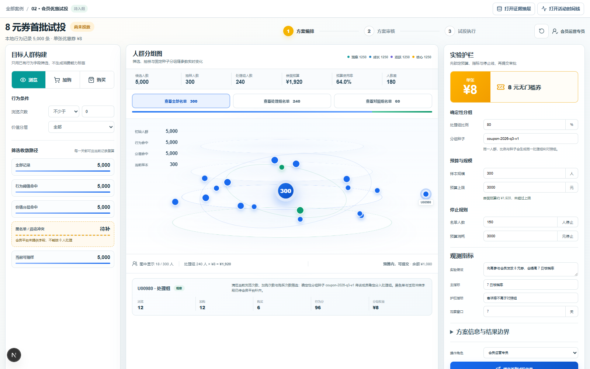

# 综合案例 B02　3,000 元预算，8 元券先发给谁？

## 需求

会员运营要做第一轮小流量试投：从匿名用户中抽出 300 人，80% 发券、20% 留作对照，总预算不超过 3,000 元。同样的筛选条件和分组种子再次打开时，名单不能变化。

## 问题

现有文件只有浏览、加购和购买次数，没有消费金额、优惠券曝光、领取、核销和投放后的购买记录。它可以帮助运营选出一批人，却不能回答“发券后会多卖多少”。

## 数据

数据来自 Beibei 用户行为。课程把 162,933 条行为记录整理为 5,000 名匿名用户的汇总表，页面使用 `user_id`、`view_count`、`cart_count`、`buy_count`、`engagement_score` 和 `value_segment`。

`engagement_score = view_count + 3 × cart_count + 8 × buy_count`。浏览与加购次数最多保留 12 次，当前 5,000 人都达到这个上限，因此分数主要由购买次数拉开。四个层级也是按排序等分得到的，每层 1,250 人；它们适合课程筛选，不应被解释成自然形成的“客户价值”。

- 可以做：按历史行为筛选、稳定抽样、计算券面预算。
- 不能做：预测核销率、计算新增收入、判断投放是否有效。

## 解决方案



<video src="../../assets/case-diagrams/B02-requirement.webm" controls muted loop></video>

<video src="../../assets/case-diagrams/B02-architecture.webm" controls muted loop></video>

人群分组图是页面中心。筛选条件变化时，它同步显示剩余人数；固定种子把 300 人稳定分为 240 人发券组和 60 人对照组。点开任一成员，可以看到浏览、加购、购买次数及入组原因。

实验设置集中在右侧：单张 8 元、预算上限、样本人数、80%/20% 比例、观察期、主要指标和提前停止条件。默认券面预算为 `240 × 8 = 1,920 元`。黑名单和活动冲突字段尚未接入，页面明确标为“待补”，不会按 0 人处理。

运营提交名单后，主管可以确认试投或退回修改。确认名单只表示方案可以进入真实投放，不代表优惠券已经产生效果。

## CodeBuddy Prompt

```text
请实现案例 B02 的 8 元券首批试投页面。

只使用本地会员行为字段，不生成消费金额、优惠券曝光、核销结果或转化提升。首屏明确显示“尚未投放”。

按 value_segment 和行为次数筛选候选人。用户可以设置样本人数、人民币预算、处理组比例和分组种子；相同条件与种子必须得到相同名单，处理组和对照组不能重叠。点开成员时显示 user_id、view_count、cart_count、buy_count 和入组原因。

提交前填写方案名、要验证的判断、主要指标、限制指标、观察天数，以及人数和预算两条停止规则。运营人员先保存名单，主管确认后才能开始；名单不合适时退回调整。确认名单不代表试验已经有效。

检查预算联动、稳定分组和刷新恢复；相同条件与种子必须得到同一名单。
```

## 演示

1. 选择一种历史行为和最低次数。
2. 设置 300 人、80%/20% 比例和分组种子。
3. 核对发券组 240 人、对照组 60 人，以及 1,920 元券面预算。
4. 点开一名用户，查看其浏览、加购、购买次数和入组原因。
5. 填写观察期、主要指标和停止条件，提交首批名单。
6. 刷新页面，确认名单和方案没有变化；再由主管确认或退回。

**结果**：相同条件和种子仍得到同一份名单。页面只保存试投计划，不显示尚未发生的转化提升。


## 实现与排错

- 实现：[`code/cases/02-member-value-experiment`](../../code/cases/02-member-value-experiment/)。
- 聚焦测试：[`case-02-member-trial-domain.test.tsx`](../../code/app/tests/case-02-member-trial-domain.test.tsx)。
- 排查：若刷新后试投名单变化，检查抽样前是否按匿名会员编号稳定排序，并确认分组种子没有在客户端重新生成。

---
