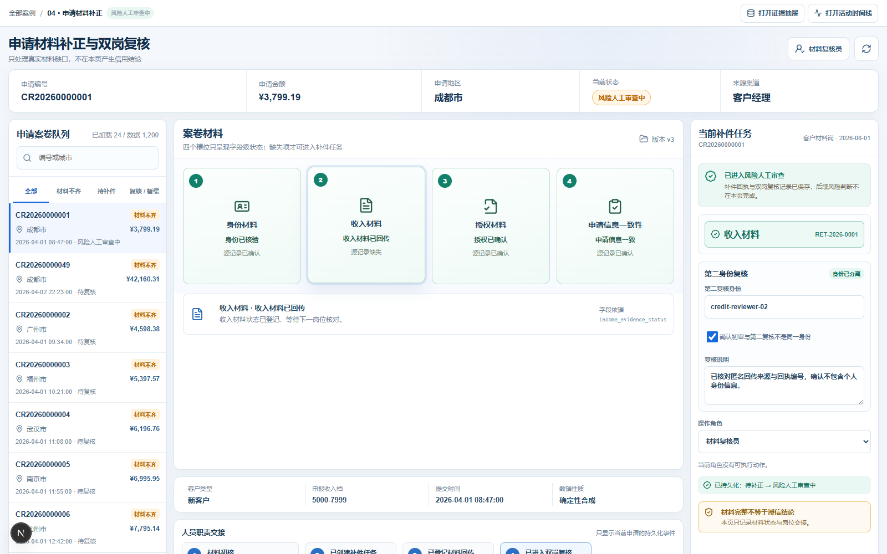
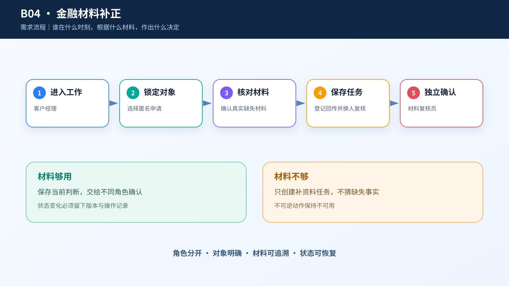
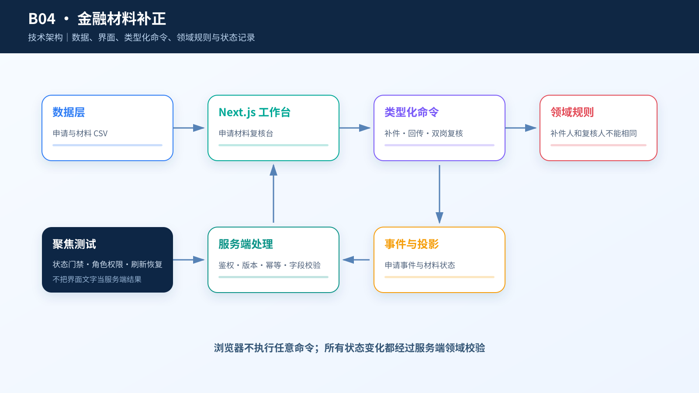

# 综合案例 B04　收入证明缺失：谁补，谁复核？

## 需求

成都客户经理提交了申请 `CR20260000001`，金额为人民币 3,799.19 元。材料复核员要确认缺少什么、交给谁补、什么时候回传；材料补齐后，必须换一名复核员再检查一次。

这一步只决定材料能否进入后续人工审查，不决定授信、拒贷或额度。

## 问题

四类材料混在一张清单里时，最容易出现三种错误：已经核验的材料被重复索取，补件记录串到另一张申请，或者初审人员自己完成第二次复核。只做一个“资料不全”标签，无法避免这些问题。

## 数据

页面只读取 `applications.csv`：1,200 条确定性合成申请、19 个字段、1,200 个唯一申请号。六个城市各 200 条，三种渠道各 400 条；收入材料缺失 72 条、身份待核 48 条、授权未确认 24 条、申请一致性需举证 12 条。

精选申请来自成都，渠道为客户经理，申请金额为 379,919 分，换算后是人民币 3,799.19 元。身份已核验、授权已确认、申请信息一致，只有收入材料缺失。

同目录的 30,000 条 UCI 历史信用卡样本只用于离线讲解方法和偏差。它不进入当前申请页面；历史违约标签、性别、年龄和婚姻状态也不能成为个体复核理由。

## 解决方案







页面以一张匿名案卷为中心。四个材料槽位直接显示源记录状态，只有真实缺失项才出现“发起补正”；已核验项不能勾选。补件任务必须写清负责人、回传日期和缺少内容，并绑定当前申请号和材料类型。

材料回传后，第二名复核员逐项确认来源与一致性。同一身份不能同时完成初审和复核。页面不展示附件影像、个人身份信息、信用分或自动决定。

## CodeBuddy Prompt

```text
请实现案例 B04 的“申请材料补正与双岗复核”。

页面权威数据只能是 dataset/04-credit-human-review/applications.csv。申请队列必须支持搜索，不得只让前 12 条可达。金额从 requested_amount_fen 转成人民币元。

四个材料槽位只显示字段状态，不伪造附件缩略图。只有源记录为 missing 或 pending 的材料才允许请求补正；已核验材料必须禁用。任务恢复时，只合并 objectId 等于当前申请的事件，切换申请后不得继承上一份草稿。

补件任务保存材料类型、初审身份、负责人、回传期限和说明；所有请求项回传后，另一名复核人才可填写意见并确认；暂缓申请必须填写原因。

不显示姓名、证件号、手机号、信用分、违约概率、建议额度、自动授信或拒贷结论。支持键盘焦点、reduced-motion 和确定性首屏。
```

## 演示

1. 搜索并打开 `CR20260000001`。
2. 核对身份、授权和申请一致性，定位缺失的收入材料。
3. 填写补件负责人、日期和具体说明，发起材料补正。
4. 刷新页面，确认任务仍绑定这张申请和收入材料。
5. 记录材料回传，由另一名复核员填写核对说明。
6. 提交后续人工审查，或由主管说明原因后暂缓。

**结果**：已核验材料不会被重复索取；材料未回传或两次复核使用同一身份时，页面不会允许继续。


## 实现与排错

- 实现：[`code/cases/04-credit-human-review`](../../code/cases/04-credit-human-review/)。
- 聚焦测试：[`case-04-credit-material.test.tsx`](../../code/app/tests/case-04-credit-material.test.tsx)。
- 排查：若补正材料齐全后复核按钮仍不可用，检查必填字段、材料状态以及申请岗与复核岗是否真正分离。

---
