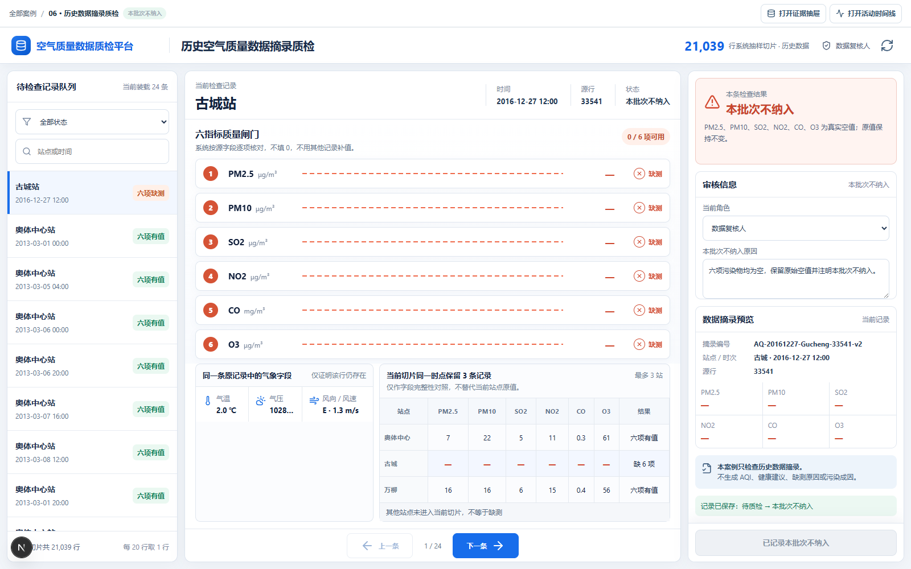
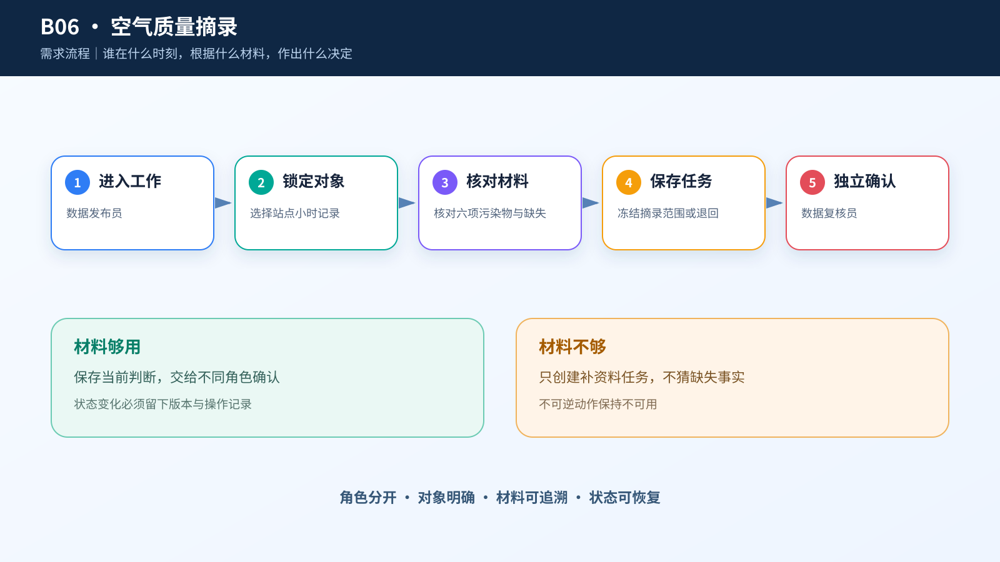
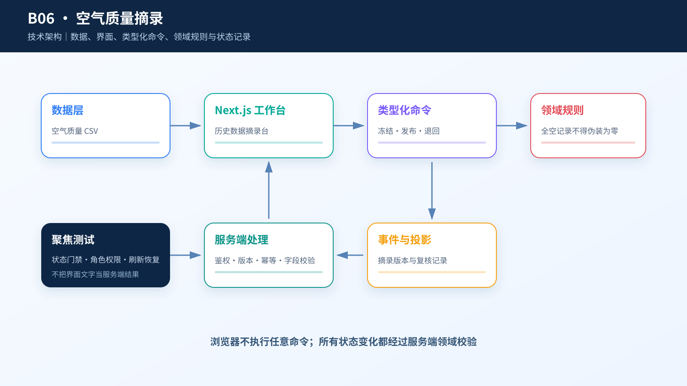

# 综合案例 B06　古城站 12:00 六项污染物全空：这条记录要不要纳入摘录？

## 需求

数据编辑准备整理一份 2016-12-27 12:00 的历史空气质量数据摘录。每条记录必须保留六项污染物原值。古城站这一行六项全空，编辑要决定把它锁定进摘录，还是注明原因后从本批次排除。

## 问题

这行仍有气温、气压、风向和风速，因此不是整行损坏；但气象值不能补出污染物。其他站点同一时点有读数，也不能替代古城站的原始空值。

## 逻辑思维方法论：从全空行到摘录排除的子集判断

本案例的方法论链条如下：

1. **全集/子集辨析**：21,039 行是全集，12 个站点是子集，古城站 `No=33541` 六项全空是子集现象。任一时点最多只有 3 个站点，没有"同一小时 12 站全市快照"——全集的聚合指标（1,998 行至少缺一项）可能掩盖子集差异（古城站全空）。必须能下钻到单站单时点，不能用全集的完整率代表每个站点。

2. **量词严谨性**：任一时点最多只有 3 个站点有记录——"最多 3 个站点"只在已采集的范围内成立，不能反向推广为"同一小时 12 站全市快照"。古城站全空不代表 12 站都全空，万柳记录完整也不代表古城站正常——每个站点每个时点独立判定，不能从子集推全集，也不能从全集的完整率代表每个站点。

3. **逻辑一致性**：古城站这一行仍有气温 2℃、气压 1028.4 hPa、风向 E、风速 1.3 m/s——但气象值不能补出污染物。气象字段和污染物字段是不同测量对象，气象值齐全不等于污染物齐全，不能用气象值插补污染物的空值。其他站点同一时点有读数，也不能替代古城站的原始空值——"当前切片同一时点记录"仅供核对抽样内容，不用于插补。

## 数据

本地保留 UCI Beijing Multi-Site Air Quality 的完整派生 Parquet；页面读取每 20 行固定抽取 1 行得到的课程切片：21,039 行、12 个站点、8,766 个抽样时点。任一时点最多只有 3 个站点，没有“同一小时 12 站全市快照”。

切片中有 1,998 行至少缺一项污染物，共 3,730 个空单元格。古城站 `No=33541` 在 2016-12-27 12:00 的 PM2.5、PM10、SO2、NO2、CO 和 O3 全部为空；气温 2℃、气压 1028.4 hPa、风向 E、风速 1.3 m/s 仍然保留。

数据不能说明缺测原因、仪器是否故障、污染来源、AQI、健康建议或官方发布结论。页面处理的是历史数据摘录，不是实时监测。

## 解决方案







中央六道质量闸门逐项显示污染物原值、单位和“有值/缺测”。气象字段放在次级区域，避免被误解为补值来源。下方只列当前切片在同一时点实际保留下来的另外两条记录，并明确“仅供核对抽样内容，不用于插补”。

字段完整的记录可以锁定成一条数据摘录，再由另一名复核人确认；缺任一污染物时，只能填写原因并标记“本批次不纳入”。源记录永远不被修改，空值也不会变成 0。

## CodeBuddy Prompt

```text
请实现案例 B06 的“历史空气质量数据摘录质检”。

只读取 dataset/06-beijing-air-quality-audit/case.csv。按 station、No 和 observed_at 定位记录；空值显示为“缺测”，不能填 0。按 observed_at 查到的其他记录称为“当前切片同一时点记录”，不能称为邻站或全市快照。

首屏用六道质量闸门显示 PM2.5、PM10、SO2、NO2、CO 和 O3。保留温度、气压、风向、风速和降雨，但不解释污染原因。不使用地图、AQI、健康建议、实时监测或官方发布措辞。

六项完整时才能“锁定数据摘录”，另一名复核人确认后才纳入；缺项时选择“本批次不纳入”，并保存站点、时次、源行、具体缺项和原因。

检查记录选择、双人复核、刷新恢复和键盘操作。
```

## 演示

1. 打开古城站 `No=33541`，逐项核对六道质量闸门。
2. 查看气象字段，确认记录仍在，但六项污染物都缺测。
3. 展开同一抽样时点的另外两条记录，确认它们不能用于补值。
4. 填写排除原因，将古城记录标记为“本批次不纳入”。
5. 恢复案例，选择同一时点字段完整的万柳记录并锁定数据摘录。
6. 切换另一名复核人确认纳入，刷新后核对原值和处理记录。

**结果**：古城空值保持原样且不进入完整摘录；万柳记录保存六项原值后才允许第二人确认。


## 实现与排错

- 实现：[`code/cases/06-beijing-air-quality-audit`](../../code/cases/06-beijing-air-quality-audit/)。
- 聚焦测试：[`case-06-air-quality-release.test.tsx`](../../code/app/tests/case-06-air-quality-release.test.tsx)。
- 排查：若六项污染物全空的行仍被纳入摘录，检查空值解析和发布状态判断，不要把空字符串或缺测值转成 0。

---
