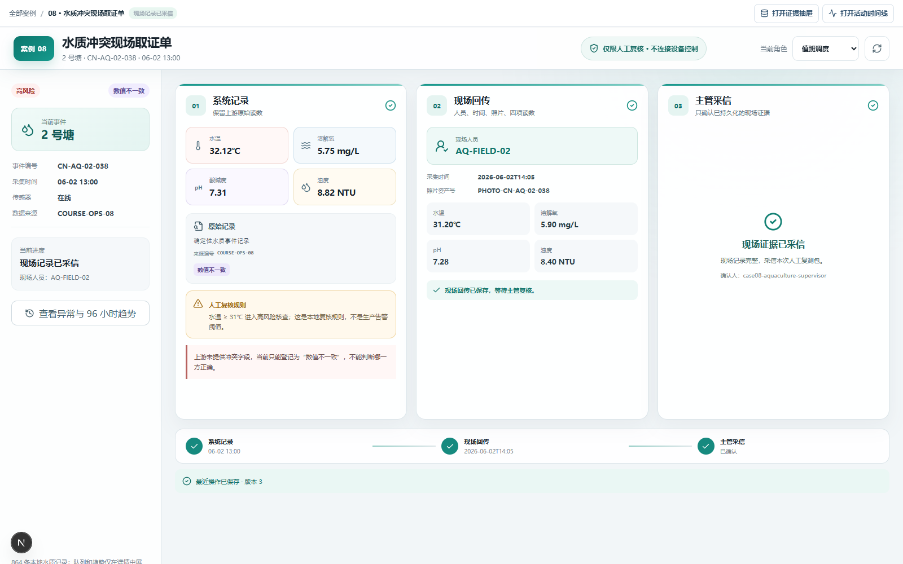
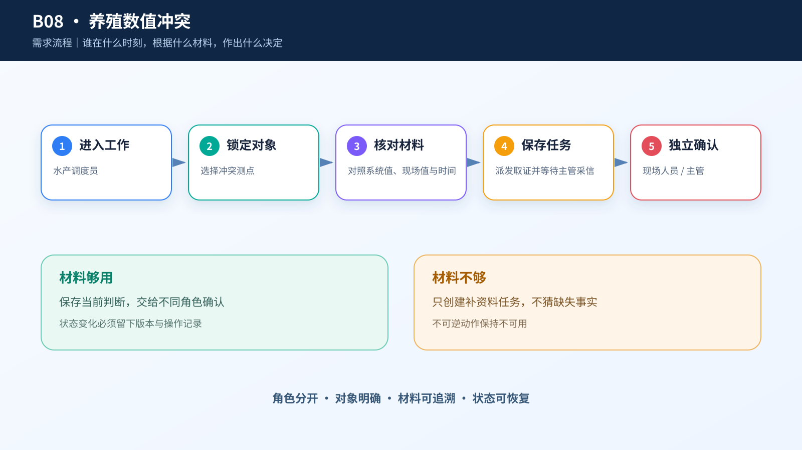
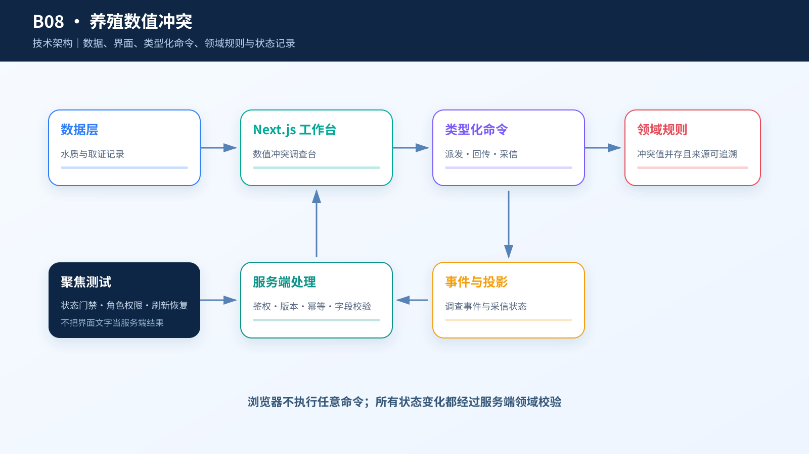

# 综合案例 B08　数值冲突：谁取证，谁采信？

## 需求

养殖现场出现传感器与人工复测冲突时，值班人员要看清来源、时间和校准状态，再决定补采、复测或人工处置。

## 问题

事件 `CN-AQ-02-038` 的传感器在线，四项读数齐全，上游却把证据状态标为“数值冲突”。系统没有提供冲突字段和另一组数值，办公室人员不能凭猜测消除冲突。

可执行流程只有三步：调度员派发，现场人员回传照片和四项复测值，另一名主管决定是否采信。任何一步缺失都只能等待证据。

## 数据

`case.csv` 有 864 条确定性记录，覆盖 9 个区域、每区 96 个小时；高风险 181 条、设备离线 16 条、来源缺失 10 条、数值冲突 12 条，异常并集 38 条。

代表事件位于 `CN-POND-02`，时间是 2026-06-02 13:00：水温 32.12℃、溶氧 5.75 mg/L、pH 7.31、浊度 8.82 NTU，风险为高，只允许人工复核。数据没有经纬度、基地、巡检队、预计到达时间、鱼类健康、投药记录或设备控制回执，页面不得补造。

## 解决方案







页面按三栏展开同一份取证单：系统记录、现场回传、主管采信。开始时只有第一栏有值；派发后第二栏解锁，现场人员填写身份、采集时间、照片资产号和四项读数；提交后第三栏才允许主管填写采信说明。96 小时四测点趋势放在事件详情抽屉，不占据主流程首屏。

```text
现场调度：派发现场取证 → 现场取证中
现场人员：提交现场回传 → 待主管采信
业务主管：采信现场记录 → 现场记录已采信
现场调度：暂缓等待证据 → 等待现场证据 → 可重新派发
```

## CodeBuddy Prompt

```text
请实现案例 B08 的养殖塘事件响应台。

只使用 case.csv 中的 event_id、event_time、region_id、四项读数、sensor_status、evidence_status 和 risk_level。内部值 value_conflict 在界面写成“数值冲突”。不要生成地图、坐标、基地、队伍、ETA 或冲突对端值。

页面分为系统记录、现场回传、主管采信三栏。调度员指定现场人员；该人员提交照片资产号和四项复测值；另一名主管决定采信哪组记录。资料不足时进入等待状态，之后可以重新派发。

主界面没有设备控制。阶段切换动效只提示任务已解锁，不模拟现场操作。
```

## 演示

1. 打开 `08-CN-AQ-02-038-CN-POND-02`，核对系统记录和“数值冲突”。
2. 以调度员身份指定现场人员 `AQ-FIELD-02`，说明需要回传的五类证据并派发。
3. 切换现场人员，填写采集时间、照片资产号和四项复测值，提交回传。
4. 尝试让同一现场人员采信，确认系统拒绝；切换另一名主管后填写说明并采信。
5. 恢复案例，选择“暂缓等待证据”，再从等待状态重新派发。

**结果**：三次动作留下三个身份和三段回执。系统不判断水质根因，也不控制现场设备。


## 实现与排错

- 实现：[`code/cases/08-aquaculture-event-response`](../../code/cases/08-aquaculture-event-response/)。
- 聚焦测试：[`case-08-aquaculture-domain.test.tsx`](../../code/app/tests/case-08-aquaculture-domain.test.tsx)。
- 排查：若冲突数值被直接覆盖，检查采集时间、来源优先级和人工采信记录；原始读数必须并存，不能只保留最后一个值。

---
