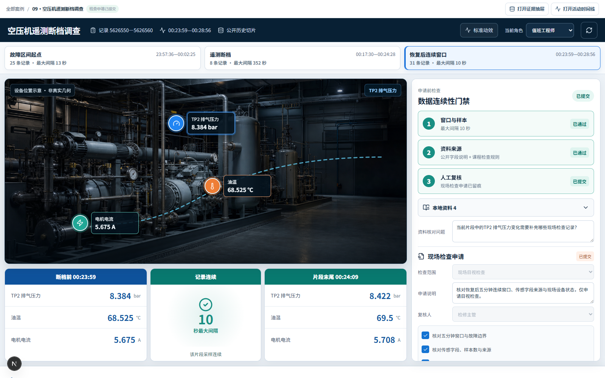
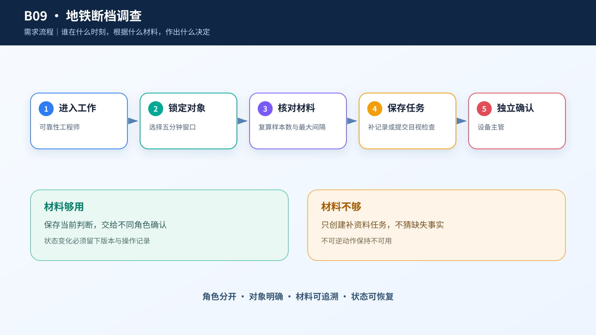
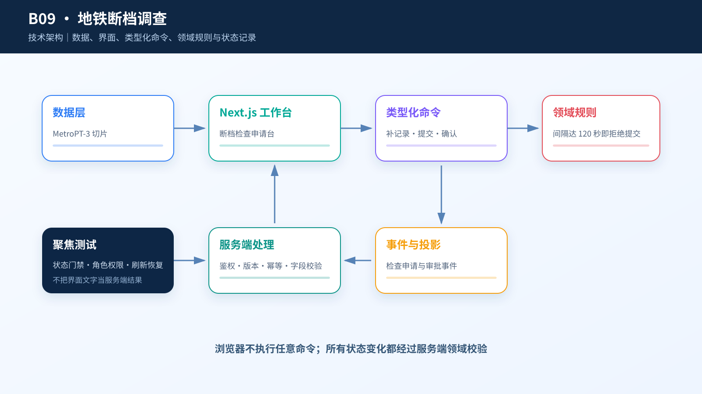

# 综合案例 B09　352 秒没有记录：现在能不能提交检查申请？

## 需求

地铁设备调查必须把事件、检修记录和引用材料对齐；存在 352 秒空窗或权限缺口时，只能补取资料或转人工。

## 问题

空压机遥测在 00:18:07 后突然消失，直到 00:23:59 才恢复。TP2 从 -0.018 变成 8.384 bar，油温从 49.45 变成 68.525℃，电机电流从 0.04 变成 5.675 A。问题不在于“哪个值异常”，而在于最关键的 352 秒变化过程没有记录。

这套产品先检查数据连续性，再核对本地资料。断档窗口只能请求补记录；选择恢复后的连续窗口，工程师核对资料后，另一名主管才可以提交现场目视检查申请。

## 数据

`case.csv` 是 UCI MetroPT-3 的 4,090 条固定历史切片。页面准备三个片段：故障区间起点、包含 352 秒空白的断档窗口、恢复后的连续窗口。服务端根据所选片段内相邻时间戳重新计算最大间隔，不相信浏览器上传的“已通过”标记。

`knowledge.jsonl` 有 4 条本地资料：来源事实、字段说明、课程检查程序和人工审批边界。它们只参加确定性本地排序，没有模型往返、MCP 或 A2A 网络请求。公开数据没有线路、站点、资产号、真实设备几何、报警阈值、诊断和维修结果。

## 解决方案







左侧设备示意只标出 TP2、油温、电机电流三个测点，并明确“非真实几何”。下方把断档前、352 秒空白、恢复后三段并排。右侧是三道门禁：窗口与样本、资料来源、人工复核。断档片段的申请表单保持锁定；选择恢复后的连续片段并完成资料核对后，表单才解锁。

```text
现场工程：核对本地资料 → 资料已核对
现场工程：请求补充设备记录 → 等待设备记录 → 可重新核对
业务主管：提交现场目视检查申请 → 检查申请已提交
```

## CodeBuddy Prompt

```text
请实现案例 B09 的地铁空压机检索辅助排查台。

读取 case.csv 和 knowledge.jsonl。主对象是 investigation_id。提供三个真实时间片段，并按 timestamp 计算样本数和最大相邻间隔；断档窗口必须得到 352 秒。

按选定设计实现空压机示意、三个测点、断档前/空白/恢复后三联和右侧三道门禁。设备图必须标注“非真实几何”。点击测点只改变信息连线和读数焦点，不模拟设备控制。

检索只排序四条本地资料。提交检查申请前，服务端重新检查所选窗口：少于 3 条记录或最大间隔达到 120 秒时拒绝。申请类型只允许“现场目视检查”，由另一名主管确认；资料不足时保存补记录请求。禁止输出故障诊断、停机、维修或控制命令。
```

## 演示

1. 选择“遥测断档”片段，核对 00:18:07、00:23:59 和三组前后值。
2. 查看第一道门禁失败和锁定表单，点击“请求补充设备记录”。
3. 恢复案例，选择“恢复后连续窗口”，点击三个测点观察读数联动。
4. 以工程师身份核对本地资料；切换另一名主管，完成三项检查并提交现场目视检查申请。
5. 刷新页面，确认状态和回执保留。

**结果**：断档片段永远不能越过服务端连续性门禁；连续片段只生成一份人工检查申请，不生成诊断或设备动作。


## 实现与排错

- 实现：[`code/cases/09-metro-agentic-rag`](../../code/cases/09-metro-agentic-rag/)。
- 聚焦测试：[`case-09-metro-rag-domain.test.tsx`](../../code/app/tests/case-09-metro-rag-domain.test.tsx)。
- 排查：若 352 秒空窗被页面补成正常记录，检查检索空结果的处理；缺少记录应显示为待补数据，不能插值成事实。

---
