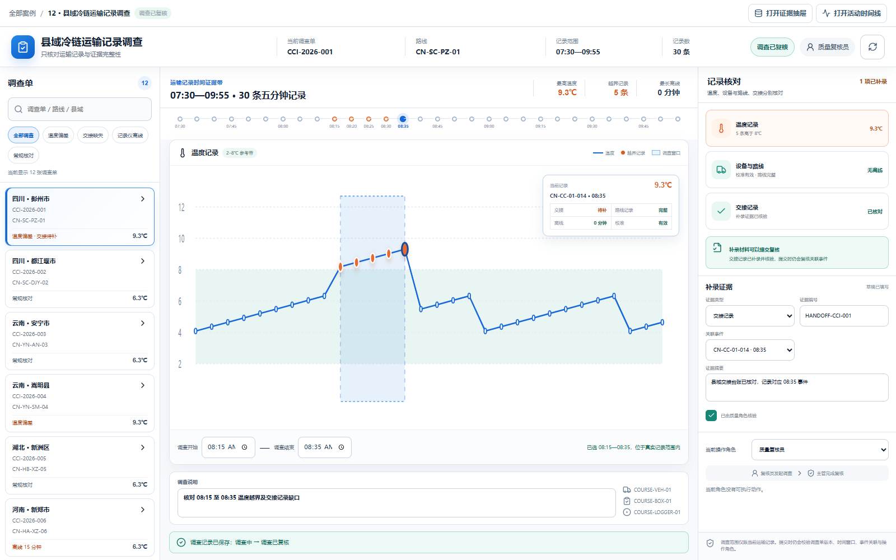
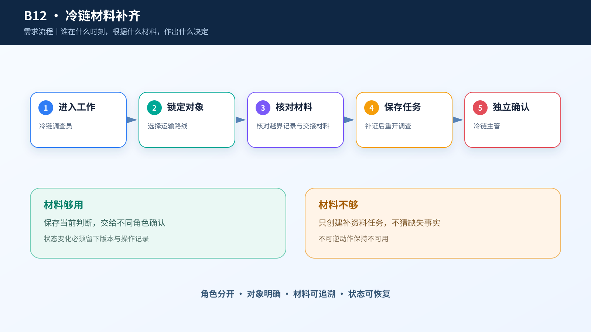
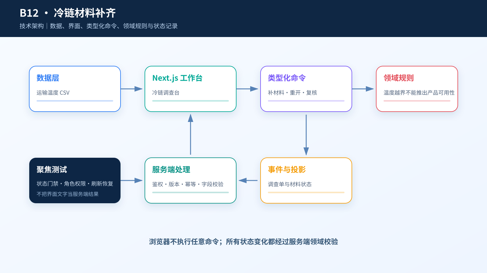

# 综合案例 B12　30 条运输记录里有 5 次越界，缺的交接材料怎么补？

## 需求

冷链运营要把温度越界与交接材料逐一对应，先形成调查单和补证清单，不能自动判定疫苗是否可用。

## 问题

四川彭州的一条县域冷链路线共有 30 条五分钟记录，其中 5 条高于 8℃，最高 9.3℃；同一调查单又缺少交接记录。此时可以确认“运输记录需要调查”，却不能确认箱内装了什么，更不能判断任何产品是否可用。

调查人员需要把温度变化、交接、路线记录、校准和离线情况放在同一时间带上，先确定调查窗口，再补齐能够核对的材料。

## 数据

`case.csv` 有 12 个匿名调查单，每单 30 条记录，共 360 条。20 条记录高于 8℃，60 条缺交接记录，60 条缺路线记录，60 条校准过期，6 条存在离线时长。车辆、保温箱和记录仪使用 `COURSE-` 编号；路线、时间和运营记录为确定性合成。

公开热性能数据只提供温度形态参考。课程数据没有个人信息、真实产品、真实批次、装箱清单或地理坐标，所有记录都禁止直接作产品可用性判断。

## 解决方案







左侧按越界、交接、路线、校准和离线问题筛选调查单。中间把 30 个五分钟事件排成时间带，并在同一屏展示温度曲线和可拖动的调查窗口；点击任意事件，立即看到该时刻的温度、交接、路线、校准和离线记录。右侧列出缺口，要求补录材料编号、关联事件、摘要和核验状态。

```text
调查员：选择有效时间窗并说明原因 → 调查中
业务主管：材料不足 → 等待补证
业务主管：材料已补齐并核验 → 调查已复核
```

完成调查只表示记录已经复核，不表示产品可以使用或放行。

## CodeBuddy Prompt

```text
请实现案例 B12 的县域冷链运输记录调查台。

读取 dataset/12-vaccine-cold-chain/case.csv，以 investigation_id + route_id 聚合一条路线的 30 个事件。左侧提供问题筛选和调查单搜索；中间按 event_time 绘制事件带、温度曲线和调查窗口；右侧逐项显示 handoff_status、route_record_status、calibration_status、offline_minutes 和 sample_completeness。

启动调查时必须提交覆盖代表事件的有效起止时间和说明。存在材料缺口时，质量人员补充材料类型、编号、关联事件、摘要并确认；资料仍不齐时状态保持“等待补证”。服务端重新验证时间窗、角色和补录字段。

不要生成地图坐标、产品名称、真实批次或可用性结论。测试无效时间窗、未覆盖代表事件、缺材料、未核验、等待补证后重开、主管复核和刷新恢复。
```

## 演示

1. 搜索 `CCI-2026-001`，选择 08:35、9.3℃ 的记录，查看越过 8℃ 的五个点。
2. 缩小调查窗口，使它不再覆盖代表事件，观察“启动运输记录调查”保持不可用；恢复有效窗口并启动调查。
3. 切换主管，查看交接材料缺口；填写材料编号、关联事件和摘要，勾选质量角色已核验。
4. 完成调查复核并刷新页面，确认调查单、窗口和操作记录保留。

**结果**：30 条记录被还原成一条可以点击、筛选和复核的时间线；系统回答“缺什么、补到哪条记录”，但不越权回答产品能否使用。


## 实现与排错

- 实现：[`code/cases/12-vaccine-cold-chain`](../../code/cases/12-vaccine-cold-chain/)。
- 聚焦测试：[`case-12-cold-chain-domain.test.tsx`](../../code/app/tests/case-12-cold-chain-domain.test.tsx)。
- 排查：若温度曲线穿过缺测时段连续连线，检查缺失点是否保留为 null，并核对交接材料是否关联到具体越界记录。

---
