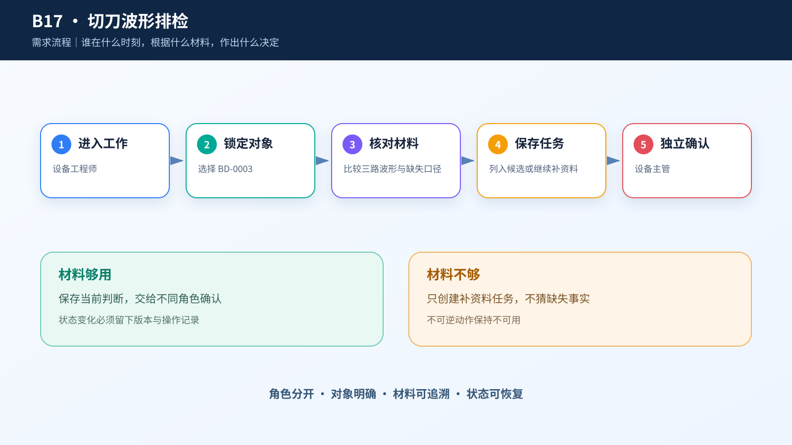
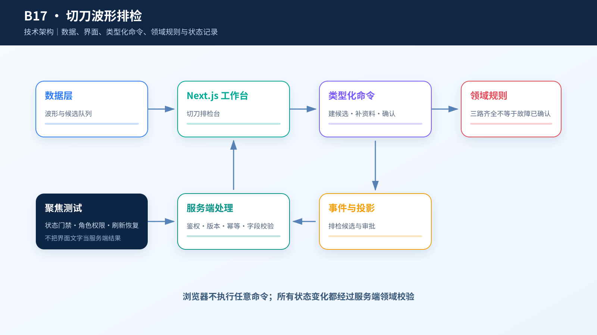

# 综合案例 B17　BD-0003 三路波形都在：要不要列入排检候选？

## 需求

包装线要从振动、负载和切割质量变化中识别检修候选，保留人工复核，不自动停机或更换部件。

## 问题

包装设备会话 `BD-0003` 的健康偏差指数是 3.856，高于课程规则线 3.775，主导变化信号是“切刀转矩均值”。这足以进入人工复核，却不能说明刀具已经损坏。维护计划员要在三路同步波形中固定一个游标和一个样本窗口，再决定是否保存为排检候选。

## 数据

`case.csv` 有 519 个会话摘要，记录三路信号的均值、标准差、均方根、绝对峰值，以及规则线和复核等级。BD-0003 的源会话有 2,048 个样本；为了让运行结果稳定，本地 `waveform.csv` 为 `BD-0001` 到 `BD-0008` 各保留 256 个连续点，共 2,048 行。

BD-0003 的切刀转矩均值为 -0.0215，切刀跟随误差均值接近 0，薄膜跟随误差均值为 0.8211。来源没有提供这些信号的工程单位，也没有可用于排班的绝对时间、刀具寿命、产品质量、停机代价和换刀记录，因此页面保留原始量纲，不能从曲线直接推断故障或排检时段。

## 解决方案






左侧只列本地确实有 256 点波形的 8 个会话；中间以三路同步波形为主画布，共用一个游标和一个样本窗口。右侧只显示当前角色要完成的表单。设备图只是环境示意，不标传感器位置。

```text
维护计划员：保存排检候选 → 排检候选待确认
维护主管：确认排检候选 → 排检候选已确认
维护计划员：继续采样观察 → 继续观察
```

## CodeBuddy Prompt

```text
请实现案例 B17 的包装切刀波形复核台。

读取 dataset/17-cutter-health-review/case.csv，默认选择 BD-0003。再读取 waveform.csv，只筛选当前 session_id，并按 sample_index 排序；三条曲线分别绑定 cutter_motor_torque、cutter_follow_error、film_follow_error。

摘要中的 2,048 个源样本与本地 256 点波形切片要分开说明。只有 BD-0001 至 BD-0008 开放波形操作；其他会话只显示摘要，不能进入候选。保存排检候选时记录三路同步游标、检查窗口、计划员和说明；选择继续观察时填写追加样本数与理由。不得生成绝对采样时间、刀具寿命、停机、换刀或产品质量结论。
```

## 演示

**操作**：打开案例 B17，选择 `BD-0003`，把共享游标移到样本 128，再把检查窗口设为 96—160；对照健康偏差 3.856、规则线 3.775 和游标处三路原始值，填写计划员、排检方向和说明后保存候选，再由另一名维护主管确认。若选择继续观察，需要填写追加样本数和理由。

**结果**：提交后为“排检候选待确认 · v1”，主管确认后为“排检候选已确认 · v2”。只有本地波形确实存在的会话才能进入候选核对。


## 实现与排错

- 实现：[`code/cases/17-cutter-health-review`](../../code/cases/17-cutter-health-review/)。
- 聚焦测试：[`case-17-cutter-review-domain.test.tsx`](../../code/app/tests/case-17-cutter-review-domain.test.tsx)。
- 排查：若 BD-0003 不能进入排检候选，检查三路波形覆盖和同一测量窗口；候选成立后仍需另一角色复核。

---
