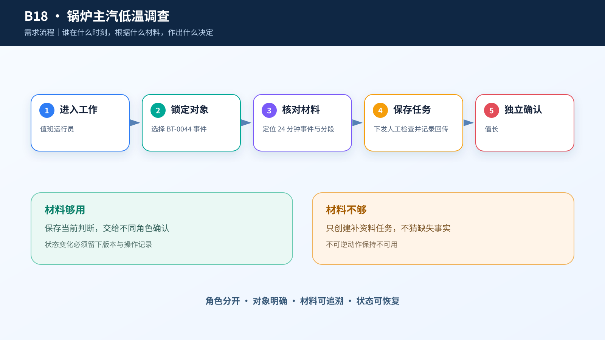

# 综合案例 B18　BT-0044 主汽低温持续 24 分钟：先查哪一段？

## 需求

运行人员要沿锅炉工艺路径核对温度、流量和负荷变化，形成可追溯的运行复核单，不把课程阈值当成厂方控制限。

## 问题

2022-03-29 17:22:39，主汽出口温度跌到公开来源区间 530℃ 以下，17:46:59 事件结束，共持续 24 分 25 秒。事件内有 293 个原始采样点；对应的分钟窗口为 17:22 至 17:46，共 25 行。运行人员现在只能看到出口温度，不能凭一条曲线判断阀门、过热器或测点故障。

要做的不是“自动诊断”，而是把一个检查问题说清楚：先查哪一段，需要补哪组过程记录，由谁到现场核对。

## 数据

- `events.csv`：93 个按公开来源区间派生的温度事件。`BT-0044` 的最低温度为 526.63℃，事件内 293 个原始采样点完整。
- `case.csv`：7,201 个分钟汇总。`BT-0044` 对应 25 个连续分钟点，最后一分钟均值为 529.846℃。
- `imputation-points.csv`：30 条一级减温水流量补点，只能说明流量数据曾被补点，不能画进温度曲线。

530—545℃ 是源数据给出的参考区间，不是本案例掌握的厂方控制限。数据中没有真实阀位、减温水流量、过热器分段温度、压力或负荷。

## 解决方案





页面左侧列事件，中间把出口测点放回锅炉场景，并只画 `BT-0044` 的 25 个分钟点；阀位、流量和分段温度统一显示“未接入”。右侧只保留一次检查选择：出口测温链路、末级过热器出口段或减温水调节段。运行工程师提交后，检查段和资料清单被冻结，再由运行主管确认。

```text
锅炉运行工程师：提交当班排查 → 当班排查中
运行主管：确认优先检查段 → 检查已下发
运行主管：阻断自动调节 → 自动调节已阻断
```

## CodeBuddy Prompt

```text
实现“BT-0044 主汽低温事件核查台”，使用 React 19 与 Next.js 16。

从 events.csv 读取 BT-0044，以 event_id 作为业务对象；从 case.csv 精确筛选 2022-03-29 17:22 至 17:46 的 25 个连续分钟点。趋势只绑定 steam_temperature_mean，事件卡显示 start_time、end_time、duration_seconds、minimum_temperature 和 source_samples。

页面分为事件队列、锅炉场景、25 分钟趋势和检查单。锅炉场景只标主汽出口实测值；减温水阀位、减温水流量和过热器分段温度显示“未接入”，不得生成数值。530℃ 只标成“来源区间下界”，不能写成控制限。

当班检查单保存事件编号、精确分钟窗口、检查段、负责人、说明、已有资料和至少一项待补来源。运行主管只能确认原检查段，或在控制条件不明时阻断自动调节。
```

## 演示

**操作**：打开案例 B18，核对事件时段、293 个事件采样和 25 个分钟点；选择一个优先检查段，至少勾选一项待补资料，填写负责人和排查说明后提交。切换到运行主管，填写意见并确认原检查段。也可在首次提交前直接阻断自动调节。

**结果**：提交后为“当班排查中 · v1”，主管确认后为“检查已下发 · v2”。重新打开页面，事件、窗口、检查段和资料清单保持不变；页面始终不显示数据中不存在的过程数值。


## 实现与排错

- 实现：[`code/cases/18-boiler-temperature-review`](../../code/cases/18-boiler-temperature-review/)。
- 聚焦测试：[`case-18-event-contract.test.ts`](../../code/app/tests/case-18-event-contract.test.ts)。
- 排查：若 24 分钟低温被自动解释成设备故障，检查事件规则是否只生成分段核查任务；缺少操作记录时不得给出原因结论。

---
