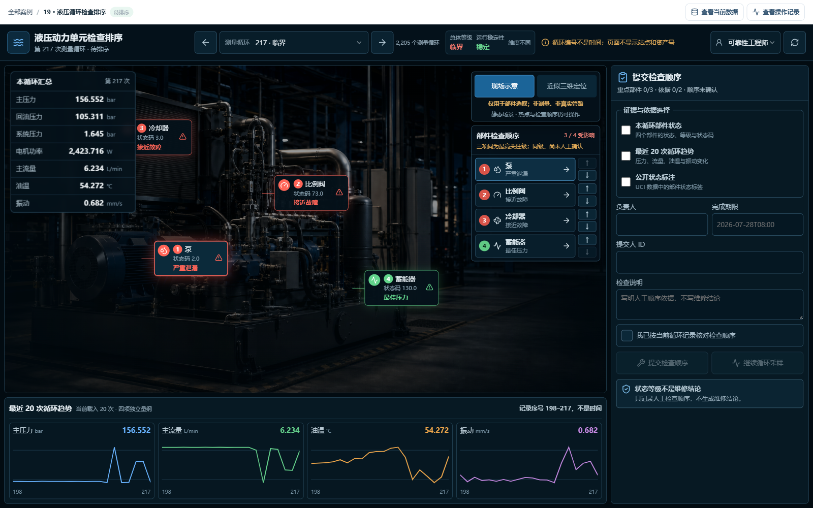

# 综合案例 B19　第 217 次测量循环：三项同级，谁先查？

## 需求

检修人员要根据压力、流量、温度和部件状态给设备排查排序；系统只负责分流复核，不自动执行维护动作。

## 问题

第 217 次测量循环里，泵、冷却器和比例阀都处于最高关注级，蓄能器正常。数据没有给三个重点部件排先后，可靠性工程师必须结合本循环读数和最近 20 次变化，亲自确定先查哪一项。

## 逻辑思维方法论：从三项同级到检查顺序的人工确认

本案例的方法论链条如下：

1. **同一律**：液压动力单元、压力、部件状态——这些概念在产品、工程、数据中含义必须一致。"状态等级"在数据里是"排序依据"，在业务里是"维修结论"，混用就是偷换概念。`cycle_id` 只是测量顺序，不是时间戳，也不是液压站编号；"临界"描述部件状态，"稳定"描述当次循环是否稳定，两者不能混为一谈。

2. **相关性≠因果**：压力、流量、温度与部件状态可能共变，但可能是：部件故障导致读数异常、读数异常导致部件被标级、第三方因素（负载/油液）同时影响两者。排序先后≠故障先后——三个"严重"项同级，数组顺序不是风险排名。

3. **量词严谨性**：第 217 次循环中泵、冷却器、比例阀三项同级严重——这是针对"第 217 次循环"的存在命题（∃），不能推广为"所有循环中这三项都最严重"（∀）。三项同级意味着数组顺序不是风险排名，蓄能器正常也不意味着整台设备健康；每项独立判定，不能一刀切。

4. **归纳例外预警**：2,205 个循环中"三项同级值得优先检查"是归纳结论——归纳结论是或然的，不是必然的，"同级严重但实际正常"的循环就是它的例外。系统保留"继续循环采样"作为降级路径：当遇到反例循环时，排序结论必须降级为"待观察"，而不是强行维持原结论——或然性降级是归纳结论的内在约束。

5. **证伪思维**：三项同级严重，但"同级"不等于"同因"——泵、冷却器、比例阀的严重可能各有原因。检查排序的验收不是"证明哪项有问题"，而是"同级严重但实际正常"的循环存在时，排序结论必须降级——证伪优先于证实，找反例比找正例更能约束结论。

## 数据

数据来自 UCI 液压系统状态监测，共 2,205 个测量循环。每行保存主压力、回油压力、系统压力、电机功率、主流量、油箱温度、系统振动 7 项循环均值，以及 4 个部件的状态。第 217 次循环总体为“临界”，运行稳定性仍是“稳定”：前者描述部件状态，后者描述当次循环是否稳定。

`cycle_id` 只是测量顺序，不是时间戳，也不是液压站编号。数据没有站点、资产号、维修史、工单和检查结果，因此状态等级只能用于排序，不能直接变成维修结论。

## 解决方案




页面把 7 项本循环读数、4 个部件状态、人工检查顺序和最近 20 次记录放在同一屏。三个重点部件明确标为“同级、尚未人工确认”，避免把数组顺序误当成风险排名。默认画面是通用设备语境示意；用户主动打开“近似三维定位”时才加载三维部件，只用于选择，不表示真实管路、测点或数字孪生。

```text
可靠性工程师：提交检查顺序 → 检查顺序待确认
业务主管：确认检查顺序 → 检查顺序已确认
可靠性工程师：继续循环采样 → 继续采样
```

## CodeBuddy Prompt

```text
请实现案例 B19 的液压动力单元检查排序台。

读取 dataset/19-hydraulic-condition/case.csv，默认选择 cycle_id=217，并显示 cycle_id=198..217。顶部绑定 main_pressure_mean、return_pressure_mean、system_pressure_mean、motor_power_mean、main_flow_mean、tank_temperature_mean、system_vibration_mean；横轴写“记录序列”，不能写时间。

四个部件直接读取泵、冷却器、阀和蓄能器的状态、等级与描述。三个“严重”项同级，初始顺序写“尚未人工确认”，不得生成风险分、站点、资产号、工单或维修结果。提交前核对全部重点部件，选择至少两项依据，确认顺序，并填写负责人、期限、提交人和说明；材料不足时继续采样。
```

## 演示

**操作**：打开第 217 次循环，核对 7 项读数和 4 个部件；点击场景热点，调整检查顺序，选择至少两项依据，填写负责人、期限、提交人和说明后提交。切换到另一名维护主管，确认同一顺序。

**结果**：提交后为“检查顺序待确认 · v1”，主管确认后为“检查顺序已确认 · v2”。系统只保存检查顺序；故障部件仍要靠现场检查确定。


## 实现与排错

- 实现：[`code/cases/19-hydraulic-condition`](../../code/cases/19-hydraulic-condition/)。
- 聚焦测试：[`case-19-hydraulic-condition.test.tsx`](../../code/app/tests/case-19-hydraulic-condition.test.tsx)。
- 排查：若三项同级指标的顺序反复变化，检查固定次序和测量循环编号；排序只决定先查什么，不得改写健康结论。

---
