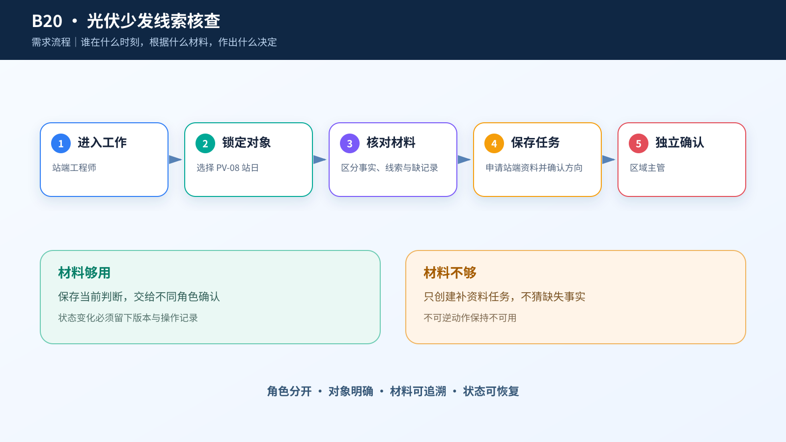
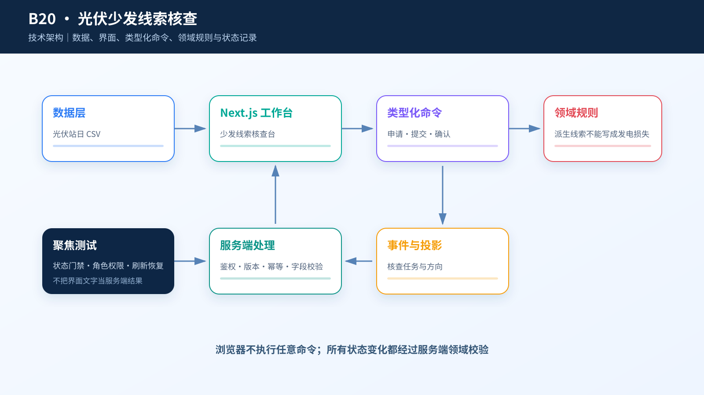

# 综合案例 B20　PV-08 在 2020-05-19 出现少发线索：站端先查什么？

## 需求

运行团队要把少发拆成可核对的候选原因，明确需要补取的调度、告警和检修记录，不自动改变电站控制设定。

## 问题

2020-05-19，PV-08 的 96 条记录聚合成一个站日：装机容量 30 MW，平均辐照度 331.79 W/m²，平均气温 21.61℃，平均功率 3.67 MW。归一化出力比为 0.362，疑似限电记录占比为 40.6%。这两项只是线索，性能工程师要先决定向站端补取哪类资料。

## 数据

`case.csv` 有 5,327 个唯一站日，覆盖 8 个匿名站点。完整的 8×731 日期矩阵缺 521 个站日；PV-03 在 2020-05-19 没有记录，PV-08 缺 2020-11-09 和 2020-11-10。页面遇到空值或缺日时必须留空并断开曲线，不能补成 0。

日期、记录数、辐照度、气温和功率由公开记录聚合。归一化出力比、温度降额和疑似限电占比来自上游派生字段的日均值，本地快照没有它们的计算公式。0.362 不是组件效率，40.6% 也不是发电损失。数据没有地理坐标、调度限电记录、逆变器告警和检修工单。

## 解决方案






页面按四段组织工作：站日事实、派生线索、缺少的站端记录、人工核查任务。三类缺失资料都显示“数据集未包含”，勾选表示“申请补取”，不是已经取得。底部三条独立日级曲线只画最近 14 个真实站日；页面不使用场景图、地图或三维，以免虚构站点位置和设备关系。

```text
性能工程师：提交站端核查 → 站端核查中
运维主管：确认核查方向 → 核查方向已确认
运维主管：登记禁止控制变更 → 禁止控制变更已登记
```

## CodeBuddy Prompt

```text
请实现案例 B20 的光伏站端记录核查台。

读取 dataset/20-pv-loss-attribution/case.csv，默认选择 station_id=8、date=2020-05-19。站点来自 stations.csv。只允许选择真实存在的 station_id+date；PV-03 当日禁用并显示“当日无数据”。趋势取当前站最近 14 个真实站日，空值和缺日断线，不得补 0，也不得生成小时曲线。

将源事实、上游派生线索和缺失资料分栏展示。核查方向初始为空，用户单选“温度影响、疑似限电、设备侧待核对”；调度限电、逆变器告警和站端检修三项都申请补取后才能提交。主管确认核查方向；若资料不足，只登记“禁止控制变更”，不声称站端控制已经改变。
```

## 演示

**操作**：打开 PV-08 的 2020-05-19，按“事实—线索—缺少记录—任务”从左到右核对；尝试切换 PV-03，确认当日不可选。回到 PV-08，选择一个暂定方向，申请三类资料，填写负责人、期限、提交人和说明后提交。刷新页面，再由另一名主管确认同一方向。

**结果**：提交后任务保留核查方向，主管确认后进入“核查方向已确认 · v2”。页面中的 40.6% 始终表示疑似记录占比，不会被写成发电损失比例。


## 实现与排错

- 实现：[`code/cases/20-pv-loss-attribution`](../../code/cases/20-pv-loss-attribution/)。
- 聚焦测试：[`case-20-pv-loss.test.tsx`](../../code/app/tests/case-20-pv-loss.test.tsx)。
- 排查：若 40.6% 被显示成发电损失率，检查字段标签和派生说明；它只能表示疑似记录占比，也不能触发任何站端控制命令。

---
