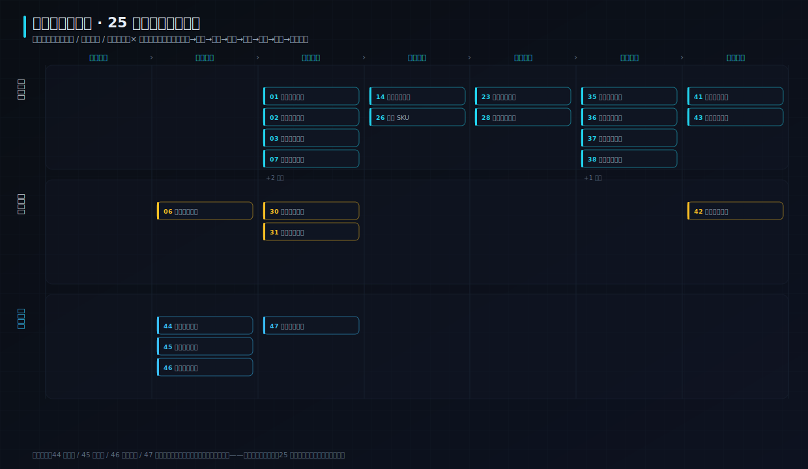

# 第二部分 · 案例演示与验证

## 数字化系统全景（先看这张图）

第一部分讲的理念、原理、规范、设计，不是散点——它们共同构成**一套数字化系统**。下面 9 个代表性案例，正是这套系统在不同环节、不同层的**实操演示**（每案标注它更偏哪个角色镜头）：

- **纵向三层**：`底座平台`（44 向量库·45 关系库·46 架构契约·51 SDD 建造·54 事件总线）→ `能力智能`（指标/检索/AI）→ `业务应用`（业务场景）。
- **横向数据价值闭环**：`采集 → 治理 → 洞察 → 决策 → 执行 → 验收 → 增长`，再反馈回采集。
- **怎么读**：先在全景里定位一个案例在「哪一层·哪一环节」，再进它看它把哪条理论落成了什么操作。

## 案例总览

| # | 场景 | 行业 | 角色镜头 | 演示原理 | 设计 | 链接 |
|---|---|---|---|---|---|---|
| 01 | 电商早会异常订单台 | 电商零售 | 产品/研发/项目 | 2.1/2.7 | graphite-hud | [打开](01-morning_ops_grid.md) |
| 02 | 大陆 P2P 信贷放款与信用画像运营 | P2P信贷 | 产品 | 2.7/8.3 | amber-funnel | [打开](02-p2p_credit.md) |
| 03 | 零售经营产品方案 | 零售经营 | 产品/研发/项目 | 2.7/3.1/4.1 | graphite-hud | [打开](03-retail_capstone_board.md) |
| 04 | 产品知识库语义检索 | 中文知识库 | 研发/产品 | 1.3/3.3 | emerald-flow | [打开](04-rag_knowledge_retrieval.md) |
| 05 | 北京空气质量大表·查询优化与复合索引 | 数据工程 | 研发 | 3.3/4.1 | steel-queue | [打开](05-postgres_relational_arch.md) |
| 06 | 后端子系统分解与接口契约（对照真实国产开源微服务·若依） | 系统架构 | 研发/项目 | 3.1/3.3 | cyan-matrix | [打开](06-system_arch_flow.md) |
| 07 | RAG 回答评测台 | AI 产品 | 产品/研发 | 2.3/1.3 | cyan-matrix | [打开](07-rag_eval_harness.md) |
| 08 | 规格驱动系统建造台 | 研发效能 / 架构 | 研发/项目/产品 | 3.0/2.3 | cyan-matrix | [打开](08-sdd_system_build.md) |
| 09 | 仓库事件总线·事件溯源（本仓库 dogfood + 大型国产开源项目 nacos 对照） | 软件工程 | 研发/项目 | 7.2/9.4/2.3 | emerald-flow | [打开](09-repo_event_bus.md) |

## 原理 → 案例 反查（哪个原理，被哪些案例演示）

> 读完第一部分某个原理，想看它怎么落地？按这张表直达（自动从各案 `demonstrates` 反转，只列被真实演示到的原理）。

| 原理 | 演示它的案例 |
|---|---|
| §1.3 | [案例 04](04-rag_knowledge_retrieval.md)、[案例 07](07-rag_eval_harness.md) |
| §2.1 | [案例 01](01-morning_ops_grid.md) |
| §2.3 | [案例 07](07-rag_eval_harness.md)、[案例 08](08-sdd_system_build.md)、[案例 09](09-repo_event_bus.md) |
| §2.7 | [案例 01](01-morning_ops_grid.md)、[案例 02](02-p2p_credit.md)、[案例 03](03-retail_capstone_board.md) |
| §3.0 | [案例 08](08-sdd_system_build.md) |
| §3.1 | [案例 03](03-retail_capstone_board.md)、[案例 06](06-system_arch_flow.md) |
| §3.3 | [案例 04](04-rag_knowledge_retrieval.md)、[案例 05](05-postgres_relational_arch.md)、[案例 06](06-system_arch_flow.md) |
| §4.1 | [案例 03](03-retail_capstone_board.md)、[案例 05](05-postgres_relational_arch.md) |
| §7.2 | [案例 09](09-repo_event_bus.md) |
| §8.3 | [案例 02](02-p2p_credit.md) |
| §9.4 | [案例 09](09-repo_event_bus.md) |
