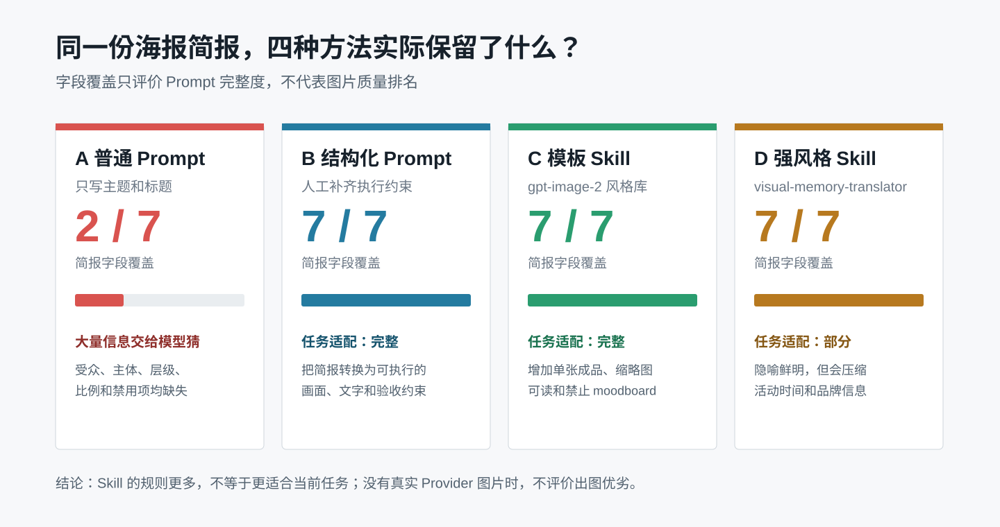

# Skill 实验 S05　没有 API Key，怎样做可展示的图像 Skill 测评？

## 需求

本案例选择两个公开的图像 Prompt Skill：一个擅长从风格库中选择海报模板，另一个擅长把文字转成带隐喻的编辑视觉。即使没有 OpenAI API Key或本地图片模型，也可以先回答一个能够现场展示、能够复跑的问题：

> 同一份海报简报，普通 Prompt、人工结构化 Prompt、模板 Skill 和强风格 Skill，分别把需求编译成了什么？

本案例测的是 **Prompt 编译质量和任务适配**，不是没有图片时猜测哪一组“出图最好”。这一区分让零 Key 实验仍然有真实证据，也避免把文字分析包装成图像实测。

## 固定输入

四组方法都读取同一份“雨天旧书店”活动简报。实验不允许为某一组临时增加信息。

| 简报字段 | 固定内容 |
|---|---|
| 主题 | 雨天旧书店 |
| 受众 | 下班后想慢下来的城市读者 |
| 标题 | 雨落下来，书页慢下来 |
| 辅助文字 | 躺进一页旧时光；周五 19:30 · 夜读与换书 |
| 必备文字 | SECOND PAGE BOOKS；入场免费 |
| 可见主体 | 雨线、暖黄橱窗、旧书脊、一盏灯 |
| 禁用项 | 人物大特写、高饱和多色渐变、密集商业促销标签 |
| 画布 | 1080 × 1440，3:4 竖版 |

原始输入保存在 [`rainy-bookstore-brief.json`](../../code/skills/poster-recipe/examples/rainy-bookstore-brief.json)，生成器只读该文件，并在结果中记录 SHA-256。

## 实验设计

```text
同一份简报
   ├─ A 普通 Prompt
   ├─ B 人工结构化 Prompt
   ├─ C 模板 Skill：poster-layout-system
   └─ D 强风格 Skill：editorial_text_card
          ↓
   保存四份完整 Prompt
          ↓
   检查字段覆盖、任务适配和来源
          ↓
   生成一张本地可编辑构图样张
          ↓
   有真实图片服务时，再进入同模型盲评
```

这里有意把实验拆成两道门：

1. **Prompt 门**：不需要 Key，现在就能完成；
2. **图片门**：必须拿到真实图片、参数和 Provider 回执后才能进入。

没有通过第二道门，不影响第一道门的结果成立，但不能填写图片质量分数。

## 四组真实 Prompt 结果

| 组 | 方法 | 七类简报字段覆盖 | 任务适配 | 实际增加的东西 |
|---|---|---:|---|---|
| A | 一句普通 Prompt | 2/7 | 基线 | 只有主题和标题，其他内容交给模型猜 |
| B | 人工结构化 Prompt | 7/7 | 完整 | 明确受众、逐字文字、主体、层级、比例和禁用项 |
| C | `gpt-image-2-style-library` | 7/7 | 完整 | 在 B 的约束上增加编辑式不对称版式、单一色彩锚点、缩略图可读和禁止 moodboard |
| D | `visual-memory-translator` | 7/7 | 部分 | 把“书页像屋檐承接雨线”固定为单一隐喻，并使用大留白、小画面的编辑卡片风格 |



七类字段指主题、受众、标题、辅助文字、必备文字、可见主体和禁用项。覆盖完整只表示 Prompt 没漏掉简报信息，不表示最后图片一定更美。

四份 Prompt 全文和机器可读结果保存在[对比记录](../../assets/skill-cases/S05/comparison/prompt-comparison.md)中。下面截取最能说明差异的部分：

```text
A：为“雨天旧书店”设计一张竖版活动海报，
   标题是“雨落下来，书页慢下来”。

C：3:4 竖版；采用编辑式不对称布局……
   标题、活动信息、品牌文字形成清楚的三级层级，
   至少保留约 30% 安静留白。不要输出 moodboard、宫格或设计过程。

D：只使用一个视觉隐喻：一张打开的旧书页像窄屋檐承接三条雨线……
   视觉隐喻占画面 15%–30%，其余为暖米白艺术纸留白。
```

## 可展示成果

下面这张图是课程自有 `poster-recipe` 根据同一简报生成的**本地可编辑 SVG 构图样张**。它用于展示信息层级、冷暖色锚和构图交接，不是 OpenAI 或其他图片模型的输出。


这张样张让案例在没有 Key 时仍能现场展示三件事：

- 标题与活动信息是否形成清楚层级；
- 冷雨和暖黄橱窗是否形成单一视觉锚点；
- 交付物是否可编辑，而不只是一段抽象审美描述。

它不能证明 C 或 D 的真实出图效果，也不能替代图片模型测评。页面底部保留 `NO IMAGE PROVIDER RECEIPT`，就是为了防止展示时误读。

## 结论

本轮可以据证据得出三个结论：

1. A 组漏掉五类简报信息，生成结果需要模型大量猜测；B、C、D 都保留了七类固定输入。
2. C 的价值不是“Prompt 更长”，而是补充了海报交付约束，例如单张成品、缩略图可读和禁止过程板。
3. D 的审美意图最鲜明，但原 Skill 面向编辑隐喻卡，活动时间和品牌信息不是它的第一目标，所以任务适配只能记为“部分”。Skill 风格越强，不代表越适合当前业务。

本轮不能得出“C 出图最好”或“D 最有高级感”。这些判断需要真实图片后再做。

## 课堂展示方法

一次 5 分钟展示可以按下面顺序进行：

1. 先展示固定简报，说明四组不能偷偷换题；
2. 展示 2/7 与 7/7 对比，让观众找到 A 组漏掉的信息；
3. 对照 C 和 D，提问“规则更多”和“任务更合适”是不是同一件事；
4. 展示本地 SVG，明确它是构图样张，不是 AI 出图；
5. 最后揭示证据边界：当前能评价 Prompt，不能评价不存在的图片。

这个展示本身就是 Skill 工程案例：Skill 的价值不只在生成内容，还在固定输入、保存中间产物、声明边界和留下复验入口。

## 将来怎样补真实图片

不需要先开发 API 程序。只要以后能使用任意一个带图片生成能力的产品界面，就可以手工完成第二阶段：

1. 只选一个产品、一个模型和一个尺寸；
2. 依次粘贴 A、B、C、D 四份完整 Prompt，每组生成相同张数；
3. 保存原图、生成时间和界面中可见的模型信息，不后期修图；
4. 匿名打乱图片后，再评文字准确、约束符合、信息层级、构图留白、风格一致和主题表达；
5. 如果不能固定模型或参数，就标为“展示性复验”，不包装成严格横向实验。

使用消费级产品界面时通常不需要 API Key，但可能需要对应产品账号或图片额度。只有希望脚本自动批量生成、保存请求 ID 时，才需要配置该服务的 API Key。

## 运行与证据

在仓库根目录运行：

```bash
python3 -B code/skills/poster-recipe/scripts/build_prompt_comparison.py \
  --input code/skills/poster-recipe/examples/rainy-bookstore-brief.json \
  --allowed-root code/skills/poster-recipe/examples \
  --output-dir assets/skill-cases/S05/comparison

python3 -B code/skills/poster-recipe/scripts/build_poster.py \
  --input code/skills/poster-recipe/examples/rainy-bookstore-brief.json \
  --allowed-root code/skills/poster-recipe/examples \
  --recipe-output assets/skill-cases/S05/poster-recipes.json \
  --svg-output assets/skill-cases/S05/poster.svg
```

主要证据：

- [四组 Prompt 与结论边界](../../assets/skill-cases/S05/comparison/prompt-comparison.md)
- [机器可读实验记录](../../assets/skill-cases/S05/comparison/prompt-comparison.json)
- [本地海报配方](../../assets/skill-cases/S05/poster-recipes.json)
- [`poster-recipe` Skill](../../code/skills/poster-recipe/SKILL.md)
- [`gpt-image-2-style-library` 固定副本](../../skills/gpt-image-2-style-library/SKILL.md)
- [`visual-memory-translator` 固定副本](../../skills/visual-memory-translator/SKILL.md)

当前实验状态应保持：`prompts_compiled=true`、`images_generated=false`、`provider_execution.status=not-run`。

---
