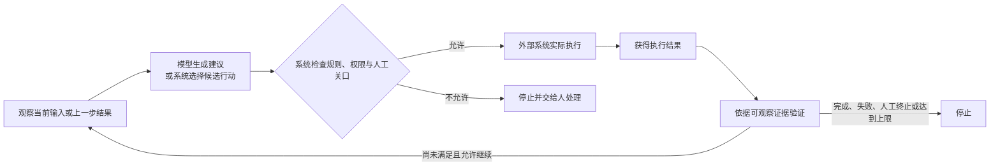
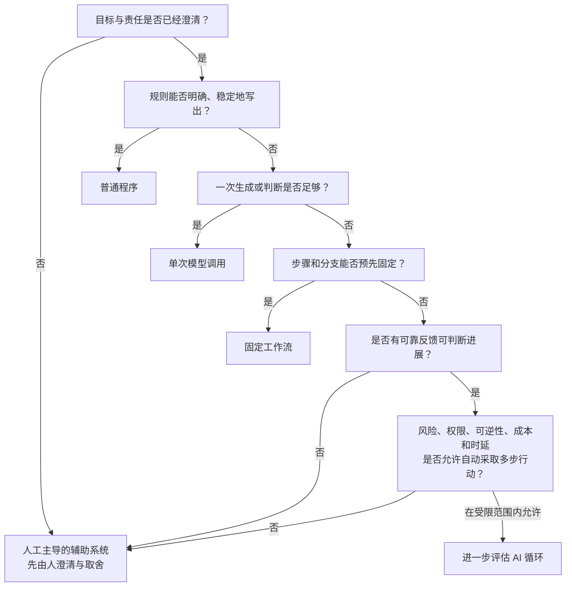

# 序章　为什么需要理解人工智能循环

你已经使用过对话式 AI，也许让它总结文字、起草邮件或解释概念。输入一个问题，得到一段回答，这种体验很自然。

但“给出回答”和“完成任务”不是同一件事。

假设你在组织一次社区读书会。你可以请模型写一封报名确认邮件。几秒后，一封措辞完整的邮件出现在屏幕上。此时，模型完成的是文字生成：它没有读取报名表，没有判断哪些报名信息缺失，也没有把邮件发送给任何人。

如果需求变成“检查报名材料；缺少联系方式时请求补充；材料完整时生成确认信息；发送后核对结果”，系统承担的责任就变了。它不但要生成内容，还要读取新结果、决定下一步、影响外部世界，并知道何时停止。

本章要回答的正是这个问题：一个任务什么时候采用普通程序、一次模型调用或固定流程就足够，什么时候可能需要人工智能循环（AI Loop），又有哪些任务必须由人主导。

读完本章，你应当能够：

- 区分模型给出的建议、系统作出的决定和外部世界中真实发生的执行；
- 说清 AI 循环包含哪些位置，以及循环为什么必须有停止出口；
- 根据任务的变化、证据、风险、权限、成本和时延，初步选择实现方式；
- 用同一套记录方法参与本书的贯穿案例、观察实验和逐章实操。

本章不要求编程，也不要求选择任何模型或软件。能够阅读简单表格和流程图，就可以完成本章内容。后文会从模型本身开始，一层一层补齐实现能力。

## 0.1 人工智能正在从“回答问题”变成“完成任务”

先看读书会任务中的三个不同事实：

1. 模型输出：“这份报名材料完整，可以发送确认邮件。”
2. 运行系统根据明确规则，把这条输出标记为“等待负责人确认”。
3. 负责人批准后，邮件服务返回“发送成功”，收件地址和发送时间被记录下来。

它们分别对应模型建议、系统决策和外部执行。

模型建议是一段生成结果。它可能有用，也可能遗漏信息。  
系统决策是运行程序依据规则、权限和当前证据选择如何处理建议。  
外部执行才会真正改变文件、发送消息、提交数据或触发其他操作。

三者不能相互代替。模型写出“邮件已发送”，不能证明外部系统真的发送了邮件；程序收到“发送成功”的返回，也不能证明收件人读过邮件；收件人读过邮件，又不代表报名信息已经正确。每个结论都需要与它相匹配的证据。

### 从回答到任务，多出了什么

回答问题通常以生成信息为主。完成任务至少多出三类责任：

- **外部行动**：是否读取、写入、发送、提交或改变了外部对象？
- **结果检查**：有什么可观察证据能够说明目标已经达到？
- **责任边界**：谁有权批准关键行动，失败后由谁处理？

还要再加两个容易被忽略的问题：

- 如果结果不满足条件，系统下一步做什么？
- 如果一直不能满足条件，系统何时停止？

仍以读书会为例。请模型起草一封确认邮件，一次生成便可能满足目标。批量检查报名表中的手机号是否符合既定格式，规则明确，普通程序通常更稳定。按照“读取表格—生成草稿—负责人审核—发送”的固定顺序处理，固定工作流可能已经足够。只有当系统必须根据每次获得的新信息，动态决定询问什么、修改什么或是否继续时，才值得进一步评估 AI 循环。

任务看起来更复杂，不代表循环就是更好的选择。恰当的目标不是“尽量使用 AI”，而是用足够简单、可控的方式完成任务。

## 0.2 本书中的“循环”是什么

本书使用下面这个固定定义：

> **人工智能循环（AI Loop）**：系统重复执行“观察 → 生成或选择行动 → 执行 → 获取结果 → 验证 → 判断继续或停止”的控制过程。

这里的“循环”不是让模型不停生成文字，也不是把同一句问题重复发送很多次。系统必须在每一轮读到新结果，并依据证据决定下一步。



图中的每个位置承担不同责任：

- **观察**：读取当前能够看到的输入、环境变化或上一步结果。
- **生成或选择行动**：模型可以提出建议，系统也可以根据预先规定的规则选择候选行动。
- **执行**：外部程序真正读取文件、写入记录、发送消息或调用其他系统。
- **获取结果**：执行后拿到成功、失败、拒绝或其他返回信息。
- **验证**：依据可观察证据，检查结果是否满足目标或约束。
- **继续或停止**：条件允许时进入下一轮；完成、失败、人工终止或达到上限时退出。

### 为什么会继续

假设系统检查读书会报名材料后发现紧急联系人缺失。模型建议写一条补充信息请求，系统确认这一操作处于允许范围内，外部消息服务发送请求。稍后，报名者补充了内容。

这时，系统不能沿用上一轮“材料缺失”的结论。它需要重新观察补充结果，再检查材料是否完整。新结果改变了下一步，因此可能进入下一轮。

### 为什么必须停止

如果报名者没有回复，系统不能无限发送提醒。最低限度要有清楚的出口，例如：

- 材料完整，任务完成；
- 地址无效或服务拒绝请求，任务失败；
- 负责人要求终止；
- 已发送两次提醒，达到事先规定的上限。

达到上限后，系统应停止自动处理并把现有证据交给负责人，而不是继续尝试。停止不是失败设计之外的补丁，而是循环本身的一部分。

### 最小操作过程

本章不实现循环代码。下面只用伪代码展示控制差异。

**伪代码，不能直接运行：**

```text
最多处理 3 轮

每一轮：
    读取当前报名材料或上一步结果
    形成候选下一步
    如果行动超出权限：
        停止，交给负责人
    执行已获允许的行动
    读取执行结果并检查证据
    如果目标已经满足：
        停止，记录完成
    如果结果明确失败：
        停止，记录失败并交给负责人

达到 3 轮仍未完成：
    停止，记录“达到上限”
```

这段伪代码没有规定模型、接口或运行框架。它只说明四件事：结果会被重新读取；模型建议不直接等于系统批准；执行后必须检查；循环有明确上限。

## 0.3 什么任务适合使用人工智能循环

AI 循环适合的，不是“所有步骤很多的任务”，而是一类更具体的问题：目标和约束可以说明，但下一步会随着运行结果变化，无法在开始前把所有有效路径都写死。

候选任务同时具备越多下列特征，越值得进入循环设计评估：

### 目标能够表达，下一步不能全部预定

“让报名材料达到完整标准”是一个相对清楚的目标。但缺失的是电话、授权勾选还是活动场次，每次可能不同，下一步需要根据新信息选择。

如果连目标都含糊，例如“把活动办得最成功”，系统无法知道应优化报名人数、参与体验还是成本。此时应先由人澄清取舍，不应直接启动循环。

### 运行中会出现新信息

报名者补充材料、消息发送失败或名额发生变化，都会改变下一步。如果执行过程中没有新信息需要吸收，一次生成或固定流程可能已经足够。

### 结果有可获得的检查证据

是否填写手机号、是否勾选授权、消息服务是否返回成功，都可以留下证据。相反，“这一定是最有创意的活动方案”缺少可靠、及时且一致的完成证据，系统很难知道是否应该继续。

### 试错范围受到限制

低风险、可撤销或影响可控的草稿修改，可能允许系统在小范围内尝试。付款、删除生产数据、作出医疗诊断或法律结论等高影响行为，不能因为系统能够生成下一步就自动执行。

### 动态判断确实带来价值

如果十条明确规则就能稳定处理问题，引入多轮生成只会增加成本、时延和不确定性。只有当预写全部分支的代价较高，而动态选择又能带来足够价值时，循环才值得继续评估。

这些特征不是采用 AI 循环的充分保证。权限是否合适、失败是否可发现、成本是否能接受、人工责任是否清楚，仍然可能让最终选择转向更简单的方式。

## 0.4 哪些任务不适合直接做成循环

选择实现方式时，可以先问一连串逐步收窄的问题。



这张图不是机械公式。复杂系统可以组合多种方式，例如用普通程序检查字段格式，用模型生成草稿，再由人工批准发送。序章要做的是判断任务中的主导方式，而不是给整个系统贴上唯一标签。

### 五种主导方式

| 方式 | 通俗说明 | 适用条件 | 读书会中的例子 |
|---|---|---|---|
| 普通程序 | 按明确规则计算或处理 | 输入、规则和正确结果能够明确表达 | 检查手机号位数和必填字段 |
| 单次模型调用 | 完成一次生成或候选判断 | 结果不触发模型自主选择并执行下一步 | 起草一封报名确认邮件 |
| 固定工作流 | 按预定步骤和分支运行 | 顺序和分支可在运行前写清 | 读取表格、生成草稿、等待审核、发送 |
| AI 循环 | 依据每轮新结果动态选择下一步 | 有可靠反馈，试错受限，动态判断有价值 | 根据补充内容决定再次询问、通过或停止 |
| 人工主导的辅助系统 | 系统提供草稿、归纳或候选方案，人决定关键行动 | 目标需取舍、风险高、不可逆或责任必须由人承担 | 负责人决定是否破例接收逾期报名 |

### 应优先选择其他方式的情况

不选择 AI 循环，原因不只有“任务太简单”。更容易理解的方法，是把原因分成四类。

#### 第一类：能做，但没有必要——循环反而更贵、更慢

如果规则能明确写出来，普通程序通常已经足够。例如统一日期格式、计算报名人数或检查手机号位数。让模型反复判断同一个确定性问题，不但增加调用成本和等待时间，还可能把稳定结果变得不稳定。

如果任务通过一次生成就能完成，例如根据完整信息起草一段活动介绍，那么一次模型调用就可能满足目标。再增加“观察—生成—检查—继续”的多轮过程，并不会自然让草稿更好，只会增加费用和时延。

如果步骤很多，但顺序和分支能够提前写清，例如“读取文件—转换格式—生成摘要—等待审核—保存”，固定工作流更直接。这里的关键不是步骤有多少，而是运行时是否真的需要根据新结果重新选择下一步。

这三种情况都不是系统做不到循环，而是循环没有带来足以抵消成本和复杂度的价值。

#### 第二类：想循环，但系统不知道该往哪里走

循环每一轮都要依据结果判断“完成、继续还是停止”。如果没有可靠证据，这个判断就没有根据。

例如目标是“不断修改，直到方案足够有创意”。如果“足够有创意”没有明确标准，也没有责任主体进行评审，系统只能继续生成，或者自行宣布已经完成。生成次数增加，不会自动产生可靠的完成证据。

这类任务应先由人定义可检查的目标，或让系统只提供候选方案、由人评审。在可靠反馈出现之前，不应启动自动循环。

#### 第三类：循环可以运行，但不应把行动权交给它

付款、医疗、法律结论、生产数据删除等任务，可能有清楚目标，也可能获得执行结果，但错误影响重大、难以撤销，或责任必须由特定的人承担。

例如系统可以整理付款资料并提示缺失项，但实际扣款需要有权限的人核对金额和收款方后批准。这里保留人工关口，不是因为系统一定无法生成下一步，而是因为关键行动的后果和责任不应交给它自动承担。

当权限不足、证据不完整或批准人无法介入时，停止外部执行，只保留整理、草拟或提醒等辅助能力。

#### 第四类：连目标都没有说清，无法开始设计

例如同时要求“不增加任何成本”和“无条件提高活动质量”，但没有说明发生冲突时哪一项优先。系统无法替责任主体决定价值取舍。

此时首先需要人澄清目标、边界和成功标准。目标尚未明确时，普通程序、工作流和 AI 循环都没有可靠的设计起点。

还有一种现实限制：即使任务在逻辑上适合循环，多轮执行的成本、时延或资源消耗也可能超过任务价值。这时应缩小范围，或改用普通程序、单次调用和固定工作流的组合。

“不适合直接做成循环”不等于“不能使用 AI”。AI 仍可用于草拟、归纳或提供候选方案，只是行动权、检查责任和最终决定留在人手中。

## 0.5 如何使用本书

本书包含三类相互配合的学习活动，但只维护一个主要贯穿项目。

### 贯穿案例：看同一个项目怎样成长

贯穿案例从最小版本开始。后续每章只增加刚学到的一层能力，并保留上一阶段的证据。它不会在开头就堆入工具、记忆、复杂框架或完全自主执行。

本序章只做立项前的任务分流。当前案例尚未正式批准，因此本章后面的综合任务卡明确标注为“候选项目占位卡”，不能把其中事实当成已验证的正式案例。

### 观察实验：把一个问题单独拿出来看

观察实验使用小型输入或任务卡，帮助你比较概念、发现边界。它不会发展成另一套完整项目。实验的目的不是证明某种技术更先进，而是让设计理由与约束对得上。

### 逐章实操：每次增加最小能力

逐章实操推进贯穿项目。每章都要回答四个问题：

1. 本章增加了什么？
2. 为什么现在需要增加？
3. 如何验证它确实起作用？
4. 仍然缺少什么？

建议保留每次实操的输入、原始输出、验证证据和已知局限。程序成功返回不等于内容正确，模型声称完成不等于外部执行已经发生。

### 两种参与方式

如果你只阅读概念，至少应完成每章的判断题或观察实验，并能解释能力边界。这样仍可掌握“应该选择什么系统方式”的核心判断。

如果你同步完成贯穿项目，建议每章保留一个可复现版本和验证记录。这样到最后得到的不只是代码，还会得到一条可以回看的设计证据链。

具体案例、模型、供应商和实现将在条件成熟时确定，并遵守中国大陆无需翻墙的可达性要求。序章不要求安装软件。

## 观察实验：为任务选择主导实现方式

下面八张卡均为**教学用合成案例**，不是生产事故、真实统计或已批准的贯穿案例。

请先不要看参考判断。对每张卡选择一种主导方式：

1. 普通程序
2. 单次模型调用
3. 固定工作流
4. AI 循环
5. 人工主导的辅助系统

每张卡选择一种即可。完成后再看答案中的原因。

### 任务卡 1：统一日期格式

把报名表中的 `2026/8/2`、`2026-08-02` 等有效日期统一为指定格式。格式规则已写清，异常输入需列出但不能猜测修正。

### 任务卡 2：起草活动介绍

根据负责人提供的主题、时间和受众，起草一段 200 字活动介绍。文字不会自动发布，由负责人选择是否采用。

### 任务卡 3：固定材料处理

系统依次读取指定文件、检查文件类型、生成摘要草稿、等待负责人确认，再把确认后的版本保存到指定目录。每个步骤和失败分支都已预先写清。

### 任务卡 4：动态补全低风险报名材料

目标、必填项、最多两次提醒和允许发送的消息类型都已明确。系统每次收到补充材料后，需要判断仍缺什么、是否已经完整或是否应停止并交给负责人。所有外发消息都在限定模板范围内，负责人可随时终止。

### 任务卡 5：选出“最有意义”的活动

系统收到十个活动创意，目标是自动反复改写，直到选出“最有意义”的一个。但“意义”没有统一标准，也没有确定谁承担取舍责任。

### 任务卡 6：高影响医疗建议

根据用户描述自动形成诊断、开药并提交处方，不经持证专业人员复核。错误可能直接影响健康，且用户希望系统自行处理全部步骤。

### 任务卡 7：看起来复杂的费用计算

活动场地费用由人数区间、时长、工作日或周末、固定优惠规则共同决定。规则虽然有二十多条，但全部明确且变化需要审批后才生效。

### 任务卡 8：候选项目占位卡

> **状态：候选项目占位，未经贯穿案例负责人批准或事实验证。**

候选需求包含整理输入材料、形成候选结果以及在有限条件下处理反馈。具体用户、领域、允许行动、成功证据、风险和人工责任尚未确定。

请选择：在这些事实尚未确定时，当前应采用哪一种主导方式？

### 参考判断

**任务卡 1：普通程序。**  
规则和正确结果可以明确表达。使用循环会增加模型调用费用、等待时间和不确定性，却没有带来新的判断价值。错误路径是遇到无效日期时不猜测，记录异常并停止处理该条。

**任务卡 2：单次模型调用。**  
任务主要需要一次生成，没有新结果要求系统继续选择下一步。增加循环只会带来额外调用成本。外部发布仍由人决定；如果事实材料不完整，应停止采用草稿并请负责人补充。

**任务卡 3：固定工作流。**  
虽然有多个步骤，也可能包含一次模型生成，但顺序和分支已经固定。系统不需要在运行中动态探索下一步，固定工作流更便宜，也更容易复现。任一步失败时按照预定路径停止或交给负责人。

**任务卡 4：可进一步评估 AI 循环。**  
每次补充内容会改变下一步，完成证据和两次提醒上限也比较清楚。但“可以评估”不等于已经适合部署；仍需确认消息权限、错误影响、人工终止入口和实际成本。

**任务卡 5：人工主导的辅助系统。**  
系统可以帮助整理和改写创意，但目标缺少共同标准，循环没有证据判断应继续还是停止。应由责任主体先定义评价维度并作出取舍，不能让系统靠反复生成自行宣布完成。

**任务卡 6：人工主导的辅助系统。**  
按卡片条件，不应允许系统自动诊断、开药和提交处方。原因不是任务步骤少，而是错误影响重大、行动难以撤销且专业责任不能转交给系统。系统至多在合规范围内辅助整理信息；持证专业人员必须复核并承担关键决定。若缺少授权或证据，停止外部执行。

**任务卡 7：普通程序。**  
这是“看起来复杂但普通程序更合适”的反例。规则多不等于规则不能写清；确定性计算更便宜、更快，也更容易复现和审计。

**任务卡 8：先由人澄清，暂按人工主导处理。**  
目标、权限、证据和责任都未确定，任何自动化方式都缺少可靠设计起点。应先由人澄清这些事实。案例负责人批准后，才可决定项目从哪种方式起步。

### 条件改变，选择也会改变

把任务卡 4 改成以下条件：

- 系统可以直接从账户扣除高额保证金；
- 扣款不可自动撤销；
- 没有独立记录证明材料是否完整；
- 负责人无法在异常时及时介入。

此时，即使任务仍会根据新信息变化，也不应直接采用 AI 循环自动执行。更合适的方式是让系统整理缺失项和候选建议，由人核对证据并批准关键行动。

再把任务卡 5 改为：

- “有意义”被拆成三项明确标准；
- 每项都有可检查证据；
- 系统只生成候选排序，不发布、不付款；
- 负责人最终选择。

此时它可以从完全含糊的开放任务，转为单次模型调用或人工主导的辅助系统。选择发生变化，不是因为模型变了，而是目标、证据、权限和风险发生了变化。

完整的“实现方式选择记录”和可填写判断表将放入附录 C。本章先学会选择，并读懂答案背后的原因。

## 小结：先选运行方式，再增加能力

本章从一个问题开始：模型给出一段完整回答，为什么任务仍可能没有完成？

答案是，完成任务还需要外部行动、结果证据和责任边界。模型可以生成建议；系统依据规则、权限和人工关口作出处理决定；外部程序才会真正执行。三者是不同事实。

AI 循环是系统重复执行“观察 → 生成或选择行动 → 执行 → 获取结果 → 验证 → 判断继续或停止”的控制过程。它适合下一步会随新结果变化、结果可以检查、错误影响可控且动态判断确有价值的任务。它不适合替代明确规则，也不应绕过高影响行动中的人工责任。

现在你已经有五种起始选择：普通程序、单次模型调用、固定工作流、AI 循环和人工主导的辅助系统。后续章节不会把系统一次搭到最终形态，而是让同一个项目逐章增加最小能力，并留下验证证据和已知局限。

下一章将从最基础的生成组件开始：既然模型会参与生成或选择行动，它到底在做什么？为什么它能写出流畅内容，却不能被直接当作知识库、事实终点或执行证据？
