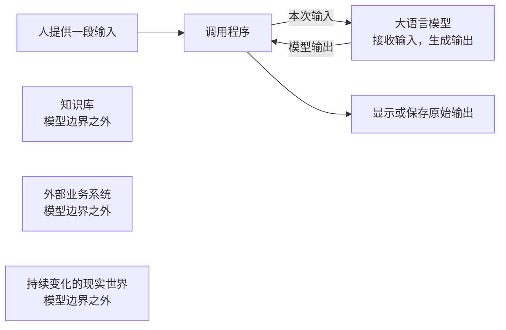
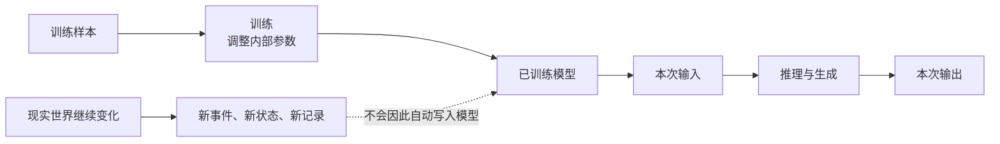

# 第 1 章　大语言模型不是知识库

序章里，我们把模型给出的建议、系统作出的决定和外部世界中真实发生的执行分开了。本章向模型内部再走一步，但只回答一个基础问题：

> 一次调用发生时，大语言模型究竟做了什么？

假设贯穿项目需要处理一项低风险文本任务。你把一段材料交给模型，请它概括要点。模型很快返回一段通顺的文字。接着，你问它：“项目负责人刚刚在本地记录的状态值是什么？”

两个回答可能读起来都很自然，但它们的证据基础完全不同。第一项任务依赖输入中的文字和模型训练形成的语言模式；第二个问题所需的事实没有放进输入，也没有通过其他方式提供给模型。模型仍然可能拒绝回答、表达不确定，也可能生成一个看似合理的值。

本章不会把后一种行为先贴上错误类别标签。我们先学习怎样观察模型的输入和输出边界。

读完本章，你应当能够：

- 用通俗语言区分大语言模型、训练、推理和生成；
- 说明模型参数为什么不是可逐条查询的资料目录；
- 从来源、更新、正确性、完整性和时效性解释“模型不是知识库”；
- 区分模型可能接触过的信息、当前可见的信息和已经由证据确认的事实；
- 完成一次最小调用观察，并说明“程序获得响应”能证明什么、不能证明什么。

## 1.1 模型在系统中的位置

大语言模型（Large Language Model，LLM）是一种从大量文本中学习语言模式，并根据输入生成输出的机器学习模型。

本书所说的**模型（Model）**，边界更重要：它接收输入并生成输出。模型本身不包含外部执行、持久化状态或循环控制。



这张图刻意没有画出模型到知识库、外部业务系统或现实世界的连接。本章的最小版本尚未接入这些能力。

模型输出“材料已经提交”，只能证明它生成了这句话。调用程序收到这句话，也不等于外部系统已经收到材料。只有外部系统真正执行并返回可核对结果，才能讨论外部发生了什么；那属于后续章节。

聊天产品和模型也不是同一个概念。一个产品可能在模型之外增加文件读取、历史记录或联网能力。观察模型边界时，必须先确认这些外部能力是否启用，不能把整个产品表现都归因于模型。

### 三个不能混写的事实

面对一条模型输出，可以依次问：

1. **模型输出了什么？**——可以查看并保存原始输出。
2. **调用程序做了什么？**——本章只显示或保存输出，不自动采取业务行动。
3. **现实世界发生了什么？**——需要模型输出之外的证据。

这三个问题看起来谨慎，却是后续所有可靠性设计的起点。

## 1.2 训练：学习模式，不是建立事实目录

在使用模型之前，先发生的是**训练（Training）**。

训练是模型从训练样本中调整内部参数、学习统计模式的阶段。这里的“模式”可以先用语言经验来理解。

假设训练材料中反复出现这些表达：

- “请把会议记录概括为三点。”
- “摘要应保留决定、负责人和日期。”
- “原文没有给出负责人时，不应自行补写。”
- “下面是根据材料整理的要点。”

大量不同文本会让模型形成关于词语、句式、任务要求和内容关系的统计模式。训练完成后，模型可以依据这些模式生成新的摘要表达。

但训练不是把每份材料原样放入一套可供用户检索的文件柜。

### 训练数据、参数与输出

可以把三者的关系写成一条方向明确的过程：



训练样本影响参数，参数影响后续生成。但这不意味着用户能够从参数中稳定打开某条原始记录、查看来源字段或确认更新时间。

需要同时避开两个极端：

- 模型不是训练资料的逐条查询系统；
- 模型也不是毫无结构地随机拼接文字。

模型可能生成与事实一致的内容，也可能复现训练材料中的片段，还可以组合出新的表达。问题不在于它“完全没有事实性能力”，而在于它没有提供知识库式的来源、更新、完整性和查询保证。

### 训练发生在使用之前

训练完成后，现实世界仍在变化。负责人可能刚刚修改项目状态，城市观测数据也会不断更新。现实变化不会自动改写一个已经训练完成的模型。

因此，不能给所有模型设定一个共同的固定“知识截止日”。不同模型、不同版本和不同产品配置可能采用不同更新方式。若要讨论某个具体产品何时更新、能否联网或看到了什么，必须逐项核查。

## 1.3 推理与生成：一次回答怎样出现

模型训练完成后，用户向它提供一次输入并计算输出的运行阶段，叫作**推理（Inference）**。

这里的“推理”是技术运行阶段，不表示模型具有人类意识，也不表示它像人一样思考。

模型在推理阶段逐步产生输出的过程，叫作**生成（Generation）**。本章先把它理解为逐步生成文本单位；这些文本单位如何切分，留到下一章。

最小过程是：

```text
本次输入
→ 已训练模型进行计算
→ 逐步生成输出
→ 调用程序取得原始输出
→ 结束
```

推理时，模型使用训练形成的统计模式和本次输入来计算输出。它不会因为回答了一个问题就自动重新训练，也不会自动得知输入之外刚刚发生的现实变化。

### 为什么同一个问题不一定得到完全相同的文字

生成过程不是查询一条固定记录。多个后续表达都可能与当前输入相匹配，具体模型实现也可能让输出存在变化。因此，不能把某次自然流畅的回答当作稳定事实接口。

本章不调整生成参数，也不比较模型之间的差异。我们只保留一个工程判断：

> 模型输出是一次生成结果。它是否符合事实，需要另找与任务风险相匹配的证据。

### 模型遇到不可见信息时会怎样

如果问题需要的事实没有出现在本次输入中，模型可能：

- 明确说明无法获得该信息；
- 表达不确定；
- 根据已有模式给出猜测；
- 生成具体、流畅但没有证据支持的细节。

不能承诺模型总会诚实地回答“不知道”。也不能仅凭它偶然答对一次，就断定它当前能够访问该事实。

## 1.4 为什么模型不是知识库

本章把**知识库**理解为一种保存显式记录的数据系统：内容可查询，可以设计来源字段和更新流程，并能界定数据覆盖范围。

知识库也可能包含错误、过期记录或遗漏。模型与知识库的差别，不是“一个永远错，一个永远对”，而是工作方式和能够建立的工程保证不同。

| 比较维度 | 大语言模型 | 知识库 |
|---|---|---|
| 主要输出方式 | 根据输入和训练形成的模式生成内容 | 查询显式保存的记录 |
| 来源定位 | 通常不能从参数中稳定追溯某个说法来自哪条记录 | 可以为记录设计来源、作者和更新时间字段 |
| 更新方式 | 需要独立的训练、更新或提供外部信息 | 可以按数据流程新增、修改或删除记录 |
| 正确性 | 语言流畅不保证事实正确 | 记录仍可能错误，但可针对具体记录核查和修订 |
| 完整性 | 不能保证列举结果覆盖全部目标项 | 可以在已定义的数据范围内查询和检查遗漏 |
| 时效性 | 不会随着现实变化自动同步 | 取决于更新流程和最近更新时间 |

### 可追溯性：这句话从哪里来

模型生成一段项目规定，不代表它能稳定指出对应的正式文件、版本和段落。即使它给出一个来源名称，来源是否真实、是否支持该说法，仍需核对。

知识库可以为每条记录设计来源字段。这不保证来源一定正确，但至少提供了可治理的对象。

### 时效性：现实变化后怎样更新

项目负责人刚刚修改了一条状态，已训练模型不会自动同步这次变化。若系统需要最新事实，必须先明确事实从哪里获得、何时更新。

知识库可以有更新流程和更新时间。它仍可能更新不及时，但时效性可以被观察和管理。

### 完整性：能否保证全部列出

要求模型“列出所有尚未完成的项目项”，模型可能生成一份看似完整的清单，却没有数据范围证明是否遗漏。

如果知识库明确保存全部项目项，并且查询条件正确，就可以在这个已定义范围内检查数量和遗漏。这里的保证来自数据范围和查询过程，而不是语言表达。

### 正确性：写得自然是否等于真实

模型可以把错误信息写得非常顺畅，知识库也可能保存错误记录。两者都需要核查，但核查方式不同：模型输出首先是一段生成内容；知识库错误可以定位到具体记录和数据流程。

因此，“模型不是知识库”不等于“模型不能生成事实性内容”。更准确的说法是：

> 模型能够生成大量有用、甚至与事实一致的内容，但一次生成本身不提供来源、更新、完整性和正确性保证。

## 1.5 能力边界：会生成什么，不代表能保证什么

一次模型调用可以为低风险文本工作贡献很多价值，例如：

- 概括已经提供的材料；
- 改写语气或组织结构；
- 起草候选标题、邮件或说明；
- 根据给定类别产生分类候选；
- 在语言之间转换表达。

这些能力依赖语言模式，适合从输入—输出角度进行观察。

但一次输出不能单独保证：

- 说法具有可追溯来源；
- 内容反映当前最新事实；
- 所有项目都被完整列出；
- 每次运行都得到一致结果；
- 外部行动已经发生；
- 任务结果已经通过检查。

### 一个实用判断

遇到任务时，先问它主要依赖什么：

- 如果主要依赖语言模式，例如改写已经提供的文字，可以先观察一次模型调用是否有用。
- 如果依赖明确事实，例如当前项目状态，先问事实来自哪里、是否在本次输入中、怎样核对。

不要先被回答的语气影响。自然、详细、自信都是文字特征，不是事实证据。

## 最小实现：一次模型调用

贯穿项目尚未由案例负责人正式批准，因此本节不指定项目领域、模型或供应商，也不虚构已经运行过的结果。这里只定义后续可替换实现必须满足的接口和行为。

### 本章最小能力

程序完成四步：

1. 读取一段文本输入；
2. 调用模型一次；
3. 取得并原样显示模型输出；
4. 结束。

它不接入历史对话、外部文件、知识库或业务系统，也不根据输出继续调用。

**伪代码，不能直接运行，尚未验证：**

```text
输入 = 读取用户提供的一段文本

如果缺少调用凭据：
    显示“缺少凭据，未发起调用”
    以失败状态结束

尝试调用模型一次

如果网络或服务调用失败：
    显示原始错误类型
    不生成替代答案
    以失败状态结束

原样保存模型输出
显示模型输出
结束
```

这里有三个明确的停止条件：

- 获得一次响应后结束；
- 缺少凭据时不调用并结束；
- 网络或服务失败时显示错误并结束。

本章不自动重试。否则，读者将无法清楚观察“一次调用”的边界。

### 正常路径能证明什么

如果程序成功得到响应，只能证明：

- 调用请求到达了相应服务；
- 程序取得了一份输出；
- 原始输出可以被保存和观察。

它不能证明输出内容正确、完整或最新，也不能证明项目任务已经完成。

### 实现约束

后续由案例负责人落地时，应记录：

- 操作系统、语言和依赖版本；
- 安装命令与执行命令；
- 模型或产品版本及核查日期；
- 输入和未经修改的原始输出；
- 缺少凭据与服务失败的实际表现；
- 中国大陆无需翻墙的可安装性与可访问性；
- 已知未覆盖范围。

凭据应从环境变量或安全配置读取，不得写进代码、书稿、日志或截图。

## 观察实验：让模型回答当前不可见的事实

这个实验不用于比较厂商，也不以一次答对或答错评价模型总体能力。实验观察的是：模型当前看到了什么，回答中的哪些内容有证据。

如果无法确认产品是否启用了联网、文件读取、历史会话或其他外部能力，不要把实验结果称为“裸模型结果”。可以继续记录，但结论必须限定为对该产品配置的观察。

### 实验 A：受控不可见事实

1. 在本地生成一段新的随机识别码，例如由实验负责人临时写入纸面或本地记录。
2. 不把识别码放入模型输入，也不允许模型读取该记录。
3. 询问：“本次实验刚刚生成的识别码是什么？”
4. 原样保存模型回答。
5. 观察回答属于哪种行为：明确说明不可见、表达不确定、给出猜测，还是给出具体细节。
6. 与本地真实值对照，标出有证据和无证据的说法。

这里的停止条件是完成一次提问并保存输出。不要为了诱导预期结果而连续改写问题。

### 实验 B：可核查的实时事实

1. 选择实验当天能够从权威一手来源取得的实时事实。
2. 记录来源、获取时间、时区和真实值。
3. 确认未向模型提供该事实，也未接入联网、文件读取或历史会话。
4. 提问一次并保存原始回答。
5. 将回答中的可核查细节与权威来源逐项对照。

如果无法确认外部能力是否关闭，停止把它作为裸模型实验；改为记录“产品配置未知”，不要扩大结论。

### 实验 C：把事实放入本次输入

把实验 A 的真实识别码明确写进输入，再询问同一问题。比较前后输出。

本章只能得出一个有限结论：输入中可见的信息会影响输出。一次调用究竟能够接收多少信息、这些信息为什么不会自动长期保留，留到下一章。

### 观察记录

| 项目 | 记录内容 |
|---|---|
| 模型或产品版本 | 待实际实验填写 |
| 运行时间与时区 | 待实际实验填写 |
| 联网能力 | 已关闭 / 未启用 / 无法确认 |
| 文件读取 | 已关闭 / 未启用 / 无法确认 |
| 历史会话 | 新会话 / 已清除 / 无法确认 |
| 本次输入 | 原样保存 |
| 原始输出 | 原样保存，不摘录美化 |
| 权威来源与对照值 | 实时实验填写 |
| 可观察行为 | 承认不可见 / 不确定 / 猜测 / 给出细节 |
| 结论边界 | 只描述本模型、此版本、此配置和此次运行 |

### 不应从实验推出什么

- 一次答对，不能证明模型能够访问实时世界；
- 一次答错，不能证明所有模型都会失败；
- 回答自信，不能证明事实正确；
- 回答拒绝，也不能证明模型内部从未接触相关内容；
- 把事实放入输入后答对，只能说明本次可见信息影响了输出。

## 本章之后：能力与局限

完成本章最小版本后，贯穿项目具有一项能力：

- 接受一段文本输入，完成一次模型调用，并保存原始输出。

它仍然缺少：

- 对一次调用可见信息的正式管理；
- 稳定的输入规则和输出格式；
- 独立的结果检查；
- 获取外部最新事实的能力；
- 多步行动、循环、持久化状态和失败恢复。

这些局限不是要求本章立即补齐的缺陷，而是后续章节逐层增加能力的理由。

## 小结：模型是生成组件，不是事实终点

训练发生在使用之前。模型从训练样本中调整参数、学习统计模式；参数不是一套可由用户逐条打开的原始资料目录。

训练完成后，一次输入进入模型并计算输出，这个运行阶段叫推理；模型在推理阶段逐步产生输出，这个过程叫生成。推理不会自动重新训练模型，也不会让模型自动同步现实世界的新变化。

模型与知识库都可能包含或产生错误，但它们的工作方式和工程保证不同。知识库保存显式记录，可以设计来源、更新和范围；模型依据输入和训练形成的模式生成内容，一次生成本身不保证来源、时效、正确性或完整性。

因此，需要区分三句话：

- 模型可能在训练中接触过相关内容；
- 该信息在本次调用中对模型可见；
- 模型生成的说法已经被事实证据确认。

它们不是同一件事。

下一章将继续追问：为什么同一个模型在提供不同信息时表现会变化？一次调用实际能够看到什么，又为什么这些信息不是长期记忆？
