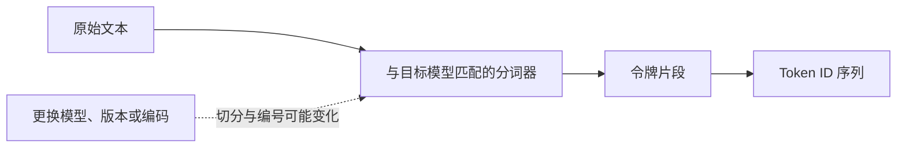
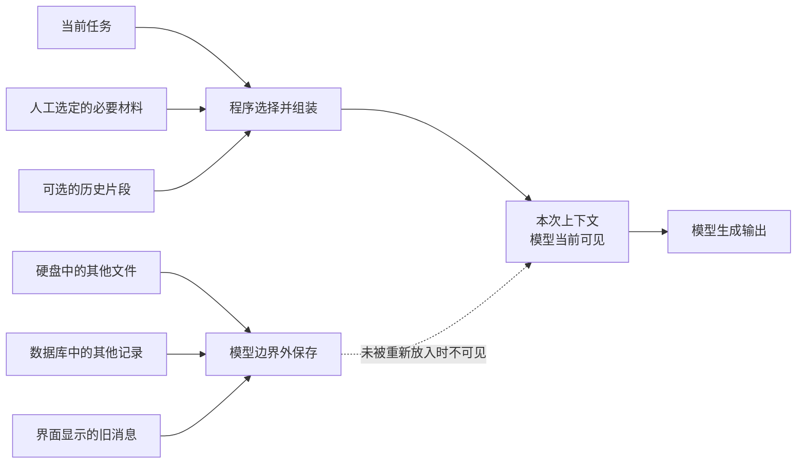
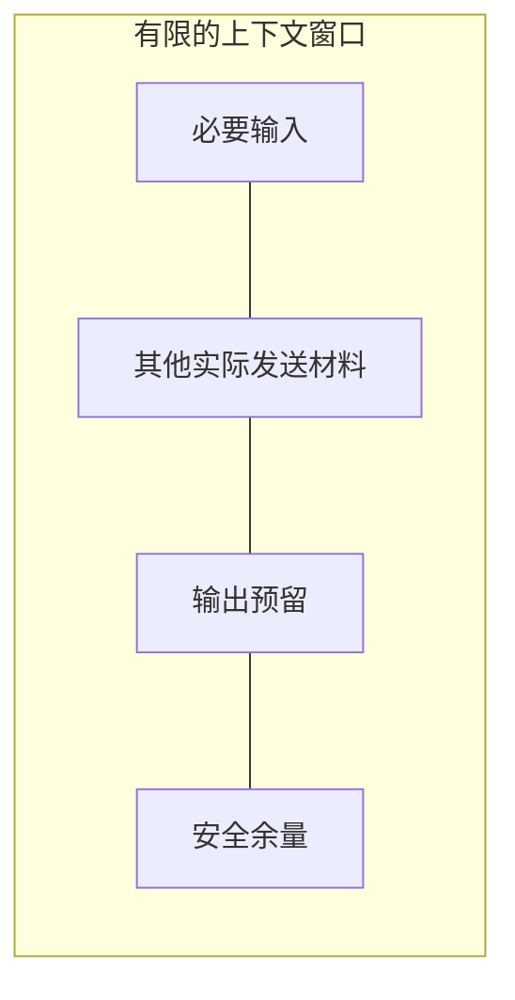
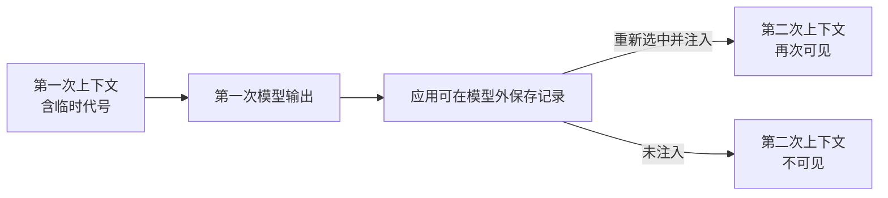

# 第 2 章　令牌、上下文与模型的临时世界

第 1 章的观察实验做了一个对照：第一次不向模型提供临时识别码，第二次把识别码明确写进输入。模型没有在两次调用之间自动学会新事实，发生变化的是本次调用中可见的信息。

这带来两个新的问题：

1. 文字怎样变成模型能够处理和计量的单位？
2. 一次调用究竟能放入哪些信息，又能放多少？

本章将解释令牌（Token）、分词器（Tokenizer）、令牌编号（Token ID）、上下文（Context）和上下文窗口（Context Window）。这些概念共同描述模型一次调用中的“临时世界”。

读完本章，你应当能够：

- 说明令牌为什么不等于汉字、单词、字符或字节；
- 准确复述“上下文是一次模型调用时可见的信息集合”；
- 区分信息被保存、被选中、进入本次上下文和影响模型输出四个阶段；
- 解释上下文窗口为什么是有限预算，以及输入和输出为什么都需要考虑；
- 区分上下文、聊天记录、状态、长期记忆和外部知识；
- 识别上下文中的必要材料、无关噪声、重复、冲突和过时内容；
- 为一次调用规划最小充分上下文，并在空材料、配置错误或预算超限时停止。

本章不指定模型或供应商，也不提供未经验证的令牌数量。所有真实切分、窗口规则和运行结果都留作待验证 placeholder。

## 2.1 令牌：模型处理文本的计量单位

人看到的是文字，模型计算时使用的是经过编码的离散单位。这种单位叫作**令牌（Token）**。

一个令牌可能对应：

- 一个汉字；
- 一个词或词的一部分；
- 一段数字；
- 标点或空白；
- 英文单词的一部分；
- 其他由具体编码规则划分的片段。

把原始文本转换为令牌及其编号的组件，叫作**分词器（Tokenizer）**。分词器会依据特定模型使用的词表和编码规则切分文本，再把每个令牌映射为整数编号，即 **Token ID**。



Token ID 只是特定词表中的映射编号。编号更大不表示词更重要，也不表示含义更复杂。

### 一个不能凭空填写的切分示例

假设要观察下面两段文本：

```text
项目状态已更新。
版本 v2.1，完成率 75%。
```

不能仅凭肉眼把汉字、数字和标点逐个数出来，再把结果称为令牌数。正确做法是使用与目标模型匹配的实际分词器。

| 原始文本 | 分词器/编码 | 实际令牌片段 | Token ID | 令牌数 |
|---|---|---|---|---|
| 项目状态已更新。 | `[PLACEHOLDER：待案例负责人选定]` | `[PLACEHOLDER：待真实切分]` | `[PLACEHOLDER]` | `[PLACEHOLDER]` |
| 版本 v2.1，完成率 75%。 | `[PLACEHOLDER：待案例负责人选定]` | `[PLACEHOLDER：待真实切分]` | `[PLACEHOLDER]` | `[PLACEHOLDER]` |

这张表不是运行结果。它明确保留空位，是为了避免把某种直观切分冒充所有模型通用的事实。

### 为什么不能用固定换算

同一句话在不同模型、版本或分词器中，可能得到不同切分。中文的一个汉字不固定等于一个令牌，英文的一个单词也可能被拆成多个令牌。

因此，“若干汉字固定等于一个 Token”只能作为特定条件下的粗略估算，不能用于精确预算。实操必须记录：

- 目标模型或编码名称；
- 分词器及版本；
- 实际输入；
- 实际计数；
- 核查日期。

令牌数会影响窗口预算，也可能影响调用成本和等待时间。本章不比较价格，因为价格、接口和计数规则会变化，而且不同服务不一定采用同一规则。

## 2.2 上下文：一次调用时可见的信息集合

本书对**上下文（Context）**的定义是：

> 一次模型调用时可见的信息集合。

“一次调用”是这个定义的边界。信息存在于电脑、数据库或聊天界面中，不表示它已经对模型可见。程序必须把需要的信息选出来，并实际放进本次调用。



### 四个不同阶段

对于一条项目事实，应当区分：

1. **信息被保存。** 它可能位于文件、数据库或应用记录中。
2. **信息被程序选中。** 程序决定把它用于当前任务。
3. **信息进入本次上下文。** 实际发送的调用内容包含了它。
4. **模型根据上下文生成输出。** 输出可能使用、忽略或误用该信息。

信息停留在第一阶段，不会自动跳到第四阶段。即使信息已经进入上下文，也不能因此断言模型输出必然正确。

### 上下文可能包含什么

一次调用的上下文可以包含当前输入、程序加入的说明、人工选择的材料和由应用重新加入的历史片段。

“可以包含”不表示本章已经实现这些来源。本章只关心最终实际发送了什么，不展开说明层级、自动检索或长期保存机制。

### 容易混淆的边界

| 概念 | 本章中的边界 | 是否自动对当前模型可见 |
|---|---|---|
| 训练数据 | 训练阶段使用的材料，影响模型参数 | 不是可逐条打开的当前上下文 |
| 上下文 | 一次模型调用时可见的信息集合 | 是 |
| 应用保存的聊天记录 | 产品或程序保存的历史内容 | 否，除非程序重新放入本次调用 |
| 状态 | 系统为后续决策显式保存的信息 | 否，正式机制留到第 8 章 |
| 长期记忆 | 跨步骤或跨会话保存、选择并重新注入信息的机制 | 否，正式机制留到第 12 章 |
| 外部知识 | 存在于模型之外的资料或记录 | 否，必须被选择并提供 |

模型输出也可以被应用在下一次调用时重新放回上下文。但这是程序的外部行为，不是模型在调用结束后自动永久保留了内容。本章仍然只讨论一次调用。

## 2.3 上下文窗口：有限预算，不是永久容量

模型一次调用能够处理的令牌数量有限。这个有限预算叫作**上下文窗口（Context Window）**。

上下文窗口不是：

- 硬盘或数据库容量；
- 应用能够保存多少条聊天记录；
- 模型的永久记忆容量；
- “材料越多，效果越好”的保证。

### 窗口预算怎样组成

一次调用不仅要容纳必要输入，还要考虑其他实际发送内容、计划生成的输出和安全余量。



可以先用下面的计算框架理解：

```text
必要输入令牌数
+ 其他实际发送内容令牌数
+ 计划最大输出令牌数
+ 安全余量
≤ 当前接口允许的窗口预算
```

这是预算框架，不是跨产品通用公式。具体接口怎样计算输入、输出和其他消息，必须查对应官方文档。输入刚好没有超过某个数字，也不代表调用一定能够按计划完成。

### 三种不同的窗口风险

**明确拒绝。**  
接口发现请求超过限制，直接返回错误。程序应显示原因并停止，不能假装已经生成答案。

**应用在发送前截断。**  
某些应用可能自行删掉部分内容。若没有保存最终实际发送的上下文，使用者可能以为全部材料都进入了模型。本章要求不静默截断。

**输出过早结束。**  
输入占用太多预算，留给输出的空间不足，生成结果可能没有完成。此时“请求成功”也不等于任务完成。

不能断言所有模型或产品都会采用同一种处理方式。实际行为需要按具体版本验证。

### 窗口更大不等于使用更可靠

更大的窗口意味着容量上限更高，但不保证：

- 所有材料都与任务相关；
- 冲突内容会被正确处理；
- 过时记录不会干扰当前事实；
- 关键内容在任何位置都被同等使用；
- 输出一定完整、正确。

容量只是条件之一。上下文质量还取决于相关性、组织方式、冲突、位置和长度。

## 2.4 上下文不等于长期记忆

聊天界面可能显示你上一轮输入，模型也可能在下一轮回答中引用它。这并不能单独证明模型具有长期记忆。

一种常见过程是：

1. 应用保存上一轮输入和输出；
2. 用户发起下一轮请求；
3. 应用把部分历史重新放入新的调用；
4. 模型在新上下文中再次看到这些内容。

这里发生了外部保存和重新注入。模型不是因为上次看过，就自动在独立调用中永久保留了内容。



### 最小对照

第一次独立调用提供：“本次临时代号是青禾-27。”  
第二次独立调用不提供代号，并关闭或排除历史注入，再询问代号。

这个例子只能用于观察信息可见性。真实实验必须确认产品是否保存并重新发送历史；无法确认时，应标注配置未知，不能把结果推广为模型是否具有长期记忆的证明。

长期记忆需要外部保存、选择和重新注入机制，还需要写入、更新和清理规则。本章只划清边界，不实现这些能力。

## 2.5 上下文工程：选择与组织，而不是堆满

**上下文工程（Context Engineering）**是围绕当前任务，选择、组织、压缩和检查一次调用所需信息的工程过程。

它关注“模型这一次应该看见什么”，不等于把所有资料都塞进去，也不等于下一章将讨论的目标、约束和输出表达方式。

### 一份最小工作单

#### 第一步：写清模型完成本次任务需要哪些事实

先列必要信息，不要从“有哪些文件”开始。文件很多，不表示全部与当前任务相关。

#### 第二步：标记来源、时间和用途

每段材料至少说明：

- 来自哪里；
- 何时更新；
- 用来支持当前任务中的什么判断。

来源不清或时间未知的材料，应标记风险，而不是与已核实材料混在一起。

#### 第三步：删除无关、重复和明显过时内容

无关内容增加令牌成本，也增加判断难度。重复内容不一定增强正确性；它可能只是让某种表达出现更多次。

#### 第四步：显式处理冲突

当两段材料对同一事实给出不同值时，不要静默选择。保留来源和时间，交给有责任的人确认，或在无法确认时停止组装。

#### 第五步：按任务使用顺序组织，并保持边界清楚

不同来源之间使用稳定分隔，避免读者和程序无法判断某段内容属于哪里。本章不讨论具体提示措辞。

#### 第六步：实际计数并预留输出

使用与目标模型匹配的分词器计算最终发送内容，而不是只计算源文件。再为输出和安全余量留出空间。

#### 第七步：保存最终实际发送的上下文

只保存源材料清单不够。必须能够回看最终发给模型的完整内容，才能复现观察。

### 最小实现 placeholder

根据用户要求，本章忽略案例和代码实现。以下只保留实现位置，不构成代码，也没有经过运行验证。

**实现 placeholder，不可运行，未验证：**

```text
[PLACEHOLDER：读取人工批准的任务与必要材料]
[PLACEHOLDER：校验材料不为空、来源存在、冲突已处理]
[PLACEHOLDER：使用与目标模型匹配的分词器计算最终上下文]
[PLACEHOLDER：检查 输入 + 输出预留 + 安全余量 是否超限]
[PLACEHOLDER：保存最终实际发送内容和材料清单]
[PLACEHOLDER：沿用第 1 章入口，只调用模型一次]
```

错误路径与停止条件必须在未来实现中保留：

- 任务为空：不调用模型，显示原因并停止；
- 必要材料缺失：不自行补写，显示缺失项并停止；
- 分词器与目标模型不匹配：不把计数称为精确值，停止正式运行；
- 材料冲突且无人确认：不静默选择，交给人工处理并停止；
- 预算超限：不静默截断，不自动摘要，调用前停止；
- 服务拒绝：保留原始错误，不自动重试并停止；
- 获得一次输出：保存原始结果后停止，不进入第二轮。

模型可以生成文本建议；是否采用材料、怎样处理冲突和是否允许调用，由程序规则与人工关口决定；本章不会触发任何外部业务执行。

## 观察实验：逐步增加上下文噪声

本实验使用同一个可核查问题和同一条目标事实，观察上下文相关性、重复、冲突、位置和长度改变后，输出如何变化。

案例负责人尚未提供已验证材料，因此所有输入、模型、次数和结果都保留 placeholder。不得把表中的实验设计写成已经运行的证据。

### 五组条件

1. **基线组**：只提供回答问题所需的最小材料。
2. **无关噪声组**：逐批加入主题相近但与答案无关的材料。
3. **重复组**：重复加入同一背景，观察输出是否发生变化。
4. **冲突组**：加入一条具有来源和时间标记的冲突信息。
5. **位置组**：保持总内容不变，把关键事实分别放在开头、中间和结尾。

### 控制条件

各组必须保持：

- 同一个模型或产品版本；
- 同一生成设置；
- 同一个任务问题；
- 同一条目标事实；
- 预先写好的判定方式。

每个条件应重复运行若干次，以观察变化而不是依赖一次输出。具体次数由案例负责人结合成本决定并记录，本章不填入虚构数字。

### 预定义判定

每次运行只记录可观察结果：

- 是否找到目标事实；
- 是否引用冲突或错误信息；
- 是否遗漏关键限定；
- 是否因预算超限而失败；
- 实际令牌数量；
- 完整输入和原始输出。

不使用“回答看起来更聪明”之类的审美评分代替证据。

| 实验条件 | 实际令牌数 | 运行次数 | 找到目标事实 | 引用错误信息 | 遗漏限定 | 是否溢出 | 原始结果位置 |
|---|---:|---:|---|---|---|---|---|
| 基线 | `[PLACEHOLDER]` | `[PLACEHOLDER]` | `[PLACEHOLDER]` | `[PLACEHOLDER]` | `[PLACEHOLDER]` | `[PLACEHOLDER]` | `[PLACEHOLDER]` |
| 无关噪声 | `[PLACEHOLDER]` | `[PLACEHOLDER]` | `[PLACEHOLDER]` | `[PLACEHOLDER]` | `[PLACEHOLDER]` | `[PLACEHOLDER]` | `[PLACEHOLDER]` |
| 重复 | `[PLACEHOLDER]` | `[PLACEHOLDER]` | `[PLACEHOLDER]` | `[PLACEHOLDER]` | `[PLACEHOLDER]` | `[PLACEHOLDER]` | `[PLACEHOLDER]` |
| 冲突 | `[PLACEHOLDER]` | `[PLACEHOLDER]` | `[PLACEHOLDER]` | `[PLACEHOLDER]` | `[PLACEHOLDER]` | `[PLACEHOLDER]` | `[PLACEHOLDER]` |
| 位置：开头/中间/结尾 | `[PLACEHOLDER]` | `[PLACEHOLDER]` | `[PLACEHOLDER]` | `[PLACEHOLDER]` | `[PLACEHOLDER]` | `[PLACEHOLDER]` | `[PLACEHOLDER]` |

### 实验停止条件

- 任一条件超过已批准成本或时间预算时停止；
- 无法确认模型、编码或生成设置时停止正式比较；
- 无法保存完整输入与原始输出时停止，不能只记录结论；
- 输入超过窗口预算时记录“溢出”，不静默删除材料后继续；
- 完成预先批准的重复次数后停止，不因结果“不够理想”临时增加次数。

### 能得出和不能得出的结论

实验可以描述某个模型、版本、配置和材料在本次条件下的变化。

实验不能据此宣称：

- 更多上下文一定更差；
- 关键事实放在中间一定失败；
- 重复信息一定提高或降低质量；
- 某个结果适用于所有模型和任务。

上下文质量由相关性、位置、冲突、长度和具体模型共同影响。一次实验只能提供有限证据。

## 本章之后：能力与局限

由于案例和代码实现被明确留作 placeholder，本章当前交付的是可执行的设计要求，而不是已验证项目增量。

未来补齐 placeholder 后，项目应当能够：

- 记录哪些材料被选入一次调用；
- 保存最终实际发送的上下文；
- 使用匹配的分词器记录实际令牌数；
- 为输出和安全余量保留预算；
- 在空材料、配置错误、冲突或超限时停止；
- 仍然只调用模型一次。

它仍然不能保证：

- 模型准确理解任务目标；
- 规则能够稳定生效；
- 输出具有固定结构；
- 生成内容符合事实；
- 系统自动获取外部知识；
- 信息成为长期记忆。

## 小结：模型的临时世界由本次上下文构成

令牌是模型处理文本时使用的离散单位。分词器依据特定模型的编码规则把文本转换为令牌和 Token ID。同一文本在不同模型或编码中可能得到不同切分，因此精确预算必须实际计数。

上下文是一次模型调用时可见的信息集合。信息被保存、被程序选中、进入本次上下文和影响模型输出，是四个不同阶段。

上下文窗口是有限令牌预算，不是数据库容量，也不是长期记忆容量。输入、输出预留和安全余量都需要按具体接口规则核查。窗口更大或材料更多，不保证结果更可靠。

上下文工程的目标不是堆满窗口，而是为当前任务选择、组织、压缩和检查最小充分信息。发现空材料、来源缺失、冲突、配置错误或预算超限时，系统应明确停止，不静默补写或截断。

即使材料已经选对，模型仍然需要知道本次任务要做什么、遵守哪些规则、用什么形式返回。第 3 章将处理这下一层问题。
