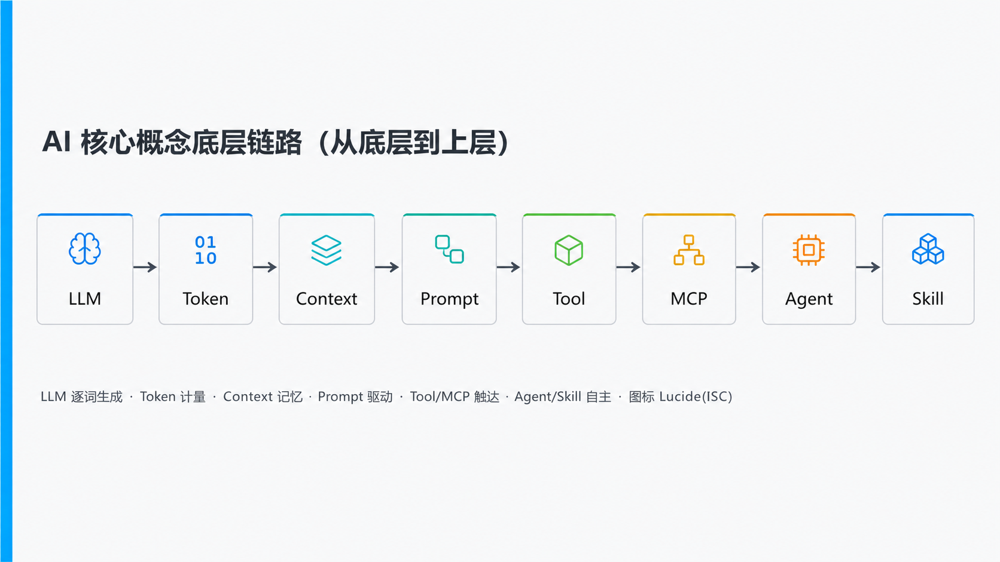
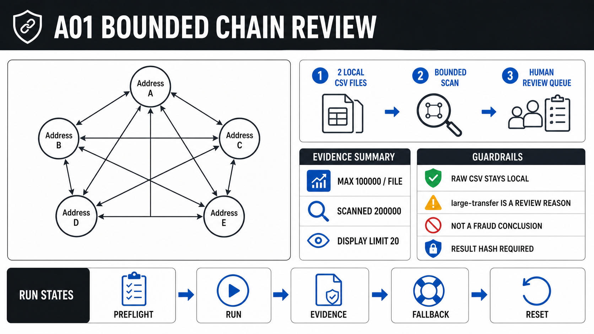
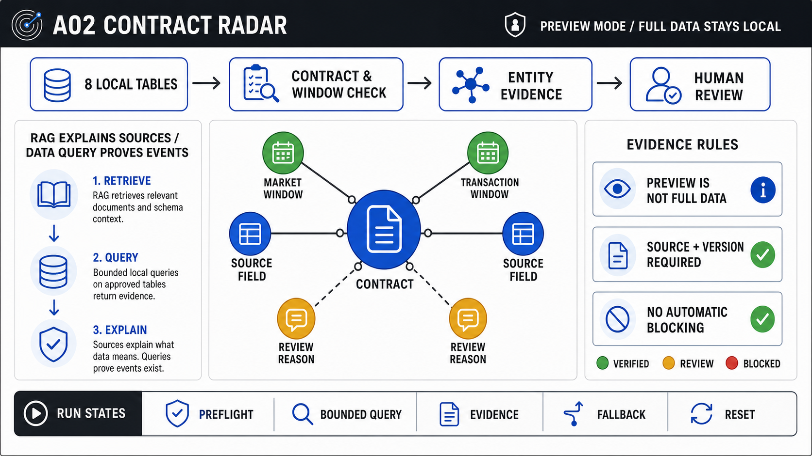
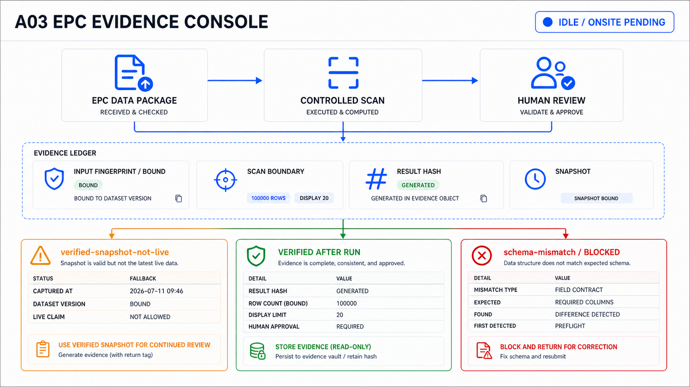
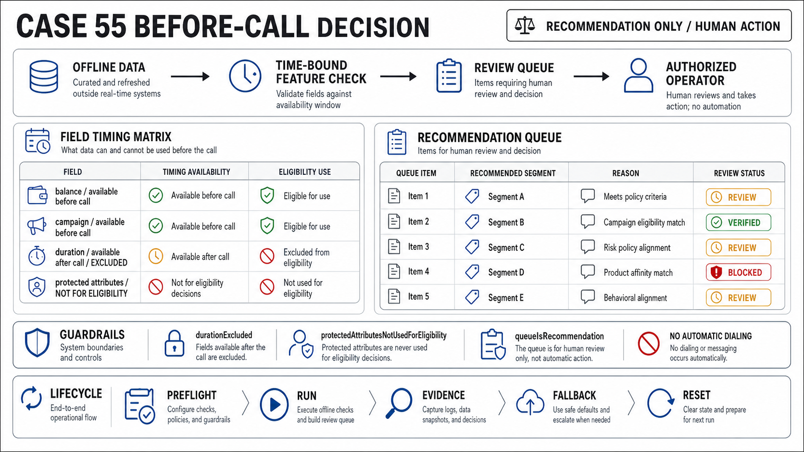
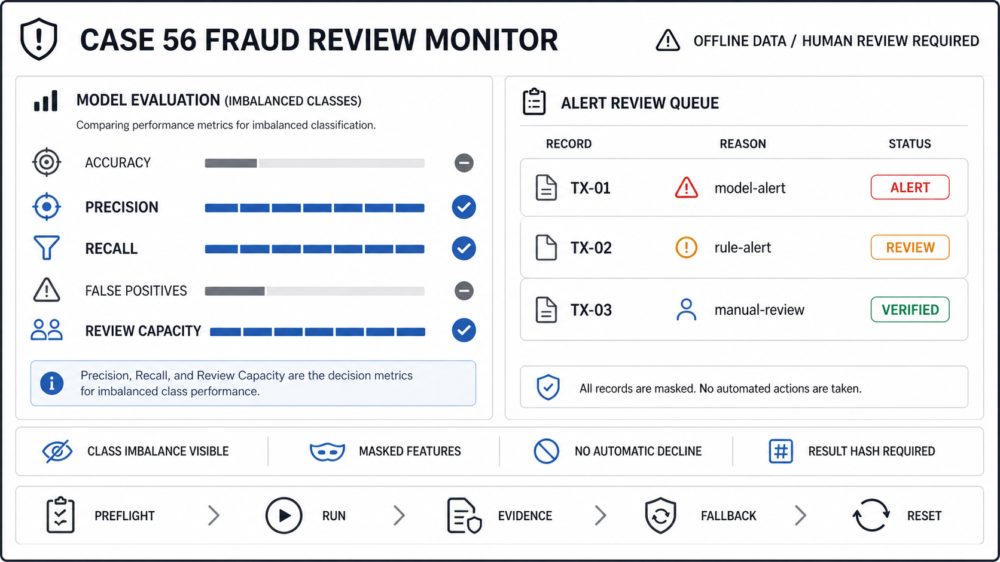
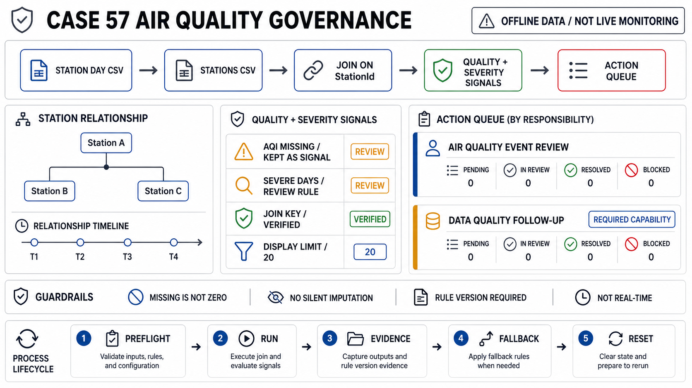

# HTML 讲师长课映射

## 定位

这不是把原教程逐章搬进幻灯片，也不是学员在线闯关。课程由讲师连续讲授并操作，学员只观看；同一份结构化课程包驱动投屏、讲者稿、运行任务、离线数据预检、故障回退和复盘证据。

固定合同：3 天、9 个单元、18 小时；560 分钟精讲、400 分钟演示、120 分钟串联复盘。任何连续讲授段不超过 50 分钟。

## 九个单元

| Day | 单元 | 现场证明 |
|---|---|---|
| 1 | 从业务问题到可验证系统 | A03 数据身份与字段预检 |
| 1 | 需求、用户与状态 | A03 角色、状态、异常分支 |
| 1 | 产品决策与边界 | 55 泄漏红线与行动队列 |
| 2 | 从 Prompt 到可停止 Loop | A01 大文件边界与重复失败停机 |
| 2 | SDD、DDD、C4 与 ADR | A03 从需求契约到架构决策 |
| 2 | 数据、RAG、MCP 与 Skill | A02 多表契约与权限边界 |
| 3 | Eval、安全与人工复核 | 56 极端不平衡与受控告警 |
| 3 | 运行、观测与治理 | 57 缺失、超标与责任队列 |
| 3 | A03 端到端走查 | 预检、运行、证据、失败、回退、重置 |

## 删冗余规则

1. 原教程和参考资料是素材库，不是章节顺序合同。
2. 同义结论只保留第一次定义、一次反例和一次运行证明。
3. 新闻、人物故事和没有一手来源的百分比不进入讲师口播。
4. 每个案例只承担一种不可替代的能力证明，不重复相同仪表盘。
5. “实操”必须包含输入身份、预检、类型化运行、预期信号、失败分支、证据对象和重置。

## 六步演示协议

`preflight → run → evidence → failure → fallback → reset`

- 浏览器只提交类型化 `jobId`，不执行任意 shell。
- 预检未通过时运行按钮保持阻断。
- 快照必须标记 `verified-snapshot-not-live`，不能伪装成本次运行。
- image2 原型只解释产品方向，当前状态以结构化 runtime evidence 为准。
- A02 当前全量 Parquet 仅做离线身份预检；课堂运行使用明确标注的 preview，禁止外推全量结论。
- 真实双屏认证和 18 小时人工走台必须在现场另行完成，机器审计不得代签。

## image2 图谱

完整身份和哈希见 [`assets/image2/manifest.json`](../assets/image2/manifest.json)。
