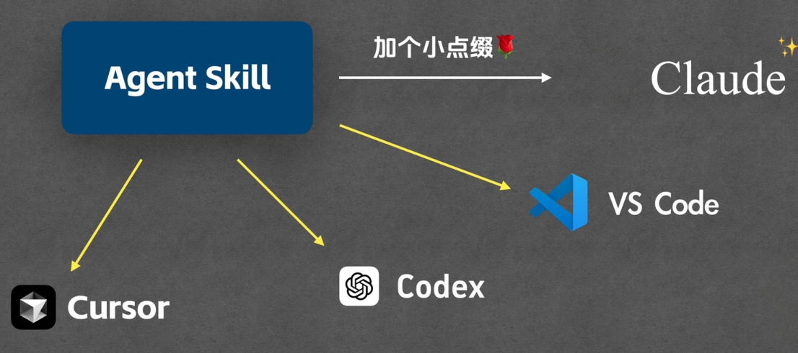
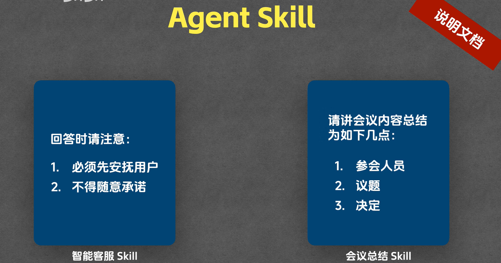
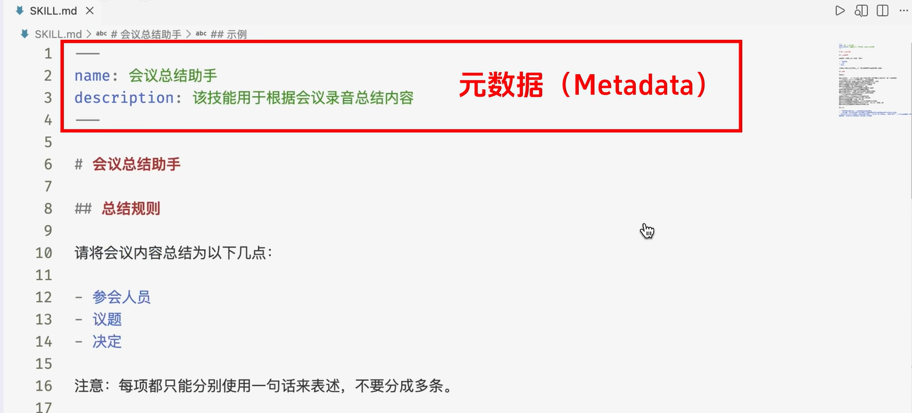
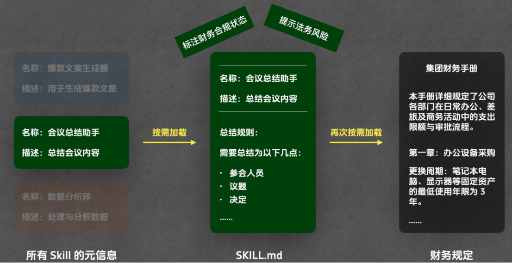

# Agent Skill 技术详解

## 一、Agent Skill 技术发展背景

Agent Skill 最初为 Claude 模型配套设计，核心初衷是针对性提升 Claude 在各类特定任务场景下的执行表现。该套技术架构凭借极强的实用性与通用性，快速获得行业认可，各大主流 AI 工具厂商纷纷跟进适配落地。

目前 VS Code、CURSOR 等主流 AI 编程、智能开发工具，均已全面兼容并支持 Agent Skill 相关能力，成为行业通用的技术配套方案。

在全行业普及落地的背景下，Anthropic 于12月18日推出重要行业更新：正式将 Agent Skill 对外开放为**通用开放标准**，彻底支持跨平台、跨产品复用。

这一举措标志着 Agent Skill 彻底摆脱了 Claude 单一产品的专属属性，不再是局限于单一模型的配套功能，已然升级为 AI 智能体领域的**通用设计模式**，成为全行业共建、通用落地的核心技术规范。

## 二、行业核心探究问题

随着 Agent Skill 成为行业主流技术标准，两大核心问题成为技术学习的重点，也是本文后续重点拆解的内容：

1\. Agent Skill 究竟解决了 AI 智能体落地过程中的哪些**核心痛点**，能够让各大科技厂商纷纷跟进适配？

2\. Agent Skill 与行业熟知的MCP 技术之间，存在怎样的**区别与关联**？

本文将分模块完整拆解以上问题，同时依次讲解 Agent Skill 的基础用法与高阶高级用法，全方位吃透该项技术。

## 三、Agent Skill 通俗核心定义

抛开复杂的技术术语，用最通俗的逻辑解释：Agent Skill 本质是**大模型专属的可复用自定义能力规则库**。

传统大模型交互存在明显短板，每一次对话、每一次任务执行，都需要人工重复粘贴对应的任务要求、输出规范、行为约束，操作繁琐且效率极低。而 Agent Skill 可以提前将各类任务规则、约束条件、输出格式预设配置完成，一次配置、永久复用。后续大模型执行对应任务时，会自动读取并严格遵循预设规则执行，无需人工重复叮嘱。

注：该定义为入门简化理解版本，Agent Skill 实际技术能力远超基础规则配置，其高阶高级功能、复杂落地能力将在后续章节详细讲解。新手入门阶段，可暂时将 Agent Skill 理解为**可复用、可预设、永久生效的 AI 任务专属说明文档**。

## 四、Agent Skill 实战落地场景（基础用法）

通过两个高频真实业务场景，可直观理解 Agent Skill 的核心价值与基础用法：

### 4\.1 智能客服场景

若需搭建专属 AI 智能客服，可直接在 Agent Skill 中提前预设客服行为规范：用户发起投诉时，优先安抚用户情绪，严禁随意向用户做出各类服务、结果承诺。

规则配置完成后，后续所有用户投诉对话场景，AI 都会自动遵循该规范应答，无需人工每次重复设定约束条件。

### 4\.2 智能会议总结场景

若需实现自动化会议总结功能，可在 Agent Skill 中固定输出格式规范，明确要求会议总结必须严格按照「参会人员\-核心议题\-会议决议\-待办事项」的固定结构输出。

后续 AI 生成所有会议总结内容时，都会自动适配预设格式，标准化输出内容，规避格式混乱、内容遗漏等问题，大幅提升办公效率。

演示用claude 完成会议总结的过程，具体可参见视频：[Agent Skill 从使用到原理，一次讲清_哔哩哔哩_bilibili](https://www.bilibili.com/video/BV1cGigBQE6n/?spm_id_from=333.1387.homepage.video_card.click&vd_source=53cc4ab182d19dd4baeac21fe0d801f9) 3：40秒

## 五、Agent Skill 进阶痛点：单层按需加载的局限性

前面我们讲到，Claude Code 的基础 Skill 运行逻辑是**一级按需加载**：启动任务时，模型会优先读取所有 Agent Skill 的名称与简短描述，例如爆款文案 Skill、会议总结 Skill、数据分析 Skill 等，由模型根据当前任务场景自主匹配所需技能。确定选中某一项 Skill 后，系统才会将对应 Skill 的完整 MD 文档内容灌入模型上下文，未选中的 Skill 资源则完全不加载，以此节省模型资源。

这套基础按需加载机制，已经解决了「全量加载、资源冗余」的基础问题，但在复杂业务场景下依旧存在明显短板。以会议总结助手为例，我们希望智能助手不再局限于简单的会议内容复述，而是具备**场景化智能校验、风险提示、合规补充**等高阶能力。

具体落地需求为：当会议内容涉及经费支出、预算审批、物资采购时，自动在总结中标注对应财务合规要求与标准；当会议内容涉及合作签约、权责协议时，自动提示潜在法务风险。如此一来，使用者阅读会议总结时，无需额外翻阅公司规章制度、财务条例、法务条款，即可直观获取关键合规提示，极大提升办公效率。

但想要实现该能力，就必须将完整的财务规章制度、法律条文等参考资料全部写入会议总结的 Skill 文件中。这类合规文档内容冗长、条目繁多，会直接导致 Skill 文件极度臃肿。

这就产生了新的资源浪费问题：如果只是一场普通的日常早会、技术复盘会，完全不涉及经费、合同、采购等场景，模型依旧需要加载整篇包含财务、法务条例的臃肿 Skill 文件，被迫载入大量完全无用的冗余信息，占用上下文窗口、消耗模型算力，造成资源浪费、推理速度变慢。

## 六、高阶解决方案：按需中的按需（Reference 条件加载机制）

针对上述痛点，Agent Skill 提供了**二级精细化按需加载**高阶能力，也就是「按需中的按需」：技能主体常驻、细分资料条件触发，只有当会议内容真正命中特定场景时，才动态加载对应的合规参考资料，无匹配场景则完全不加载，彻底杜绝资源冗余。

想要实现该能力，核心依托 Agent 术语中的 **Reference（条件参考文件）** 机制，完整落地配置流程如下：

第一步，新建独立 Reference 参考文件。在 Skill 目录下创建专属参考文档，例如《集团财务手册》，文档内详细录入企业标准化财务规范，包含各类费用报销标准、补贴规则、采购阈值等明细，如住宿补贴500元/晚、餐饮人均补贴300元/次、项目采购审批阈值等完整条例。

第二步，改写原有 Skill 规则，新增**场景触发约束**。在会议总结 Skill 的原有规则基础上，新增财务提醒专项规则：仅当会议内容提及经费、预算、采购、费用报销、项目支出等相关关键词与场景时，自动加载《集团财务手册》参考文件，并依据手册标准对会议内容进行合规校验、标注风险、补充规范说明；若无相关场景，则完全不加载该文件、不执行对应校验逻辑。

第三步，同理拓展法务、人事、行政等多维度 Reference 文件。按照同样逻辑，可单独创建《法务风险提示手册》《人事考勤规范》《行政审批流程》等独立参考文件，分别配置对应的触发条件，实现多维度精细化按需加载。

演示如何完成。

还有一些高级用法，演示如何完成的过程。
