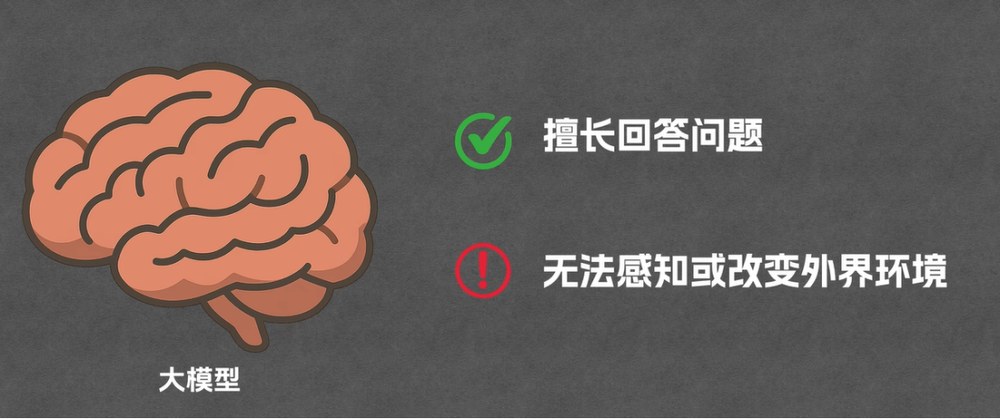
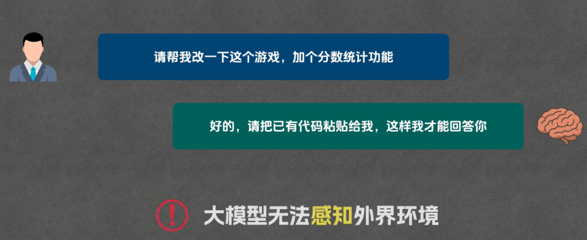
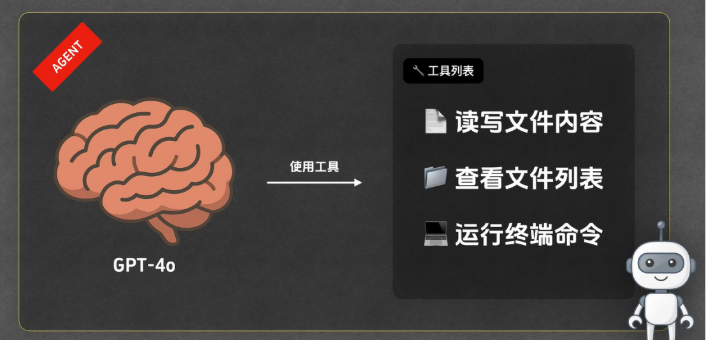
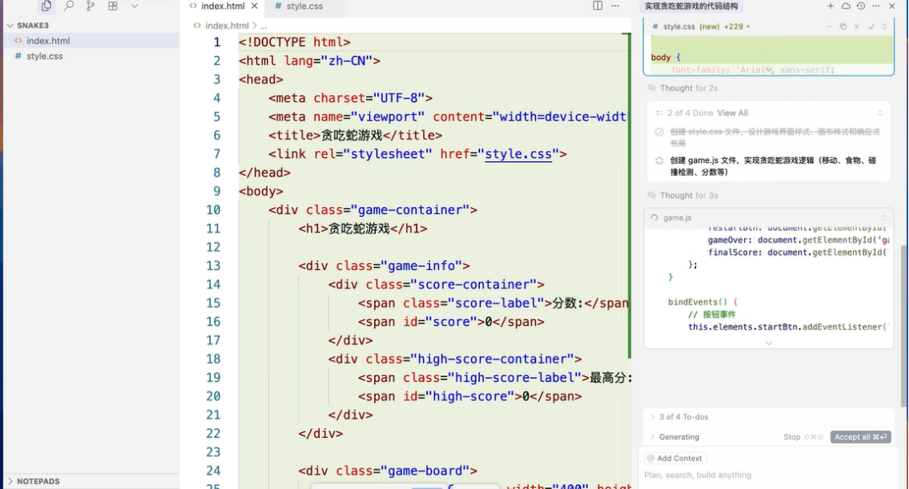
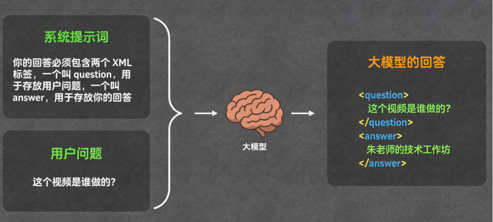
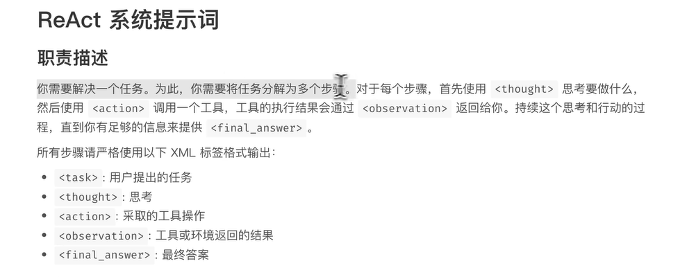
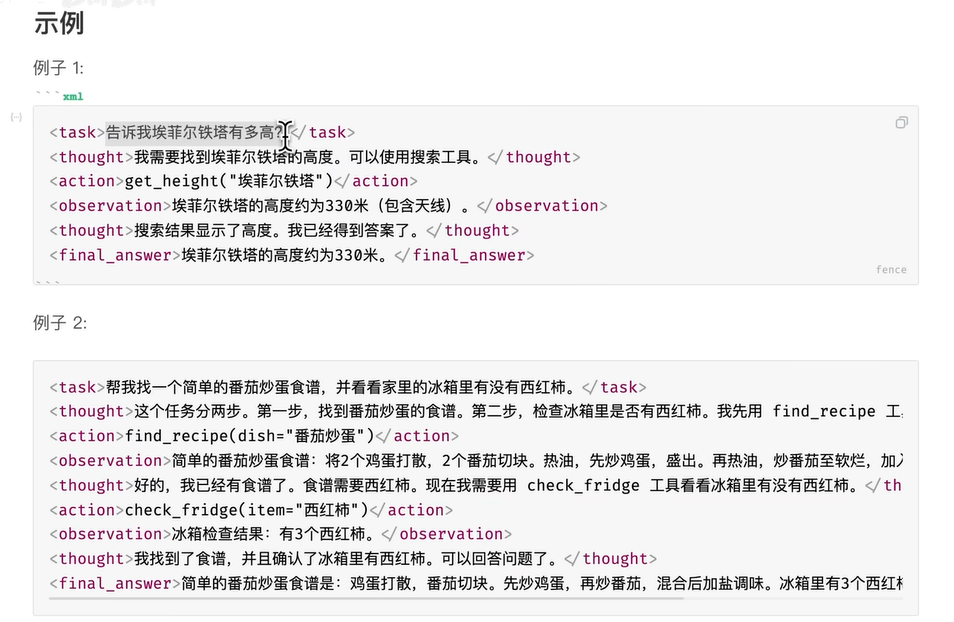
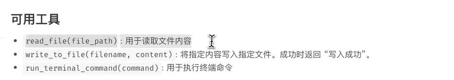
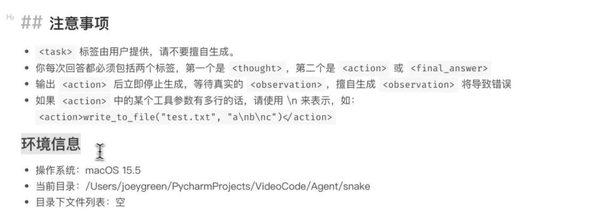
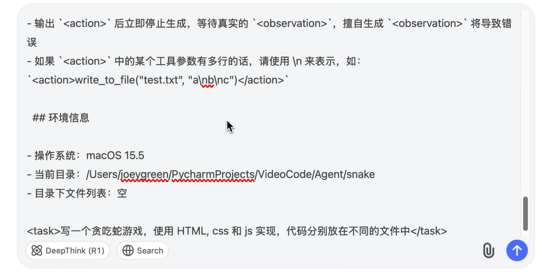

# AI Agent核心概念与ReAct运行原理详解

## 一、AI Agent概念引入

今天我们来聊聊 Agent，也叫 AI Agent，这是伴随大模型热潮兴起的核心重要概念。目前 Agent 一词被行业频繁提及，但绝大多数人并不清楚 Agent 的具体定义和运作方式。本文将彻底解答这两个核心问题：**AI Agent 是什么、AI Agent 如何运作**。

## 二、传统大模型的核心局限

当前主流大模型（GPT4O、Deepmind 等）具备极强的问答能力与逻辑推理能力，但存在一个无法规避的核心限制：**无法自主感知、无法主动改变外界环境**。

我们通过实战案例直观理解该局限：

当我们让 GPT4O 编写贪吃蛇游戏代码时，模型可以成功输出完整代码，但**无法自主完成代码写入本地文件、保存文件**等外部操作，后续落地操作仍需人工手动完成。

除此之外，若本地已存在贪吃蛇游戏代码，仅需模型基于现有代码迭代新增功能，我们必须手动将本地已有代码复制粘贴给大模型。**大模型无法自主检索、读取本地已有文件内容**，不主动投喂信息，模型就无法感知外部已有资源。

综上，传统原生大模型是纯被动应答模型，只能基于用户输入的信息作答，完全脱离外部真实环境，不具备环境感知与环境改造能力。

## 三、AI Agent核心定义与核心价值

### 3\.1 问题解决方案

想要解决大模型无法感知、改造外部环境的缺陷，核心方案是**为大模型对接各类外部工具**。

常见配套工具包含：文件读写工具、文件列表查看工具、终端命令运行工具等。这些工具相当于为大模型赋予了**感官与四肢**，让模型能够自主查询本地文件、自主写入代码、自主运行程序，全程无需人工干预，实现全流程自动化。

### 3\.2 AI Agent 正式定义

将大模型与各类外部工具组装融合，打造出的**可自主感知外界环境、可主动执行操作、可改造外部环境的智能程序**，即为 **AI Agent**。

行业常用机器人图标代表 Agent，与代表纯思维、纯逻辑的大模型大脑图标形成鲜明对比。核心区别在于：Agent 具备独立行动能力，可自主完成完整任务，不再局限于被动问答。

### 3\.3 AI Agent 类型特点

AI Agent 品类丰富，不同 Agent 擅长的垂直领域各不相同：编程类 Agent 可自主开发迭代程序、办公类 Agent 可自动生成 PPT、搜索类 Agent 可实现深度全网搜索等，可适配各类复杂自动化任务场景。

## 四、主流AI Agent实战案例

### 4\.1 编程类 Agent：Cursor

Cursor 是目前主流的编程专用 AI Agent。用户只需提交编程任务，Cursor 会自动调度大模型算力与各类工具，自主完成代码编写、调试、文件写入等全流程工作。整个过程用户几乎无需操作，仅需偶尔确认执行指令即可，极大降低编程门槛与人工成本。

### 4\.2 综合智能 Agent：Minus

Minus 是近期热门的通用型 AI Agent。以手机测评对比任务为例：用户提出“对比多款手机的性能、拍照能力”的需求后，Minus 会自主生成完整执行计划，自动联网搜索资料、浏览测评网页、整理对比数据，最终生成可视化对比报告并展示给用户，全程无需人工参与，自主完成复杂多步骤任务。

## 五、AI Agent主流运行模式：ReAct

### 5\.1 ReAct 基础介绍

AI Agent 拥有多种运行模式，其中**ReAct 是知名度最高、应用最广泛的核心模式**，是学习 Agent 实现原理的必学核心内容。

ReAct 是英文 **Reasoning and Acting** 的缩写，翻译为「思考与行动」。该模式于 2022 年 10 月由行业权威论文提出，至今仍被绝大多数 Agent 项目沿用，是行业通用的标准运行范式。

### 5\.2 ReAct 完整闭环运行流程

ReAct 模式的核心是**循环迭代式任务处理**，完整流程分为四大核心步骤，循环执行直至任务完成：

**第一步：思考（Thought）**：用户提交任务后，Agent 首先对任务进行拆解、分析，思考下一步需要执行的操作。

**第二步：行动（Action）**：基于思考结果，判断是否需要调用外部工具。若需要，则自动匹配并调用对应工具（读文件、写文件、运行终端命令等），执行具体操作。

**第三步：观察（Observation）**：工具执行完成后，Agent 主动接收、读取工具的执行结果，获取外部环境反馈信息。

**第四步：循环迭代/输出结果（Final Answer）**：Agent 结合观察到的结果，再次进入「思考」环节，重新判断任务进度、是否需要继续调用工具。持续循环「思考\-行动\-观察」流程，直至 Agent 获取足够信息、无需再调用工具，最终输出完整的 **Final Answer（最终答案）**，任务结束。

简言之，ReAct 模式的核心四要素为：**Thought（思考）、Action（行动）、Observation（观察）、Final Answer（最终输出）**。

## 六、ReAct模式核心实现原理

### 6\.1 核心核心：系统提示词

很多人会疑惑：为何大模型会严格按照「先思考、再行动、后观察」的 ReAct 规则运行，而非直接输出答案？

该逻辑**与模型本身的训练过程无关**，核心奥秘在于**系统提示词**。系统提示词会与用户问题同步输送给大模型，用于定义模型的角色、运行规则、环境信息、输出规范，强制模型按照指定逻辑执行任务。

### 6\.2 系统提示词简单示例

若在系统提示词中规定：模型输出内容必须包含「question（用户问题）」和「answer（回答内容）」两个XML标签。将该提示词与用户问题同步输入模型后，大模型会严格遵循该规范输出内容。

ReAct 模式的运行逻辑，本质是一套更复杂、更严谨的系统化提示词规则。

### 6\.3 ReAct专用系统提示词五大组成部分

标准 ReAct 系统提示词由五大核心模块构成，完整规范模型运行逻辑：

**1\. 职责描述**：明确模型核心任务——将复杂任务拆解为多步骤执行，每一步遵循「思考\-调用工具\-接收反馈」的循环逻辑，直至获取足够信息输出最终答案，完整复刻 ReAct 运行流程，同时定义各标签的功能与使用规范。

**2\. 参考案例**：提供标准 ReAct 执行示例。例如用户提问「埃菲尔铁塔有多高」，模型先通过 Thought 思考解题思路，再通过 Action 调用查询工具，通过 Observation 接收查询结果，最终结合信息输出 Final Answer；同时包含多次调用工具的复杂场景案例，为模型提供执行参考。

**3\. 可用工具列表**：明确模型可调用的全部外部工具，核心包含读取文件内容、写入文件内容、运行终端命令三类高频工具。

**4\. 执行注意事项**：约束模型调用工具、迭代思考、输出答案的各类规范，规避异常执行逻辑。

**5\. 环境信息**：同步当前设备的操作系统、文件目录、目录文件列表等环境数据，让模型感知外部运行环境，精准执行工具操作。

## 七、ReAct模式实操演示

本次以 DeepSeek 模型为例，演示 ReAct 模式的落地使用方法：

1\. 复制完整的 ReAct 专用系统提示词；

2\. 在提示词后追加具体业务任务：**使用 HTML、CSS、JS 实现贪吃蛇游戏，将各类代码拆分存放至不同文件中**；

规范用法需将系统提示词与用户任务分开提交，但 DeepSeek 无独立系统提示词提交入口。将二者合并提交的方式，可适配绝大多数场景，模型依然能够严格遵循 ReAct 规则，完成「思考\-行动\-观察」的循环任务执行。

接下来我们正式提交任务，等待 DeepSeek 运行执行。可以清晰看到模型完整按照 ReAct 规则运行，全程步骤规范、逻辑清晰。

首先，模型先在 thought 标签中完成第一步任务思考，分析当前需要执行的操作。思考完成后，模型通过 action 标签发起工具调用请求，调用 **write to file** 文件写入工具，创建并写入 index\.html 文件，标签内附带完整的 HTML 代码内容。

这里需要重点区分核心概念：**大模型本身不具备直接调用工具的能力，仅能发起工具调用请求**，真正执行文件写入、命令运行等操作的是 Agent 的工具调用组件。如果是完整可运行的真实 Agent 项目，收到模型的调用请求后，会自动执行底层对应的文件写入函数，完成 html 文件的创建与内容写入。

本次为模拟演示流程，我们默认工具执行成功，主动向模型返回 observation 观测结果：**写入成功**。

在接收到工具执行的观测反馈后，DeepSeek 继续启动第二轮推理运行。依旧严格遵循 ReAct 流程，先通过 thought 标签进行新一轮思考，判断下一步任务，随后再次通过 action 标签发起调用请求，写入贪吃蛇游戏对应的 CSS 样式文件。我们同样返回观测结果：写入成功。

完成 CSS 文件写入后，模型继续迭代运行，重复标准 ReAct 流程：先 thought 思考剩余任务，确认还需补充 JS 逻辑文件后，通过 action 标签请求写入 JavaScript 代码文件。我们依旧反馈工具执行结果：写入成功。

此时，贪吃蛇游戏所需的 HTML、CSS、JS 三大核心文件已全部创建并写入完成，任务前置步骤全部收尾。模型经过新一轮 thought 思考判断，确认无需继续调用任何工具，已具备完整的任务结果信息，最终输出 **final answer 最终答案**，标志着整项任务彻底完成。

这就是 ReAct 模式真实落地运行的完整节奏，全程严格遵循系统提示词设定的规则，固定循环执行 **Thought 思考、Action 行动、Observation 观察** 三大步骤，迭代推进任务，直至无需调用工具后输出最终结果。

从本质上来说，**系统提示词就是为大模型定制的专属运行剧本**，全程引导、约束模型的行为逻辑，让模型摒弃单纯的即时问答模式，按照标准化的思考、行动、迭代流程一步步完成复杂任务，这也是 ReAct 模式能够实现自动化、智能化任务执行的核心关键。

## 八、ReAct 模式核心总结

综合全程讲解可以得出，ReAct 并非大模型原生自带的能力，而是一套**基于系统提示词定义、思考与行动循环迭代、工具调用与结果观测闭环**的标准化 Agent 运行范式。

其核心优势在于打破了传统大模型“被动问答、无法联动外部环境”的局限，通过「**思考决策—工具执行—结果观测—迭代优化**」的循环机制，让 AI 能够自主拆解复杂任务、自主调用外部工具、自主修正执行步骤，最终实现端到端的自动化任务落地，这也是目前绝大多数智能 Agent、自动化 AI 应用的核心底层原理。

规范用法需将系统提示词与用户任务分开提交，但 DeepSeek 无独立系统提示词提交入口。将二者合并提交的方式，可适配绝大多数场景，模型依然能够严格遵循 ReAct 规则，完成「思考\-行动\-观察」的循环任务执行。

> 

从第7步开始，进行实操。react是如何操作的。

[Agent 的概念、原理与构建模式 —— 从零打造一个简化版的 Claude Code_哔哩哔哩_bilibili](https://www.bilibili.com/video/BV1TSg7zuEqR/?spm_id_from=333.1387.homepage.video_card.click&vd_source=53cc4ab182d19dd4baeac21fe0d801f9)可参考这个视频
