# LLM、Token等AI核心概念底层工程解析

当下AI领域不断涌现各类新名词：LLM、Token、context prompts tool、MCP agent skill。很多人对这些概念只知其名、不知其意。本文摒弃空洞的商业概念包装，从底层工程视角，逐一拆解、细化各个核心概念，帮大家搭建扎实的AI底层认知，逐层吃透AI技术逻辑。

## 一、LLM（大语言模型）核心定义与发展历程

### 1\.1 核心定义

LLM 全称 Large Language Model，中文译为大语言模型，简称大模型，是当前生成式AI的核心底层基础。目前市面上绝大多数大模型，均基于 **Transformer** 架构训练迭代而来。

这套核心架构由Google团队在2017年正式提出，对应的奠基性论文为《Attention Is All You Need》。该架构看似复杂，但无需深究表层结构，只需明确：它是所有现代大模型的技术根基。

### 1\.2 行业发展演进

Transformer架构诞生后，AI行业逐步迎来爆发式增长：

1\.  初代可用级大模型落地，让大众首次直观感受到AI的强大能力，为后续AI浪潮奠定基础；

2\.  2023年3月，GPT\-4正式发布，直接拉高了人工智能的能力天花板，重新定义了大模型的能力边界；

3\.  时至今日，GPT家族依旧是业界标杆，例如GPT\-5\.4仍处于行业第一梯队；

4\.  当前AI赛道早已告别OpenAI独家垄断的局面，Claude、Gemini等优质模型快速崛起，在各自细分领域与GPT系列同台竞技、各有优势。

## 二、LLM底层核心工作原理

大模型的工作逻辑其实非常朴素，本质就是**自回归文字接龙**，我们通过实例完整拆解运行流程：

当你向大模型提问：“朱老师的讲座怎么样？”，模型接收指令后，会通过内部运算，预测出概率最高的首个词汇，比如“特别”。

这里是核心关键点：模型输出“特别”后不会停止，而是将刚生成的词汇追加到原始输入语句后方，形成全新的完整输入，再基于新输入继续预测下一个词汇，比如“得”。

随后重复该逻辑，持续迭代预测，依次输出“棒”等词汇。当模型判定语义完整、语句收尾后，会输出一个**特殊结束标识符**，终止生成流程，最终输出完整回答：“特别的棒”。

这就是大模型最底层的**生成原理**，也完美解释了为什么大模型永远是逐词、逐字输出答案——这是其核心运行机制决定的。

## 三、Tokenizer：人机交互的核心翻译中介

上述逐词生成的逻辑是为了方便理解做的简化讲解。真实的工程底层中，大模型本质是一套庞大的数学函数，内部全程运行矩阵运算，**只识别数字，完全无法读懂人类文字**。

因此，人类与大模型之间需要一个“翻译中间人”——**Tokenizer（分词器）**，它的核心工作只有两件事：编码、解码。

### 3\.1 编码：文字转数字（输入环节）

编码是将人类自然语言，转化为模型可识别数字的过程，分为固定两步：

**第一步：切分**。Tokenizer接收用户输入的完整文本，将其拆解为最小独立片段，这个最小片段就是 **Token**。例如“朱老师的讲座怎么样？”会被精准切分为4个独立Token。

**第二步：映射**。由于模型仅识别数字，每一个Token都会一对一绑定一个专属数字编号，这个编号就是 **Token ID**。

简单来说：**Token是文字形态的最小单元，Token ID是数字形态的对应编码**，二者本质一一对应、指代同一内容。经过切分、映射两步后，人类的自然语句就会转化为一串Token ID数字列表，输入大模型完成运算。

### 3\.2 解码：数字转文字（输出环节）

解码是编码的反向流程，仅需**一步反向映射**，无需二次切分。

大模型完成矩阵运算后，会输出对应的Token ID，Tokenizer接收数字编码后，将其反向翻译为文字形态的Token，这就是我们看到的模型输出内容。

若模型语句未生成完毕，会持续输出Token ID、持续解码，循环往复直到生成结束标识符，完成完整回答输出。

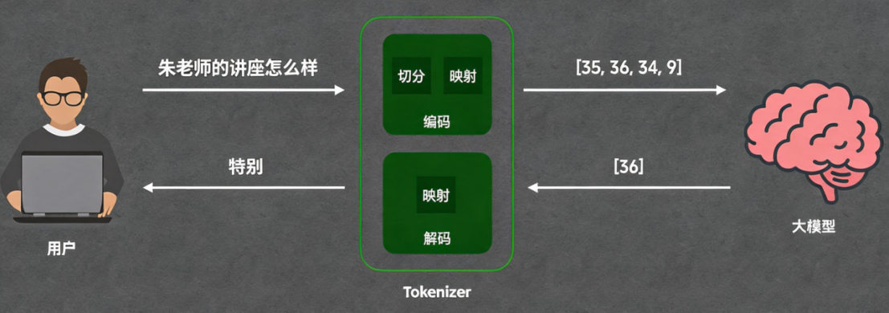

## 四、Token的核心认知误区与量化标准

### 4\.1 核心误区：Token ≠ 词语

通过前文案例，很多人会误以为“一个Token对应一个词语”，**这是典型认知误区**，前文的匹配案例只是巧合。Token和人类认知中的汉字、词语，并非固定一对一关系。

结合OpenAI官方分词测试规则来看：很多完整的固定词组、常用词汇，会被Tokenizer拆分为多个Token；部分特殊字符、生僻字符，甚至单个字母都会被切分为多个Token，无对应可视字符时，界面会以问号展示。

综上，**Token才是大模型处理文本的唯一最小单元**，其切分逻辑基于模型训练语料，和人类的语言语法、字词划分规则完全不同。

### 4\.2 Token通用量化换算标准

行业通用的Token与常规文字换算比例，可作为算力、上下文长度评估的核心参考：

- **1个Token ≈ 0\.75个英文单词**

- **1个Token ≈ 1\.5\~2个汉字**

- 40万Token ≈ 60\~80万汉字 / 30万英文单词

## 五、 上下文 Context 与上下文窗口 Context Window

理解Token的定义与运作逻辑后，我们来拆解一个大家日常使用AI时都会疑惑的问题：大模型本身只是一个纯数学函数，仅遵循**“输入对应输出”**的运算逻辑，并不具备人类真正的记忆能力，那为什么它能记住我们之前的聊天内容？

核心答案在于：我们每一次向大模型发送消息时，前端程序并不会只单独传输当前的新问题，而是会自动调取**完整的历史对话记录**，和当前提问拼接在一起，统一传给大模型。模型每一次接收的都是一套完整的对话信息，自然能够“记住”过往的聊天内容。

这就引出了关键概念——**Context（上下文）**。

简单来说，Context是大模型单次处理任务时，接收到的**所有信息的总和**，也是大模型的临时记忆载体。

我们熟知的用户提问、历史对话记录，都是Context的核心组成部分。除此之外，大模型实时生成的每一个Token、后台配置的系统指令、可调用的工具列表等所有传入模型的信息，都会被纳入Context范畴。这些后续概念我们会逐一拆解，大家只需先牢记核心定义：**上下文就是大模型单次运算的全部输入信息集合。**

明确Context的定义后，新的核心问题随之而来：这个临时记忆体的容量有没有上限？它最多能容纳多少Token？这就需要了解**Context Window（上下文窗口）**的概念。

上下文窗口，指的是大模型单次任务能够承载的**最大Token数量**，直接决定了模型的记忆长度和单次处理信息的体量。

举个直观的例子：如果某模型的上下文窗口为1万Token，就代表它单次最多只能处理1万个Token的信息，超出部分会被截断，模型无法识别。在当下的AI行业中，1万Token的上下文窗口已经属于极小容量，主流大模型的上下文承载力都达到了百万级。

目前主流大模型上下文窗口规格参考：

- **GPT\-5\.4：105万Token**

- **Gemini 3\.1 Pro：100万Token**

- **Opus 4\.6：100万Token****

结合之前讲到的Token换算规则：1个Token约等于1\.5个汉字，100万Token就对应约150万个汉字。这个容量足以容纳整本《哈利·波特》全集，足以满足绝大多数长文本处理、长对话交互的场景需求。

了解上下文窗口的容量限制后，我们可以思考一个实际落地场景：如果我们有一份上千页的公司产品手册，想要让大模型依托这份手册解答用户的各类咨询，是否需要把整本手册的内容全部拼接用户问题，一次性传给大模型？

答案是否定的。这种方式存在两个致命问题：第一，即便模型的上下文窗口足够大、能够承载全文内容，海量Token的输入会带来极高的调用成本，资源浪费严重；第二，全文输入会引入大量无关冗余信息，干扰模型判断，降低回答精准度。

行业主流的最优解决方案是**RAG检索增强生成技术**：不将完整手册传入模型，而是通过检索算法，从产品手册中精准抽取与用户问题**高度匹配的核心片段**，仅将这些关键片段\+用户问题传入大模型。

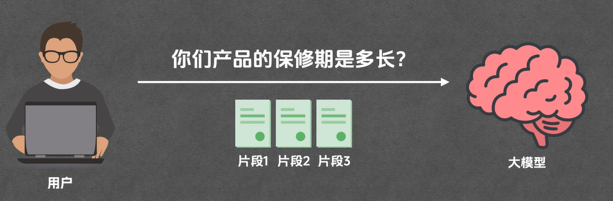

这种方式彻底摆脱了上下文窗口的容量限制，极大降低AI调用成本，同时让模型的回答更聚焦、更精准，也是目前企业知识库、文档问答场景的核心技术方案。

## 六、 Prompt（提示词）核心逻辑与提示词工程

搞懂模型底层Token运算、上下文承载逻辑后，我们再深入上层应用核心概念——Prompt（提示词）。

Prompt的定义非常简单：它是用户传递给大模型的**具体任务、问题或指令**，是触发模型运算、驱动模型输出结果的直接输入。简单说，没有Prompt，大模型就没有运算目标，不会产生任何输出。

但很多人不知道的是：**Prompt的精准度，直接决定大模型的输出质量**。

我们通过对比案例直观感受：如果只给模型模糊指令“帮我写一首诗”，模型的输出结果是完全不可控的。它可能生成五言古诗、七言律诗，也可能生成现代散文诗，甚至是通俗打油诗，输出结果完全随机，无法匹配用户潜在需求。

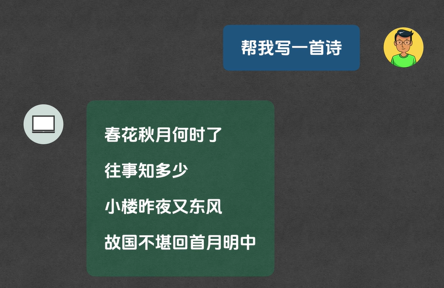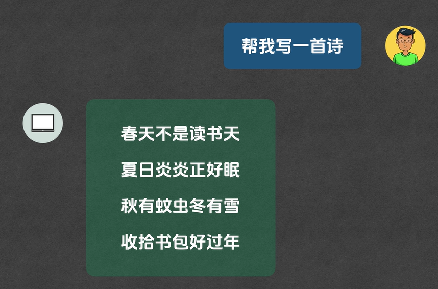

但如果我们将Prompt优化为精准、具体、清晰的指令：“请帮我写一首五言绝句，主题是秋天的落叶，整体风格偏向悲凉萧瑟”，模型就能精准捕捉核心需求，从体裁、主题、风格三个维度精准落地，输出结果完全贴合用户预期。

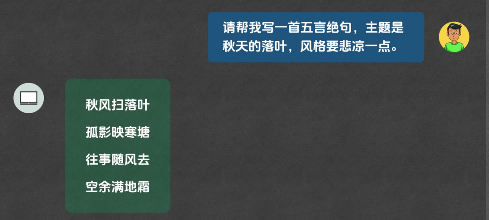

基于这个逻辑，衍生出了专门的技术领域——**提示词工程（Prompt Engineering）**。其核心本质并不复杂，说白了就是研究如何精准、清晰、完整地描述任务，消除指令模糊性，让大模型精准匹配用户需求。

值得一提的是，提示词工程的行业热度如今大幅降温，很少有人再深度研究。核心原因有两点：第一，这项技术门槛极低，本质就是规范表达、清晰描述需求，没有复杂的技术壁垒；第二，大模型的基础理解能力持续迭代升级，如今的主流模型具备极强的语义脑补、意图识别能力，即便用户的Prompt模糊、残缺，模型也能精准预判用户潜在需求，大幅降低了精准提示词的使用门槛。

## 七、 System Prompt 与 User Prompt 的核心区别

基础的Prompt认知成型后，我们需要进一步区分两类核心提示词，这是AI能够精准人设、遵守规则、稳定输出的核心关键。日常使用中，Prompt分为**User Prompt（用户提示词）**和**System Prompt（系统提示词）**，二者分工明确、各司其职。

简单区分核心定义：

**User Prompt：**由用户主动输入，核心作用是**下达具体任务、提出具体问题**，是每一轮对话的核心需求指令。

**System Prompt：**由开发者在后台提前配置，用户无法修改、无法查看，核心作用是**定义模型人设、设定行为规则、约束输出边界**，全程贯穿所有对话，持续影响模型输出风格与逻辑。

我们通过「数学辅导机器人」的实战案例，彻底吃透二者的配合逻辑：

我们的需求是：打造一个数学辅导机器人，不直接给学生报答案，而是通过引导式提问，启发学生自主思考。想要实现这个效果，就需要两类Prompt配合生效。

第一，后台配置**System Prompt**：固定设定规则——“**你是一名耐心专业的小学数学老师，学生向你提问数学问题时，禁止直接给出最终答案，需要通过生活化举例、分步提问的方式引导学生自主思考，启发学生解题思路**”。

这段系统提示词是底层规则，全程生效，锁定了模型的人设和输出逻辑。

第二，用户输入**User Prompt**：学生在对话框输入具体问题——“3\+5等于多少？”。

如果没有System Prompt的约束，模型会直接输出标准答案“8”，简单直白但没有辅导价值。

而在系统规则的约束下，模型会坚守人设和规则，输出引导式回答：“我们可以这样思考哦，你手里有3个苹果，妈妈又给你拿来5个苹果，现在你手里一共有多少个苹果呀？可以自己数一数哦。”

通过这个案例可以清晰看出二者的核心价值：**System Prompt定规矩、定人设、定边界，User Prompt定任务、定需求、定内容**，二者相互配合，才能让大模型既遵守规则，又精准完成用户的各类任务需求。

## 八、 Tool（工具）：补齐大模型的外部感知短板

理解了Prompt体系后，我们需要直面大模型的核心原生弱点：**天然无法感知、无法触达外部真实环境**。

大模型的所有能力，都来源于训练数据集，它的本质是文字概率预测，只能基于已有知识库做内容生成，没有实时联网、查询、调用外部接口的能力。这也是为什么当我们问模型“**今天上海的天气怎么样**”时，模型会回复无法获取实时数据、知识库存在时间截止的核心原因。

想要弥补这个短板，让大模型从“纯文本脑补”变成“可对接真实世界”，就必须引入全新的核心概念——**Tool（工具）**。

Tool的底层本质非常简单，就是一个**可被调用的函数**：接收指定输入参数，通过内部逻辑或外部接口运算，返回精准的结构化输出结果。

以天气查询工具为例：它的固定入参为「城市、日期」，接收参数后会调用官方气象接口，完成数据查询与解析，最终返回标准化的天气数据，完美解决大模型无实时信息的痛点。

完整的工具调用流程一共涉及四个核心角色：**用户、平台、大模型、工具**。其中平台是很多人容易忽略的关键角色，它本质是一段后台代码，承担**上传下达、信息中转**的传话筒职责。因为大模型无法直接对接外部工具接口，必须依托平台完成指令传递和工具调用，整套完整运行逻辑如下：

第一步：用户提问，内容首先发送至平台，平台将原始问题转发给大模型；

第二步：大模型自主分析任务，识别出自身无实时天气数据，但平台挂载了天气查询工具，判定需要调用外部工具完成任务；

第三步：大模型无法直接调用工具，只能生成标准化的**工具调用指令**，包含目标工具名称、所需参数，回传给平台；

第四步：平台解析指令，主动调用对应的天气工具函数，传入参数并执行查询，获取实时天气结果；

第五步：平台将结构化的天气数据回传给大模型；

第六步：大模型将冰冷的结构化数据，整理成通顺的自然语言回答，再次交给平台；

第七步：平台将最终回答转发给用户，完成完整交互。

整套流程下来，两个核心主体分工清晰：大模型负责**思考判断、决策调用工具、整理输出答案**；平台负责**流程串联、指令解析、执行工具调用、数据中转**。工具的核心价值，就是为大模型提供各类外部专属能力，让模型突破训练数据限制，感知真实、实时的外部世界。

## 九、 MCP（模型上下文协议）：工具统一接入标准

既然工具能极大拓展大模型的能力边界，想要落地使用，首先就需要将工具接入AI平台。但行业长期存在一个痛点：**不同AI平台的工具接入标准完全不统一**。

同一个工具，想要适配GPT、Gemini、Claude等不同平台，需要针对每个平台单独开发、改写三遍代码，重复工作量极大、效率极低，严重限制了工具的复用性和行业发展。

为了解决这个行业痛点，统一的工具接入规范应运而生——**MCP（Model Context Protocol，模型上下文协议）**。

这个概念看似学术，核心逻辑却极其简单：**一套通用的AI工具统一接入标准**。

它的作用可以类比手机Type\-C接口：在没有统一标准之前，不同品牌手机充电接口各不相同，充电器无法通用；而Type\-C统一标准后，一款充电器可以适配所有兼容设备。

MCP也是同理：工具开发者只需按照MCP规范**开发一次工具**，这款工具就可以无缝接入、适配所有支持MCP协议的AI平台，无需重复开发改写，彻底解决多平台适配繁琐、工具无法复用的行业难题，极大提升AI工具的开发和落地效率。

## 十、 Agent（智能体）：大模型的自主多步任务规划能力

有了Tool工具补齐外部感知能力、有了MCP统一工具接入标准，大模型的能力已经实现了质的飞跃，但依旧存在明显短板：**无法自主完成复杂的多步骤串联任务**。

前面讲到的天气查询，属于单步工具调用任务，简单易执行。但真实场景中的用户需求，往往复杂且需要多工具联动、多步骤推理。

我们举一个典型复杂场景：用户提问“帮我看一下我当前位置的天气，如果下雨的话，就帮我查找附近的雨伞店”。

想要完成这个需求，需要联动三套能力、执行多步逻辑：通过定位工具获取用户经纬度、通过天气工具根据经纬度查询实时天气、通过店铺工具根据天气结果二次判断并检索周边店铺。整套流程需要**模型自主思考、分步决策、条件判断、多次调用工具**，单次工具调用完全无法实现。

这就引出了核心概念——**Agent（智能体）**。

Agent的核心能力是**自主规划、分步推理、循环执行**。面对复杂任务，它可以像人一样分步思考：第一步需要什么信息、需要调用什么工具、拿到结果后下一步该做什么、根据不同结果执行不同分支逻辑，循环往复，直到完整完成用户的全部需求。

上述案例中，Agent的完整思考与执行逻辑如下：

第一步：拆解用户需求，明确核心前置条件——需要先获取用户位置经纬度，调用定位工具，拿到位置数据；

第二步：基于经纬度数据，调用天气查询工具，获取当前位置的实时天气状况；

第三步：自主判断分支逻辑，若天气无雨，任务终止；若下雨，继续执行下一步；

第四步：触发条件分支，调用周边店铺工具，检索当前位置附近的雨伞店，整合所有信息输出最终结果。

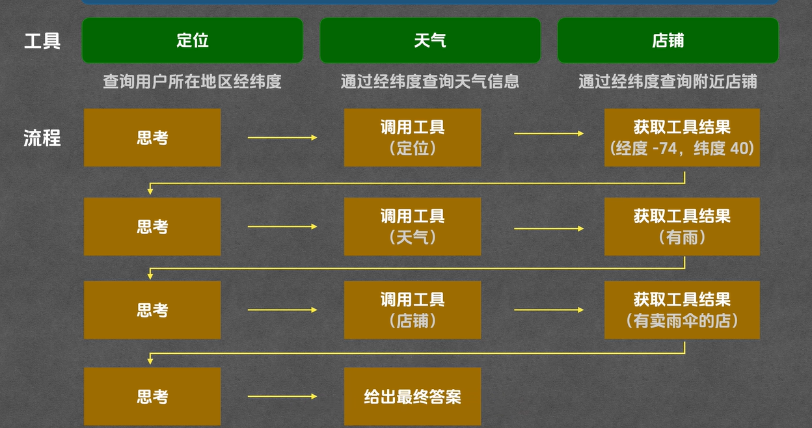

这套自主思考、分步执行、循环迭代的核心架构，就是行业常说的**ReAct推理架构**，也是所有AI智能体的底层核心原理，让大模型从“被动单次应答”升级为“主动自主完成复杂任务”。这种方式就是Agent，目前比较流行的是包括 cloud Code、Codex、Gemini CLI 等等，它们所使用的 agent 构建模式也是五花八门，比较经典的有 react，plan and excute 等等。

## 十一、 Agent Skill（智能体技能）：固化个性化专属执行能力

我们已经知道，Agent智能体可以自主规划流程、主动调用工具、持续迭代工作，直到完整完成用户任务，能力已经非常强大。但在高频、个性化的实际使用场景中，它依然存在明显痛点。

我们举一个生活化的例子：假设我们想把大模型打造成专属出门小助手，每次出门前自动查看天气、根据个人习惯提醒携带物品。每个人都有专属的生活规则：下雨必须带伞、光照强烈需要戴帽子、空气质量差要戴口罩、大风天气需要穿防风外套，无论任何天气、任何场景，手机必须随身携带。

同时很多人有细节化的使用要求，比如希望AI的回答简洁不冗余，严格按照固定格式输出：先输出整体出行总结，再罗列对应的携带物品清单。

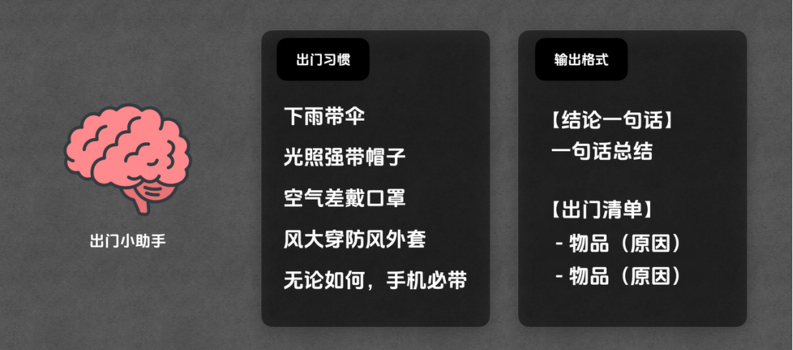

在没有任何额外设定的前提下，如果我们只简单提问一句：“我马上要出门，该带些什么？”，普通Agent虽然能够自主调用工具查询天气，但它**不知道用户的私人习惯、专属规则和固定输出格式**，最终的回答往往杂乱、不符合个人预期。

为了得到满意的结果，用户每次提问都需要附带一大串补充说明，重复描述规则和格式要求，使用体验极差。这个时候，**Agent Skill（智能体技能）**就可以完美解决这个痛点。

简单来说，Agent Skill就是一份**给智能体看的专属说明文档**，整体分为指令层，我们可以自由定义格式，只要逻辑清晰、能让AI完整理解任务规则即可。我们可以在文档中提前写清**任务目标、执行步骤、判断规则、输出格式和输出示例**，一次性固化所有个性化要求。

具体配置逻辑非常清晰：在执行步骤中，明确要求AI先调用定位工具获取用户经纬度，再调用天气工具获取实时天气；在判断规则中，提前录入下雨、强光、大风、差空气等不同场景对应的物品携带规则；最后在输出格式板块，严格规定最终回答的排版、句式、结构，甚至可以附上标准输出示例，让AI完全按照我们的要求执行任务、输出结果。

完成Agent Skill的内容编写后，需要按照固定规范存放至指定目录，系统才能识别并加载该技能，具体存放规则有严格要求，不能出错：

第一，找到电脑用户目录下的 `.cloud/skills` 文件夹，在该目录下新建文件夹，**文件夹名称必须与Agent Skill名称完全一致**。例如技能命名为 `go out checklist`，文件夹名称就必须严格对应该名称。

第二，进入新建的技能文件夹，在内部新建文件，将编写好的全套技能规则内容粘贴保存。重点注意：**文件名必须严格命名为 Skill\.md（首字母大写）**，这是系统识别技能的“专属标识”，自定义文件名、命名不规范都会导致系统无法加载该技能。

配置完成后，我们启动 Cloud Code 即可调用测试。这里补充一个核心机制：为了节省Token开销、提升运行效率，Cloud Code 不会默认加载所有技能的指令层内容，**只有当用户提问内容与对应 Agent Skill 的名称、描述场景匹配时，系统才会自动读取该技能的完整指令层规则**，按需加载、精准调用。

同时本次演示所需的定位、天气工具，已经提前通过 MCP 协议导入 Cloud Code，我们可以通过运行MCP指令验证工具是否加载成功，包含 location 定位工具、weather 天气工具。本次演示的工具返回数据为模拟数据，仅用于完整演示整套技能运行流程。

最后我们输入测试问题：“我要出门了，告诉我要带什么？”，提交指令后即可观察完整运行流程：Cloud Code 首先识别用户问题与 `go out checklist` 技能场景高度匹配，自动加载该Agent Skill的完整指令规则，随后严格按照预设步骤执行，先申请调用定位工具，再调用天气工具，获取全部环境数据后，对照提前固化的判断规则，最终严格按照指定格式整理并输出标准化、个性化的回答结果。

至此我们可以总结 Agent Skill 的核心本质：它就是一份**提前固化好的智能体执行手册**，用来统一规范Agent的做事流程、判断规则、输出样式，省去每次对话重复解释规则的麻烦，同时依托按需加载机制大幅节省Token消耗。除此之外，Agent Skill还支持运行代码、引用外部资源等高级能力，功能性极强。

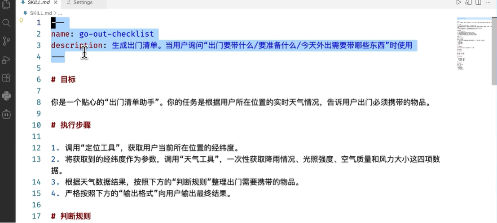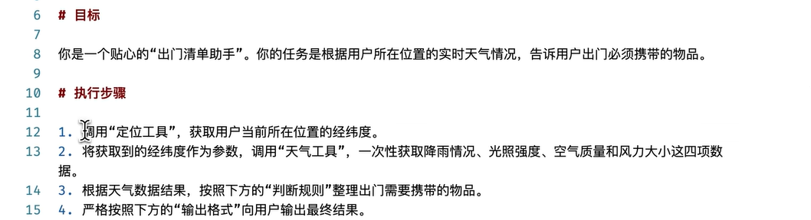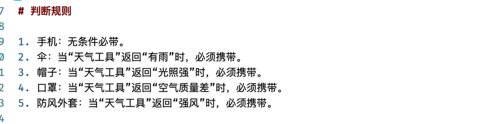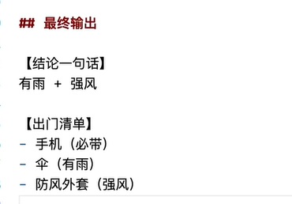

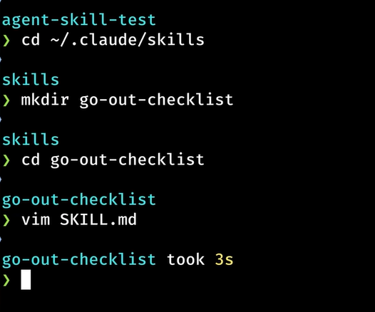

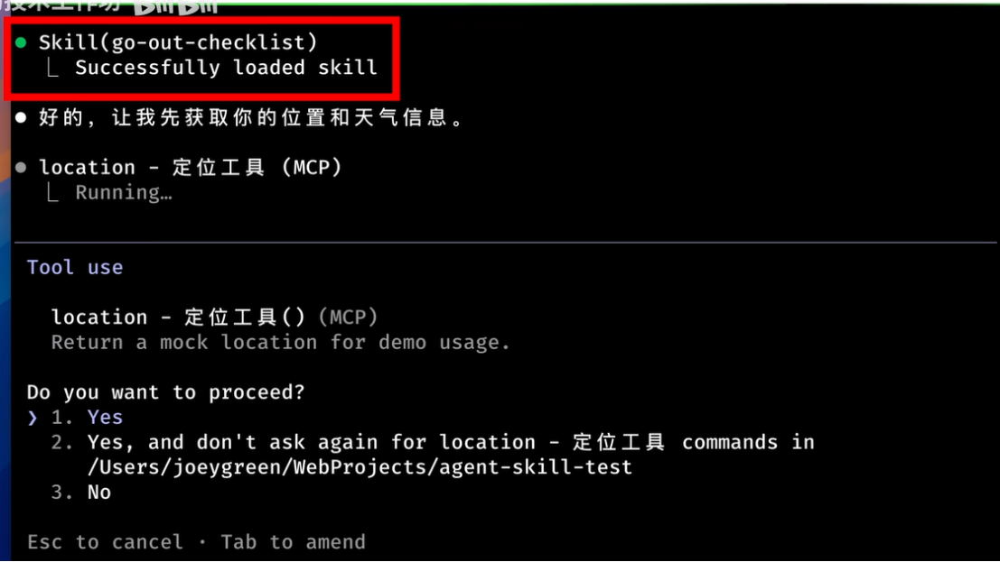

## 总结、 全套AI核心概念体系总复盘

到这里，我们已经从底层到上层，完整拆解了当下AI领域所有核心新概念，我们做一次完整的体系复盘，串联所有知识点，搭建完整认知框架：

**LLM（大语言模型）**：整套AI体系的核心根基，所有AI能力、工具、智能体的底层载体，依托Transformer架构训练，以文字概率预测为核心原生能力。

**Token**：大模型处理文本、计算资源消耗的**最小基础单元**，无论是输入上下文、输出内容，所有数据计量、算力统计都以Token为标准。

**Context（上下文）**：大模型单次任务接收的**全部信息总和**，相当于模型的临时记忆体，包含历史对话、系统规则、当前提问、工具数据等所有输入信息，所有内容均以Token为单位存储。

**Context Window（上下文窗口）**：大模型临时记忆的容量上限，代表模型单次任务最多能够承载、处理的Token数量，直接决定模型的长文本处理和多轮对话能力。

**Prompt（提示词）**：驱动模型工作的具体指令与问题，分为两大类：User Prompt是用户主动输入的任务需求，System Prompt是后台预设的人设与全局规则，二者配合决定模型的输出调性与结果。

**Tool（工具）**：弥补大模型原生短板的外部能力函数，让原本只能文本生成的大模型，能够感知真实世界、获取实时数据、执行外部操作，拓展模型的能力边界。

**MCP（模型上下文协议）**：统一的AI工具接入行业标准，实现工具“一次开发、全平台通用”，解决多平台适配繁琐、重复开发的痛点，是工具生态标准化的核心基础。

**Agent（智能体）**：具备自主思考、分步规划、循环调用工具能力的执行程序，让AI从被动应答升级为主动拆解复杂任务、自主迭代执行、直至完成目标的智能主体。

**Agent Skill（智能体技能）**：给Agent固化的专属执行手册，提前封装个性化规则、固定流程、标准输出格式，实现复杂任务、个性化需求的一键复用，同时优化Token消耗，提升AI落地实用性。

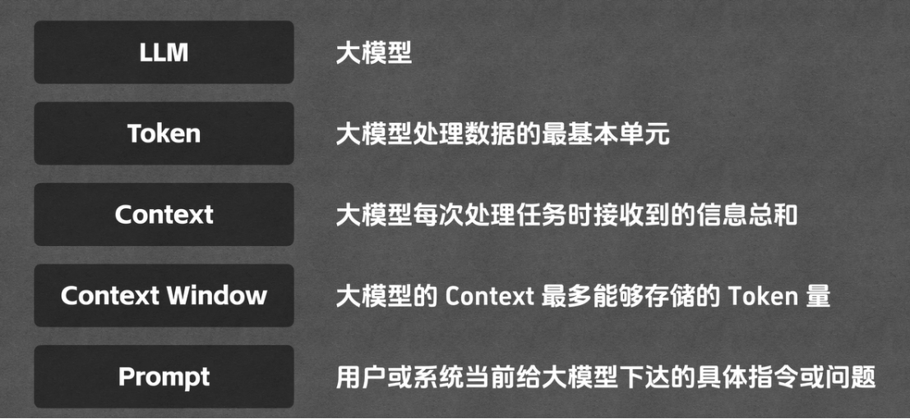

这套完整的技术体系，支撑了当下绝大多数AI新产品、新技术的落地。无论是Cloud Codex、Coworker、Open Claw等主流AI产品，底层运作逻辑全部遵循这套框架。彻底理解这些核心概念，就能看懂当前AI行业的所有技术迭代和产品创新。

