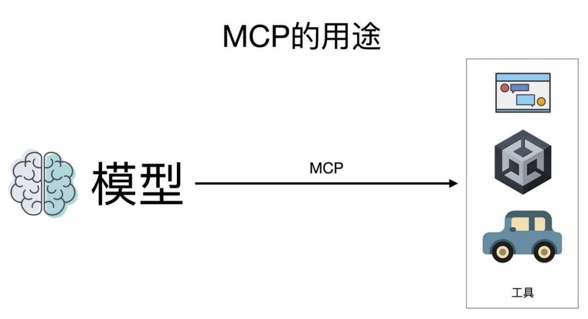
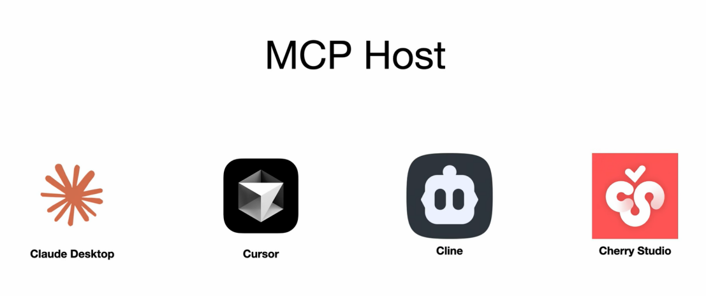

# MCP模型上下文协议零基础深度教程

## 一、教程前言：为什么需要深度吃透MCP

MCP是近期AI领域的核心热点话题，很多人都看过各类相关介绍内容，但绝大多数人对其底层运行原理始终一知半解。尤其是对于想要深度落地使用、甚至自主开发MCP相关工具的开发者而言，市面上多数教程都流于表面，只能让人形成“似懂非懂”的模糊认知，无法支撑实战开发与深度落地。

本次教程区别于市面上的浅层科普内容，主打**从底层原理到动手实战**的全链路深度教学。整体学习路径循序渐进、层层递进：首先夯实基础，吃透MCP核心概念、完整数据流转逻辑与基础使用方法；随后进入进阶实战环节，从零搭建一套完整的MCP Server，吃透MCP输入输出全流程逻辑，真正实现从“看懂概念”到“动手开发”的跨越。

## 二、MCP官方定义与发布背景

MCP 全称 **Model Context Protocol**，中文译为**模型上下文协议**，是 Anthropic 公司在 **2024年11月25日** 正式发布的AI开放协议标准。

MCP领域存在大量晦涩、故弄玄虚的专业词汇，也是很多新手难以入门的核心原因。后续教程会逐一拆解所有专业术语，用通俗语言讲透底层逻辑，无需提前死记硬背概念，零基础也能轻松吃透。入门阶段无需纠结名词字面含义，优先理解MCP的核心能力与核心用途即可。

## 三、MCP核心作用与核心价值

用最通俗的话概括：**MCP是一套让大模型稳定、高效使用各类外部工具的标准化协议**。

原生大模型存在天然短板：仅具备问答、推理、生成文本的能力，无法主动感知外部世界、无法自主调用外部工具、无法联动第三方应用。简单来说，原生大模型只能基于训练知识应答，不会“使用工具”、不会“联网探索”、不会“操作系统”。

而 MCP 的核心价值，就是补齐大模型的这一短板，为大模型赋予联动外部世界的能力，让静态的问答模型，升级为可自主操作、可联动外设的智能体。

## 四、MCP典型落地场景

依托MCP协议，大模型可以解锁各类高阶实操能力，覆盖多领域复杂场景，典型应用如下：

- 联网检索：驱动浏览器自主上网，实时查询各类最新信息；

- 程序开发：联动Unity等开发工具，自主编写、调试游戏及各类程序代码；

- 生活服务：自主查询路况、调度生活工具、处理日常事务；

- 更多场景：可对接各类第三方工具、数据库、业务系统，能力可无限拓展。

综上，MCP 是打通大模型与外部世界的核心桥梁，是当前 AI 智能体、自动化工具落地的核心底层协议。

## 五、MCP Host核心概念与常用工具

想要正常使用MCP协议、解锁大模型工具调用能力，必须搭配核心配套组件——**MCP Host**。

MCP Host 无需复杂理解，本质就是**支持MCP协议运行的载体软件**，是承载MCP任务、调度协议运行、衔接大模型与外部工具的运行环境。

目前行业主流、常用的 MCP Host 工具包含：Claude Desktop、Cherry Studio 等主流AI客户端。

使用cline查询天气的案例。具体参考[MCP终极指南 - 从原理到实战，带你深入掌握MCP（基础篇）_哔哩哔哩_bilibili](https://www.bilibili.com/video/BV1uronYREWR/?spm_id_from=333.1387.homepage.video_card.click&vd_source=53cc4ab182d19dd4baeac21fe0d801f9) 2：50秒

> 
