# RAG技术原理与实现流程讲解

## 一、RAG简介

你是否想做一个靠谱的知识客服，或者是搭建一个能回答问题的知识库？那你就一定绕不开一个技术 RAG，它的全称是 Retrieval Augmented Generation，翻译过来就是检索增强生成。

这项技术听起来挺高大上，但核心原理十分简单，归根结底就两件事：先从资料库里检索相关的内容，再基于这些检索到的内容生成答案，核心逻辑就是**先检索、再生成**，这也是检索增强生成名称的由来。

RAG是目前最常用的 AI 问答方案之一，市面上绝大多数企业内部知识助手、智能客服系统，均采用这项技术搭建实现。

本文将详细介绍 RAG 的实现原理，整体讲解内容主要分为三个部分：第一，整体梳理RAG的使用场景和大致运行链路，帮助大家对这门技术建立直观、感性的认知；第二，逐步拆解RAG运行链路中的每一个环节，深入剖析底层实现原理；第三，从用户提问前、提问后两个时间维度，复盘完整的链路运行过程，进一步加深对RAG技术的理解。

在讲解过程中，会逐一解读RAG技术涉及的各类专业名词，包括向量模型、向量数据库、向量相似度等核心概念。通过完整的内容学习，能够清晰掌握高质量智能客服、企业知识库的搭建逻辑与实现方式。

假设我们需要搭建一款能够解答企业各类产品相关问题的智能客服系统，常规的实现思路如下：首先需要为客服系统搭载基础AI模型，例如GPT4.0、deepseek等主流大模型。但仅依靠基础模型无法实现业务需求，因为通用大模型本身不具备企业专属的产品信息，无法精准解答产品相关问题。

针对这个问题，有人提出解决方案：在向模型发送用户提问的同时，同步将企业产品手册等专属资料一并发送给模型。该方案具备可行性，但存在明显短板。若产品手册内容体量极大，模型无法读取全部内容，核心原因是所有AI模型都有信息承载上限，这一上限被称为**上下文窗口大小**。

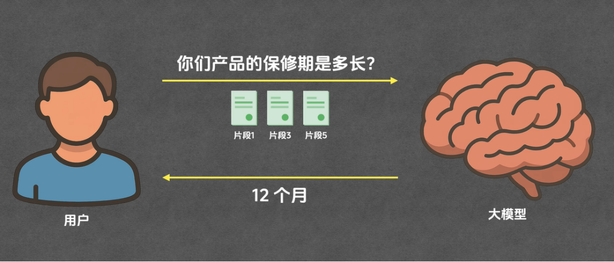

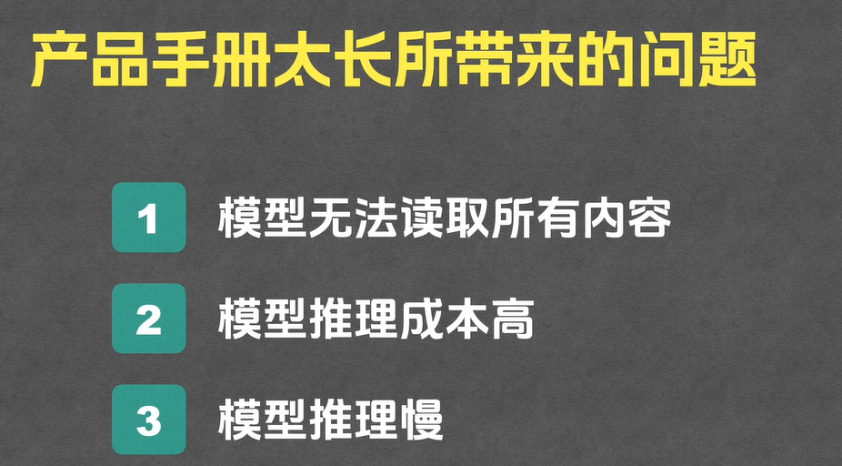

而RAG技术可以完美解决上述问题，技术核心逻辑是让模型仅感知与用户问题相关的资料片段，而非读取完整文档，从根本上解决模型上下文窗口受限、无法读取海量资料的问题。

上述是RAG技术的简化原理，便于快速理解，但该简化逻辑隐藏了大量核心实现细节，文档分片、相关片段筛选等环节都具备专业技术逻辑。下面详细拆解完整的RAG运行流程。

## 二、提问前准备

完整的RAG整体流程主要分为两大阶段、五大核心环节，两大阶段分别为用户提问前的数据准备阶段、用户提问后的智能回答阶段。

第一阶段：数据准备阶段（用户提问前执行），核心是完成专属文档的预处理工作，包含**分片、索引**两个核心环节。

第二阶段：智能回答阶段（用户提问后执行），包含**召回、重排、生成**三个核心环节。

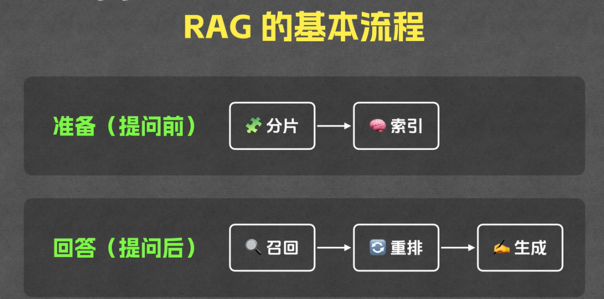

### 2.1 分片

其中分片环节顾名思义，就是将完整的海量文档，按照段落、章节等规则切分成多个独立的内容片段，为后续检索环节做铺垫。

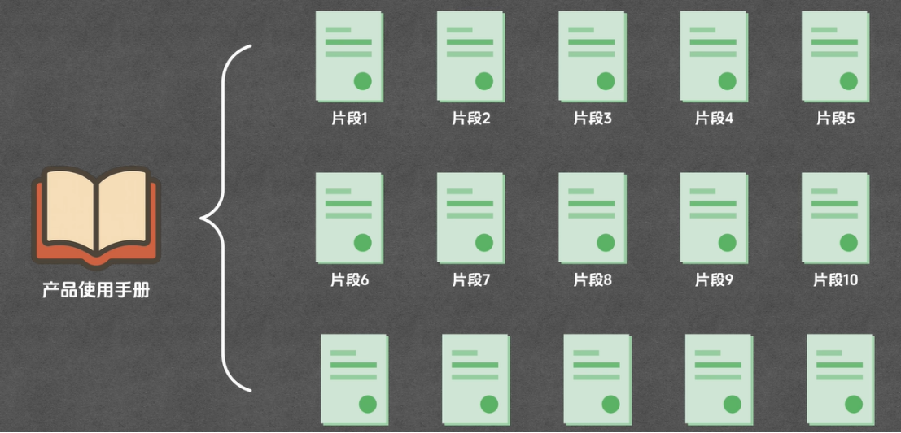

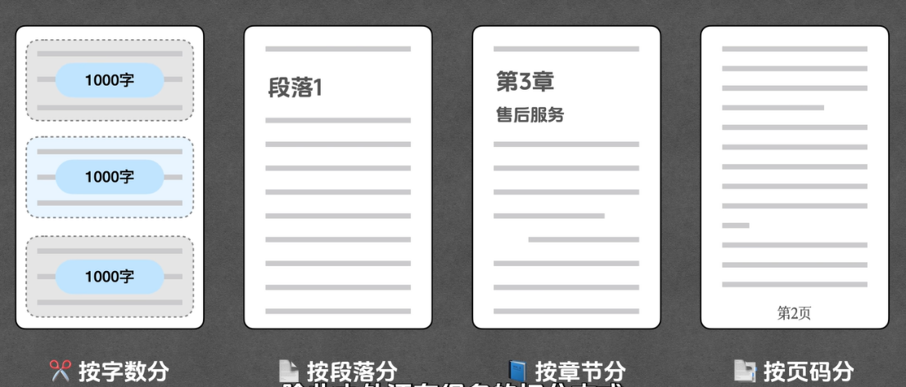

### 2.2  索引

#### 1. 向量

是RAG技术的核心基础概念，向量的维度可通过坐标轴直观理解。

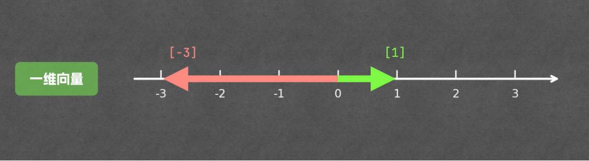

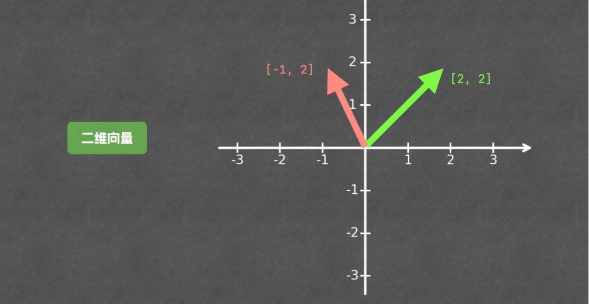

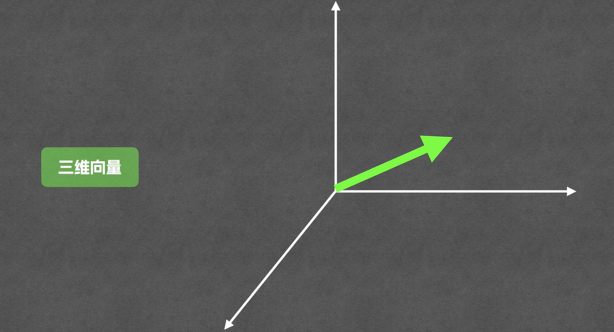而RAG技术实际应用中，所使用的向量维度数值普遍较高，通常为数百维甚至数千维。在行业通用逻辑中，向量的维度越高，单个向量承载的信息内容越丰富，基于向量完成检索、匹配等工作的准确性和可靠性也就越高。

> 

#### 2. 向量嵌入（Embedding）核心原理

Embedding 就是把文本转换为向量的一个过程。我们可以通过具体案例直观理解这一核心逻辑：以数值2为向量参考为例，假设“朱老师喜欢吃水果”对应的向量是1、2，“朱老师爱吃水果”对应的向量是1、1，“天气真好”对应的向量是\-3、\-1。

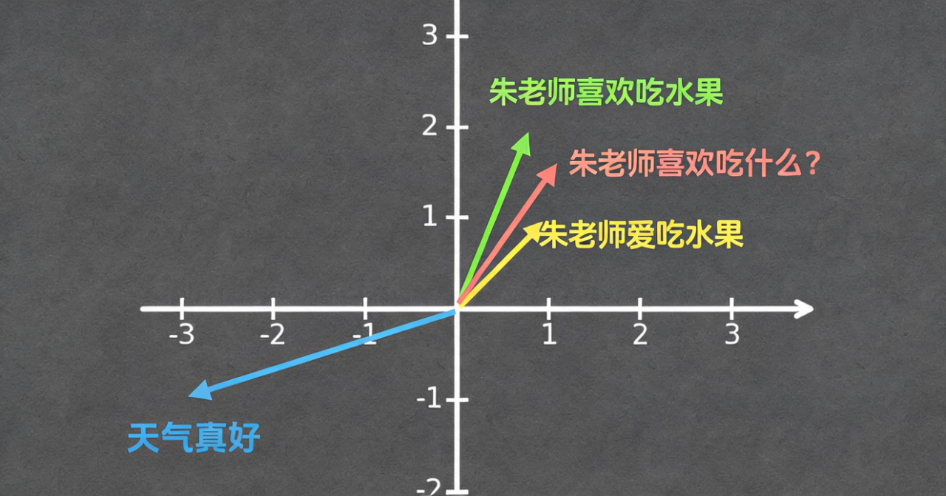

通过对比可以发现，前两个语义相近的句子，对应的向量数值非常接近，而语义完全无关的“天气真好”，对应的向量距离差距极大。这正是 Embedding 的核心目的：**含义相近的文本经过 Embedding 转换后，对应的向量也会高度相近；语义无关的文本，向量距离差距悬殊**。

依托这一特性，即可实现智能问答的检索逻辑：当用户提出“朱老师喜欢吃什么”这类问题时，首先对用户的问题进行 Embedding 处理，将自然语言转化为向量形式，再通过向量相似度匹配规则，筛选出与该问题向量相近的相关文本，最终匹配出关联内容，为模型作答提供依据。

#### 3. 向量数据库存储规则

依旧以“朱老师喜欢吃水果”这句话为例，在对文本完成 Embedding 转换、得到对应向量后，需要将相关数据存入向量数据库。需要重点注意的是，向量数据库的存储内容不只有文本向量，还必须包含原始文本。

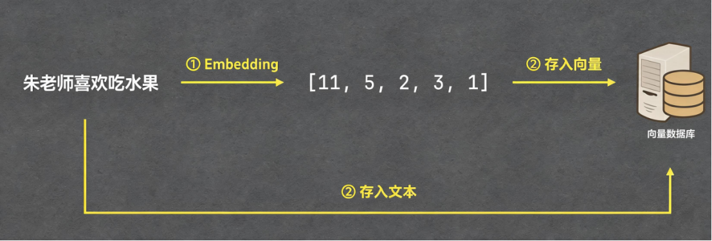

原始文本同步存储的核心原因：向量仅为文本转换后的中间数据，是用于相似度匹配的工具，并非模型最终的处理对象。在通过向量检索匹配出相似向量后，需要依托对应的原始文本，输送给大模型进行分析作答。

因此，常规的向量数据库数据表，至少包含**原始文本**和**对应向量**两列核心内容，二者一一对应、缺一不可。

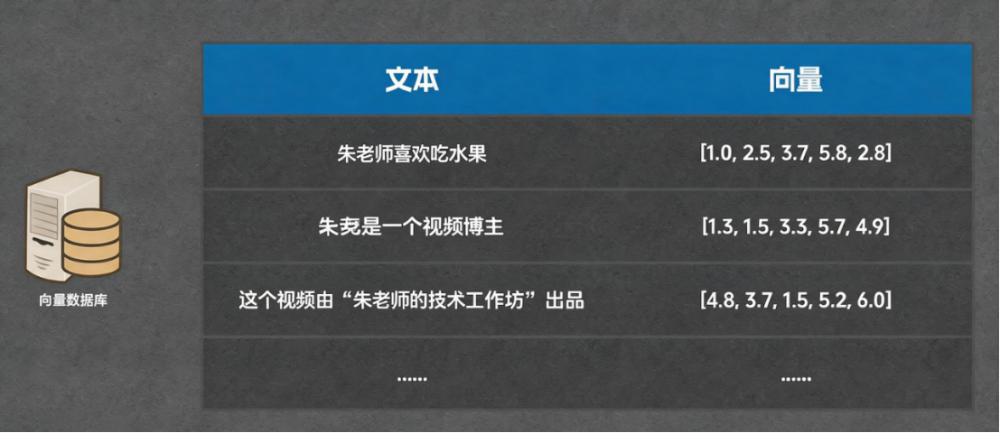

#### 4. RAG索引环节详解

讲完向量 Embedding 和向量数据库的核心逻辑后，我们回头拆解此前提到的「索引」概念。

索引的完整定义：通过 Embedding 技术，将文档拆分后的每一个片段文本逐一转换为向量，同时将片段原始文本与对应向量统一存储至向量数据库的全过程。

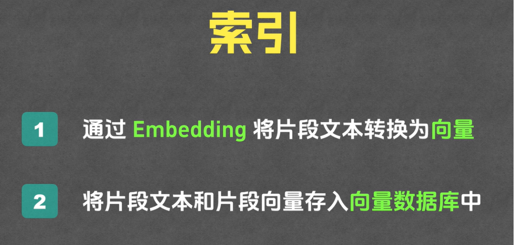

索引的核心执行逻辑与前文的文本向量转换、存储逻辑完全一致，唯一区别是处理对象由单句文本，变为文档分片后的所有片段。具体流程为：优先处理片段一，完成Embedding转换与数据库存储后，依次迭代处理片段二、片段三，直至所有文档片段全部处理完成，索引环节正式结束。

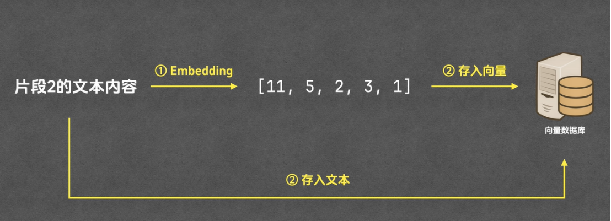

核心总结：**分片、索引两大环节均发生在用户提问之前，属于RAG体系的前置数据准备工作，是后续智能问答的基础**。完成前置准备后，即可进入用户提问后的核心应答流程。

## 三、用户提问后核心流程：召回、重排、生成

### 3\.1 召回环节原理与执行流程

召回的核心定义：系统主动搜索、匹配与用户问题相关的文档片段，完成初步筛选的过程，是用户提问后的第一个核心步骤。

具体执行流程：首先将用户的提问内容输入Embedding模型，由模型将自然语言问题转换为专属向量；再将该用户问题向量推送至向量数据库，让数据库检索、匹配出与用户问题相似度最高的一批片段内容。

常规场景下，召回环节会筛选出10条高相关片段，该数值不固定，可根据业务需求调整为15条、20条等，核心要求为数量适中，兼顾筛选效率与内容覆盖率。最终输出向量数据库匹配出的、与用户问题最相似的一批文本片段。

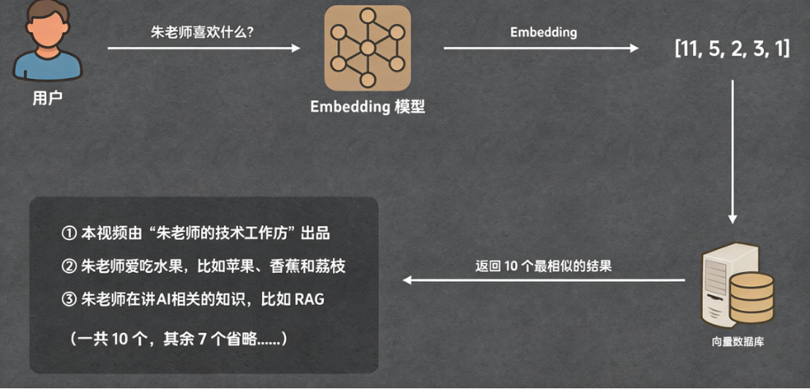

### 3\.2 向量相似度计算方法

向量数据库能够精准匹配相关片段，核心依托**向量相似度计算**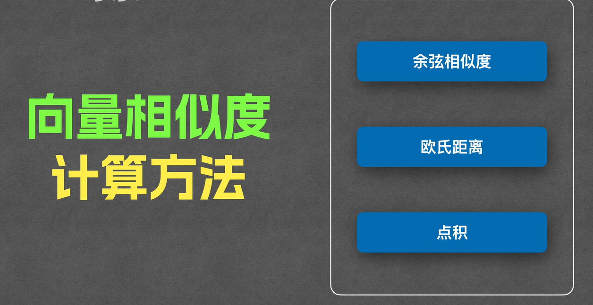

具体模拟流程与核心算法如下：

为方便演示，假设向量数据库内仅存储3条文本片段及对应向量，同时录入用户问题的对应向量，通过公式计算两两之间的相似度。相似度计算公式固定：第一个参数为用户问题向量，第二个参数为数据库内各片段向量。

具体计算步骤：依次将第一条、第二条、第三条片段向量代入公式，分别计算出每条片段与用户问题的相似度数值并记录；所有片段计算完成后，对所有相似度数值进行排序，筛选出数值最大、相似度最高的前N条片段（常规取前10条），即为召回结果。

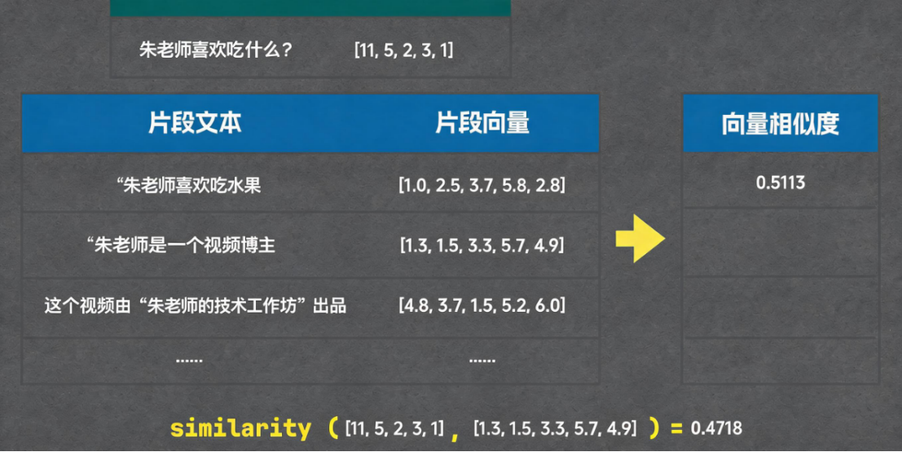

### 3\.3 重排环节：高精度二次筛选

经过召回环节后，系统已筛选出10条高相关片段，这批片段将进入**重排环节**完成二次精准筛选。重排全称为重新排序，核心作用是对召回结果做精细化提纯。

重排的核心逻辑与价值：重排的筛选目标，是从召回得到的10条片段中，再次精准筛选出3条匹配度最高、最贴合用户问题的核心片段。很多人会疑惑，为何不直接在召回环节筛选3条片段，而是拆分召回、重排两个步骤？核心原因是两个环节的筛选逻辑、算力成本、准确率差异极大。

召回环节依托普通向量相似度算法，核心优势是**成本低、耗时短、效率高**，能够快速对数据库中成千上万条片段完成批量相似度计算，适合做大范围、粗粒度的初步筛选，但缺点是准确率相对有限。

重排环节依托**Cross Encoder模型**完成相似度计算，该模型的算力成本更高、运算耗时更长，但对应的筛选准确率大幅提升，适合小范围、高精度的精细化筛选。

我们可通过企业招聘类比两个环节的差异：召回对应「简历初筛」，从海量候选人中快速挑出一批优质候选，效率优先；重排对应「面试精筛」，对初筛合格人员逐一深度考核，精准筛选最优人选，质量优先。通过粗筛\+精筛的组合模式，兼顾检索效率与匹配精度。

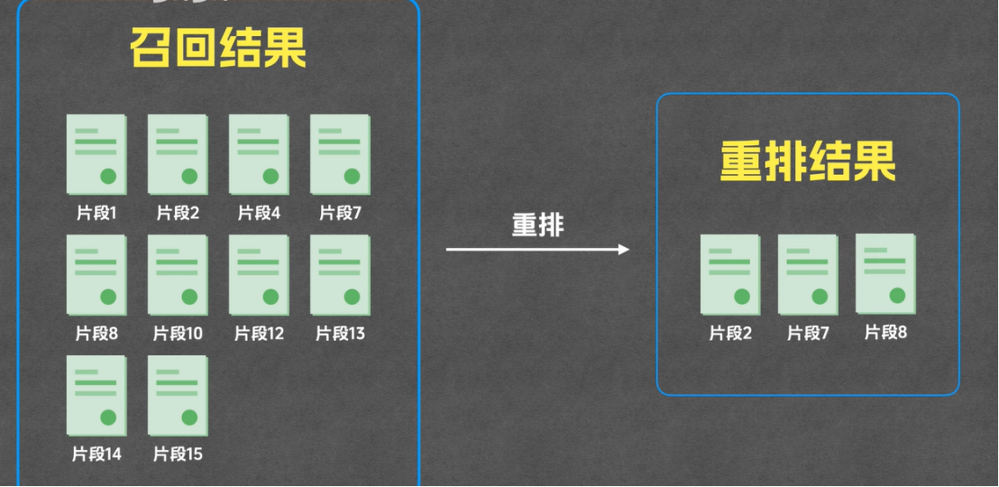

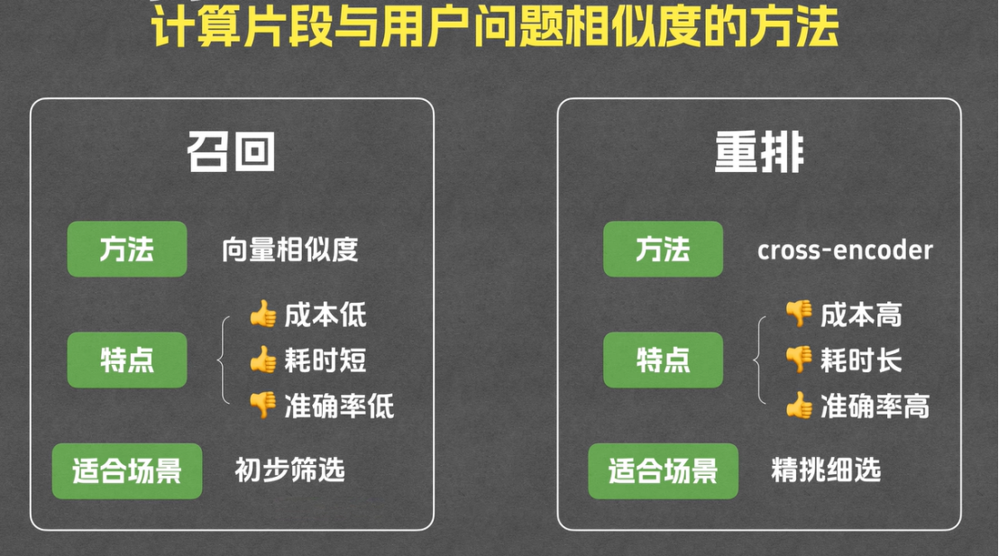

### 3\.4 答案生成环节

经过分片、索引、召回、重排全流程后，系统最终留存用户提问内容，以及3条与问题高度匹配的核心文档片段。

生成环节为RAG流程的最终环节：将用户的原始提问、重排筛选出的核心文本片段统一输入大语言模型，由大模型依托真实的知识库片段内容，结合用户问题生成精准、合规的作答内容，至此完整的智能问答流程全部结束。

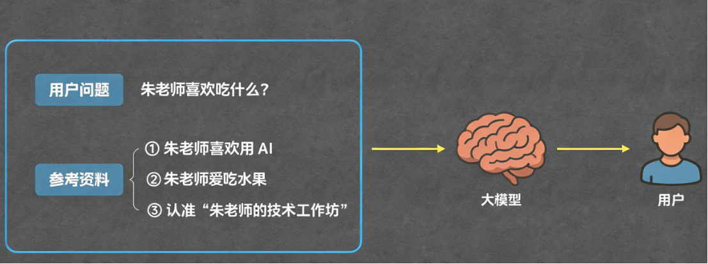

## 四、RAG全流程整体复盘

完整的RAG技术运行流程分为两大核心阶段，包含五大执行环节，全流程逻辑闭环如下：

### 4.1  前置准备阶段（用户提问前，离线执行）

\- 分片：将海量完整文档，按段落、章节等规则切分为独立文本片段；

\- 索引：通过Embedding将所有文本片段转为向量，同步将原始片段与向量存入向量数据库，完成数据预处理。

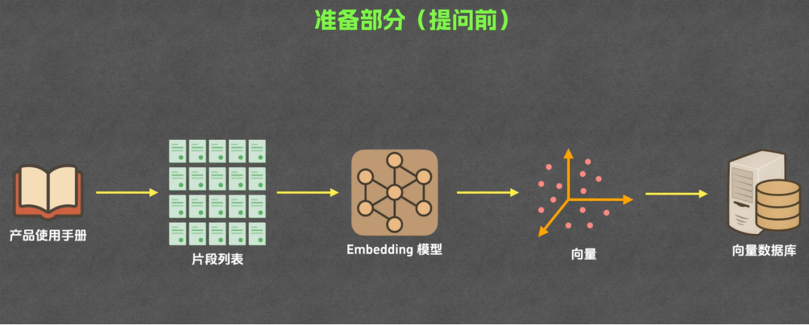

### 4.2 实时应答阶段（用户提问后，在线执行）

\- 召回：将用户问题转为向量，通过向量相似度快速匹配出一批高相关文本片段；

\- 重排：通过Cross Encoder模型对召回结果高精度二次筛选，锁定最优核心片段；

\- 生成：将用户问题与核心片段输入大模型，由模型生成最终问答答案。

