# 1.1 为什么是"产品视角"的架构设计

> 本章是全书唯一的方法论章。四个案例章（第 2~5 章）只做一件事：把本章的 8 步流程在四个真实领域各走一遍，展示**同样的流程如何在不同约束下导出不同的架构**。

## 从一个熟悉的失败场景说起

一个有经验的开发者接到"做一个合同管理系统"的任务，最常见的开场是这样的：当天下午，技术选型群里已经在讨论"用不用微服务""上不上 Redis""K8s 还是 Docker Compose"。两周后，脚手架搭好了：网关、注册中心、配置中心、三个服务、一套消息队列。三个月后，法务部门提出审批路由要按金额和合同类型变化、且要由法务自己配置——这个真正决定系统骨架的需求，没有出现在任何一次技术讨论里。

这就是**技术视角**的架构设计：从"我们要用什么技术"出发，把架构等同于技术栈清单。它的失败模式非常固定：

- 复杂度花在了没有需求支撑的地方（分布式事务、服务治理），而真正的难点（可配置的审批路由、组织架构月度变动下的数据权限）没有得到设计；
- 每一项技术都"没错"，但没有一项技术决策能回答"为什么"；
- 系统上线后，任何一个业务规则变化都要动代码，因为规则从未被当作设计对象。

**产品视角**的架构设计把出发点倒过来：先回答这个产品为谁解决什么问题、在什么约束下运行、哪些质量属性生死攸关，再让架构成为这些回答的推论。本书给这个视角一个可操作的定义：

> **架构是在特定约束下，对质量属性做出的一组可追溯的决策。**

三个关键词拆开看：

1. **约束**（constraints）：不可谈判的边界。政务系统部署在无公网出口的政务外网，这一条就直接否决了所有依赖外部 SaaS API 的方案，无论那些方案多优雅。约束是四个案例分道扬镳的第一现场。
2. **质量属性**（quality attributes）：性能、安全、可维护性这些"非功能需求"。功能决定系统"做什么"，质量属性决定系统"长什么样"：两个功能清单完全相同的系统，可以因为质量属性优先级不同而拥有完全不同的架构（第 4 章的设备监控和第 2 章的政务审批都有"数据写入"功能，但 400 点/秒的持续遥测写入和日均几百件的申报提交，导出的是两种数据架构）。
3. **可追溯的决策**（traceable decisions）：每个架构决策都能回答"依据哪条约束、哪个质量场景、否决了哪些备选、为什么"。本书用 ADR（架构决策记录）承载这件事，四个案例共 19 篇 ADR，全部按此标准写成。

## 产品视角不是产品经理视角

需要澄清：产品视角不等于"听产品经理的"。它是指架构师主动向上游走两步：

- 向**业务**走：搞清楚干系人是谁、他们的利益在哪里冲突。审批方要留痕免责、申请方要快速办结，这对矛盾不是需求文档里的一行字，而是整个流程引擎设计的原动力；
- 向**运行环境**走：搞清楚系统将在什么土壤里生长。有没有专职运维？内网还是公网？团队会什么技术？这些"工程社会学"因素对架构的影响，常常大于任何性能指标。

有经验的开发者最容易低估的恰恰是这一步的杠杆率：在需求与约束分析上多花一天，常常能省掉后期数月的返工；反过来，任何在错误问题上做出的精巧设计，价值都是零。

## 本书的方法论从哪里来

本章的 8 步流程是对四个成熟实践的组装（详见 1.2 节），并非发明：

- **arc42**（arc42.org，Gernot Starke / Peter Hruschka 维护，当前 v9）提供文档结构骨架——特别是它对"约束"独立成节的坚持；
- **C4 模型**（c4model.com，Simon Brown）提供建模分层——用四层缩放代替一张什么都想说的"架构总图"；
- **SEI 质量属性场景**（Bass/Clements/Kazman,《Software Architecture in Practice》）提供把"高性能"翻译成数字的方法；
- **ADR**（Michael Nygard, 2011,《Documenting Architecture Decisions》）提供决策留痕的最小格式。

架构描述的国际标准 ISO/IEC/IEEE 42010 与 Kruchten 的 4+1 视图是这些实践的理论先驱，本书不展开——它们回答"架构描述应包含什么"，而本书回答"周一早上你该做什么"。

## 贯穿全书的一条元原则：奥卡姆剃刀

如无必要，勿增实体。在架构语境下：**每引入一个组件、一层抽象、一项技术，都必须有一条编号的约束或质量场景为它作证；作证不出来的，砍掉。** 这条原则的完整操作化放在 1.5 节，这里先剧透四个案例的最终形态，让读者感受它的实际力度（下图为动画 SVG，浏览器中打开可见"同一流程流经不同约束、落位为不同架构"的流动过程）：

| 案例 | 最终架构 | 没有上的东西 |
|---|---|---|
| 政务申报审批 | 模块化单体（单进程） | 微服务、工作流引擎、Redis、MQ |
| 企业合同管理 | 模块化单体（单进程） | BPMN 引擎、ESB、Elasticsearch、MQ |
| 设备监控 | 采集/查询两进程 | Kafka、Flink、时序数据库专用集群 |
| SaaS 工单 | 无状态单体 × N + Worker | 微服务、独立计费服务 |

四个案例没有一个上微服务。这不是立场而是推论：每一章都会用编号的约束与质量场景，当面论证"为什么不需要更复杂的方案"；案例四会同样严格地论证为什么 Redis 在那里配得上它的运维成本。复杂度不是罪，没有证据的复杂度才是。
