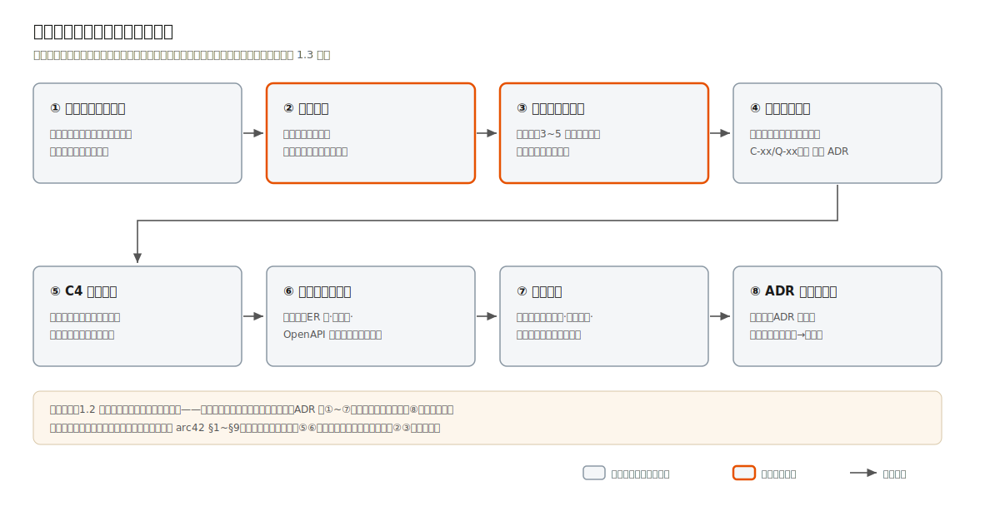

# 1.2 八步流程总览

本节是全书的锚点：8 步流程的定义只在这里。案例章节每节开头的"流程进度条"与"方法回看 §1.x"都指向本节，不再复述。

## 流程一览表

| 步骤 | 名称 | 核心产出物 | 图形表达 | 方法来源 |
|---|---|---|---|---|
| ① | 业务与干系人分析 | 干系人清单、需求清单表（含"演进"档） | 业务流程泳道图 | arc42 §1–2 |
| ② | 约束识别 | 约束清单表（来源 + 可否谈判） | 表格，无需图 | arc42 §2 |
| ③ | 质量属性场景化 | 3~5 条带数字的质量场景 | 六要素结构图（本章 1 张） | ISO/IEC 25010:2023 + SEI 场景法 |
| ④ | 架构风格选型 | 风格对比表 + 首篇 ADR | 架构风格谱系图（本章 1 张） | MonolithFirst、模块化单体 |
| ⑤ | C4 分层建模 | 上下文图、容器图 | C4 图 | C4 模型 |
| ⑥ | 数据与接口设计 | ER 图、状态机、接口约定 | ER 图、状态机图 | ER 建模、OpenAPI 3.x |
| ⑦ | 横切设计 | 权限模型、审计方案、部署图 | 部署图 | RBAC/ABAC 谱系、等保要求 |
| ⑧ | ADR 与演进规划 | ADR 集、演进触发表 | 无需图 | Nygard ADR、演进式架构 |

四种表格类产出物（需求清单、约束清单、质量场景、ADR、演进触发表）的格式定义在[附录 A](../appendix/a-templates.md)。

## 流程的三个性质

**它是瀑布的形状，迭代的用法。** 8 步有清晰的依赖关系：没有约束清单就无从评估架构风格，没有质量场景就无从裁决数据库选型。但实操中每一步都会反过来修正前面的产出物——画容器图时发现遗漏的外部系统（回到①补干系人），写 ADR 时发现两条质量场景冲突（回到③排优先级）。依赖关系是真的，一次走通是假的；按序开始，随时回头。

**它的产出物就是架构文档。** 走完 8 步，需求清单、约束清单、质量场景、C4 图、ER/状态机图、部署图、ADR 集、演进触发表装订起来就是一份完整的架构设计文档，结构大体对应 arc42 模板的第 1~9 节。本书不要求"先设计后写文档"，因为设计的过程就是填这些产出物的过程。

**它的重心在前四步。** 有经验的开发者拿到任务，手最痒的是第⑤⑥步（画图、建表），但四个案例会反复证明：第②步（约束）与第③步（质量场景）才是架构分岔的地方。第 2 章政务案例与第 3 章合同案例的第⑤⑥步产出物长得很像（都是模块化单体加 PostgreSQL），让它们内在完全不同的是第②③步：等保三级加政务外网，对上组织月变加法务自配路由。

## 与来源方法的对应关系

- **对 arc42**：本流程第①②步对应 arc42 §1（简介与目标）§2（约束），⑤对应 §3（上下文）§5（构件视图），⑥⑦对应 §5–§8，⑧对应 §9（架构决策）。差异：arc42 是文档模板（回答"写什么"），本流程是工作序列（回答"先做什么后做什么"）。
- **对 C4**：C4 只管第⑤步。Simon Brown 的建议本书照单全收：Context 与 Container 两层必画，Component 只画有争议的局部，Code 层交给代码本身。
- **对 ADR**：ADR 不是第⑧步才写。每一步里做出的显著决策当场记 ADR，第⑧步做的是把 ADR 集整理归档、补写演进触发表。案例章节的 ADR 编号顺序即真实决策顺序。
- **对 ISO/IEC 25010**：2023 修订版定义了 9 个质量特性（功能适合性、性能效率、兼容性、交互能力、可靠性、安全性 Security、可维护性、灵活性、安全性 Safety）。它是第③步的选维度菜单，防止漏项，而非要求全项覆盖。

## 案例章节的固定结构

四个案例章都是 4 节，与 8 步的对应关系固定：

| 案例章节 | 覆盖步骤 | 内容 |
|---|---|---|
| 第 1 节 业务与约束 | ①②③ | 场景、需求清单、约束清单、质量场景 |
| 第 2 节 架构决策 | ④⑤ | 风格选型、C4 上下文图与容器图、ADR 导读 |
| 第 3 节 数据·接口·安全 | ⑥⑦ | 状态机、ER、接口约定、权限与审计 |
| 第 4 节 部署与工程验证 | ⑦⑧ | 部署图、示例工程走读、生产映射表、演进触发表 |

每节顶部有一行进度指示（如 `流程进度：①②③ ▸ ④⑤ ▸ ⑥⑦ ▸ ⑧`，加粗当前段），方法论疑问一律回本章，案例章只讲"这个领域怎么不一样"。

1.3、1.4 两节逐步展开 8 步，每步讲三件事：产出物怎么做、用什么图表达、有经验的开发者最容易在哪里踩坑。
