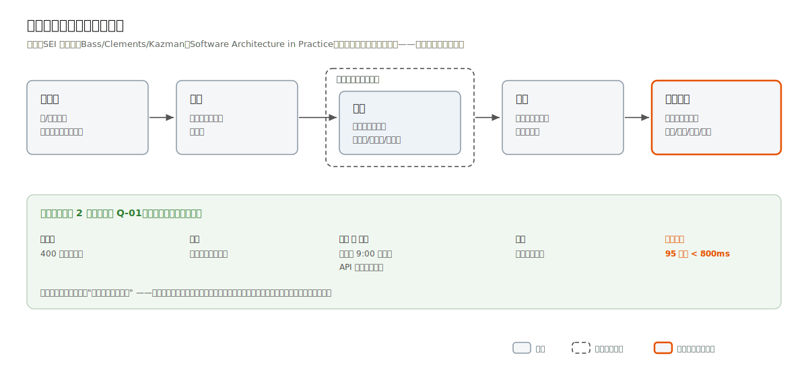
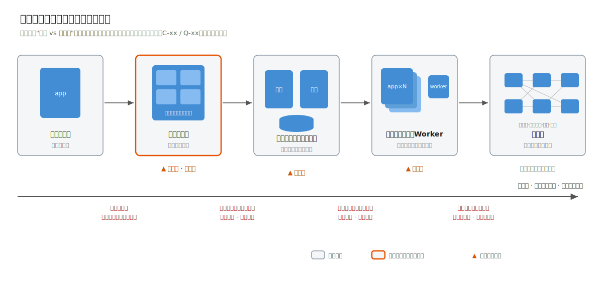

# 1.3 第①~④步：从业务到架构风格

## 第①步 业务与干系人分析

先弄清一件事：这个产品为谁、解决什么问题、各方的利益在哪里冲突。

### 做法与产出物

1. 列干系人清单。不只是"用户"：出钱的、使用的、审批的、运维的、被监管的、提供数据的。每个干系人记三样——角色、核心诉求、与其他干系人的冲突点。冲突点是这一步最有架构含金量的信息：
   - 申请企业要"快速办结"，审批人员要"留痕免责"，这对冲突直接决定了政务案例的状态机必须记录每一次流转的操作人与意见（第 2 章）；
   - 法务要"路由规则随时可调"，开发团队要"逻辑稳定可测"，这对冲突把合同案例推向了表驱动的审批流（第 3 章 ADR-001）。
2. 写核心业务流程。用一段话加一张泳道图描述主干流程。泳道按干系人划分，跨泳道的箭头就是未来系统的关键交互点。
3. 填需求清单表（格式见[附录 A.1](../appendix/a-templates.md)）。两条纪律：每条需求要有可验证的验收要点，写不出验收要点的需求是还没想清楚的需求；**"演进"档必须非空**，明确"本期不做什么"与明确"做什么"同等重要，它是架构不为幻想需求预留复杂度的唯一保险。

### 冲突从哪来：三个可操作的提问

冲突点最有价值也最难挖，干系人不会主动说"我和隔壁部门有矛盾"。三个提问能把它逼出来：

1. **"这件事做慢了/做错了，谁来背锅？"** 追问担责的人，会发现审批方要留痕免责、申请方要快速办结——责任与效率的对立是流程类系统最普遍的冲突。
2. **"这条规则以后谁来改，改一次要走什么流程？"** 追问规则的所有权，会发现业务方要随时可调、开发方要稳定可测——配置权的归属决定了规则该做成数据还是代码（案例二 ADR-001 的起点）。
3. **"同一个数据，两个部门看到的应该一样还是不一样？"** 追问数据的可见边界，会挖出数据范围权限的需求（谁能看本部门、谁能看全公司）。

把每次提问的答案填进干系人清单的"冲突点"列。填不出冲突点的干系人，要么访谈还不够深，要么他本就不是关键干系人。

### 图形表达

业务流程泳道图（规范见[附录 B.4](../appendix/b-svg-style-guide.md)）。干系人与系统的静态关系不单独画：它就是第⑤步 C4 上下文图的内容，画两遍必然失同步。

### 有经验开发者的三个坑

- **坑 1：把需求理解为功能列表。** 功能列表回答"做什么"，干系人冲突才回答"难在哪"。跳过冲突分析的架构，会在上线后被组织摩擦撕开。
- **坑 2：没有"不做清单"。** "以后可能要支持跨部门数据共享"如果不被显式列入演进档，就会以"预留扩展点"的名义渗入每一层设计，最终谁也说不清系统为什么这么复杂。
- **坑 3：简历驱动开发。** 拿到任务当天就开技术选型会。技术名词一旦先入为主，后面所有分析都会不自觉地为它辩护。纪律：第①②③步的产出物里不允许出现任何技术品牌名。

## 第②步 约束识别

这一步只问一件事：哪些边界是不可谈判的。

### 做法与产出物

约束与需求分开记录（arc42 把约束独立成节，本书视为其最重要的贡献）。按 arc42 的三分法扫描：

| 类别 | 典型来源 | 案例中的实例 |
|---|---|---|
| 技术约束 | 部署环境、既有系统、法规对技术的要求 | 政务外网无公网出口（第 2 章 C-02）；目标环境为信创软硬件（C-03） |
| 组织约束 | 团队规模与技能、运维力量、预算、工期 | 无专职 SRE，运维力量弱（第 2 章 C-05）；组织架构每月变动（第 3 章 C-02） |
| 惯例约束 | 编码规范、已购授权、集团技术路线 | 集团已有钉钉，触达必须走钉钉待办（第 3 章 C-04） |

每条约束记来源与可否谈判（格式见附录 A.5）。来源写不出来的"约束"，大概率是偏好："我们一直用 Oracle"值得谈判，"等保三级要求安全审计"没得谈。

### 坑

- **坑 1：把约束当需求排优先级。** 需求可以砍，约束不能砍，混在一张表里会让人产生"约束也可以商量"的幻觉。
- **坑 2：把偏好当约束。** 检验法就是追问来源：法规编号、合同条款、组织现状，三者都给不出的，移出约束表。
- **坑 3：漏掉环境类约束。** "部署在客户内网"五个字能否决一半的现代云原生工具链。设计依赖外部服务的任何能力前，先翻约束表：第 2 章的短信通知设计（政务短信网关适配器）就是这一条的产物。

约束是四个案例分道扬镳的第一现场。四个案例的第②步产出物几乎没有一条重叠，而它们的技术栈却高度相似，这说明架构差异来自约束，不来自技术偏好。

## 第③步 质量属性场景化

这一步要把"系统好不好"翻译成能验收的数字。

### 做法与产出物

1. 选维度：从 ISO/IEC 25010:2023 的 9 个质量特性里挑 3~5 个本系统生死攸关的。注意 2023 修订版的变化：可用性（usability）更名为交互能力（interaction capability），可移植性（portability）演进为灵活性（flexibility，包含可伸缩性子特性），并新增了安全性 Safety（免受危害）。引用旧版 8 特性表是常见的过时错误。
2. 写场景：每个选中的属性写 1~2 条 SEI 六要素场景（刺激源、刺激、制品、环境、响应、响应度量），格式见附录 A.2。

六要素的价值在于强制具体化。对比：

> ✗ "系统应具备高性能"
> ✓ "工作日 9:00 高峰期（环境），400 名审批人员（刺激源）并发查询待办列表（刺激），系统（制品）正常返回（响应），95 分位响应时间 < 800ms（响应度量）"

前者无法验收、无法证伪、无法指导任何设计决策；后者直接告诉你：这个量级根本不需要缓存层（第 2 章会算这笔账）。

3. 排优先级：质量属性之间是权衡关系（性能对可审计、灵活对简单）。案例章的做法是给场景表排序并在冲突处写明取舍。第 2 章政务案例明确"可审计性 > 性能"，所以每次状态流转同步写审计日志，哪怕多一次写库。

### 坑

- **坑 1：形容词场景。** "高可用、高性能、易扩展"这类不可证伪的句子不是设计输入，是护身符。
- **坑 2：全都要。** 9 个特性全选等于没有优先级，等于每个设计争议都会重新吵一遍。
- **坑 3：抄行业均值。** "电商系统都要扛万级 QPS"——你的区级审批系统日办件三百，写下这种场景，缓存、消息队列、读写分离就会跟着混进来。响应度量必须来自本系统的真实量级估算，案例章每一章都会把估算过程算给读者看。

## 第④步 架构风格选型

定系统的宏观形态，同时回答为什么不是更复杂的那一种。

### 做法与产出物

1. 认识谱系。备选风格不是"单体对微服务"二选一，而是一条复杂度递增的谱系：

单进程单体 → 模块化单体（进程内模块边界清晰、依赖方向受控）→ 按数据流/负载切分的少量进程 → 无状态多实例加任务进程 → 微服务。每右移一步，都要新增付出：进程间通信、部分失败处理、分布式追踪、发布协调、更高的运维技能要求。

2. 做对比表。行是候选风格，列是你自己第②③步的编号产出物（C-xx、Q-xx），不是网上抄来的"优点/缺点"。这是本步的关键纪律：脱离本系统约束与质量场景的对比表，结论可以随意操纵。
3. 写下第一篇 ADR。风格选型是系统最大的单项决策，必须留痕（格式见附录 A.3），被否决的方案要写明否决理由与编号依据。

Martin Fowler 的 MonolithFirst（martinfowler.com/bliki/MonolithFirst.html）与 Shopify 的模块化单体实践（《Deconstructing the Monolith》，shopify.engineering）是本步的两篇必读源文。前者论证"几乎所有成功的微服务系统都从单体起步"，后者示范了单体内部如何建立可被工具守护的模块边界，本书四个示例工程的"架构守护测试"（附录 C.5）就是这一思想的最小实现。

### 坑

- **坑 1："以后要扩展"。** 用不存在的未来规模为今天的复杂度辩护。正确姿势是把"以后"写进演进触发表（第⑧步）："当日办件量连续一个月超过 1 万时，评估拆分受理服务（ADR-xxx 已预分析）"。扩展的可能性用模块边界预留，而不是用进程边界预付。
- **坑 2：对比表维度与自己无关。** 表里出现"生态成熟度""社区活跃度"而没有一列对应你的 C-xx/Q-xx，就是在走过场。
- **坑 3：忽略团队这个隐性约束。** 三个人的团队维护八个服务，每人平均要懂 2.7 个服务的全部运行时行为。风格选型必须把第②步的组织约束当一等输入，四个案例中它两次成为决定性论据（第 2 章的弱运维、第 5 章的多实例发布能力）。

---

至此系统的宏观形态已定。第⑤~⑧步把它具体化：建模、数据、横切与决策归档。
