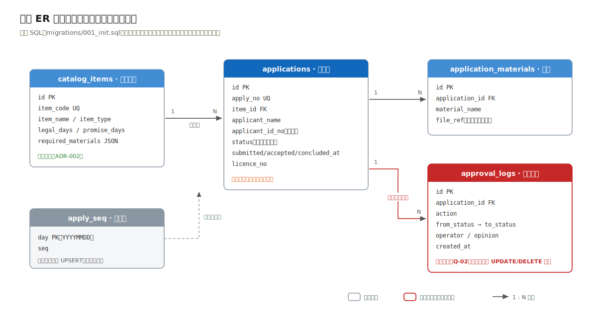

# 2.3 数据、接口与等保落地

> 流程进度：①②③ ▸ ④⑤ ▸ **⑥⑦** ▸ ⑧　（方法回看第 1 章 [1.4 节](../ch01-methodology/04-steps-5-8.md)）

## 状态机：审批系统的心脏

申报单是典型的流程类实体，第 1 章第⑥步的判断在此全部兑现：它的本质是状态机，不是带 status 字段的 CRUD。



8 个状态、8 条合法迁移边。图上每条边的动作名与代码逐字一致（图码同源，附录 B.4）。下面就是示例工程 `src/modules/application/service.ts` 中的完整迁移表，全部业务流转规则 60 行不到：

```ts
export const TRANSITIONS: Record<Action, { from: Status; to: Status }> = {
  accept:             { from: 'submitted',     to: 'accepted' },
  reject_accept:      { from: 'submitted',     to: 'not_accepted' },
  request_supplement: { from: 'accepted',      to: 'supplementing' },
  resubmit:           { from: 'supplementing', to: 'accepted' },
  start_review:       { from: 'accepted',      to: 'in_review' },
  approve:            { from: 'in_review',     to: 'approved' },
  deny:               { from: 'in_review',     to: 'denied' },
  conclude:           { from: 'approved',      to: 'concluded' },
};
```

迁移表作为一等公民数据结构，带来三项直接收益：

1. **非法迁移被显式拒绝，且告诉调用方现在能做什么。** 以下是冒烟实录（对 `submitted` 状态的申报单直接审批）：

```bash
$ curl -s -X POST "http://localhost:3001/api/applications/310104-20260702-0007/actions" \
    -H 'Content-Type: application/json' \
    -d '{"action":"approve","operator":"科长-王建国"}'
# HTTP 409
{
  "error": {
    "code": "ILLEGAL_TRANSITION",
    "message": "当前状态 submitted 不允许动作 approve",
    "details": {
      "currentStatus": "submitted",
      "allowedActions": ["accept", "reject_accept"]
    }
  }
}
```

   `allowedActions` 由 `allowedActionsFrom(status)` 对迁移表过滤而得：前端的操作按钮、接口的错误提示、测试的断言，三者用的是同一份数据。消费侧因此不必硬编码"哪个状态显示哪些按钮"，照着接口返回渲染即可（下面是前端示意，本书不交付前端工程）：

   ```js
   // 详情接口返回 { status, allowedActions: ["accept","reject_accept"], ... }
   const { allowedActions } = await fetch(`/api/applications/${applyNo}`).then((r) => r.json());
   const LABEL = { accept: '受理', reject_accept: '不予受理', start_review: '转审查',
                   approve: '通过', deny: '不予通过', conclude: '办结', request_supplement: '要求补正' };
   // 按钮可用性完全由后端状态机决定，前端零状态规则
   renderButtons(allowedActions.map((a) => ({ action: a, label: LABEL[a] })));
   ```
2. **终态天然封闭。** `concluded / denied / not_accepted` 不出现在任何边的 `from` 里，任何动作都会 409，不需要写一行"如果已办结则禁止"的防御代码。
3. **可穷举测试。** 工程的测试直接遍历非法组合断言 409（`tests/application.test.ts`），状态机的正确性不靠人肉回归。

## 数据模型



四张业务表的角色分工（建表 SQL 见工程 `src/db/migrations/001_init.sql`，图上仅画核心列）：

- `catalog_items`（规则的家，ADR-002）：材料清单（JSON 数组）、法定/承诺时限都在这里，是 R-07"新增事项零代码"的物质基础；
- `applications`（状态的家）：唯一可变的业务表，可变列被压缩到最少（status 加三个时间戳加证照号）；
- `application_materials`：材料快照；
- `approval_logs`（审计的家，Q-02）：只增不改，应用层没有任何 UPDATE/DELETE 路径。每次流转在同一事务里双写 `applications` 与 `approval_logs`，这是"可审计性 > 性能"排序（2.1 节）的直接落点。

材料齐全性校验的数据驱动效果，冒烟实录（缺两项材料）：

```bash
# HTTP 400
{
  "error": {
    "code": "MATERIALS_MISSING",
    "message": "缺少必备材料 2 项",
    "details": { "missing": ["食品安全管理制度", "从业人员健康证明"] }
  }
}
```

缺哪几项由 `catalog_items.required_materials` 与提交材料求差集得出。换一个事项，规则跟着配置走，代码零变更（Q-04 达标的证明写在测试里）。

## 接口约定

按业务动作设计，不按表设计（第 1 章第⑥步坑 3）：流转统一走 `POST /api/applications/:applyNo/actions`，body 为 `{action, operator, opinion?}`，动作进入签名，状态机自然成为接口守卫。错误结构全局统一 `{error: {code, message, details?}}`。

契约即代码：路由上的 JSON Schema 同时承担入参校验（Fastify 内置 Ajv）与文档生成（@fastify/swagger），`GET /openapi.json` 的实录输出：

```json
{
  "openapi": "3.0.3",
  "paths": [
    "/api/items", "/api/items/{code}",
    "/api/applications", "/api/applications/{applyNo}",
    "/api/applications/{applyNo}/actions", "/api/notify/dispatch"
  ]
}
```

## 等保三级的架构落地（C-01）

GB/T 22239-2019 的条目很多，从架构师视角挑真正改变设计的四类（其余属于运维与管理制度范畴）：

| 等保关注点 | 本系统落地 | 对应设计元素 |
|---|---|---|
| 身份鉴别（双因子） | 省统一身份认证 SSO（C-04）+ 审批端短信验证码二次认证 | 上下文图的认证连线；notify 模块 |
| 访问控制 | RBAC：申请人/窗口/科室/科长/监察五角色，路由级 + 数据级双重校验 | 权限中间件（生产设计，见 2.4 映射表） |
| 安全审计 | 业务留痕 `approval_logs`（只增不改）；**网络与系统日志留存不少于六个月——注意此要求出自《网络安全法》第二十一条**，等保在其上叠加防篡改与定期备份的技术要求 | ER 图 approval_logs；部署图日志服务器 |
| 数据备份恢复 | 每日全量备份 + 备份介质异地存放（三级要求异地备份功能），支撑 Q-03 的 RPO ≤ 24h | 部署图备份链路 |

一个常见误区在此纠正：应用日志不是审计日志（第 1 章第⑦步坑 2）。Fastify/pino 打的请求日志滚动即删、可被运维修改，监察追溯（Q-02）一条都用不上；`approval_logs` 是业务产出物，进 ER 图、进备份策略、进测试断言。
