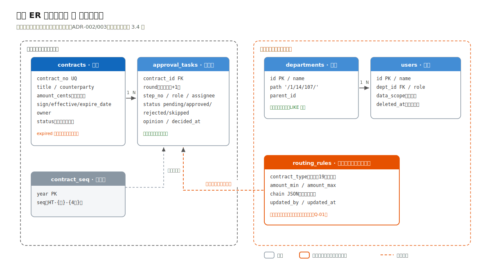

# 3.3 数据、接口与权限：规则即数据，链即快照

> 流程进度：①②③ ▸ ④⑤ ▸ **⑥⑦** ▸ ⑧

## 两台状态机：合同的与审批链的

合同本身仍有状态机（`draft → approving → active → terminated`，驳回支线 `approving → rejected → 重提`），实现手法与案例一同款（as const 迁移表），不再展开。本案例的新东西是第二层：审批链。



链的生成规则（ADR-001 的表驱动路由）在示例工程中体现为规则表 `CHAIN_LEVELS`：金额阈值到环节序列；生产设计在此之上增加合同类型维度与法务管理界面（映射表见 3.4）。看真实实录：一份 ¥1,280,000 的合同提交后，系统当场物化出 4 步链：

```bash
$ curl -s -X POST "http://localhost:3002/api/contracts/HT-2026-0007/submit"
# HTTP 200
{
  "contractNo": "HT-2026-0007",
  "round": 1,
  "status": "approving",
  "chain": [
    { "stepNo": 1, "role": "法务",       "assignee": "周敏"   },
    { "stepNo": 2, "role": "部门负责人", "assignee": "王建国" },
    { "stepNo": 3, "role": "分管副总",   "assignee": "李雪梅" },
    { "stepNo": 4, "role": "总经理",     "assignee": "陈志远" }
  ]
}
```

物化（materialize）是本设计的关键词：链在提交时按"当时的规则"生成为 `approval_tasks` 记录，此后规则怎么改都不影响在途链，审计回放（Q-02）看到的永远是"当时规则下的当时链"。规则即数据（可改），链即快照（不可变）。

顺序控制退化为一个查询："当前步 = 本轮最小 step_no 的 pending 任务"。越级决策的真实实录：

```bash
$ curl -s -X POST "http://localhost:3002/api/approvals/21/decision" \
    -H 'Content-Type: application/json' \
    -d '{"decision":"approve","operator":"李雪梅","opinion":"同意"}'
# HTTP 409
{
  "error": {
    "code": "STEP_OUT_OF_ORDER",
    "message": "只能决策当前步：第 1 步（法务 周敏）",
    "details": { "currentStep": { "taskId": 19, "stepNo": 1, "role": "法务", "assignee": "周敏" } }
  }
}
```

与案例一的 409 同一设计语言：拒绝的同时告诉你"现在该谁"。驳回则将本轮剩余任务置 `skipped`、合同回 `rejected`；修改后重提 `round+1` 生成新链，两轮链都完整留存。

## 一个不起眼但常翻车的决定：金额存分

`contracts.amount_cents INTEGER`：金额一律以分存储整数，接口边界用元的字符串（`"1280000.00"`），换算收敛在唯一位置（工程 `contract/types.ts` 的 `yuanToCents/centsToYuan`，字符串整数运算不经浮点）。0.1 + 0.2 ≠ 0.3 的浮点课，不要在合同金额上补。印花税口径字段同理：买卖合同万分之三、借款合同万分之零点五（《印花税法》），税额计算必须落在整数分上才可对账。

## 数据模型：业务与组织两个世界



左半边业务域（contracts / approval_tasks / contract_seq）已如上述；右半边组织权限域是本案例独有的（ADR-002）：

- `departments`：带物化路径列（`/1/14/107/`），"本部门及以下"就是一个 `LIKE '/1/14/%'` 前缀匹配；
- `users`：挂部门、挂角色；HR 同步（ADR-003）只写这两张表，软删除保证历史审批链的人员引用不悬空；
- `routing_rules`（生产设计）：法务维护的路由规则表，金额区间 × 合同类型到环节序列。

## 数据权限：进 repo 层，不进 if-else

第 1 章第⑦步的警告在此落地：数据范围过滤统一在 repo 层注入。台账查询的签名是 `list(scope, filter)`，scope 由当前用户的角色推导（本人/本部门/本部门及以下/本公司/全集团），翻译成 SQL 追加条件；任何接口都不允许自己拼权限条件。越权查询得到的是空集而非报错（R-07）：权限对查询者不可见，既不泄露数据存在性，也让前端无需特判。

## 到期提醒：零调度器的奥卡姆示范

R-05 的第一反应往往是"上个延迟队列"。看量级：提醒是日粒度语义（"30 天内到期"），最自然的实现是一条 SQL 的派生查询：

```bash
$ curl -s "http://localhost:3002/api/contracts/reminders?days=30"
# HTTP 200 —— 精确命中 2 份：不含已过期、不含审批中
```

`expired` 状态同理不落库，台账查询时由 `expire_date` 派生：少一个要维护一致性的冗余状态字段，少一个半夜跑批改状态的定时任务。案例四会展示反例：当 SLA 计时是分钟级且要多实例竞争消费时，延迟队列才配得上它的成本（第 5 章 ADR-005）——同一个"到期"需求，两个量级，两种答案。
