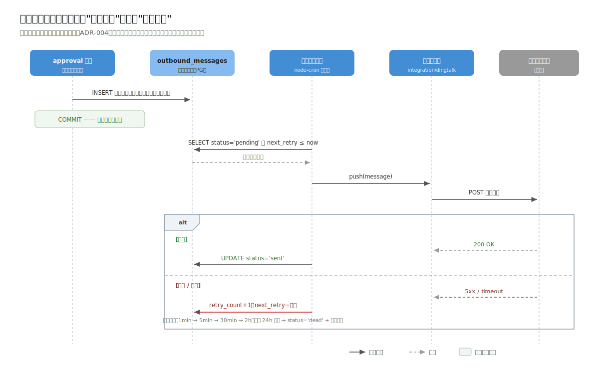
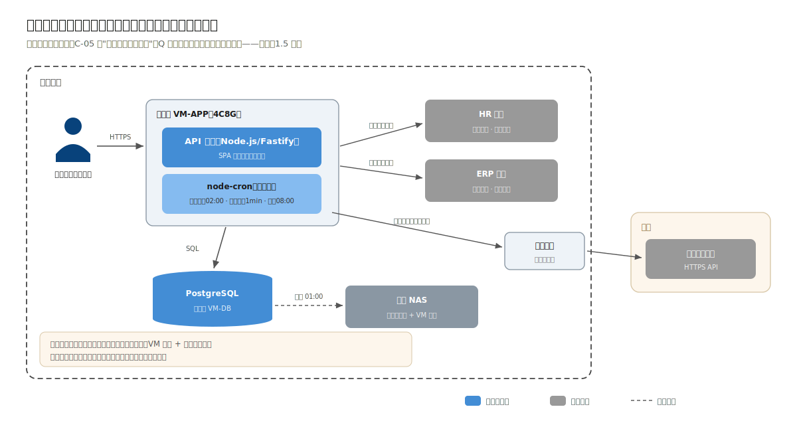
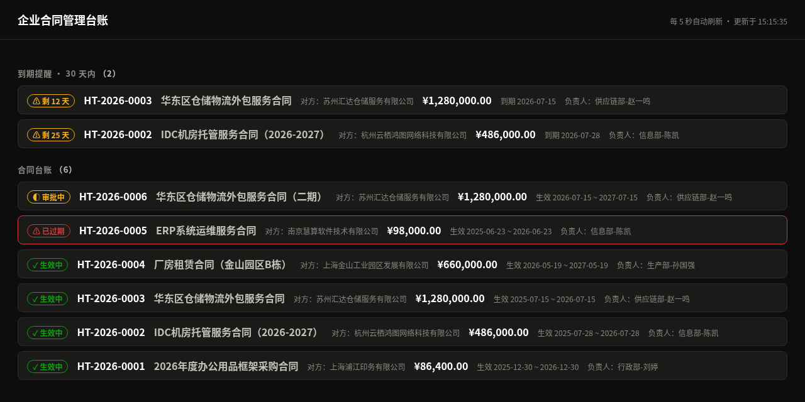

# 3.4 集成、部署与演进

> 流程进度：①②③ ▸ ④⑤ ▸ ⑥⑦ ▸ **⑦⑧**

## 集成落地：出站重试的时序细节

ADR-004 的防腐适配器 + 出站重试表，用一张时序图讲清失败补偿路径：



读图要点：审批链生成的事务里只落出站表（同事务，不可能"链生成了通知丢了"）；真正的钉钉调用发生在事务之外的扫描循环里，失败按 1min/5min/30min/2h 退避，24h 超限转人工。业务写路径与外部系统的可用性彻底解耦——钉钉全天宕机，影响的只是待办晚到，合同流程分毫不损（Q-03）。

## 部署视图



与案例一部署图对照着看最有信息量：

- **单节点虚拟机，没有双机热备。** Q 表里没有可用性场景撑腰（C-05：工作时间可用即可），热备就是没有证据的复杂度。故障恢复策略是"虚拟机快照 + 每日库备份，半天内重建"（写进运维手册，同样是架构产出物）；
- 定时任务跑在 API 进程内（node-cron）：组织同步（每日 02:00）、出站重试扫描（每分钟）、到期提醒扫描（每日 08:00）；
- 与三个外部系统的连线标注了方向与频率，这张图同时是网络策略申请单：向 HR/ERP 只出不进，钉钉出站走集团代理。

## 示例工程走读

运行工程后 `http://localhost:3002/` 是内嵌只读台账看板：



图中相对方注册地（上海、杭州、苏州、南京）为真实 GB/T 2260 行政区划（据 `dataset/02-contract-ledger/regions.json` 校验），企业名拟真但虚构；印花税按《印花税法》真实法定税率计算。

配套工程 `code/02-contract-ledger/`（30 个测试全绿）。除了与工程 01 同构的部分（附录 C），本工程的独有看点是仓储接口隔离的完整示范：

```
modules/approval/
├── types.ts      # 定义 ApprovalRepo、ContractGateway 两个"端口"（接口）
├── service.ts    # 业务逻辑只依赖端口——全文件零 SQL、零 sqlite import
├── repo.ts       # ApprovalRepo 的 SQLite 实现
└── index.ts
```

`tests/approval-chain.test.ts` 是这一设计的收益凭证：6 个链生成与流转测试跑在纯内存 Fake 上，全文件不碰数据库——2 步/3 步/4 步链、10 万/100 万阈值边界、中途驳回，毫秒级跑完。第 1 章说 repo 是"廉价的可逆性保险"，保费单在这里。

## 示例工程 ⇄ 生产架构映射表

| 生产设计 | 示例工程 | 缝合线 |
|---|---|---|
| PostgreSQL + pg_trgm 检索（ADR-005） | node:sqlite + LIKE | repo 层 |
| routing_rules 表 + 法务管理界面（ADR-001） | `CHAIN_LEVELS` 常量规则表（金额维度） | approval/service 的规则输入 |
| departments 物化路径 + 数据范围注入（ADR-002） | 未实现（工程聚焦路由与链） | repo 查询签名预留 scope 位 |
| HR/钉钉/ERP 适配器 + 出站表（ADR-003/004） | 未实现 | integration 模块位 |

示例工程演示的是决策的可运行核心（表驱动链、物化、顺序控制、仓储隔离），不是全功能：每个"未实现"都有明确的模块位与接口形状，也就是模块化单体"预留而不预付"的含义。

## 演进触发表

| 编号 | 触发条件 | 启动改造 | 提前量 |
|---|---|---|---|
| E-01 | 归档合同 > 50 万份且检索 95 分位 > 3s | zhparser 库内全文检索；再不足评估 ES（ADR-005 两级路径） | 3 个月 |
| E-02 | 电子签章采购落地 | integration 新增签章适配器，用印环节挂出站事件 | 2 个月 |
| E-03 | 出现并行会签/跨系统流程需求 | 重估 BPMN/Temporal（ADR-001 预分析，规则表可作迁移中间格式） | 6 个月 |
| E-04 | 适配器数量 > 6 或出现跨系统事务编排 | 重估集成平台（ADR-004） | 6 个月 |

---

## 本章小结（供第 6 章对照）

| 决策点 | 本案例答案 | 与案例一的分岔原因 |
|---|---|---|
| 流程实现 | **表驱动条件路由**（推翻案例一 ADR-003） | 规则调整权在法务（C-02）、多维条件（R-02） |
| 权限 | RBAC + 数据范围 + 物化路径部门树 | 组织月变（C-01）——案例一无此约束 |
| 集成 | 防腐适配器 + 出站重试表 ×3 系统 | 案例一只有 2 个简单外部服务 |
| 部署 | 单节点 + 每日备份 | 无可用性场景撑腰，热备被剃掉 |
| 检索 | PG 内置（pg_trgm），全文检索挂演进 | 量级 + C-06 |
