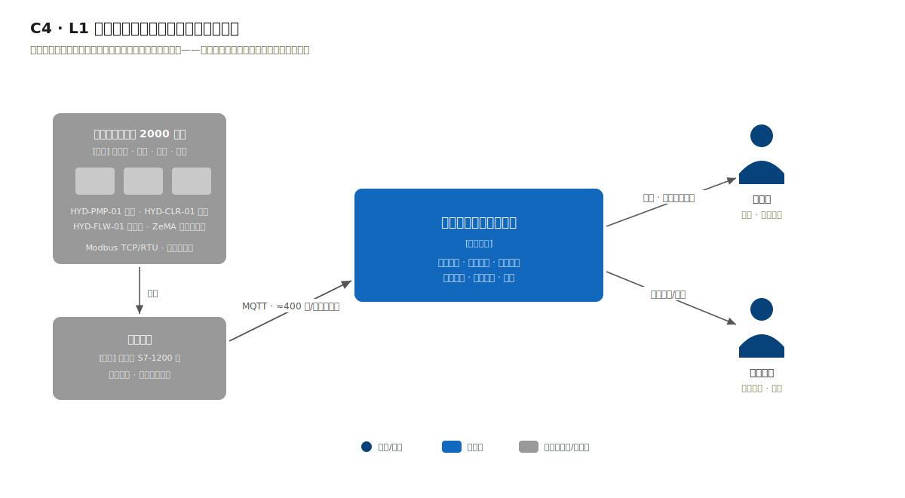
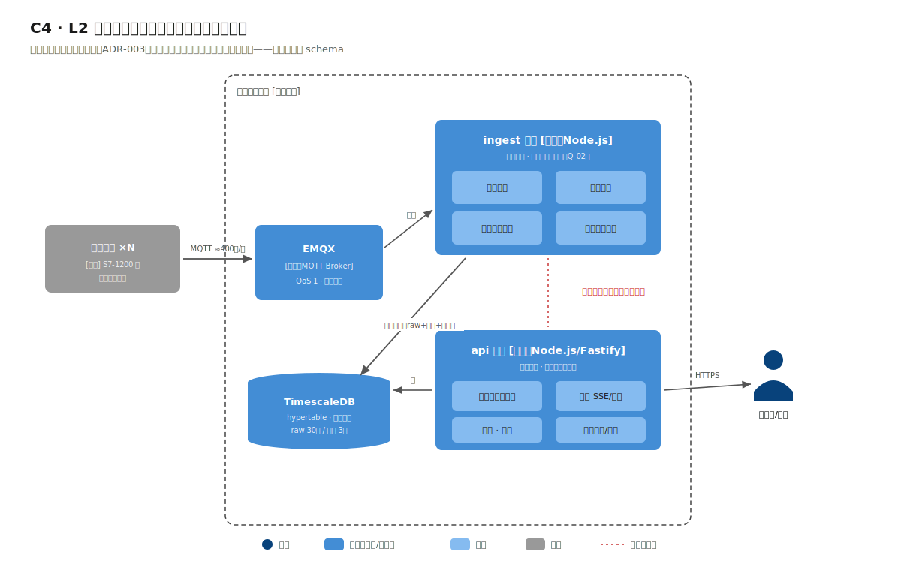
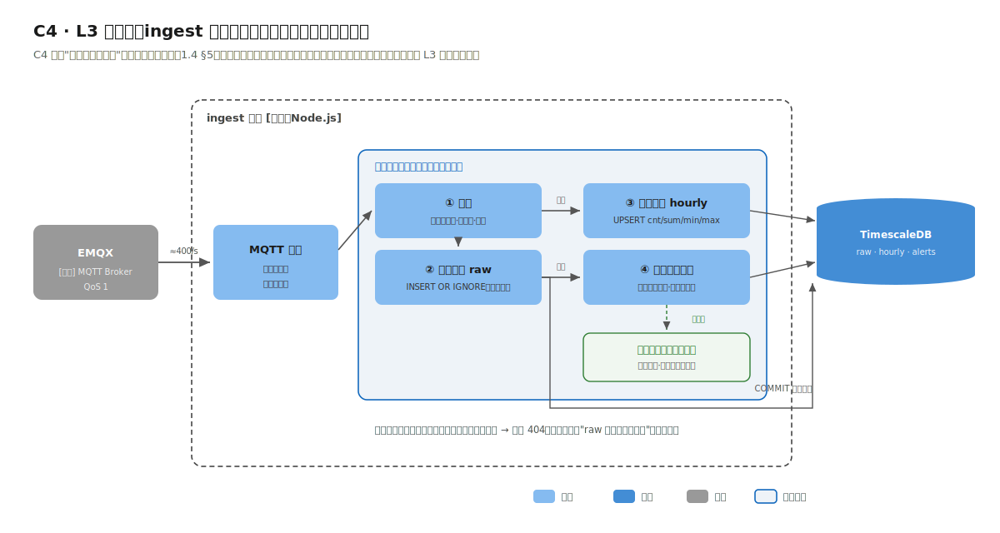

# 4.2 架构决策：全书第一次"拆"，拆的依据是数据流

> 流程进度：①②③ ▸ **④⑤** ▸ ⑥⑦ ▸ ⑧

## 第④步：第一条过硬的拆分证据

前两个案例都在"要不要拆"上给出了否，因为量级作证不出来。本案例的 Q-02 给出了第一条过硬的拆分证据：

> 发布/重启查询服务时，遥测写入不得中断。

单进程模型下，重启 API 就是重启采集：每次发版丢 30 秒数据点，弱网补传（C-03）还会放大这个窗口。而写路径（持续 400 点/秒、逻辑稳定、极少变更）与读路径（偶发查询、界面迭代频繁、经常发版）的变更节奏与负载特征都不同，按数据流切分为 `ingest`（采集/告警）与 `api`（查询/看板）两个进程，各自独立发布与重启。

对照第 1 章架构风格谱系图：这是从"模块化单体"右移一档到"按数据流切分的少量进程"，只右移一档，不是微服务：两个进程共享一个数据库、一个代码仓库、一套部署脚本，没有服务发现、没有跨进程调用（它们通过数据库与 MQTT 各自独立工作）。完整论证见 [ADR-003](adr/adr-003-process-split.md)。

## 本章 ADR 一览

| ADR | 决策 | 关键证据 |
|---|---|---|
| [ADR-001](adr/adr-001-mqtt-ingestion.md) | 南向接入用 MQTT（QoS 1 + 网关缓存续传） | C-03、R-06、真实工业协议生态 |
| [ADR-002](adr/adr-002-timescaledb.md) | 时序存储用 TimescaleDB（PG 扩展），不上专用时序集群 | C-01/C-02/C-06、Q-03/Q-04 |
| [ADR-003](adr/adr-003-process-split.md) | ingest / api 两进程（全书第一次拆） | Q-02、负载特征分析 |
| [ADR-004](adr/adr-004-inline-alerting.md) | 告警在采集通路内存匹配，不上流处理引擎 | C-04、规则量级算账 |
| [ADR-005](adr/adr-005-sse-dashboard.md) | 看板推送用 SSE，不用 WebSocket | 单向推送、反代穿透、浏览器自动重连 |

## 第⑤步：C4 建模

### 上下文图

系统边界的独特之处：最重要的"外部参与者"是设备与网关而非人：2000 台设备经车间网关（S7-1200 等 PLC/网关，Modbus 归一化后以 MQTT 上报）持续供数。人（值班员、生产主管）反而是低频参与者。

### 容器图

五个容器的分工：

1. **MQTT Broker（EMQX）**：南向接入的汇聚点。选型盘点见 ADR-001（EMQX / Mosquitto / Aedes 均为真实可选，生产推荐 EMQX）；
2. **ingest 进程**：订阅遥测主题 → 校验/幂等写入 → 增量聚合 → 内存告警匹配，只写不服务查询；
3. **api 进程**：历史查询、看板 SSE、台账、报表，只读遥测数据（台账等低频数据可写）；
4. **TimescaleDB**：PostgreSQL 加时序扩展，hypertable 自动分区、连续聚合、保留/压缩策略（ADR-002）；
5. **SPA 看板**。

数据流主线（设备 → 网关 → EMQX → ingest → TimescaleDB ← api ← 看板）是本案例的招牌视图，4.3 节的管道图会带着速率标注完整展开。

### 与前两章对照的读法

案例一/二的容器图里，"模块"是主角、容器是配角；本章反过来：容器边界（进程）承担了架构语义，而每个进程内部的模块划分（ingest 内的校验/聚合/告警，api 内的查询/台账）退居次要。负载形状决定哪一层边界重要，这是第 1 章"每张图一个问题"原则的又一次应用。

### L3 组件图：只画这一个有争议的局部

第 1 章第⑤步定下规矩：C4 只对"有争议、要评审"的容器画到组件层，其余交给目录结构。全书四个案例真正满足这条门槛的只有一处：ingest 进程内部，因为幂等写入、增量聚合、内存告警评估同处一个写事务，这个事务边界是要评审的设计，值得单独一张图：

图里四个组件（校验 → 幂等写入 → 增量聚合 → 内存告警匹配）串在一个事务里，任一步失败整批回滚，不会出现"raw 写了但聚合没更新"的中间态；告警规则常驻内存，避免每个点都查库。其余容器（api、registry）的内部结构一眼可从目录看清，不再画 L3，画了也是三个月后就过期的负担。
