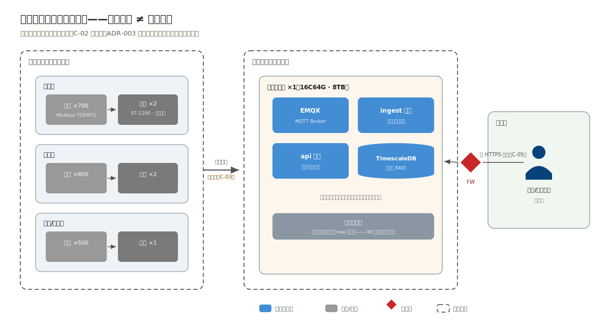
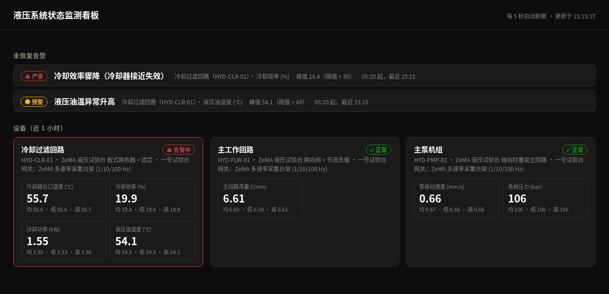

# 4.4 部署、工程验证与演进

> 流程进度：①②③ ▸ ④⑤ ▸ ⑥⑦ ▸ **⑦⑧**

## 部署视图：边缘与机房两层



- **车间边缘层**：每车间 1~2 台网关（S7-1200 或工业网关），下连设备（Modbus TCP/RTU），上连工厂环网。网关的本地缓存是断网续传（Q-05）的第一环，它是架构的一部分，不是"现场的事"；
- **工厂机房层**：一台物理服务器（C-02）承载 EMQX、ingest、api、TimescaleDB 四个组件。进程拆分不等于机器拆分，ADR-003 拆的是发布与故障边界，不是硬件预算；
- **网络隔离**（C-05）：生产网与办公网之间只开放看板 HTTPS 端口单向访问；平台无公网出口。

## 示例工程走读

运行工程后 `http://localhost:3003/` 是内嵌只读看板，直接读种子数据：



看板里的读数是 UCI-447 液压试验台的真实传感器数据（见 `dataset/MANIFEST.md`）。

配套工程 `code/03-device-monitor/`（22 个测试全绿，冒烟 10 场景）。模块结构直接对应 ADR-003 的进程语义：

```
src/modules/
├── registry/    # 设备档案（读写均低频）
├── ingest/      # 只写路径：幂等入库 + 增量聚合 + 告警评估（同一事务）
└── dashboard/   # 只读路径：自动选粒度查询 + 告警查询 + 内嵌看板
```

架构守护测试在通用三条规则外追加第 4 条：ingest 与 dashboard 互不 import。演示工程虽是单进程（零依赖约束），但两模块的隔离由测试强制，未来拆成两进程时只需给各自加一个入口文件。模块边界就是预留的进程边界，这是"预留而不预付"在本案例的形态。

种子数据的真实感（README 有完整声明）：遥测是真实传感器读数，取自 UCI 机器学习库第 447 号数据集《液压系统状态监测》（N. Helwig 等，IEEE I2MTC-2015；ZeMA / 萨尔大学采集，许可 CC BY 4.0），按 `dataset/MANIFEST.md` 逐周期取均值重整、数值未改；真实量纲（bar、°C、mm/s、%、kW、l/min），三个资产编号（HYD-PMP-01 主泵机组、HYD-CLR-01 冷却过滤回路、HYD-FLW-01 主工作回路）是这批传感数据之上的演示标签。7 路传感器 × 576 个真实周期共 4032 行原始点，按 5 分钟间隔铺成约 48 小时窗口：前约 38 小时冷却器满效，末约 10 小时为数据集标注的冷却器近失效段，seed 完成即有 1 条 critical（冷却效率骤降）加 1 条 warning（油温升高）在告警列表上，看板开箱有真数据。`GET /` 的内嵌看板（零前端依赖）已在浏览器实测渲染。

## 示例工程 ⇄ 生产架构映射表

| 生产设计 | 示例工程 | 缝合线 |
|---|---|---|
| EMQX + MQTT QoS 1（ADR-001） | HTTP 批量上报（seed 载入真实数据窗口） | ingest 的传输入口；幂等/聚合/告警与传输层无关，全部真实受测 |
| TimescaleDB hypertable + 连续聚合 + 保留策略（ADR-002） | SQLite raw + hourly 增量 UPSERT + `db:prune` 思路 | repo 层；生产 SQL 已在 4.3 节给出 |
| ingest / api 两进程（ADR-003） | 单进程内 ingest/dashboard 模块硬隔离（守护测试第 4 条） | 模块边界即进程边界 |
| SSE 推送（ADR-005） | 看板短轮询（同为真实降级路径） | api 的推送通道 |

## 演进触发表

| 编号 | 触发条件 | 启动改造 | 提前量 |
|---|---|---|---|
| E-01 | 设备规模 × 采样率增长 20 倍，或多工厂汇聚立项 | 重估专用时序集群（ADR-002 预分析） | 6 个月 |
| E-02 | 反向控制（参数下发/启停）需求立项 | MQTT 下行主题 + WebSocket 看板通道（ADR-001/005 预分析）；安全评审先行 | 3 个月 |
| E-03 | 预测性维护立项（振动频谱） | 边缘侧高频采样（kHz 级）+ 频域特征上报——原始波形不进平台，特征值进 | 6 个月 |
| E-04 | 出现跨指标/滑动窗口告警规则 | 先库内连续聚合规则，再评估流引擎（ADR-004 两级路径） | 2 个月 |

---

## 本章小结（供第 6 章对照）

| 决策点 | 本案例答案 | 决定性证据 |
|---|---|---|
| 进程形态 | **ingest/api 两进程**（全书首拆） | Q-02 发布不断采 + 负载特征三维对比 |
| 接入 | MQTT QoS 1 + 网关缓存 + 平台幂等 | C-03 弱网、R-06 |
| 存储 | TimescaleDB：分区+连续聚合+保留策略 | 3456 万行/天、C-02、C-06 |
| 告警 | 采集通路内存匹配 + 部分唯一索引兜底 | C-04 十秒、规则量级 |
| Redis/Kafka | 都不要 | broker 有证据（MQTT），队列没有 |
